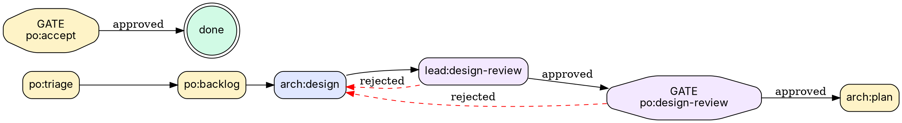

# Detailed Design: BotMinter Console Web UI

## 1. Overview

The BotMinter Console is a browser-accessible web dashboard for day-two operations of agentic teams. It serves as a **design-time introspection and editing tool** -- not a runtime monitoring dashboard. Operators use it to understand their team's process methodology, inspect member hat configurations, and edit profile files with changes propagating to members and GitHub.

The console is **multi-team aware** -- teams are treated like Kubernetes namespaces. A team selector in the sidebar scopes all views to the selected team. Team creation is done via `bm init` CLI.

The console is served by the `bm` daemon process and is available at a local port whenever the team is running.

## 2. Detailed Requirements

### 2.1 Primary User

The BotMinter operator performing day-two operations: managing, evolving, and understanding their team's methodology after initial setup.

### 2.2 MVP Scope (Priority Order)

1. **Process Visibility** -- Visualize the profile's workflow/value chain as a pipeline diagram. Show status transitions, role ownership, and handoff points. This is the process *design*, not live issue data.

2. **Member Design Visibility** -- For each hired member, display their `ralph.yml` in a syntax-highlighted, searchable YAML viewer. Show which hats they wear and their configuration.

3. **Profile/Team Editing** -- Navigate the team repo's structure via semantic views (Process, Members, Knowledge, Invariants, Settings). Edit files (YAML, Markdown) in-browser with CodeMirror 6. Save triggers `bm teams sync` to propagate changes.

### 2.3 Explicitly Out of Scope (MVP)

- Live member status monitoring (running/stopped/crashed)
- Log streaming / live activity feed
- Chat with members
- GitHub issue board / Kanban view
- Member start/stop/restart controls
- Visual workflow builder (drag-and-drop hat graph)
- Authentication / multi-user access
- Team creation wizard (use `bm init` CLI)

### 2.4 Multi-Team Model

Teams are like Kubernetes namespaces:
- The console reads `~/.botminter/config.yml` to list all registered teams.
- A **team selector dropdown** in the sidebar lets operators switch between teams.
- All views (Overview, Process, Members, Knowledge, Invariants, Settings) are scoped to the selected team.
- URL structure: `/teams/:team/overview`, `/teams/:team/process`, `/teams/:team/members`, etc.
- Team creation is out of MVP scope -- operators use `bm init` CLI. The dropdown shows a hint: "Create teams with `bm init`".

### 2.5 Process Workflow Definition (Graphviz DOT)

The process pipeline is a **state machine** with transitions, rejection loops, and human gates. This cannot be represented as a flat status list. The profile defines workflows as **Graphviz DOT files** that serve as the structured source of truth.

```
profiles/scrum/workflows/
  epic.dot          # Epic workflow state machine
  story.dot         # Story workflow state machine
  specialist.dot    # Specialist workflows
  manager.dot       # Manager workflow
```

Example `epic.dot`:


**Why Graphviz DOT:**
- Superior layout algorithms for complex state machines (rejection loops, crossing edges)
- Full control over node shapes (octagon for gates, doublecircle for terminals), colors, edge styles
- Rich ecosystem: decades of research, widely understood format
- Browser rendering via `@viz-js/viz` (WASM port of Graphviz, ~2MB) -- produces SVG directly
- Can generate PROCESS.md from DOT files (single source of truth)
- Subgraphs can group states by role for visual clarity

**Console rendering:** The process page reads `.dot` files from `workflows/` via the file API and renders them to SVG using `@viz-js/viz` (Graphviz compiled to WASM). The SVG is interactive -- hover for status details, click for transitions.

**Bootstrapped team repo:** `bm init` extracts `workflows/` alongside `PROCESS.md` and `botminter.yml`.

### 2.6 File Edit + Git Commit

When files are saved via `PUT /api/teams/:team/files/*path`, the backend:
1. Writes the file to disk
2. Stages the file with `git add <path>`
3. Commits with message: `console: update <path>`
4. Does NOT push (operator pushes when ready, or sync handles it)

This ensures edits are tracked in the team repo's git history and won't be lost on `git pull`.

## 3. Architecture Overview

```
+------------------+       REST API        +------------------+
|                  |  <------------------> |                  |
|  Svelte 5 SPA    | /api/teams/:t/...    |  Axum HTTP       |
|  (Browser)       |                       |  Server          |
|                  |                       |  (in bm daemon)  |
+------------------+                       +------------------+
                                                   |
                                          reads ~/.botminter/config.yml
                                          for team registry
                                                   |
                                    +--------------+--------------+
                                    |              |              |
                                    v              v              v
                              +-----------+  +-----------+  +-----------+
                              | Team A    |  | Team B    |  | Team C    |
                              | repo      |  | repo      |  | repo      |
                              | (on disk) |  | (on disk) |  | (on disk) |
                              +-----------+  +-----------+  +-----------+
```

### 3.1 Daemon Rewrite (tiny_http -> Axum)

The existing daemon (`crates/bm/src/daemon/`) is a synchronous event reactor using `tiny_http` with a single `POST /webhook` endpoint and an optional poll loop. It will be **rewritten to Axum** to host both the webhook endpoint and the console API on the same server.

Current daemon architecture (synchronous):
- `tiny_http` HTTP server for `POST /webhook`
- `std::thread::sleep` loop for poll mode
- `libc::signal` for SIGTERM/SIGINT handling
- `std::process::Command` for spawning Ralph members

Rewritten daemon architecture (async):
- **Axum** HTTP server hosting webhook + console API + static assets
- `tokio::spawn` task for poll mode background loop
- `tokio::signal` for graceful shutdown
- `tokio::process::Command` for spawning Ralph members (or keep sync with `spawn_blocking`)

Tokio is already a dependency with `rt-multi-thread` and `signal` features (used by the brain module). The detached process model (`bm daemon-run` hidden command, PID file, log rotation) stays the same. `bm start`/`bm stop` are unaffected -- they use a completely separate code path through the `formation` module.

### 3.2 Deployment Model

- The Axum server runs inside the daemon process (`bm daemon-run`).
- `bm daemon start` spawns the daemon, which serves both webhooks and the console.
- Console URL is printed on startup: `Console available at http://localhost:<port>`.
- Port is configurable via `--port` flag (default: 8484, same as current webhook port).
- In production, frontend assets are **embedded in the `bm` binary** via `rust-embed`.
- In development, Vite dev server (port 5173) proxies `/api` requests to the daemon port.

### 3.3 Crate Structure

```
crates/
  bm/                    # Existing CLI binary
    src/
      daemon/            # REWRITTEN: Axum-based daemon
        mod.rs           # Module root
        run.rs           # REWRITTEN: async event loop with Axum server
        config.rs        # UNCHANGED: DaemonConfig, DaemonPaths, PollState
        event.rs         # UPDATED: webhook handler as Axum route
        lifecycle.rs     # UNCHANGED: start/stop/query daemon process
        log.rs           # UNCHANGED: log rotation
        process.rs       # UPDATED: member launching (spawn_blocking if needed)
      web/               # NEW: Console API handlers (named `web` to avoid collision with `console` crate dep)
        mod.rs           # Router assembly, shared state
        teams.rs         # GET /api/teams
        overview.rs      # GET /api/teams/:team/overview
        process.rs       # GET /api/teams/:team/process
        members.rs       # GET /api/teams/:team/members, /:name
        files.rs         # GET/PUT /api/teams/:team/files/*path
        tree.rs          # GET /api/teams/:team/tree
        sync.rs          # POST /api/teams/:team/sync
        assets.rs        # rust-embed static file serving + SPA fallback (folder = "../../console/build/")

console/                 # NEW: Frontend (Svelte 5 project)
  package.json
  vite.config.ts
  svelte.config.js
  src/
    app.html
    routes/
      +layout.svelte     # Root layout (team selector logic)
      +page.svelte       # Redirect to /teams/:default/overview
      teams/
        +page.svelte     # Team list / creation view
        [team]/
          +layout.svelte # Team-scoped shell: sidebar + content
          +page.svelte   # Redirect to overview
          overview/
            +page.svelte # Team overview dashboard
          process/
            +page.svelte # Process pipeline view
          members/
            +page.svelte # Members list
            [name]/
              +page.svelte # Member detail (ralph.yml viewer/editor)
          knowledge/
            +page.svelte # Knowledge files browser
          invariants/
            +page.svelte # Invariants browser
          settings/
            +page.svelte # Team configuration
    lib/
      api.ts             # REST API client
      types.ts           # TypeScript types matching Rust API responses
    components/
      Sidebar.svelte     # Navigation sidebar
      FileEditor.svelte  # CodeMirror 6 wrapper (YAML/Markdown)
      ProcessPipeline.svelte  # Status transition diagram
      YamlViewer.svelte  # Syntax-highlighted YAML display
      MarkdownRenderer.svelte # Rendered markdown display
```

## 4. Components and Interfaces

### 4.1 REST API Endpoints

All endpoints return JSON. Team-scoped endpoints are prefixed with `/api/teams/:team/`.

#### Health Check
```
GET /health
Response: { ok: true, version: string }
```

#### Teams (global)
```
GET /api/teams
Response: [{
  name: string,
  profile: string,
  github_repo: string,
  path: string
}]
```

#### Team Overview (team-scoped)
```
GET /api/teams/:team/overview
Response: {
  name: string,
  profile: string,
  display_name: string,
  description: string,
  version: string,
  github_repo: string,
  roles: [{ name: string, description: string }],
  members: [{ name: string, role: string }],
  bridges: [{ name: string }],
  projects: [{ name: string, fork_url: string }]
}
```

#### Process (team-scoped)
```
GET /api/teams/:team/process
Response: {
  markdown: string,          // Raw PROCESS.md content
  workflows: [{              // From workflows/*.dot files
    name: string,            // e.g., "epic" (derived from filename)
    dot: string              // Raw .dot file content
  }],
  statuses: [{               // From botminter.yml
    name: string,            // e.g., "po:triage"
    description: string
  }],
  labels: [{
    name: string,
    color: string,
    description: string
  }],
  views: [{
    name: string,
    prefixes: [string],
    also_include: [string]
  }]
}
```

#### Members (team-scoped)
```
GET /api/teams/:team/members
Response: [{
  name: string,              // e.g., "superman-01"
  role: string,
  comment_emoji: string,
  has_ralph_yml: boolean,
  hat_count: number
}]

GET /api/teams/:team/members/:name
Response: {
  name: string,
  role: string,
  comment_emoji: string,
  ralph_yml: string,         // Raw YAML content
  claude_md: string,         // Raw Markdown content
  prompt_md: string,         // Raw Markdown content
  hats: [{                   // Parsed from ralph.yml
    name: string,
    description: string,
    triggers: [string],
    publishes: [string]
  }],
  knowledge_files: [string], // Relative paths
  invariant_files: [string],
  skill_dirs: [string]
}
```

#### File Operations (team-scoped)
```
GET /api/teams/:team/files/*path
Response: {
  path: string,
  content: string,
  content_type: "yaml" | "markdown" | "json" | "text",
  last_modified: string      // ISO 8601
}

PUT /api/teams/:team/files/*path
Request: { content: string }
Response: { ok: boolean, path: string, commit_sha: string }
```

#### Directory Listing (team-scoped)
```
GET /api/teams/:team/tree?path=members/superman-01
Response: {
  path: string,
  entries: [{
    name: string,
    type: "file" | "directory",
    path: string
  }]
}
```

#### Sync (team-scoped)
```
POST /api/teams/:team/sync
Response: {
  ok: boolean,
  message: string,
  changed_files: [string]    // Files that were synced
}
```

### 4.2 Frontend Pages

#### Team Overview Page (`/teams/:team/overview`)

Landing page for a team. Shows at a glance:
- Profile info (name, version, description, GitHub repo, coding agent)
- Roles defined in the profile with descriptions
- Hired members with hat count, skill count, knowledge file count
- Process summary (workflow status counts, mini pipeline preview)
- Projects configured
- Bridge status
- Knowledge and invariant file listings

Data source: `GET /api/teams/:team/overview`

#### Process Page (`/teams/:team/process`)

Renders the team's process methodology:

1. **Pipeline Diagram** -- A horizontal flow showing status transitions extracted from `botminter.yml` statuses. Each status is a node, grouped by role prefix (po, arch, dev, qe, etc.). Arrows show the progression.

2. **PROCESS.md Rendered** -- The markdown content rendered below the diagram for reference.

3. **Status Table** -- All statuses with their descriptions, grouped by category (epic, story, specialist, manager).

4. **Views** -- The board views defined in the profile (e.g., "Architecture" view showing arch:* statuses).

Data sources: `GET /api/teams/:team/process`

#### Members Page (`/teams/:team/members`)

Lists all hired members as cards:
- Name, role, emoji
- Hat count
- Click to drill into detail

Data source: `GET /api/teams/:team/members`

#### Member Detail Page (`/teams/:team/members/:name`)

Two-panel layout:
- **Left panel:** Navigation tabs -- Ralph YAML | CLAUDE.md | PROMPT.md | Hats | Knowledge | Invariants
- **Right panel:** Content viewer/editor (CodeMirror 6)

Default view shows `ralph.yml` in the YAML viewer with syntax highlighting.

The Hats tab shows a summary list of hats parsed from ralph.yml (name, triggers, description), clickable to jump to that section in the YAML.

Data source: `GET /api/teams/:team/members/:name`, `GET /api/teams/:team/files/*`

#### Knowledge Page (`/teams/:team/knowledge`)

Tree view of knowledge files at all resolution levels:
- Team knowledge (`knowledge/`)
- Project knowledge (`projects/<project>/knowledge/`)
- Member knowledge shown inline with member context

Click any file to view/edit in CodeMirror.

Data source: `GET /api/teams/:team/tree`, `GET /api/teams/:team/files/*`

#### Invariants Page (`/teams/:team/invariants`)

Similar to Knowledge -- tree view of invariant files at team, project, and member levels. Rendered as markdown with the constraint highlighted.

Data source: `GET /api/teams/:team/tree`, `GET /api/teams/:team/files/*`

#### Settings Page (`/teams/:team/settings`)

Displays and allows editing of:
- `botminter.yml` (profile manifest) -- the master configuration
- Bridge configuration
- Formation configuration

Data source: `GET /api/teams/:team/files/botminter.yml`, `PUT /api/teams/:team/files/botminter.yml`

### 4.3 Frontend Components

#### `TeamSelector.svelte`
Dropdown in the sidebar that lists all registered teams from `GET /api/teams`. Shows:
- Current team name with a status indicator dot
- Dropdown with all teams, each showing their profile name
- Hint at the bottom: "Create teams with `bm init`"
- Switching teams navigates to `/teams/:newTeam/overview`

#### `Sidebar.svelte`
Fixed left sidebar with:
- BotMinter logo and branding at the top
- TeamSelector dropdown
- Navigation links (scoped to selected team):
  - Overview (building icon)
  - Process (pipeline icon)
  - Members (people icon)
  - Knowledge (book icon)
  - Invariants (shield icon)
  - Settings (gear icon)
- Version info at the bottom

#### `FileEditor.svelte`
Wrapper around CodeMirror 6 with:
- Language detection (YAML, Markdown, JSON) based on file extension
- Syntax highlighting
- Search (Ctrl+F)
- Save button (triggers PUT /api/files/*)
- Optional "Save & Sync" button (PUT then POST /api/sync)
- Read-only mode toggle
- Line numbers

#### `ProcessPipeline.svelte`
SVG/HTML-based pipeline diagram:
- Nodes represent statuses, colored by role prefix
- Arrows show progression
- Grouped into swimlanes by workflow type (epic, story, specialist)
- Role legend with colors

Does NOT use a heavy library like React Flow -- simple SVG rendering since the diagram is static (no drag-and-drop).

#### `YamlViewer.svelte`
Read-only CodeMirror instance pre-configured for YAML:
- Collapsible sections (CodeMirror fold)
- Search
- Copy button
- Toggle to edit mode (switches to FileEditor)

#### `MarkdownRenderer.svelte`
Renders markdown content as HTML. Uses a lightweight markdown parser (marked or markdown-it).

## 5. Data Models

### 5.1 Backend (Rust)

```rust
// API response types (serde::Serialize)

#[derive(Serialize)]
struct TeamInfo {
    name: String,
    profile: String,
    display_name: String,
    description: String,
    version: String,
    github_repo: String,
    roles: Vec<RoleInfo>,
    members: Vec<MemberSummary>,
    bridges: Vec<BridgeInfo>,
    projects: Vec<ProjectInfo>,
}

#[derive(Serialize)]
struct ProcessInfo {
    markdown: String,
    workflows: Vec<WorkflowInfo>,
    statuses: Vec<StatusInfo>,
    labels: Vec<LabelInfo>,
    views: Vec<ViewInfo>,
}

#[derive(Serialize)]
struct WorkflowInfo {
    name: String,   // e.g., "epic" (derived from filename)
    dot: String,    // Raw .dot file content
}

#[derive(Serialize)]
struct MemberSummary {
    name: String,
    role: String,
    comment_emoji: String,
    has_ralph_yml: bool,
    hat_count: usize,
}

#[derive(Serialize)]
struct MemberDetail {
    name: String,
    role: String,
    comment_emoji: String,
    ralph_yml: String,
    claude_md: String,
    prompt_md: String,
    hats: Vec<HatSummary>,
    knowledge_files: Vec<String>,
    invariant_files: Vec<String>,
    skill_dirs: Vec<String>,
}

#[derive(Serialize)]
struct FileContent {
    path: String,
    content: String,
    content_type: String,
    last_modified: String,
}

#[derive(Serialize)]
struct TreeEntry {
    name: String,
    entry_type: String, // "file" or "directory"
    path: String,
}
```

### 5.2 Frontend (TypeScript)

```typescript
// Mirrors the Rust types

interface TeamInfo {
  name: string;
  profile: string;
  display_name: string;
  description: string;
  version: string;
  github_repo: string;
  roles: RoleInfo[];
  members: MemberSummary[];
  bridges: BridgeInfo[];
  projects: ProjectInfo[];
}

interface ProcessInfo {
  markdown: string;
  workflows: WorkflowInfo[];
  statuses: StatusInfo[];
  labels: LabelInfo[];
  views: ViewInfo[];
}

interface WorkflowInfo {
  name: string;   // e.g., "epic" (derived from filename)
  dot: string;    // Raw .dot file content
}

interface MemberSummary {
  name: string;
  role: string;
  comment_emoji: string;
  has_ralph_yml: boolean;
  hat_count: number;
}

interface MemberDetail {
  name: string;
  role: string;
  comment_emoji: string;
  ralph_yml: string;
  claude_md: string;
  prompt_md: string;
  hats: HatSummary[];
  knowledge_files: string[];
  invariant_files: string[];
  skill_dirs: string[];
}
```

## 6. Error Handling

### 6.1 Backend

- **Team not initialized:** If the team repo path doesn't exist or `botminter.yml` is missing, all API endpoints return `404` with `{ error: "Team not initialized. Run 'bm init' first." }`.
- **File not found:** `GET /api/files/*path` returns `404` with the missing path.
- **File write errors:** `PUT /api/files/*path` returns `500` with the OS error message.
- **Sync errors:** `POST /api/sync` returns `500` with the sync error output.
- **Path traversal:** The file API MUST reject paths containing `..` or absolute paths. Only paths within the team repo root are allowed. Return `403` for violations.

### 6.2 Frontend

- **API errors:** Display a toast notification with the error message. Do not crash the page.
- **Network errors:** Show a "Console disconnected" banner at the top. Auto-retry on reconnect.
- **Unsaved changes:** Warn before navigation if the editor has unsaved changes (`beforeunload` event).

## 7. Testing Strategy

### 7.1 Backend (Rust)

- **Unit tests:** Test API handler functions using real fixtures from `fixture-gen/fixtures/team-repo/` (copy into a tempdir per test). These are artifacts from a real `bm init` + `bm hire` + `bm teams sync` run — 3 members (superman-alice, superman-bob, team-manager-mgr), 14 hats on superman, team-level knowledge/invariants/skills.
- **Integration tests:** Start the Axum server, hit endpoints with reqwest, verify JSON responses against the fixture team repo.
- **Path traversal tests:** Verify `..` and absolute paths are rejected.

### 7.2 Frontend (Svelte)

- **Component tests:** Vitest + Testing Library for individual components (Sidebar, FileEditor, ProcessPipeline).
- **E2E tests:** Playwright tests against a running backend + frontend, testing the full flow: navigate to process page, click member, edit YAML, save.

### 7.3 Integration

- **Build test:** CI job that runs `npm run build` in `console/` and verifies `cargo build` succeeds with embedded assets.
- **Smoke test:** Start daemon, verify console serves at the configured port, hit `/api/team` and verify response.

## 8. Security

- **Bind address:** The daemon binds to `0.0.0.0` by default (required for GitHub webhook reception). Console API routes (`/api/*`) are served on the same port. Since the console is intended for local use, operators behind a firewall or using SSH tunnels are responsible for network security. A `--bind` flag allows restricting to `127.0.0.1` when webhooks aren't needed.
- **No authentication** for MVP (local-only, single-user).
- **Path traversal prevention:** All file paths are canonicalized and checked to be within the team repo root before any read/write operation.
- **CORS:** Configured to allow `localhost` origins only (for Vite dev server proxy).

## Appendices

### A. Technology Choices

| Component | Choice | Rationale |
|-----------|--------|-----------|
| Frontend framework | Svelte 5 | Lighter than React, simpler mental model, compiled output is small. Good fit for local dev console. |
| Build tool | Vite 7 | Universal standard, fast dev server, works with Svelte. |
| Styling | Tailwind v4 + shadcn-svelte | Utility-first CSS, consistent component library. |
| Code editor | CodeMirror 6 | Framework-agnostic, lighter than Monaco, excellent YAML/Markdown support. |
| Backend framework | Axum | Already used in the ecosystem (Ralph), Tokio-native, excellent Rust web framework. |
| API style | REST | Simple, debuggable, maps naturally to file/resource model. |
| Asset embedding | rust-embed | Proven pattern, same approach as profile embedding. |
| Markdown rendering | marked or markdown-it | Lightweight, well-maintained. |

### B. Research Findings

- **Ralph Orchestrator** uses React 19 + Vite + Tailwind + shadcn/ui + Axum JSON-RPC. We diverge on framework (Svelte) and API style (REST) for simplicity.
- **Svelte 5** is production-proven at NYT, IKEA, 1Password, Decathlon, Chess.com. Runes reactivity model is stable.
- **Process pipeline** can be rendered with simple SVG -- no need for React Flow or d3. The diagram is static (defined by profile, not user-editable in MVP).

### C. Alternative Approaches Considered

1. **React 19 (align with Ralph)** -- Rejected: heavier, more boilerplate, component sharing with Ralph unlikely given different UI purposes.
2. **JSON-RPC API** -- Rejected for MVP: REST is simpler and maps better to the file-browsing model. Can be added later for action-oriented operations.
3. **Terminal TUI (ratatui)** -- Rejected: less suitable for rich file editing and process visualization.
4. **HTMX + server templates** -- Rejected: too limited for interactive CodeMirror editing.
5. **Embedded assets only** -- Rejected: Vite dev server is essential for frontend development experience.
