# Detailed Design: SDLC Planning & Acceptance Redesign

## 1. Overview

### 1.1 Purpose

Redesign the planning and acceptance phases of the BotMinter agentic SDLC to create a multi-level system that supports friction-free entry at any work item level while maintaining comprehensive artifact production and verification. The redesign delivers a new profile (`agentic-sdlc-planning`) based on `agentic-sdlc-minimal`, with the Agent SOP planning pipeline (PDD + code-task-generator) baked in. Task implementation is handled by the autonomous agent runtime (Ralph loops), not a separate skill.

### 1.2 Goals

- **Pluggable planning methodology** via team plugins, with enhanced PDD as first POC
- **Multi-level work item support** with entry at any level (epic, story, task) without ceremony overhead
- **Two mandatory human touch points** for all implemented work: specs in (before), verification out (after)
- **Adversarial review** built into the planning process via 3 parallel arch\_reviewer agents per artifact
- **Verification/acceptance** as a first-class SDLC phase, inspired by GSD's verify-work but native to PDD
- **Full traceability** from requirements through implementation to verification, using a consistent ID system across the pipeline

### 1.3 Non-Goals

- Spike work items (deferred — not in scope for this plan)
- BotMinter core abstraction changes (hub, board, identity provider abstractions)
- Full plugin system implementation (only PDD plugin POC; the broader plugin architecture is captured as target state)
- Cross-model adversarial review (GSD uses different LLM providers; we use same-model multi-perspective)
- Estimation, sizing, or capacity planning

### 1.4 Key Principles

1. **Two touch points.** Every implemented change has specs (before) and verification (after). These are non-negotiable regardless of work item level or runtime context.
2. **Friction-free entry.** Start at any level without being forced through the full epic ceremony. Dreading the full flow when you just want to implement something simple kills adoption.
3. **No gaps in source of truth.** Lower-level entry must not create holes in the project's requirements, design docs, or traceability. The system works backwards to fill gaps when needed.
4. **Artifacts always produced at full depth.** What varies is WHO produces them and the level of human involvement — not the artifact depth.
5. **Pluggable methodology.** BotMinter defines the contract (two touch points); planning implementations (PDD, GSD, custom) satisfy that contract.
6. **Gating and awareness are separate concerns.** Auto-merge doesn't obsolete human awareness. Awareness is active evaluation, not passive notification.

---

## 2. Detailed Requirements

Requirements describe what the system needs to achieve and why — not how. Design specifics (hat names, file paths, label formats, specific modes) are resolved in Sections 3–8.

### 2.1 Work Items (WIM)

| ID | Requirement | Source |
|----|-------------|--------|
| WIM-01 | Work MUST be expressible at multiple granularity levels, from large strategic initiatives down to atomic implementation units. | Q3, Q4 |
| WIM-02 | Users MUST be able to begin work at any granularity level without first creating parent containers. | Q3 |
| WIM-03 | Planning depth MUST scale proportionally to work item scope — large initiatives require full planning, small changes require minimal ceremony. | Q3, Q8 |
| WIM-04 | Every implemented change MUST pass through two human touch points — specification (before implementation) and verification (after implementation) — scaled appropriately to the work item's scope. | Q2, Q3 |
| WIM-05 | Bug fixes MUST have a lightweight path that bypasses planning ceremony for simple fixes, with an escalation path to standard planning for complex bugs. | Q22 |

### 2.2 Planning (PLN)

| ID | Requirement | Source |
|----|-------------|--------|
| PLN-01 | Planning artifacts MUST be producible in both human-initiated interactive sessions and orchestrator-initiated autonomous iterations, and the system MUST accept externally provided artifacts. | Q8 |
| PLN-02 | In autonomous iterations, the agent MUST be able to determine from the work item whether to proceed to implementation or wait for human review. The agent MUST NOT have to guess. | Q8 |
| PLN-03 | Planning artifacts MUST include the same artifact types (idea-honing, requirements, research, design, plan) regardless of whether they were produced interactively or autonomously. | Q8 |
| PLN-04 | Implementation MUST NOT begin until planning artifacts exist for the work item. | Q8 |
| PLN-05 | Planning artifacts from a parent work item MUST be reusable by its children to avoid duplicate planning effort. | Q8 |
| PLN-06 | The system MUST support both forward planning (plan then implement) and backward artifact generation (implement then generate epic-level planning artifacts retroactively from existing code). | Q21 |
| PLN-07 | During conversational planning, if the skill detects the user is working at the wrong level, it MUST offer to start at the appropriate level instead. During autonomous implementation, backward artifact generation MUST be configurable as a default (on/off) with per-issue label override. | Q21 |

### 2.3 Verification (VER)

| ID | Requirement | Source |
|----|-------------|--------|
| VER-01 | The system MUST provide a mechanism for the user to verify that what was built matches what was specified. | Q2, Q18 |
| VER-02 | The verification mechanism MUST present acceptance criteria alongside what was implemented, enabling the user to assess each criterion. | Q20 |
| VER-03 | When the user identifies gaps during verification, the system MUST capture them in a readable document so they can inform subsequent work. The user decides when and how to address them. | Q20 |

### 2.4 Review (REV)

| ID | Requirement | Source |
|----|-------------|--------|
| REV-01 | Planning artifacts MUST be reviewed from multiple independent perspectives before implementation begins. | Q15 |
| REV-02 | Review perspectives MUST be relevant to the type of artifact being reviewed. | Q15 |
| REV-03 | In interactive sessions, the operator MUST be able to selectively accept or dismiss review feedback. | Q15 |

### 2.5 Artifacts & Traceability (ART)

| ID | Requirement | Source |
|----|-------------|--------|
| ART-01 | Planning artifacts MUST be stored durably in version control where they can be diffed, reviewed via PR, and referenced over time. | Q9 |
| ART-02 | Agents MUST be able to discover planning artifacts for any work item through multiple independent paths, so that no single broken link prevents access. | Q9 |
| ART-03 | Every catalogable planning entity (requirements, acceptance criteria, decisions, implementation steps) MUST have a stable identifier for cross-referencing across the pipeline. | Q20 |
| ART-04 | Traceability MUST flow end-to-end: from requirements through acceptance criteria to implementation steps to verification results. | Q20 |

### 2.6 Pluggability (PLG) — Future Work

The idea-honing established pluggable planning methodology as a goal (Q10, Q11). For this deliverable, PDD is baked into a new profile (`agentic-sdlc-planning`). The plugin abstraction will be derived from the diff between the base and planning profiles once both exist.

### 2.7 Operations (OPS)

| ID | Requirement | Source |
|----|-------------|--------|
| OPS-01 | The operator MUST be able to control whether and how agent-internal implementation tasks are externalized to the board. | Q6, Q7 |
| OPS-02 | Agent-internal tasks MUST be clearly distinguishable from human-facing work items to prevent board noise. | Q6 |

---

## 3. Architecture Overview

### 3.1 Approach: New Profile

Rather than building a generic plugin composition system, this deliverable creates a new profile — `agentic-sdlc-planning` — based on `agentic-sdlc-minimal` with all planning capabilities baked in. The plugin abstraction is future work, informed by the diff between the two profiles once both exist.

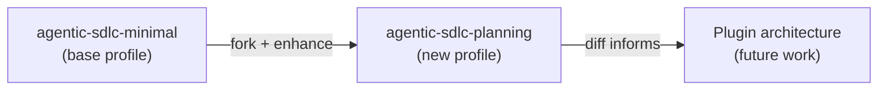

**What the new profile adds to the base:**

| Area | Base (`agentic-sdlc-minimal`) | New (`agentic-sdlc-planning`) |
|------|-------------------------------|-------------------------------|
| **Engineer hats** | arch_designer, arch_planner, arch_breakdown, lead_reviewer, qe, developer, ... (18 hats) | lead_plan-create, lead_plan-review, lead_breakdown, lead_monitor, dev_implement-red/-green/-refactor/-review, qe_verify, qe_investigate, qe_monitor, ... (15 hats) |
| **Status graph** | 14 epic statuses, 3 human gates | 8 epic statuses, 2 human gates |
| **Skills** | github-project, board-scanner, status-workflow | + pdd, code-task-generator, verification, adr, backward-generation, codebase-summary |
| **CLI extensions** | None | `bm plan`, `bm verify` |
| **PROCESS.md** | Current lifecycle (design → review → plan → review → breakdown → review) | Simplified lifecycle (plan → review → breakdown → implement → verify → accept) |
| **Artifact conventions** | Design docs in team repo | Planning artifacts at `team/specs/` with index, traceability IDs |

**Team creation:** `bm init --profile agentic-sdlc-planning` extracts the profile, `bm teams sync -a` provisions workspaces. No interactive onboarding step needed — the profile is pre-wired.

### 3.2 Future: Plugin Architecture

The idea-honing established pluggable planning methodology as a target architecture (Q10, Q11, Q12). Once `agentic-sdlc-planning` exists alongside `agentic-sdlc-minimal`, the concrete diff between them defines what a "planning plugin" would contain. The plugin abstraction — how plugins provide files, how they compose with the base profile, how CLI extensions register — will be designed based on that diff rather than speculatively.

### 3.3 Work Item Model

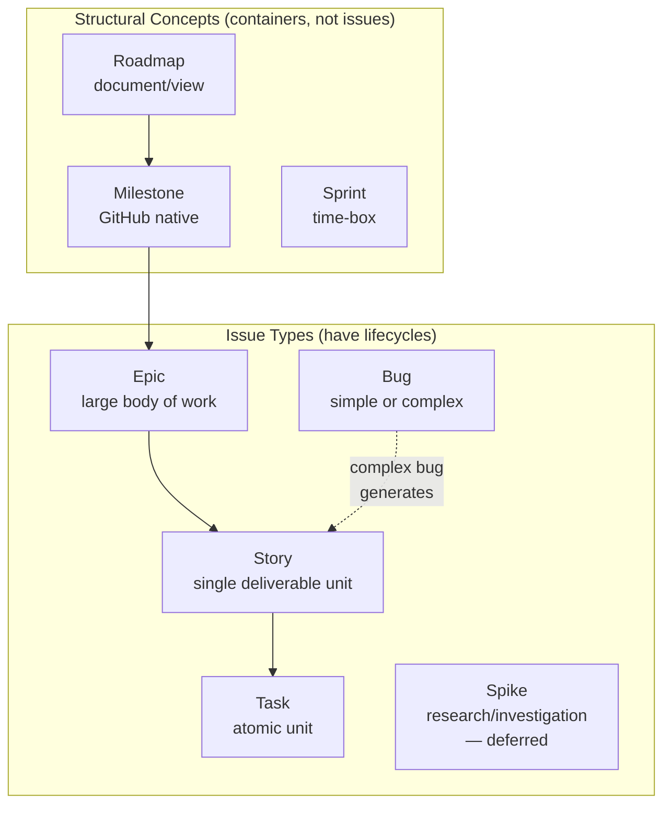

**Sizing recalibration (D-01):** With agent-internal tasks separated from human-facing work, sizing returns to standard meaning. What was previously called "Epic" in BotMinter is now correctly a "Story." "Epic" now means what it normally means — a large body of work spanning multiple stories.

**Entry at any level:** The user can start at any level without requiring the parent. The entry point determines the planning sub-workflow:

| Entry Level | Skill / Mechanism | Artifacts (gate — must exist before proceeding) | Deliverables (output — produced during execution) |
|-------------|------------------|------------------------------------------------|--------------------------------------------------|
| **Epic** | PDD | rough-idea.md, idea-honing.md, requirements.md, research/, design.md, plan.md, summary.md | Stories on the board |
| **Story** | code-task-generator | `.code-task-NN.md` files in `tasks/<issue#>-<story-slug>/` with catalog README | Implemented code per task |
| **Task** | Agent runtime (Ralph loop) | — (the `.code-task-NN.md` file IS the spec) | Code, tests, docs — whatever the task requires |
| **Bug (simple)** | Agent runtime (Ralph loop) | — | Code fix + regression test |
| **Bug (complex)** | Escalates to Story | Follows story-level gates | Follows story-level deliverables |

### 3.4 Runtime Contexts

Planning runs in two runtime contexts, determined by who initiated the session:

| Context | Initiated By | Human Present | Example |
|---------|-------------|---------------|---------|
| **Interactive** | Human runs `bm plan` (terminal or bridge chat) | Yes — real-time back-and-forth | Operator and engineer do PDD together |
| **Autonomous** | Ralph picks up work item from the board | No — agent works alone | Ralph loop spawns an iteration for an epic |

**Default flow (both contexts):**

The epic status graph drives the flow. When an epic reaches `eng:lead:plan`:

1. Agent checks if planning artifacts already exist in `team/specs/`
2. If artifacts exist → internal review hats run (adversarial + quality checks)
3. If artifacts don't exist → generate them via PDD → internal review hats run
4. After internal review passes → transition to `human:po:plan-review` (human approval)
5. Human approves → proceed to breakdown

The human must approve before implementation begins. This is the default — no labels needed.

**Exception — `plan:auto` label:**

When an epic has the `plan:auto` label, the `po_gate` hat at `human:po:plan-review` auto-advances instead of posting a review request and waiting. The epic still passes through the status (audit trail), but the hat transitions immediately.

When an epic has the `accept:auto` label, the `po_gate` hat at `human:po:accept` auto-advances the same way. This is the post-hoc awareness mode from the idea-honing (Q2) — work proceeds without blocking on human approval, but the human can still review completed work at any time.

Both labels can be combined: `plan:auto` + `accept:auto` = fully autonomous epic from planning through acceptance.

**Decision D-02:** The default requires human approval at both gates. `plan:auto` and `accept:auto` are opt-in labels — they tell the `po_gate` hat to auto-advance instead of waiting.

### 3.5 Bidirectional Work and Scope Detection

Work flows in both directions:

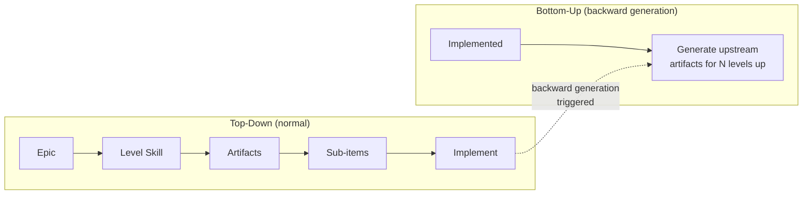

**Scope detection (D-03):** When the story-level skill (code-task-generator) runs and encounters signals that the work is actually epic-scope, it offers to switch to PDD instead. Detection is based on the natural differences between epic-scope and story-scope work:

| Signal | What it looks like | Why it means epic-scope |
|--------|-------------------|----------------------|
| Input is vague | Story description reads like a rough idea, not a clear objective | Requirements haven't been clarified — needs idea-honing |
| Research needed | Skill needs to investigate tech choices before decomposing | Architecture hasn't been decided — needs PDD research phase |
| Architecture decisions emerging | Decomposition reveals need for new interfaces, data models, APIs | This is design work, not task decomposition |
| Multi-component | Tasks touch 3+ distinct areas of the codebase | Cross-cutting work needs a design doc |
| Too many tasks | Decomposition produces >5 tasks or mostly High complexity | Story is really an epic |
| Open questions | Skill can't decompose because too many unknowns | Requirements haven't been clarified |

If multiple signals fire, the skill offers: "This looks like it needs design work. Want to start at epic level with PDD instead?" In interactive mode, the user decides. In autonomous mode, the skill escalates (creates an epic, links the story).

**Backward artifact generation (D-04):**

Backward generation applies from story level up to epic level only. Generating story-level artifacts (task decomposition) retroactively from completed tasks adds no value — those are operational files consumed during execution. The long-living planning artifacts (requirements, design, plan) are what matter for the project's source of truth.

When stories are implemented without epic-level planning, the backward-generation skill runs PDD retroactively against the existing code to produce epic-level artifacts (requirements.md, design.md, plan.md), then runs codebase-summary to update project documentation.

**Trigger:** Backward generation runs only when the `planning:backward-generate` label is present on the work item. No profile default, no auto-detection. The operator explicitly opts in per work item.

In interactive mode, the operator can also invoke it directly via the backward-generation skill.

---

## 4. Planning Phase Design

### 4.1 Enhanced PDD Skill

The PDD skill remains monolithic and is enhanced with three new capabilities: IDs/traceability, adversarial review, and runtime context awareness. The skill is runtime-aware — it detects whether it's running in an interactive session or a Ralph loop and adjusts its behavior accordingly (e.g., asking the user about story creation only in interactive mode).

**Enhanced PDD pipeline:**

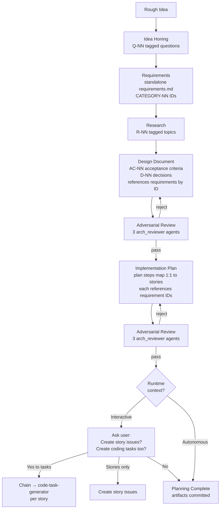

**Plan steps are stories.** Each step in `plan.md` maps 1:1 to a story. The plan uses "Step N" naming but the content is story-shaped: objective, guidance, test requirements, integration notes, demo. The breakdown hat (or the PDD skill in interactive mode) creates GitHub story issues directly from these steps.

**Skill chaining in interactive mode.** After producing the plan, the PDD skill asks the user whether to create story issues and whether to chain into code-task-generator for task decomposition. The user can choose to set up all stories first then decompose each into tasks, or work through each story completely before moving to the next. In autonomous mode, skill chaining is handled by Ralph hat transitions instead.

**Artifact set with ID system (ART-03, ART-04):**

| Artifact | IDs | Content |
|----------|-----|---------|
| `rough-idea.md` | — | The original idea verbatim |
| `idea-honing.md` | Q-NN | Question-and-answer pairs from requirements clarification |
| `requirements.md` | CATEGORY-NN | Standalone requirements document. Categories use 3-5 uppercase character abbreviations (e.g., AUTH, FORM, PLG). Sequential zero-padded numbers within each category. |
| `research/*.md` | R-NN | Research notes organized by topic |
| `design.md` | AC-NN, D-NN | Design document referencing requirements by CATEGORY-NN. Acceptance criteria in GWT format with AC-NN IDs. Design decisions with D-NN IDs and rationales. |
| `plan.md` | STEP-NN | Implementation steps (= stories), each referencing which CATEGORY-NN requirements and AC-NN criteria it addresses |
| `summary.md` | — | Summary listing all artifacts and next steps |

**Traceability matrix** (included at the end of the design doc):

| Requirement | Acceptance Criteria | Implementation Step | Verification Status |
|-------------|--------------------|--------------------|---------------------|
| AUTH-01 | AC-03, AC-04 | STEP-02, STEP-03 | Pending |
| FORM-01 | AC-07 | STEP-05 | Pending |

This matrix is the contract — verification checks against it after implementation.

### 4.2 Two Planning Paths

Both paths use the same enhanced PDD skill and produce the same artifacts. The difference is whether the operator is present during production (Q15).

**Interactive path:**

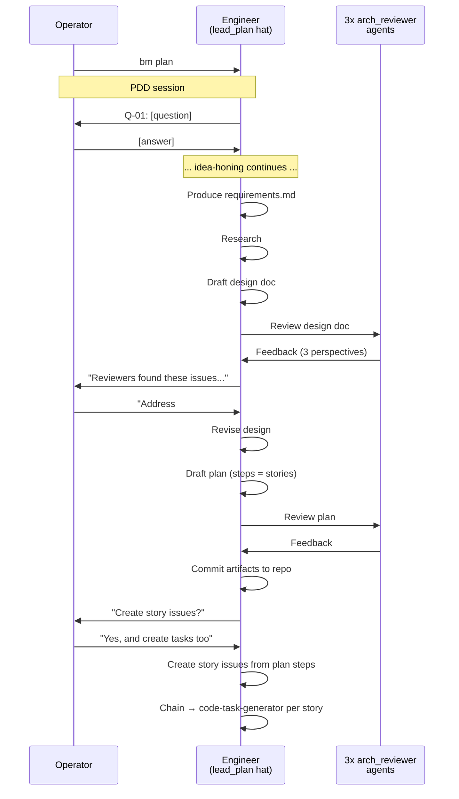

**Autonomous path (via Ralph loop):**

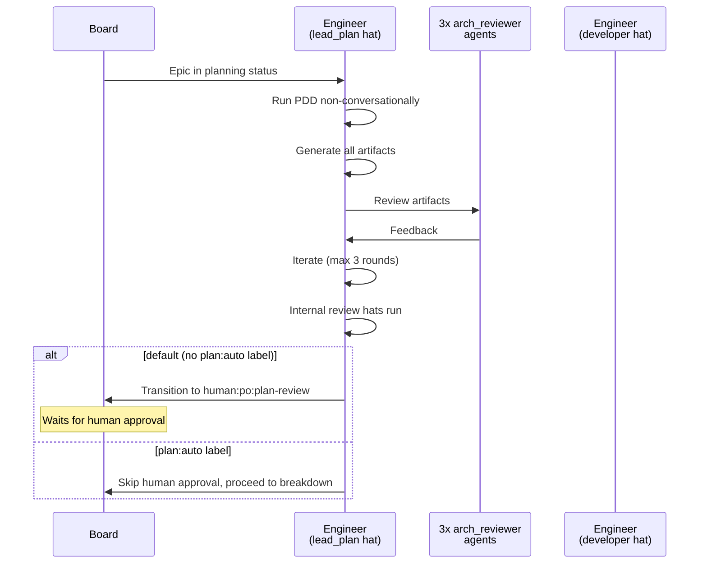

### 4.3 Planning by Work Item Level

Each level has its own skill/SOP that produces its own artifacts. This is not "PDD at different depths" — each level uses a different skill appropriate for that scope (WIM-04).

**Epic level — PDD skill:**

1. Idea-honing (Q-NN) — full requirements clarification
2. Requirements extraction (CATEGORY-NN) — standalone `requirements.md`
3. Research (R-NN) — technology, existing code, alternatives
4. Design document (AC-NN, D-NN) — architecture, components, acceptance criteria
5. Adversarial review — 3 agents
6. Implementation plan (STEP-NN) — steps map 1:1 to stories
7. Story/task creation — PDD chains into code-task-generator (interactive) or breakdown hat creates issues (autonomous)

**Story level — code-task-generator:**

Takes a story (plan step or standalone) and produces `.code-task-NN.md` files in a `tasks/` subdirectory with a catalog README. Each task file maps 1:1 to a task. For stories from an epic (PLN-05), the story inherits context from the parent's planning artifacts. code-task-generator is also runtime-aware — in interactive mode it can ask the user about decomposition preferences.

**Task level — agent runtime (Ralph loop):**

Tasks are implemented by the autonomous agent runtime, not a separate skill. The developer hat picks up the task, reads the `.code-task-NN.md` file (or raw description), and implements it — writing code, tests, docs, whatever the task requires. The output is just the task's deliverables (code changes, tests, documentation). No special skill or artifact set is prescribed at this level.

### 4.4 Bug Handling

Bugs have two tracks based on complexity (WIM-05). The determination is made during triage — either by the human (label) or by the agent (judgment during initial investigation).

**Simple bug — creates a story with `plan:auto`:**

After triage and investigation confirm the bug, a Story is created with the `plan:auto` label. Planning auto-advances (no ceremony for a simple fix). The developer hat implements the fix with a regression test in a Ralph loop. By default, the story still gates on `human:po:accept` so the user can review the fix. If the user labels the bug with `accept:auto`, acceptance auto-advances too.

Produces: code fix + regression test.

**Bug lifecycle (simple):**

```
human:po:triage → eng:qe:investigate → [creates Story with plan:auto] → eng:qe:monitor → done
Story: eng:lead:plan (auto) → human:po:plan-review (auto) → eng:dev:implement → eng:qe:verify → snt:gate:merge → human:po:accept → done
```

**Complex bug — creates a story with full human gates:**

When triage determines the bug requires multi-component changes, architectural decisions, or investigation beyond a single task:

1. Agent (or human) creates a new Story issue linked to the original bug
2. The story describes what needs to change to resolve the bug
3. The story follows normal story-level flow with human gates: code-task-generator decomposes into tasks, agent implements each in Ralph loops
4. The original bug issue stays open, linked to the story. It is only closed when the fix is implemented, verified, and merged.

**Bug lifecycle (complex):**

```
human:po:triage → eng:qe:investigate → [creates Story, bug linked and waits] → eng:qe:monitor → done
Story: eng:lead:plan → human:po:plan-review → eng:dev:implement → eng:qe:verify → snt:gate:merge → human:po:accept → done
```

**Determining simple vs complex (D-12):**

| Signal | Mechanism |
|--------|-----------|
| **Human label** | `bug:simple` or `bug:complex` set during triage by the operator |
| **Agent judgment** | During initial investigation, if the agent determines the fix spans multiple components or requires design decisions, it escalates to complex |
| **Profile default** | If no label and agent can't determine, treat as simple and attempt the fix. If the agent fails after 3 attempts, escalate to complex. |

**Bug artifacts:** Both simple and complex bugs create stories. Simple bug stories auto-advance planning (`plan:auto`) and produce code changes and regression tests — acceptance is human-gated by default unless the user adds `accept:auto`. Complex bug stories go through the full human-gated flow and produce story-level planning artifacts.

### 4.5 Adversarial Review System

After each major artifact is produced, 3 `arch_reviewer` agents are spawned in parallel. Each reviews from a distinct perspective tailored to the artifact type (REV-01, REV-02).

**Perspectives by artifact type (D-05):**

| Artifact | Perspective 1 | Perspective 2 | Perspective 3 |
|----------|--------------|--------------|--------------|
| **Requirements** (`requirements.md`) | **Completeness** — Are all user needs captured? Missing edge cases? Implicit requirements? | **Feasibility** — Can each requirement be built with available resources and technology? Are there hidden complexities? | **Testability** — Can each requirement be objectively verified? Are criteria concrete and observable? |
| **Design Document** (`detailed-design.md`) | **Architecture** — Is the design sound? Separation of concerns? Scalability? Does it handle the requirements? | **Security** — Vulnerabilities? Input validation? Auth boundaries? Data exposure? | **Maintainability** — Complexity? Coupling? Will this be understandable in 6 months? Extension points? |
| **Implementation Plan** (`plan.md`) | **Scope** — Are steps appropriately sized? Any step too large to be demoable? Any step too trivial? | **Dependency Correctness** — Are step dependencies right? Missing prerequisites? Orphaned steps? Can this actually be built in this order? | **Risk** — What could go wrong at each step? Blast radius? Rollback strategy? Integration risks? |
| **Acceptance Criteria** (within design doc) | **Coverage** — Do criteria cover all requirements? Is there a requirement with no corresponding AC? | **Observability** — Is each criterion testable from the user's perspective? No implementation-focused criteria? | **Edge Cases** — Failure modes? Boundary conditions? Error states? Concurrent access? Empty/null cases? |

**Review feedback format:**

Each reviewer produces structured feedback:

```markdown
### Review: [Perspective Name]

**Verdict:** PASS | REVISE | BLOCK

**Issues:**
1. [SEVERITY: blocker|major|minor] — [description]
   **Location:** [section/requirement/criterion reference]
   **Suggestion:** [concrete fix]

2. ...

**Strengths:** [what's done well — retained across revisions]
```

**Iteration protocol (autonomous only — in interactive sessions, the human decides when to stop):**
- Round 1: Initial review. All issues surfaced.
- Round 2: Targeted revision. Only address issues flagged blocker or major. Re-review focuses on changed sections + regression check.
- Round 3: Final pass. If blockers remain, escalate:
  - Interactive session: present to human, who decides whether to proceed or continue iterating
  - Autonomous iteration: emit rejection event with remaining issues. Ralph coordinator decides next action.

**Reference (R-04):** This is a hybrid of GSD's plan-checker (10 structured dimensions, max 3 iterations) and cross-AI peer review (independent reviewers, combined consensus). We use multiple same-model reviewers with distinct angles rather than cross-model review.

---

## 5. Implementation Phase Design

### 5.1 Agent SOP Pipeline Mapping

The Agent SOP planning pipeline is two skills — PDD produces design and plan, code-task-generator breaks plan steps into implementable task files. Task implementation is handled by the agent runtime (Ralph loops), not a separate skill.

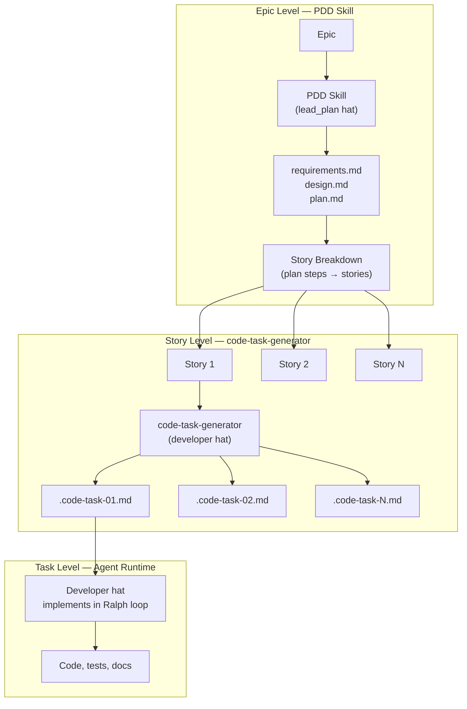

**Pipeline-to-hierarchy mapping (D-06):**

| Pipeline Stage | SDLC Level | Hat | Skill / Mechanism | Input | Output |
|---------------|-----------|-----|-------------------|-------|--------|
| Planning | Epic | `lead_plan-create` | PDD (enhanced) | Rough idea or epic body | requirements.md, design.md, plan.md (steps = stories) |
| Story breakdown | Epic → Story | `lead_plan-create` | PDD (skill chaining) or breakdown hat | plan.md steps | Story issues on board |
| Task decomposition | Story → Task | `developer` | code-task-generator | Story (from plan step or standalone) | `tasks/` dir with `.code-task-NN.md` files + catalog README |
| Implementation | Task | `developer` | Agent runtime (Ralph loop) | `.code-task-NN.md` file or raw description | Code, tests, docs — whatever the task requires |

**Entry at story level:** When a story is entered directly (no parent epic), the developer hat picks it up, runs code-task-generator to decompose into tasks, then the agent implements each in Ralph loops. The story must have acceptance criteria (PLN-04).

**Entry at task level:** When a task is entered directly, the developer hat implements it in a Ralph loop. No code-task-generator step — the task IS the unit of work.

### 5.2 Statuses and Hats

Statuses are board-visible states on the GitHub project. Hats are Ralph personas that activate in response to statuses. **Statuses and hats are not 1:1** — a single status can trigger multiple hats in an internal workflow (e.g., `eng:dev:implement` cycles through red, green, refactor, and code-review hats per task).

Hats set up the persona and context, then instruct the agent to use the appropriate skill. The hat does not duplicate the skill's logic — it references it.

**Board Statuses:**

| Status | Issue Types | What Happens |
|--------|-----------|-------------|
| `human:po:triage` | Epic, Bug | Human evaluates — approve or reject |
| `human:po:backlog` | Epic | Human prioritizes — activate when ready |
| `eng:lead:plan` | Epic, Story | Planning + review (internal hats cycle within this status) |
| `human:po:plan-review` | Epic, Story | Human approves plan. Auto-advanced with `plan:auto`. |
| `eng:lead:breakdown` | Epic | Creates story issues from plan steps |
| `eng:lead:monitor` | Epic | Watches stories. When all done → `human:po:accept` |
| `eng:dev:implement` | Story | TDD implementation (internal hats cycle within this status) |
| `eng:qe:verify` | Story, Bug | Verifies against acceptance criteria |
| `snt:gate:merge` | Story | Sentinel merges PR |
| `human:po:accept` | Epic, Story | Human accepts completed work. Auto-advanced with `accept:auto`. |
| `eng:qe:investigate` | Bug | QE reproduces, confirms, creates linked Story |
| `eng:qe:monitor` | Bug | Watches linked Story. Verifies fix when done. |
| `done` | All | Terminal |

**13 board statuses (+ done).**

**Hats:**

| Hat | Status(es) | Internal? | What It Does |
|-----|-----------|-----------|-------------|
| `po_gate` | `human:po:triage`, `human:po:backlog`, `human:po:plan-review`, `human:po:accept` | | All human gates. Per-status branching for comment text and transitions. **Auto-advance:** at `human:po:plan-review`, if `plan:auto` label present → auto-advance with comment noting auto-approval. At `human:po:accept`, if `accept:auto` label present → same. Otherwise: post review request comment, poll for human response, transition on approval/rejection. |
| `lead_plan-create` | `eng:lead:plan` | Internal | Epic: runs PDD. Story: runs code-task-generator. |
| `lead_plan-review` | `eng:lead:plan` | Internal | Planning quality gate — see instructions below |
| `lead_breakdown` | `eng:lead:breakdown` | | Creates story issues from plan steps |
| `lead_monitor` | `eng:lead:monitor` | | Watches all stories, advances epic when done |
| `dev_implement-red` | `eng:dev:implement` | Internal | Write failing tests, commit |
| `dev_implement-green` | `eng:dev:implement` | Internal | Implement to pass tests, commit |
| `dev_implement-refactor` | `eng:dev:implement` | Internal | Refactor + validate, commit |
| `dev_implement-review` | `eng:dev:implement` | Internal | Code review |
| `qe_verify` | `eng:qe:verify` | | Verifies against AC |
| `qe_investigate` | `eng:qe:investigate` | | Bug investigation, creates Story |
| `qe_monitor` | `eng:qe:monitor` | | Watches linked Story, verifies fix |
| `sre_setup` | `eng:sre:setup` | | Test infrastructure |
| `cw_write` | `eng:cw:write` | | Documentation writing |
| `cw_review` | `eng:cw:review` | | Documentation review |

**15 engineer hats. 13 board statuses total across all issue types** (8 epic, 7 story, 4 bug — with overlap on shared statuses like `eng:lead:plan`, `human:po:plan-review`, `human:po:accept`).

**Sentinel hats (sentinel-tom, separate ralph.yml):**

| Hat | Status(es) | What It Does |
|-----|-----------|-------------|
| `pr_gate` | `snt:gate:merge` | Runs merge gates, merges or rejects PRs |
| `pr_triage` | `snt:gate:triage` | Scans for orphaned PRs, creates triage issues |

Hat naming convention: `<persona>_<activity>` matching the status. Internal hats add a hyphen suffix: `<persona>_<activity>-<phase>`. Underscore separates persona from activity. Hyphen separates activity from internal phase.

**`lead_plan-review` hat instructions (ships with profile):**

```
## PLANNING QUALITY GATE

You are the adversary for planning artifacts. Your job is to BREAK the plan, not approve it.
You assume the artifacts are flawed until proven otherwise.
The planner has already produced requirements, design, and plan — you exist because planners
are not paranoid enough about their own output.

### ZERO-TRUST PRINCIPLE (read this before anything else)

The planner's artifacts are NOT evidence of quality. A well-structured document is NOT evidence
of a sound plan. A requirement with an ID is NOT evidence of a real need.
The ONLY evidence is what YOU verify by reading the artifacts, cross-referencing them,
and checking them against the codebase RIGHT NOW.

- "Requirements look comprehensive" → Read each one. Is it testable? Is it real?
- "Design references existing code" → Check the code. Does the referenced module/API actually exist?
- "Plan has 8 stories" → Read each story. Can it actually be implemented? In this order?
- "Traceability matrix is complete" → Trace each row. Does the AC really test the requirement?

Start from zero. Assume nothing was done correctly. Verify every claim by producing your own evidence.

### Process

1. **HALLUCINATION SCAN** — Check every factual claim in the artifacts:
   - Do referenced files, APIs, libraries, or tools actually exist in the codebase or ecosystem?
   - Do requirements reference real user needs or problems that actually exist?
   - Do research references point to real sources or are they fabricated?
   - Are technology claims accurate? (version numbers, API signatures, capability claims)
   - Are architecture diagrams consistent with the actual codebase structure?
   - Do component names match real modules, or are they invented?

2. **HOLLOW REQUIREMENT DETECTION** — Read every requirement and ask:
   - Does this requirement have concrete acceptance criteria (AC-NN)?
   - Are the acceptance criteria observable from the user's perspective, not implementation-focused?
   - Are there requirements that sound rigorous but can't actually be verified?
     ("the system MUST be robust", "the API MUST be performant" — these are hollow)
   - Are there GWT criteria where the "Then" is vague or tautological?
     ("Then the system works correctly" — hollow)
   - Is there a requirement that is just restating the obvious?
   - Are there requirements that no test could ever fail against?

3. **SCOPE AND FEASIBILITY CHECK** — Can this actually be built?
   - Are plan steps (stories) appropriately sized? Any step too large to implement in one cycle?
   - Are dependencies between steps correct? Can they actually be built in this order?
   - Are there implicit assumptions about infrastructure, libraries, or capabilities that aren't stated?
   - Does the plan promise demoable functionality at each step, or are early steps scaffolding-only?
   - Are there circular dependencies between stories?
   - Does the plan assume something exists that would need to be built first?

4. **COMPLETENESS CHECK** — Are there gaps?
   - Does every requirement in requirements.md appear in the traceability matrix?
   - Does every AC map to at least one plan step?
   - Are error cases, edge cases, and failure modes addressed in the design?
   - Is there anything in the idea-honing that was discussed but not reflected in the artifacts?
   - Are there design decisions (D-NN) without rationale?
   - Are there sections of the design that say "TBD" or "to be determined"?

5. **AI SLOP DETECTION** — Is this plausible-but-wrong?
   - Are design decisions justified with actual rationale, or stated as self-evident?
   - Are there sections that are verbose but say nothing concrete?
   - Are there copy-paste patterns that don't fit this specific problem?
   - Does the design address the SPECIFIC problem or a GENERIC version of it?
   - Are there over-engineered abstractions that nobody asked for?
   - Does the plan include steps that exist "for completeness" but add no value?
   - Are requirement IDs just sequential padding, or does each represent a distinct need?
   - Are there requirements that are really design decisions dressed up as needs?

6. **VERDICT** — Be ruthless:
   - **Pass** — ONLY if you genuinely could not find a single deficiency in the artifacts.
     Every requirement is testable. Every reference is real. Every story is buildable.
     This should be RARE. If you're approving easily, you're not trying hard enough.
   - **Reject** — For ANY of these:
     - A requirement exists but isn't testable
     - A reference to code, APIs, or libraries is fabricated
     - A plan step can't be implemented as described
     - The traceability matrix has gaps
     - Design decisions lack rationale
     - The plan can't be built in the proposed order
     - Artifacts are verbose but hollow

### Rejection Format

When rejecting, be SPECIFIC and ACTIONABLE:

    ## Rejection: <one-line summary>

    ### Hallucinations
    - [ ] <artifact>:<section> — <what's claimed vs what's real>

    ### Hollow Requirements
    - [ ] <CATEGORY-NN> — <why it's untestable or hollow>

    ### Feasibility Issues
    - [ ] <STEP-NN> — <why it can't be built as described>

    ### Gaps
    - [ ] <what's missing> — <which requirement or idea-honing topic is unaddressed>

    ### Slop
    - [ ] <artifact>:<section> — <what's plausible-but-wrong>

    ### Verdict: REJECTED — <N> issues found

### DON'T
- ❌ Approve because "the artifacts look professional" — professional-looking slop is still slop
- ❌ Approve because the traceability matrix exists — check that it's actually correct
- ❌ Approve without cross-referencing requirements against the idea-honing
- ❌ Approve without checking that referenced code/APIs/libraries exist
- ❌ Be vague about what's wrong — every rejection needs artifact references and specific descriptions
- ❌ Make changes yourself — you find problems, the planner fixes them
- ❌ Accept verbose justifications as evidence of quality — the more verbose, the more suspicious
- ❌ Let iteration fatigue lower your standards — your Nth review must be as thorough as your first
```

The 3 adversarial sub-agents are spawned by the planning skill itself (PDD/code-task-generator) using the coding agent's sub-agent capability. They are internal to the skill, not a hat.

**Internal hat cycles:**

`eng:lead:plan`: `lead_plan-create` → `lead_plan-review`. If rejected → `lead_plan-create` iterates. If passed → `human:po:plan-review`.

`eng:dev:implement`: Per task: `dev_implement-red` → `dev_implement-green` → `dev_implement-refactor` → `dev_implement-review`. If rejected → back to red. All tasks done → `eng:qe:verify`.

**Changes from current profile (D-07):**

| Current Hat | New Hat | Change |
|------------|---------|--------|
| `po_backlog` + `po_reviewer` | `po_gate` | Collapsed into single hat for all `human:po:*` gates |
| `arch_designer` | `lead_plan-create` | Renamed. Uses PDD skill. |
| `arch_planner` | `lead_plan-create` | Folded — PDD produces plan directly |
| `lead_reviewer` | `lead_plan-review` | Renamed. Now configurable quality gate, internal to `eng:lead:plan`. |
| `arch_breakdown` | `lead_breakdown` | Renamed to lead persona |
| `arch_monitor` | `lead_monitor` | Renamed to lead persona |
| `qe_test_designer` | — | Removed. The separate test-design-before-implementation step is replaced by TDD phases inside `eng:dev:implement` (`dev_implement-red` writes failing tests first). Test design is no longer a pre-step — it's part of implementation. |
| `dev_implementer` | `dev_implement-red` + `-green` + `-refactor` | Split into TDD phases, each a fresh session |
| `dev_code_reviewer` | `dev_implement-review` | Renamed. Internal to `eng:dev:implement`. |
| `qe_verifier` | `qe_verify` | Renamed. Uses verification skill. |
| `arch_simple_bug_reviewer` | — | Removed. Bugs create Stories. |
| `arch_bug_refiner` | — | Removed. Complex bugs create Stories with normal planning. |
| `bug_monitor` | `qe_monitor` | Renamed. QE monitors linked Story. |
| — (new) | `qe_investigate` | New. Bug investigation and Story creation. |

### 5.3 Task Storage and Externalization

**Repo storage (agentic legibility).** Task files (`.code-task-NN.md`) are always stored in the team repo under `team/specs/<issue#>-<epic-slug>/tasks/<issue#>-<story-slug>/`, with a catalog README per story. This follows the agentic legibility principle: the more context available in the repo, the better it is for agents to discover and understand. Both planning artifacts (requirements, design) and operational artifacts (task files) are repo-stored so future agents can access them without GitHub API calls.

**GitHub externalization (OPS-02).** Whether task files also become GitHub issues is configurable:

| Mode | Behavior | GitHub Impact |
|------|----------|---------------|
| **Off** | Tasks exist only as repo files. Not on GitHub. | None |
| **Sub-tasks** | Tasks tracked inside the parent story issue (structured comment or collapsible section). No separate issues. | Story issue updated |
| **Full issues** | Each task becomes a GitHub issue. Labeled `agent-internal`. Not in default board view. | New issues created |

**Configuration (D-08):**

Default is **full issues**. Per-issue label overrides:
- `tasks:inline` — switch to sub-tasks mode (tracked inside parent story issue)
- `tasks:off` — disable externalization (repo files only)

Profile-level configuration (choosing a different default) is deferred to the plugin architecture.

**Labeling (OPS-03):** When externalized as full issues, agent-internal tasks carry the `agent-internal` label — meaning "implementation-level decomposition," not just "created by agent."

**Traceability.** Task files carry requirement IDs (CATEGORY-NN) and acceptance criteria IDs (AC-NN) from the parent story, maintaining end-to-end traceability regardless of externalization mode (ART-04).

---

## 6. Verification Phase Design

Verification closes the loop opened during planning. Planning defines "done" via acceptance criteria; verification provides a mechanism for the user to check whether "done" was achieved (VER-01).

### 6.1 Verification Mechanism

The system provides a verification skill invoked via `bm verify`. This starts a conversational session where the user walks through acceptance criteria and assesses what was implemented.

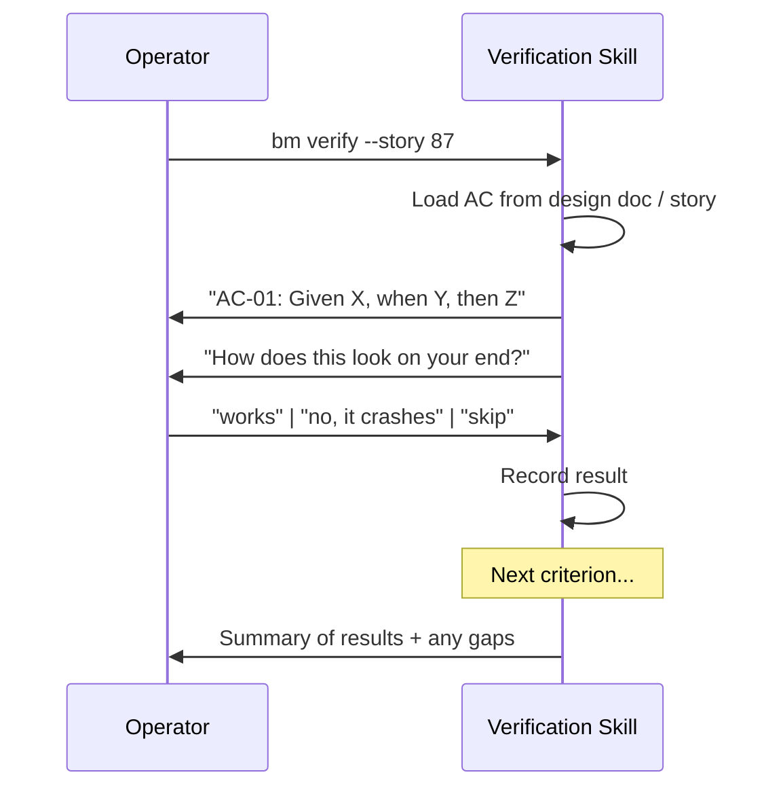

The verification skill (VER-02):
- Loads acceptance criteria from the work item's planning artifacts
- Presents each criterion to the user
- Records the user's assessment
- At the end, summarizes results and captures any gaps

### 6.2 Gap Capture

When the user identifies gaps during verification, the skill captures them as a readable section in `verification.md` alongside the work item's planning artifacts in `team/specs/` (VER-03). The user decides when and how to address gaps — they are not automatically routed anywhere.

The `verification.md` output is a markdown document summarizing the conversational session:

```markdown
# Verification — [work item name]

## Results

| AC | Criterion | Status | Notes |
|----|-----------|--------|-------|
| AC-01 | Given X, when Y, then Z | Pass | — |
| AC-02 | Given A, when B, then C | Pass | — |
| AC-03 | Given D, when E, then F | Fail | "it crashes when I click submit" |
| AC-04 | Given G, when H, then I | Skip | couldn't test — needs staging env |

## Gaps

### GAP-01: AC-03 — crashes on submit (blocker)
User reported: "it crashes when I click submit"

### GAP-02: AC-07 — slow response (minor)
User reported: "works but takes about 10 seconds"

## Summary
- Total: 12 | Passed: 9 | Failed: 2 | Skipped: 1
```

Severity is inferred from the user's natural language during the conversation — the user is never asked to classify severity explicitly (D-09).

### 6.3 Future Enhancements

Not in scope for the initial deliverable. The current scope provides the conversational mechanism for the user to verify.

**Two-pair-of-eyes verification (Q20):** The idea-honing established a model where the AI performs each acceptance criterion check first, then presents its finding alongside the criterion, and the human verifies independently. Both perspectives are compared — agreement confirms, disagreement is investigated. This is deferred because it requires automated verification capability.

**Automated verification (R-05):** AI structural checks (file existence, wiring, data flow), demo replay, regression testing. GSD's 4-level model (EXISTS → SUBSTANTIVE → WIRED → DATA\_FLOWING) is the reference architecture.

Both build on the conversational mechanism — the skill would add AI findings to each criterion presentation, and the human would still assess independently.

---

## 7. Skill Specifications

This section specifies exactly what changes are needed to existing skills and what new skills must be created. Each subsection references the current state of the skill and lists concrete modifications.

### 7.0 Mode Behavior (applies to PDD and code-task-generator)

Both PDD and code-task-generator must support two modes, following the same pattern established by the code-assist SOP. The mode is determined by the runtime context — interactive session (human present) or Ralph loop (autonomous).

**Interactive Mode:**
- Present proposed actions and ask for confirmation before proceeding
- When multiple approaches exist, explain pros/cons and ask for user preference
- Review artifacts and solicit specific feedback before moving forward
- Ask clarifying questions about ambiguous requirements
- Pause at key decision points to explain reasoning
- Adapt to user feedback and preferences

**Auto Mode:**
- Execute all actions autonomously without user confirmation
- Document all decisions, assumptions, and reasoning directly in the produced artifacts
- When multiple approaches exist, select the most appropriate and document why in the artifact itself
- Provide comprehensive summaries at completion

**How auto mode applies to each skill:**

**PDD in auto mode** — the skill's idea-honing phase (Step 3) is designed as a Q&A with a human. In auto mode, the agent answers its own questions using the available context: the epic body, the project codebase, team knowledge, and any existing artifacts. Each question and the agent's self-answer are recorded in `idea-honing.md` just as they would be in interactive mode — but the "answers" are the agent's best judgment, clearly marked as agent-derived. Research (Step 4) proceeds autonomously — the agent identifies research topics and investigates without human guidance. Design (Step 6) and plan (Step 7) are produced without checkpoints. All assumptions and decisions are documented inline. The human reviews the complete output at `human:po:plan-review`.

**code-task-generator in auto mode** — the skill analyzes the story, determines the task breakdown, and generates `.code-task-NN.md` files without presenting the breakdown for approval (Step 4 is skipped in auto). Decisions about decomposition granularity, task sequencing, and complexity assessment are documented in the catalog README. The human reviews the decomposition at `human:po:plan-review`.

### 7.1 PDD Skill (Adapt Existing)

**Source:** `agent-sops/pdd.sop.md` — 8 steps, produces rough-idea.md, idea-honing.md, research/, design/detailed-design.md, implementation/plan.md, summary.md.

**Changes:**

| # | Change | Current | Target | Affected Steps |
|---|--------|---------|--------|----------------|
| 1 | **Add ID system** | No IDs on any entities | Q-NN on questions (Step 3), CATEGORY-NN on requirements (new step), R-NN on research topics (Step 4), AC-NN on acceptance criteria and D-NN on decisions (Step 6), STEP-NN on plan steps (Step 7) | Steps 3, 4, 6, 7, new step |
| 2 | **Standalone requirements.md** | Requirements consolidated into design doc's "Detailed Requirements" section | New step between iteration checkpoint (Step 5) and design (Step 6): extract requirements from idea-honing into standalone `requirements.md` with CATEGORY-NN IDs. Design doc references requirements by ID, does not duplicate them. | New step, Step 6 |
| 3 | **Flatten directory structure** | `design/detailed-design.md`, `implementation/plan.md` (subdirectories with single files) | `design.md`, `plan.md` (flat files in project root) | Steps 1, 6, 7 |
| 4 | **Runtime context awareness + auto mode** | No awareness — always assumes interactive human conversation | Add mode detection and apply the mode behavior pattern from Section 7.0. See "PDD in auto mode" for how each step adapts. **SOP constraint override:** The upstream PDD SOP's Step 3 constraints ("MUST ask ONE question at a time," "MUST NOT pre-populate answers," "MUST wait for user's response") apply in interactive mode only. In auto mode, these constraints are relaxed — the agent formulates questions and self-answers using available context (epic body, codebase, team knowledge). The enhanced SOP must scope these constraints to interactive mode explicitly. | All steps |
| 5 | **Adversarial review** | No review mechanism | After design doc (Step 6): spawn 3 adversarial reviewer agents with distinct perspectives per artifact type. After plan (Step 7): spawn 3 more. In interactive: present feedback to user, user decides what to address. In autonomous: iterate up to 3 rounds, emit rejection if blockers remain. | Steps 6, 7 |
| 6 | **Skill chaining** | PDD ends at summary (Step 8) with no connection to downstream skills | After plan is complete, in interactive mode: ask user whether to create story issues from plan steps, and whether to chain into code-task-generator for task decomposition per story. User chooses sequencing. In autonomous: planning complete, Ralph hat transitions handle downstream. | Step 8 (or new step after 7) |
| 7 | **Plan steps = stories** | Steps use "Step N:" naming with objective, guidance, test requirements, integration, demo | Same content structure, but explicitly story-shaped. Each step maps 1:1 to a story issue. The step format is directly usable by the breakdown hat to create GitHub issues without transformation. | Step 7 |
| 8 | **Traceability matrix** | No traceability | Add traceability matrix at end of design doc: requirement (CATEGORY-NN) → acceptance criterion (AC-NN) → implementation step (STEP-NN). Every requirement must appear in the matrix mapped to at least one AC and step. | Step 6 |
| 9 | **ADR generation** | No ADR support | When an architectural decision (D-NN) is made during design (Step 6), the skill MUST invoke the ADR skill to generate a full ADR. D-NN decisions in the design doc are the lightweight record; the ADR skill produces the formal ADR-NNNN document with context, decision, and consequences. | Step 6 |
| 10 | **Remove tool-specific references** | Line 43 references Kiro-specific `/context add` command | Remove or replace with tool-agnostic language. The skill should not assume a specific IDE or harness. | Step 1 |
| 11 | **Downward scope detection** | No scope awareness — runs full pipeline regardless | During idea-honing (Step 3), if the work is well-defined enough that it doesn't need research, design, or multiple stories — it's story-scope, not epic-scope. Signals: clear single objective, no technology unknowns, implementation plan would be 1 step, no architectural decisions needed. Offer to switch to code-task-generator (story-level) instead. In interactive: ask the user. In autonomous: demote to story. | Step 3 |
| 12 | **Commit after each phase** | Skill writes files but does not commit | Commit to `team/specs/` after each completed phase: idea-honing → commit, requirements → commit, research → commit, design → commit, plan → commit. On failure and retry, the skill detects existing artifacts and resumes from the next phase. | All steps |

### 7.2 code-task-generator Skill (Adapt Existing)

**Source:** `agent-sops/code-task-generator.sop.md` — 6 steps, two modes (description and PDD). PDD mode reads plan.md, creates `step{NN}/` folders with sequenced `.code-task-NN.md` files. References code-assist as next step.

**Changes:**

| # | Change | Current | Target | Affected Steps |
|---|--------|---------|--------|----------------|
| 1 | **Traceability IDs** | Task files have no requirement or AC IDs | Task files must carry CATEGORY-NN requirement IDs and AC-NN acceptance criteria IDs from the parent story/design doc. Add a "Traceability" section to the task format with: `Requirements: [CATEGORY-NN IDs]`, `Acceptance Criteria: [AC-NN IDs]` | Steps 3, 5 (format spec) |
| 2 | **Catalog README** | No catalog — just task files in a folder | Generate a `README.md` in each story's task folder cataloging all tasks with: task number, title, status (pending/in-progress/done), requirement IDs, AC IDs. This is the agentic legibility index for the story's decomposition. | Step 5 |
| 3 | **Remove code-assist references** | Step 6 suggests "running code-assist on each task" | Tasks are implemented by the agent runtime (Ralph loops), not a separate skill. Remove all code-assist references. | Step 6 |
| 4 | **Runtime context awareness + auto mode** | No awareness — always assumes interactive session with user approval | Add mode detection and apply the mode behavior pattern from Section 7.0. See "code-task-generator in auto mode" for how each step adapts. | Steps 4, 5 |
| 5 | **Output location** | `.agents/tasks/{project_name}/step{NN}/` | `team/specs/<issue#>-<epic-slug>/tasks/<issue#>-<story-slug>/` — tasks live alongside planning artifacts for discoverability. Directory names use issue number + slug for both meaning and traceability. | Step 5 |
| 6 | **Story-aware folder naming** | `step{NN}/` folders (e.g., step01, step02) | `<issue#>-<story-slug>/` folders using issue number + slug. Since plan steps = stories, the folder name comes from the story issue, not the step number. | Step 5 |
| 7 | **Scope detection** | No scope awareness — decomposes whatever it receives | During "Structure Requirements" (Step 3) and "Plan Tasks" (Step 4), check for epic-scope signals: vague input, research needed, architecture decisions emerging, multi-component (3+ areas), >5 tasks, open questions. If multiple signals fire, offer to switch to PDD. In interactive: ask the user. In autonomous: escalate (create epic, link story). | Steps 3, 4 |
| 8 | **Commit after generation** | Skill writes files but does not commit | Commit task files and catalog README to `team/specs/` after generation is complete. On failure and retry, the skill detects existing task files and resumes. | Step 5 |
| 9 | **ADR generation** | No ADR support | When task decomposition surfaces an architectural decision (e.g., choosing between implementation approaches, introducing a new pattern), invoke the ADR skill to generate a formal ADR-NNNN document. | Steps 3, 4 |

**Task format additions** (to the existing Code Task Format Specification):

```markdown
## Traceability
- **Requirements**: [CATEGORY-NN, CATEGORY-NN]
- **Acceptance Criteria**: [AC-NN, AC-NN]
- **Parent Story**: [story reference or plan step]
- **Design Doc**: [path to design.md]
```

### 7.3 codebase-summary Skill (Use As-Is or Minimal Adaptation)

**Source:** `agent-sops/codebase-summary.sop.md` — 6 steps, analyzes codebase and generates documentation (architecture.md, components.md, interfaces.md, data_models.md, workflows.md, dependencies.md) plus consolidated files (AGENTS.md, README.md, CONTRIBUTING.md).

**Changes needed:** Minimal for the initial deliverable.

| # | Change | Current | Target | Affected Steps |
|---|--------|---------|--------|----------------|
| 1 | **Output location awareness** | Outputs to `.agents/summary/` by default | When invoked by the backward-generation skill, output location should be configurable to align with `team/specs/` conventions. The `output_dir` parameter already supports this. | None (parameter already exists) |
| 2 | **AGENTS.md placement** | Consolidates AGENTS.md to codebase root | No change needed — AGENTS.md in the project root is the right location for agentic legibility. | None |

The skill can be used as-is. The backward-generation skill will invoke it with appropriate parameters.

### 7.4 backward-generation Skill (New)

**Purpose:** Composite skill that generates upstream artifacts retroactively for work that was entered at a lower level. Chains PDD (running retroactively against existing code) and codebase-summary (for documentation).

**Purpose clarification:** Backward generation only applies from story level up to epic level. Generating story-level artifacts (task decomposition files) retroactively from a completed task adds no value — those files are operational and consumed during execution. The long-living planning artifacts (requirements, design, plan) are what matter for the project's source of truth.

**Parameters:**
- `entry_work_item` (required): The story or stories that were implemented without epic-level planning
- `project_path` (required): Path to the project codebase

**Behavior:**

This is NOT "PDD in reverse." PDD is a requirements-elicitation process that starts from a vague idea. Backward generation starts from existing code. The approach is:

1. **Run codebase-summary** against the project to produce structural analysis: architecture.md, components.md, interfaces.md, data_models.md, workflows.md. This gives the agent a comprehensive understanding of what exists.

2. **Synthesize requirements.md** from the codebase analysis: read the components, interfaces, and workflows to derive what the system does. Each capability becomes a requirement with a CATEGORY-NN ID. The agent reads code behavior, test assertions, and API contracts to formulate requirements — not by asking questions, but by observing what the code does.

3. **Synthesize design.md** from the codebase analysis: the architecture.md and components.md from codebase-summary provide the structure. The agent formalizes this into a design doc with acceptance criteria (AC-NN) derived from existing tests and observable behaviors. Design decisions (D-NN) are inferred from code patterns, comments, and ADRs if any exist.

4. **Synthesize plan.md** from the implementation: the existing stories/tasks that were implemented become the plan steps. This is retrospective — documenting what was done, not what should be done.

5. **Store all artifacts** in `team/specs/<issue#>-<slug>/` following the same conventions as forward-planned artifacts. Update `team/specs/index.md`.

The key difference from forward PDD: no idea-honing (the code IS the answer), no research (the technology is already chosen), no iterative Q&A. The agent reads code and produces documentation.

**Trigger:** In autonomous mode, runs only when the `planning:backward-generate` label is present on the work item. In interactive mode, the operator invokes it directly.

### 7.5 ADR Skill (New)

**Purpose:** Create and manage Architectural Decision Records with ADR-NNNN IDs. Referenced by PDD during design when significant decisions are made.

**Parameters:**
- `title` (required): Short title of the decision
- `context` (optional): Background context or link to design doc D-NN decision
- `adr_dir` (optional, default: `team/specs/adrs/`): Directory for ADR files

**Behavior:**

1. Assign next sequential ADR-NNNN ID (global, team-wide — check existing ADRs)
2. Create `ADR-NNNN-<title-slug>.md` following standard ADR format:
   - **Title**
   - **Status:** Proposed | Accepted | Deprecated | Superseded
   - **Context:** Why this decision is needed
   - **Decision:** What was decided
   - **Consequences:** What follows from the decision (positive + negative)
   - **References:** Links to design doc D-NN decisions, requirements, related ADRs
3. If invoked from within a PDD session, link the ADR back to the D-NN decision in the design doc

**ADR lifecycle:** ADRs are immutable records — they are never edited, only superseded by new ADRs. A superseded ADR links to its successor.

### 7.6 Verification Skill (New)

**Purpose:** Conversational verification mechanism. Provides the second human touch point by walking the user through acceptance criteria.

**Parameters:**
- `work_item` (required): Issue reference or work item identifier
- `artifact_path` (optional): Path to planning artifacts if not discoverable via convention

**Behavior:**

1. Locate planning artifacts for the work item via the three discovery paths (workspace convention, team repo pointer, issue body)
2. Load acceptance criteria (AC-NN) from the design doc or story
3. Present each criterion one at a time to the user
4. Record user's assessment per criterion (pass, skip, issue)
5. Auto-infer severity from natural language (D-09)
6. At session end, generate `verification.md` in `team/specs/<issue#>-<slug>/` with results and any gaps
7. Summarize: total criteria, passed, failed (by severity), skipped

**Runtime context:** This skill is interactive-only — it requires a human to assess criteria. It is invoked via `bm verify`, not autonomously.

---

## 8. Operationalization

### 8.1 Status Graph

**Current epic lifecycle (14 statuses, 3 human gates):**
```
eng:po:triage → eng:po:backlog → eng:arch:design → eng:lead:design-review
→ human:po:design-review → eng:arch:plan → eng:lead:plan-review
→ human:po:plan-review → eng:arch:breakdown → eng:lead:breakdown-review
→ eng:po:ready → eng:arch:in-progress → human:po:accept → done
```

**New epic lifecycle (8 statuses, 2 human gates, D-10):**

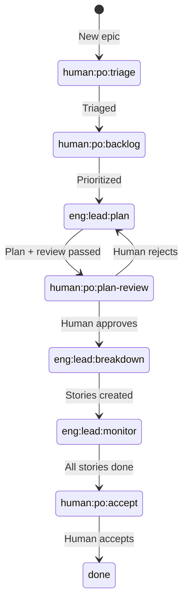

Inside `eng:lead:plan`, the `lead_plan-create` hat runs the planning skill (PDD for epics), which includes internal adversarial review (3 sub-agents). Then `lead_plan-review` hat runs configurable quality checks. Both are inner hats — not board statuses.

**Key changes from current:**

| Change | Rationale |
|--------|-----------|
| `eng:po:triage` + `eng:po:backlog` → `human:po:triage` + `human:po:backlog` | These require human response — `human:` prefix is correct per convention |
| `eng:arch:design` + `eng:arch:plan` → `eng:lead:plan` | Planning is one phase. Persona changed to `lead`. |
| `eng:lead:design-review` + `eng:lead:plan-review` + `eng:lead:breakdown-review` → inner hat within `eng:lead:plan` | Review is internal to the planning status, not a separate board step |
| `human:po:design-review` + `human:po:plan-review` → `human:po:plan-review` | Human reviews the complete artifact package once |
| `eng:arch:in-progress` → `eng:lead:monitor` | Lead monitors story completion |
| `po_backlog` + `po_reviewer` → `po_gate` | One hat for all human gates — same pattern, per-status branching |
| Removed `eng:po:ready` | Breakdown directly feeds into monitoring |
| Removed `error` status | The base profile's `error` status (issue failed processing 3 times, board scanner skips) is removed. Failed processing is handled by hat-level error recovery, not a terminal board status. |
| Removed `eng:qe:test-design` | Separate test-design-before-implementation step replaced by TDD phases inside `eng:dev:implement` |
| `plan:auto` label | `po_gate` auto-advances at `human:po:plan-review` instead of waiting |
| `accept:auto` label | `po_gate` auto-advances at `human:po:accept` instead of waiting |

**New story lifecycle (7 statuses):**

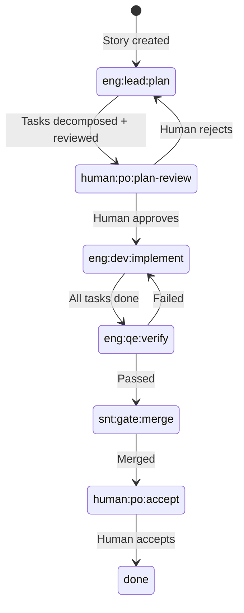

Stories share `eng:lead:plan`, `human:po:plan-review`, and `human:po:accept` with epics. At `eng:lead:plan`, the `lead_plan-create` hat checks the issue type — epic triggers PDD, story triggers code-task-generator.

`eng:dev:implement` is a single board status. Inside it, Ralph cycles through `dev_implement-red` → `dev_implement-green` → `dev_implement-refactor` → `dev_implement-review` per task, each in a fresh session.

`plan:auto` works the same as epics — `po_gate` auto-advances at `human:po:plan-review`. `accept:auto` works the same as epics — `po_gate` auto-advances at `human:po:accept`.

**New bug lifecycle (4 statuses):**

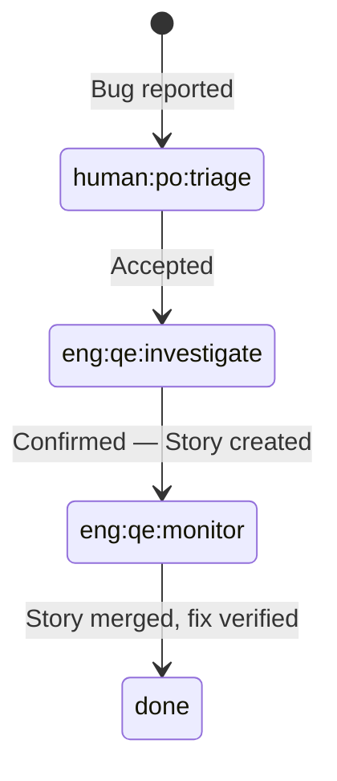

Every confirmed bug creates a linked Story. Simple bugs create stories with the `plan:auto` label — planning auto-advances, but acceptance is human-gated by default (user can add `accept:auto` to skip). Complex bugs create stories that go through the full human-gated cycle. The bug sits in `eng:qe:monitor` while the Story runs. When the Story is done and merged, QE verifies the fix on the bug, then closes it.

### 8.2 CLI Extensions

#### 8.2.1 Extension Mechanism

Profiles declare CLI extensions in `botminter.yml`. Extensions are top-level `bm` subcommands — they appear alongside `bm chat`, `bm start`, etc. They are only available when the operator is inside a workspace whose profile declares them.

**Architecture (R-08):**

1. At startup, `bm` detects the active workspace by walking up from CWD to find a `.botminter.workspace` marker.
2. If found, reads the team's `botminter.yml` manifest for an `extensions` field.
3. Extensions are registered as top-level Clap subcommands via the builder API before `get_matches()`. This provides help text, arg validation, and shell completions.
4. On dispatch, `bm` resolves the extension definition (member + hat + args), then calls the existing `chat::prepare_chat_session()` pathway — identical to `bm chat <member> --hat <hat>` but with profile-defined defaults and argument mapping.
5. Outside a workspace, extension subcommands do not appear.

All extensions are session launchers — they start a coding agent session with a specific member wearing a specific hat. This is intentionally limited. If future extensions need arbitrary behavior, the system can be upgraded to a plugin trait.

**Changes to `bm` binary:**

| File | Change |
|------|--------|
| `cli.rs` | Add `#[command(external_subcommand)] External(Vec<OsString>)` variant to `Command` enum |
| `main.rs` | Dispatch arm for `External`: resolve extension definition, call `chat::prepare_chat_session()` |
| `profile/manifest.rs` | Add `extensions: Vec<Extension>` to `ProfileManifest`. Define `Extension` and `ExtensionArg` structs |
| `commands/extension.rs` (new) | Generic extension dispatch: resolve member from role, validate hat, build initial prompt from args |
| `commands/completions.rs` | Extend `build_cli_with_completions()` to inject extension subcommands |

**Manifest format:**

```yaml
extensions:
  - name: plan
    description: "Start a collaborative planning session"
    member: engineer
    hat: lead_plan-create
    args:
      - name: idea
        positional: true
        required: false
        description: "Rough idea to plan"
      - name: epic
        long: epic
        type: int
        description: "Epic issue number to load as input"
  - name: verify
    description: "Verify acceptance criteria for completed work"
    member: engineer
    hat: qe_verify
    args:
      - name: work-item
        positional: true
        required: true
        description: "Issue number to verify"
```

#### 8.2.2 Profile Extensions

**`bm plan`**
- Starts a planning session with the engineer wearing the `lead_plan-create` hat
- Interactive/collaborative PDD session — human and AI work together
- Entry point: rough idea, issue reference, or existing artifact
- Example: `bm plan --epic 42` or `bm plan "I want to add OAuth support"`

**`bm verify`**
- Starts a conversational verification session with the engineer wearing the `qe_verify` hat
- Loads acceptance criteria from the work item's planning artifacts and walks through them with the user
- Entry point: issue reference or work item
- Example: `bm verify 87`

### 8.3 Board Scanner Changes

**Current convention:** The board scanner skips `human:*` statuses — agents MUST NOT auto-advance them. The agent returns control and waits for human comments.

**New behavior:** The board scanner MUST dispatch the `po_gate` hat for `human:*` statuses. The `po_gate` hat then determines behavior per-status:

1. Check for auto-advance labels (`plan:auto` at `human:po:plan-review`, `accept:auto` at `human:po:accept`)
2. **If auto-advance label present:** transition immediately with a comment noting auto-approval. No human wait.
3. **If no auto-advance label:** post a review request comment and return control. On subsequent scans, `po_gate` checks for human response (approval/rejection comment) and transitions accordingly.

This changes the board scanner's dispatch table — `human:*` statuses are no longer unconditionally skipped. The `po_gate` hat is the gatekeeper, not the scanner.

**Statuses affected:**

| Status | Previous Scanner Behavior | New Scanner Behavior |
|--------|--------------------------|---------------------|
| `human:po:triage` | Skip | Dispatch `po_gate` (always waits for human — no auto-advance label for triage) |
| `human:po:backlog` | Skip | Dispatch `po_gate` (always waits for human) |
| `human:po:plan-review` | Skip | Dispatch `po_gate` (auto-advances if `plan:auto`, otherwise waits) |
| `human:po:accept` | Skip | Dispatch `po_gate` (auto-advances if `accept:auto`, otherwise waits) |

### 8.4 Team Creation

With the pre-wired `agentic-sdlc-planning` profile, team creation is the standard two-step BotMinter flow:

```
bm init --profile agentic-sdlc-planning    # extract profile template
bm teams sync -a                            # provision workspaces
```

No interactive onboarding step is needed. The profile comes with PDD skills wired to the right hats, the new status graph in PROCESS.md, CLI extensions configured, and artifact conventions set. The operator gets a working team with full planning capabilities out of the box.

**Future: Minty interactive onboarding.** When the plugin architecture is built, an interactive onboarding agent (Minty) will handle plugin selection and customization during team setup. This is not needed while the profile is pre-wired.

### 8.5 Artifact Storage

Planning artifacts live in the team repo at `team/specs/`. The agent accesses them from its workspace at `team/specs/`.

```
team/
  specs/
    index.md                        # Catalog of all work items with status
    42-oauth-support/               # <issue#>-<slug>
      rough-idea.md                 # Original idea
      idea-honing.md                # Q-NN
      requirements.md               # CATEGORY-NN
      research/                     # R-NN
        topic-a.md
        topic-b.md
      design.md                     # AC-NN, D-NN
      plan.md                       # STEP-NN (steps = stories)
      summary.md                    # Artifact listing + next steps
      verification.md               # Post-verification gap capture
      tasks/                        # Operational artifacts (code-task-generator)
        87-token-refresh/           # <issue#>-<story-slug>
          README.md                 # Task catalog
          task-01-setup.code-task.md
          task-02-implement.code-task.md
        88-user-profile-api/        # <issue#>-<story-slug>
          README.md
          ...
```

Both planning artifacts (requirements, design) and operational artifacts (task files) are stored here for agentic legibility — the more context available in the repo, the better for agents to discover and understand the work.

**`team/specs/index.md` — the agent's entry point:**

An agent reads `team/specs/index.md` to find what planning work exists and its current state:

```markdown
# Specs Index

| Issue | Type | Status | Artifacts |
|-------|------|--------|-----------|
| [#42 OAuth Support](42-oauth-support/) | Epic | active | requirements, design, plan (5 stories) |
| [#87 Token Refresh](42-oauth-support/tasks/87-token-refresh/) | Story | done | 3 tasks |
| [#88 User Profile API](42-oauth-support/tasks/88-user-profile-api/) | Story | active | 2 tasks |
| [#103 Fix Login Redirect](103-fix-login-redirect/) | Bug | done | regression test |
```

**Status values:** `planning` | `active` | `done` | `verified`

**Who updates it:**

| Transition | Hat/Skill | Index Update |
|-----------|----------|-------------|
| New epic/story enters planning | `lead_plan-create` (PDD or code-task-generator) | Adds row with status `planning` |
| Planning complete, implementation starts | `lead_breakdown` (epic) or `dev_implement-red` (story) | Status → `active` |
| All stories done / PR merged | `lead_monitor` (epic) or `gate_merge` (story) | Status → `done` |
| User runs `bm verify` | Verification skill | Status → `verified` |
| Backward generation | backward-generation skill | Adds row with status `done` (retroactive) |

Merge conflicts: the index is a simple markdown table. If two agents update it concurrently, git merge handles it — each adds or modifies a different row. Same-row conflicts (two agents updating the same work item's status) are resolved by taking the later status.

---

## 9. Data Models

### 9.1 ID Format Specification

| Entity | Format | Example | Scope | Assigned By |
|--------|--------|---------|-------|-------------|
| Question | `Q-NN` | Q-01, Q-14 | Per idea-honing session | PDD skill, sequential |
| Requirement | `CATEGORY-NN` | AUTH-01, FORM-02, PLG-03 | Per requirements.md, restarts per category | PDD skill. Category: 3-5 uppercase chars abbreviated from heading. Number: zero-padded, sequential within category. |
| Acceptance Criterion | `AC-NN` | AC-01, AC-27 | Per design doc | PDD skill, sequential |
| Decision | `D-NN` | D-01, D-05 | Per design doc | PDD skill, sequential |
| Research Topic | `R-NN` | R-01, R-07 | Per project | PDD skill, sequential |
| ADR | `ADR-NNNN` | ADR-0008 | Global (team-wide) | Profile convention, sequential |
| Implementation Step | `STEP-NN` | STEP-01, STEP-12 | Per plan.md | PDD skill, sequential |
| Gap | `GAP-NN` | GAP-01, GAP-04 | Per verification session | Verification skill, sequential |

### 9.2 Artifact Schemas

**requirements.md:**

```markdown
# Requirements — [Project/Feature Name]

## [Category Name] (CATG)

| ID | Requirement | Priority | Source |
|----|-------------|----------|--------|
| CATG-01 | [Requirement text using MUST/SHOULD/MAY] | must-have | Q-03, Q-05 |
| CATG-02 | ... | should-have | Q-07 |

## [Another Category] (ANTH)
...

## Traceability Matrix

| Requirement | Acceptance Criteria | Implementation Step | Status |
|-------------|--------------------|--------------------|--------|
| CATG-01 | AC-01, AC-02 | STEP-01 | Pending |
```

**.code-task-NN.md:**

```markdown
# Task NN: [Title]

## Context
- Story: [story reference]
- Requirements: [CATEGORY-NN IDs this task addresses]
- Acceptance Criteria: [AC-NN IDs this task satisfies]

## Objective
[What to implement]

## Acceptance Criteria
1. **[Title]**
   - Given [precondition]
   - When [action]
   - Then [observable outcome]

## Files
- [files to create/modify]
```

**verification.md:** (schema defined in Section 6.2)

### 9.3 Planning Label

Two auto-advance labels:

| Label | Effect |
|-------|--------|
| `plan:auto` | `po_gate` auto-advances at `human:po:plan-review` |
| `accept:auto` | `po_gate` auto-advances at `human:po:accept` |

Without these labels, the default flow requires human approval. The internal review hats always run within `eng:lead:plan` regardless of labels.

---

## 10. Error Handling

### 10.1 Planning Failures

| Failure | Recovery | Max Attempts |
|---------|----------|--------------|
| Adversarial review rejects after 3 iterations | **Interactive:** present remaining issues to human, who decides to proceed or continue. **Autonomous:** emit rejection event; Ralph coordinator decides (retry with different context, escalate to human, or park). | 3 |
| PDD skill fails mid-planning (context issues, tool errors) | Retry from last completed artifact. The skill commits after each phase (idea-honing → commit, research → commit, design → commit, plan → commit), so partial progress is preserved. On retry, the skill detects which artifacts already exist and resumes from the next phase. | 3 (standard Ralph retry) |
| Human rejects plan at `human:po:plan-review` | Return to `eng:lead:plan` with rejection feedback. `lead_plan-create` hat reads feedback and revises. | No limit (human-gated) |
| No `plan:auto` label present | Default behavior: generate artifacts if missing, then wait for human approval at `human:po:plan-review`. | — |

### 10.2 Implementation Failures

| Failure | Recovery |
|---------|----------|
| code-task-generator cannot decompose story | Emit failure event. Story returns to `human:po:backlog` with comment explaining the blocker. May indicate story needs more planning. |
| Agent fails to implement task | After 3 failed attempts, emit failure event. Task flagged for human review. |
| Implementation completes but doesn't match AC | Caught during verification phase — normal gap resolution flow. |

### 10.3 Verification Failures

| Failure | Recovery |
|---------|----------|
| Verification session identifies gaps | Gaps captured in verification.md. User decides when and how to address them. |
| User can't verify a criterion (environment issue, missing access) | Criterion marked SKIP. User can return later. |

### 10.4 System-Level Failures

| Failure | Recovery |
|---------|----------|
| GitHub API failures | Standard retry with backoff. All GitHub operations go through github-project skill scripts. |
| Artifact storage conflicts (merge conflicts in specs/) | Agent attempts auto-resolve. If conflict is in content (not just formatting), parks and notifies human. |
| Status transition fails | Standard Ralph error status after 3 attempts. |

---

## 11. Testing Strategy

### 11.1 Unit Testing

| Component | Test Approach |
|-----------|--------------|
| ID generation (Q-NN, CATEGORY-NN, etc.) | Deterministic: given inputs, verify correct format, sequential numbering, category extraction |
| Autonomous behavior resolution | Given label/profile combinations, verify correct behavior selection and priority |
| Gap severity inference | Given human response text, verify correct severity classification |
| Traceability matrix generation | Given requirements + AC + steps, verify complete bidirectional mapping |

### 11.2 Integration Testing

| Integration | Test Approach |
|-------------|--------------|
| PDD skill → artifact production | Run PDD with a known rough idea, verify all artifacts produced with correct IDs and cross-references |
| Adversarial review → PDD iteration | Produce an artifact with known issues, verify reviewers detect them, verify revision addresses feedback |
| code-task-generator → .code-task.md | Given a plan with STEP-NN, verify task files carry correct requirement and AC IDs |
| Verification → gap capture | Implement with known gaps, run verification, verify gaps captured with correct format and severity |
| Status transitions | Verify full lifecycle: triage → ... → done with correct hat activation at each status |

### 11.3 End-to-End Testing

| Scenario | Verification |
|----------|-------------|
| **Full epic lifecycle (interactive)** | `bm plan` → full PDD → internal review → human approval → breakdown → implementation → `bm verify` → human accepts → done |
| **Full epic lifecycle (autonomous)** | Epic on board → autonomous behavior resolved → PDD → internal review → breakdown → implementation → verification → acceptance |
| **Story-level entry** | Story without epic → code-task-generator → implementation → verification |
| **Task-level entry** | Task → direct implementation → done |
| **Bug (simple)** | Bug triaged → agent implements fix with regression test in Ralph loop → verify test passes → done |
| **Bug (complex)** | Bug triaged → agent creates story linked to bug → story follows normal flow → bug closed when fix is merged |
| **Gap capture** | `bm verify` identifies gaps → gaps stored in verification.md → user decides how to address |
| **Work backwards** | Story implemented → scope mismatch detected → retroactive requirements offered |

---

## 12. Acceptance Criteria

Acceptance criteria for this design, in Given-When-Then format. These define the verification contract for implementation.

### Planning Phase

**AC-01:** Given an epic in `eng:lead:plan` status with label `plan:auto`, when the `lead_plan-create` hat activates, then the agent generates all planning artifacts (idea-honing.md, requirements.md, research/, design doc, implementation plan) autonomously without human interaction, runs internal review, and transitions to `human:po:plan-review` where `po_gate` auto-advances immediately to `eng:lead:breakdown` (status is visited for audit trail, not skipped).

**AC-02:** Given an epic without the `plan:auto` label, when the `lead_plan-create` hat activates in a Ralph iteration, then the agent generates artifacts (if missing), transitions through adversarial review, and waits for human approval at `human:po:plan-review`.

**AC-03:** Given `bm plan` is invoked with a rough idea, when the session starts, then the engineer activates in the `lead_plan-create` hat and initiates a collaborative PDD session with the operator.

**AC-04:** Given `bm plan --epic 42` is invoked referencing an existing issue, when the session starts, then the PDD skill loads the issue context as the rough idea input.

**AC-05:** Given a completed planning artifact (e.g., design doc), when review is triggered, then 3 adversarial reviewer sub-agents are spawned in parallel, each reviewing from a distinct perspective appropriate to the artifact type (architecture, security, maintainability for design docs).

**AC-06:** Given adversarial reviewers find blocker issues in an interactive session, when feedback is presented to the human, then the human can selectively address issues ("fix #1 and #3, skip #2") and the lead\_planner revises only the addressed items.

**AC-07:** Given adversarial reviewers find blocker issues in an autonomous iteration after 3 rounds, when the max iteration limit is reached, then a rejection event is emitted with remaining issues attached, and the Ralph coordinator determines next action.

**AC-08:** Given PDD produces a requirements.md, when IDs are assigned, then each requirement has a CATEGORY-NN format ID where the category is a 3-5 uppercase character abbreviation of the section heading and the number is zero-padded and sequential within the category.

**AC-09:** Given a design doc is produced, when the traceability matrix is generated, then every requirement ID in requirements.md appears in the matrix mapped to at least one acceptance criterion and implementation step.

### Skill Chaining and Work Item Levels

**AC-10:** Given PDD completes the implementation plan in an interactive session, when the skill asks about story creation, then the user can choose to create story issues, and optionally chain into code-task-generator for task decomposition per story.

**AC-11:** Given a story created from an epic's plan step, when the story is created, then the story body links to the parent epic's planning artifacts in `team/specs/`.

**AC-12:** Given a story without a parent epic, when code-task-generator runs, then it produces `.code-task-NN.md` files in `team/specs/<issue#>-<story-slug>/tasks/` with a catalog README.

**AC-13:** Given a task entered directly (no parent story or epic), when the developer hat picks it up in a Ralph loop, then it implements the task directly from the description.

**AC-14:** Given conversational planning at story level, when the skill detects the work is epic-scope (multiple components, new architecture), then it offers to switch to epic-level planning instead.

### Implementation Pipeline

**AC-15:** Given a story in `eng:lead:plan`, when the `lead_plan-create` hat activates and detects a story issue type, then code-task-generator produces `.code-task-NN.md` files that carry the story's requirement IDs (CATEGORY-NN) and acceptance criteria IDs (AC-NN), stored in `team/specs/<issue#>-<epic-slug>/tasks/<issue#>-<story-slug>/`.

**AC-16:** Given a `.code-task-01.md` file, when the developer hat implements it in a Ralph loop, then the implementation produces working code with tests and atomic commits.

**AC-17:** Given a story with the `tasks:inline` label, when code-task-generator creates tasks, then task progress appears as a structured section in the parent story issue — not as separate issues.

**AC-18:** Given a story without task externalization labels (default), when code-task-generator creates tasks, then each task becomes a GitHub issue with the `agent-internal` label and does NOT appear in the default board view.

**AC-18a:** Given a story with the `tasks:off` label, when code-task-generator creates tasks, then tasks exist only as `.code-task-NN.md` files in the repo — no GitHub issues or story updates are created.

### Verification

**AC-19:** Given `bm verify 87` is invoked, when the verification session starts, then acceptance criteria are loaded from the work item's planning artifacts and presented to the user one at a time.

**AC-20:** Given a user responds "doesn't work, it crashes when I click submit" to an AC check, when the response is interpreted, then the severity is auto-inferred as "blocker" and a gap is captured with a GAP-NN ID.

**AC-21:** Given gaps are identified during verification, when the session ends, then gaps are stored in `team/specs/<issue#>-<slug>/verification.md`. The user decides when and how to address them.

### Scope Detection and Backward Generation

**AC-22:** Given a story at `eng:lead:plan`, when code-task-generator detects multiple epic-scope signals (vague input, research needed, architecture decisions, >5 tasks), then it offers to switch to PDD. In interactive mode, the user decides. In autonomous mode, the skill creates an epic and links the story.

**AC-23:** Given an epic at `eng:lead:plan`, when PDD detects story-scope signals (clear single objective, no unknowns, would produce 1-step plan), then it offers to demote to story-level and switch to code-task-generator.

**AC-24:** Given a story with the `planning:backward-generate` label, when the story is done and merged, then the backward-generation skill runs PDD retroactively against the existing code to produce epic-level artifacts (requirements.md, design.md, plan.md) in `team/specs/`, then runs codebase-summary to update project documentation.

**AC-25:** Given a story without the `planning:backward-generate` label, when the story is done, then no backward artifact generation occurs.

### Status Lifecycle

**AC-26:** Given the new status graph, when an epic transitions through the full lifecycle, then it passes through: `human:po:triage` → `human:po:backlog` → `eng:lead:plan` → `human:po:plan-review` → `eng:lead:breakdown` → `eng:lead:monitor` → `human:po:accept` → `done`.

**AC-27:** Given a story lifecycle, when a story transitions, then it passes through: `eng:lead:plan` → `human:po:plan-review` → `eng:dev:implement` → `eng:qe:verify` → `snt:gate:merge` → `human:po:accept` → `done`.

**AC-28:** Given a bug lifecycle, when a bug transitions, then it passes through: `human:po:triage` → `eng:qe:investigate` → `eng:qe:monitor` → `done`.

### Artifact Storage

**AC-29:** Given planning artifacts are produced, when committed, then they live at `team/specs/<issue#>-<slug>/` in the team repo.

**AC-30:** Given an agent needs to find planning artifacts for a work item, when it reads `team/specs/index.md`, then it finds the work item with its type, status, and path to artifacts.

### Profile and Configuration

**AC-31:** Given `bm init --profile agentic-sdlc-planning`, when the profile is extracted, then the engineer's ralph.yml includes `lead_plan-create`, `lead_plan-review`, and `qe_verify` hats with PDD skills pre-wired, and PROCESS.md contains the new 8-status epic lifecycle.

**AC-32:** Given a team created from `agentic-sdlc-planning`, when `bm plan` is run from inside the workspace, then the extension mechanism resolves the profile's extension definition, starts the engineer with the `lead_plan-create` hat and PDD skill without any additional setup.

**AC-33:** Given a simple bug, when the developer hat picks it up in a Ralph loop, then the agent writes a regression test that reproduces the bug and implements a fix that makes it pass.

**AC-34:** Given a bug where the agent fails after 3 attempts (or where the agent determines multi-component changes are needed), when escalation triggers, then a new Story issue is created linked to the original bug. The bug stays open until the fix is implemented, verified, and merged.

**AC-35:** Given a bug with label `bug:simple`, when the developer hat picks it up, then it treats the bug as a single coding task without attempting complexity analysis.

**AC-36:** Given a bug with label `bug:complex`, when the developer hat picks it up, then it immediately creates a Story issue without attempting a direct fix.

---

## 13. Appendices

### Appendix A: Design Decisions Summary

| ID | Decision | Rationale |
|----|----------|-----------|
| D-01 | Sizing recalibrated to standard meaning — "Epic" is large body of work, "Story" is single deliverable | Agent-internal tasks are now separated, freeing the sizing hierarchy from the original BotMinter downshift (Q8) |
| D-02 | Default requires human approval at both gates. `plan:auto` and `accept:auto` tell `po_gate` to auto-advance | Human approval is the safe default. Auto labels are opt-in. The status is still visited (audit trail), the hat just transitions immediately. |
| D-03 | Scope detection based on skill-level differences: vague input, research needed, architecture decisions, multi-component, >5 tasks, open questions | Derived from comparing what PDD handles (vague ideas, research, design) vs what code-task-generator handles (clear input, bounded decomposition). Skill offers to switch, user/system decides (Q21) |
| D-04 | Backward artifact generation is label-triggered only (`planning:backward-generate`). Runs PDD retroactively + codebase-summary. Story → epic level only. | Explicit opt-in per work item. No auto-detection or profile default — operator decides when retroactive artifacts are worth generating (Q21) |
| D-05 | Adversarial review perspectives vary by artifact type, 3 distinct perspectives per artifact | Tailored review is more valuable than generic quality checks. Inspired by GSD's 10-dimension plan-checker but applied per-artifact (Q15, R-04) |
| D-06 | PDD maps to epic level; code-task-generator maps to story level; tasks are implemented by the agent runtime (Ralph loops) | Planning skills produce artifacts at their level. Task implementation is not a skill — it's what the agent does in its normal runtime (Q20) |
| D-07 | Consolidate planning hats under `lead` persona, split implementation into TDD phases, simplify bug flow | 3 planning-review-approve cycles → 1. Epic board statuses 14 → 8. Bug statuses 8 → 4. Two PO hats → one (`po_gate`). Implementation split into TDD phases with fresh sessions. Bug-specific hats removed — all bugs create Stories. Engineer hats 18 → 15 (sentinel hats unchanged, separate ralph.yml). (Q15) |
| D-08 | Agent-internal task externalization defaults to "full issues". Per-issue labels: `tasks:inline` (sub-tasks), `tasks:off` (disabled). Profile-level config deferred to plugin architecture. | Full issues gives maximum visibility by default — each task trackable on the board. `tasks:inline` for less noise, `tasks:off` for no externalization. (Q6, Q7) |
| D-09 | Gap severity auto-inferred from user's natural language, never asked explicitly | Reduces friction. User says "it crashes" → blocker. Follows GSD's verify-work pattern (R-07) |
| D-10 | Epic lifecycle simplified from 14 to 8 statuses | Consolidating design+plan and removing triple lead review reduces ceremony. Adversarial review is internal to planning phase, not a separate status (R-02) |
| D-11 | Artifacts in team repo (`team/specs/`) not project repo | Idea-honing Q9 said project repo. Changed because: the agent workspace has `team/` always accessible (pulled every scan), all team members share the same team repo, and it avoids scattering specs across multiple project repos. Trade-off: specs are separated from the code they describe. Acceptable because agents always have both `team/` and `projects/` in their workspace. |
| D-12 | Simple vs complex bug determination: label-first, then agent judgment, then default-to-simple with escalation | Three-tier resolution gives the human control when they want it (`bug:simple`/`bug:complex` labels), lets the agent use judgment when unlabeled, and defaults to attempting a fix to avoid unnecessary escalation (Q22) |
| D-13 | CLI extensions are manifest-driven, top-level `bm` subcommands declared in `botminter.yml` | The `bm` binary is static Clap — no plugin system exists. Manifest-driven extensions leverage existing `chat::prepare_chat_session()`, give proper help text/completions via Clap builder API, and are portable with the profile. Alternatives rejected: PATH-based binaries (no help text integration), shell script wrappers (no arg validation), full plugin trait (over-engineered for session-launcher use case) (R-08) |

### Appendix B: Research Findings Summary

**R-01: GSD Framework (R-01)**
GSD is a meta-prompting system with 18 agents, per-phase planning, and 4 verification layers. Its strengths are verification depth and artifact traceability. Its weakness for BotMinter is tight coupling to its own artifact format (XML-structured PLAN.md files, YAML frontmatter) and solo-developer focus. We adopted: ID system, adversarial review pattern, gap→fix→re-verify cycle, UAT response interpretation. We did not adopt: XML task format, wave-based execution, per-phase planning granularity.

**R-02: Current SDLC State (R-02)**
The current `agentic-sdlc-minimal` profile has 14 epic statuses, no research mechanism, story breakdown as comments (not files), no verification phase, empty knowledge directories, and self-review by the same agent. These 10 identified gaps directly shaped the redesign scope.

**R-03: GSD Artifacts (R-03)**
GSD produces ~15 artifact types across project and phase levels. Key insight: living documents (STATE.md, PROJECT.md) vs static artifacts (PLAN.md, SUMMARY.md). We adopted the artifact traceability chain concept but chose PDD's consolidated design doc approach over GSD's distributed artifacts. The gap capture format in verification.md is inspired by GSD's UAT.md.

**R-04: GSD Review Agents (R-04)**
GSD's plan-checker uses 10 fixed dimensions with max 3 iterations. Its cross-AI peer review uses independent models. We took the 3-iteration feedback loop and structured issue format. We diverged by using per-artifact-type perspectives instead of fixed dimensions, and same-model multi-perspective instead of cross-model review.

**R-05: GSD Verification (R-05)**
GSD defines verification criteria during planning via `must_haves` in PLAN.md frontmatter (truths, artifacts, key\_links). Verification checks against these at 4 levels (EXISTS, SUBSTANTIVE, WIRED, DATA\_FLOWING). We adopted the 4-level structural check framework and the gap→diagnosis→fix-plan→re-verify cycle. We use PDD's GWT acceptance criteria instead of GSD's YAML truths.

**R-06: PDD Acceptance Criteria Examples (R-06)**
Four BotMinter PDD projects examined. All produce concrete, observable GWT acceptance criteria — functionally equivalent to GSD's `must_haves.truths`. Three styles found: single-line GWT (design docs), multi-line GWT with titles (code tasks), GWT in FR blocks (requirements docs). Confirmed that PDD's existing AC format is sufficient for verification without inventing a new format.

**R-07: GSD IDs and UAT Flow (R-07)**
GSD uses `CATEGORY-NN` requirement IDs consumed across ROADMAP, PLAN, and VERIFICATION. UAT is sequential (not comparative): AI does structural checks, then human does behavioral UAT separately. We adopted the ID format. We diverged on UAT by combining AI and human evaluation per criterion (two-pair-of-eyes) rather than sequential separation.

### Appendix C: Alternative Approaches Considered

**GSD as first plugin instead of PDD:**
Rejected. PDD is already used by BotMinter (4 projects in repo history). PDD's monolithic design doc approach is simpler to enhance than GSD's distributed artifact system. GSD's 18-agent architecture is over-specified for a first POC.

**Separate verification role instead of verifier hat on engineer-bob:**
Rejected for the minimal profile. A separate role means another agent instance, workspace, and coordination overhead. A hat on engineer-bob provides verification capability without operational cost. Can be evolved to a separate role if verification complexity warrants it.

**PR-based review instead of in-session adversarial review:**
Not rejected — both are supported. In-session review is the primary path for interactive planning (faster feedback). PR-based review is available when artifacts are committed — review agents can review on the PR. The two aren't mutually exclusive (Q15).

**Generic plugin system vs new profile:**
Deferred. The idea-honing established pluggable methodology as a goal (Q10), but for v1 a new profile (`agentic-sdlc-planning`) with PDD baked in is simpler and concrete. The plugin abstraction will be derived from the diff between the two profiles. Building the abstraction before having two concrete profiles would be speculative.

**Separate statuses for design and plan (keep current 14-status graph):**
Rejected. The current separation (design → review → plan → review → breakdown → review) reflects an architecture where design and plan are distinct activities by distinct hats. With PDD producing both as one flow and adversarial review happening internally, the separation adds ceremony without value.
