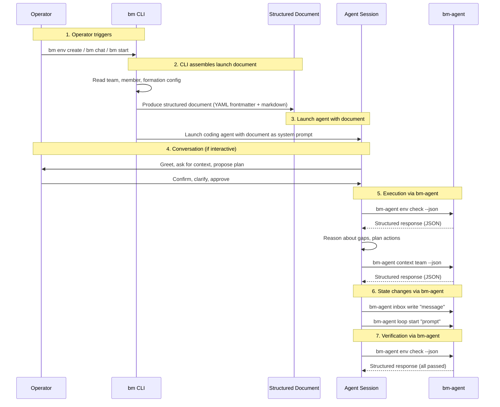

# Structured Prompt Protocol for CLI-Agent Coordination

## Problem

BotMinter has two CLI surfaces (`bm` for operators, `bm-agent` for agents) and multiple AI agent entry points (brain, `bm chat`, Minty). Each assembles its agent prompt differently:

1. **Brain** — template rendering with `{{var}}` placeholders into a static markdown file, plus a `CHAT_FIRST_REMINDER` `<system-reminder>` appended to every turn.
2. **`bm chat`** — programmatic markdown assembly via `build_meta_prompt()`, producing a structured document with identity, hats, skills, guardrails, and role context sections.
3. **Minty** — a static `prompt.md` file with Claude Code's `.claude/skills/` convention for capability discovery.

On the agent-to-CLI direction, `bm-agent` today only has `inbox` (brain-to-loop messaging), `claude hook` (PostToolUse hook), and `loop start` (spawn Ralph loops). Agents that need team state, environment state, or board information either shell out to `gh` directly or have it baked into their system prompt as static context.

This creates two problems:

1. **Inconsistent launch prompts.** Three different assembly patterns means three places to maintain when the prompt structure evolves. Adding a new agent entry point requires reimplementing prompt assembly from scratch.

2. **No structured query interface.** Agents cannot ask `bm-agent` "what's on the board?" or "what's the environment state?" in a structured way. They rely on raw `gh` CLI output or stale context from their launch prompt.

## Constraints

* Must work with any coding agent (not just Claude Code) — the structured document format must be coding-agent-agnostic
* Launch documents must be human-readable — operators can inspect what was fed to the agent
* `bm-agent` responses must be structured (JSON) — agents should not parse prose or raw shell output
* The CLI must never embed reasoning in the prompt — only context and constraints
* Agents must never manage persistent state — only call `bm-agent` for state operations
* Must be backward compatible — existing brain/chat/minty flows keep working during incremental migration
* Must not introduce new dependencies — uses markdown and JSON, both already in use

## Decision

### Two-part protocol: Structured Launch Documents + Structured `bm-agent` Responses

The protocol formalizes the boundary between deterministic CLI work and AI reasoning, inspired by [GSD's CLI-agent interaction model](../../../team/knowledge/research/gsd-interaction-protocol.md). In GSD, slash commands are structured markdown documents injected into the user's coding agent session, and `gsd-tools.cjs` provides deterministic state operations that agents call during execution. BotMinter adopts the same pattern with its own domain.

### Part 1: Structured Launch Documents

When `bm` launches an agent session, it assembles a **structured launch document** — a markdown file with YAML frontmatter and a sectioned body. This document becomes the agent's system prompt.

#### Format

```markdown
---
type: brain | chat | minty | skill-session
member: <member-name>
team: <team-name>
role: <role-name>
formation: <formation-type>
timestamp: <ISO-8601>
---

# <Session Type> — <member-name>

<session framing and identity>

## Capabilities

<hats, skills, or skill-session instructions>

## Context

<team config, formation state, project list, or other domain context>

## Constraints

<guardrails, invariants, and boundaries>
```

**YAML frontmatter** carries machine-readable metadata that both the agent and tooling can parse. The `type` field identifies the session kind, which determines what context is assembled.

**Markdown body** carries the agent's instructions, organized into standard sections. Not every section is required for every session type — a Minty skill session may have minimal Context but detailed Capabilities, while a brain session may have extensive Context but fewer Constraints.

#### Assembly by session type

| Session Type | Trigger | Frontmatter | Body Content |
|-------------|---------|-------------|-------------|
| `brain` | `bm start` (brain member) | member, team, role, formation | Identity, board awareness, loop management, chat protocol, dual-channel rules |
| `chat` | `bm chat <member>` | member, team, role, hat (if specified) | Identity, hat instructions, skills table, guardrails, role context (PROMPT.md) |
| `minty` | `bm minty` | team (if given) | Persona, available skills, operator interaction style |
| `skill-session` | `bm env create`, future skill-driven commands | member or minty, team, formation, skill | Skill-specific instructions, domain context (e.g., formation contract), constraints |

#### Assembly responsibility

The `bm` CLI owns document assembly. It reads:
- Team config (`config.yml`, team manifest)
- Member config (`ralph.yml`, `botminter.yml`, hat definitions)
- Formation state (contract, current environment)
- Project metadata
- Profile defaults

And produces a single structured document. The agent receives this document and operates within its frame.

### Part 2: Structured `bm-agent` Responses

New `bm-agent` subcommands that agents call during execution. Each returns structured JSON (default) or human-readable text. These replace raw `gh` CLI calls and ad-hoc shell commands for state queries.

#### New commands

```
bm-agent context team [--json]
bm-agent context member [--json]
bm-agent env check [--json]
bm-agent board scan [--json]
bm-agent status report [--json]
```

| Command | Purpose | Returns |
|---------|---------|---------|
| `context team` | Team metadata query | `{name, org, repo, formation, members: [{name, role, status}], projects: [{name, repo}]}` |
| `context member` | Current member's context | `{name, role, team, hats: [name], workspace, projects: [name]}` |
| `env check` | Formation environment verification | `{formation, platform, deps: [{name, status, message}], passed, failed, total}` |
| `board scan` | Actionable issues for this member | `{project, actionable: [{number, title, status, type}], blocked: [{number, reason}]}` |
| `status report` | Runtime state | `{daemon: {pid, port}, members: [{name, pid, brain_mode, uptime}]}` |

All new commands follow ADR-0010's conventions:
- Run inside a workspace (discover via `.botminter.workspace` walk-up)
- Default to `--json` output (machine-readable for agents)
- Support human-readable output without `--json` for debugging
- Error on missing workspace (these are agent commands, not hooks)

#### Existing commands (unchanged)

| Command | Status |
|---------|--------|
| `bm-agent inbox write/read/peek` | Already structured (JSONL). No changes. |
| `bm-agent claude hook post-tool-use` | Already returns structured JSON. No changes. |
| `bm-agent loop start` | Already structured. No changes. |

### The Protocol Flow



**Step 1 — Operator triggers.** The operator runs a `bm` command. They don't know or care about structured prompts.

**Step 2 — CLI assembles launch document.** The `bm` CLI deterministically reads all relevant config and state, then produces a structured document. This is the protocol boundary — everything the agent needs to understand its situation, without any reasoning embedded.

**Step 3 — Launch agent with document.** The CLI launches the coding agent with the document as its system prompt. The agent gets a fresh context window with exactly the right information.

**Step 4 — Conversation (if interactive).** For interactive sessions (`bm chat`, `bm minty`, `bm env create`), the agent converses with the operator. For autonomous sessions (`bm start` with brain), the agent operates on its own inputs (bridge messages, loop events, heartbeats).

**Step 5 — Execution via `bm-agent`.** When the agent needs current state, it calls `bm-agent` commands. The CLI does deterministic work (queries GitHub, reads config, checks environment) and returns structured JSON. The agent interprets the result and decides what to do.

**Step 6 — State changes via `bm-agent`.** When the agent needs to change state, it calls `bm-agent` commands (inbox write, loop start, and future state-mutating commands).

**Step 7 — Verification via `bm-agent`.** After acting, the agent can re-query state to verify its work succeeded. The CLI provides deterministic verification — the agent doesn't need to interpret raw command output.

### How this maps to GSD

| GSD Concept | BotMinter Equivalent |
|------------|---------------------|
| `/gsd:*` command (`.md` file injected into conversation) | Structured launch document from `bm` |
| Command YAML frontmatter (name, description, allowed-tools) | Document YAML frontmatter (type, member, team, role, formation) |
| Workflow `.md` body (instructions for the agent) | Document markdown body (identity, capabilities, context, constraints) |
| `gsd-tools.cjs init` (returns deterministic JSON context) | `bm-agent context/board/env` commands (return structured JSON) |
| `gsd-tools.cjs state update/commit` (deterministic state changes) | `bm-agent inbox write`, `bm-agent loop start` |
| Agent definitions (`agents/*.md` — role, constraints, output format) | Embedded in the document body (hats, skills, guardrails) |
| Tool scoping per agent role | Coding agent tool permissions (future: scoped per session type) |

Both systems follow the same principle: **structured markdown documents are the protocol boundary between deterministic CLI tooling and AI agents.** The CLI never reasons. The agent never manages state. Structured documents are how they communicate.

## Rejected Alternatives

### Keep three separate prompt assembly patterns

Rejected because: each new agent entry point requires reimplementing prompt assembly. The brain, chat, and Minty patterns already diverge in structure and content organization. This divergence grows with every feature addition.

### Use a prompt templating engine (Handlebars, Tera, etc.)

Rejected because: adds a runtime dependency for what is essentially string concatenation with sections. The current `{{var}}` pattern in the brain is already a minimal template system. The structured document format is simpler — it's just markdown with YAML frontmatter, assembled programmatically.

### Binary/protobuf protocol for `bm-agent` responses

Rejected because: agents parse text, not binary. JSON is universally supported by coding agents and human-readable for debugging. Adding protobuf would require a code generation step and wouldn't be inspectable.

### Make agents call `bm` (operator CLI) instead of `bm-agent`

Rejected because: violates ADR-0010's separation. `bm` commands are operator-facing with different error handling, help text, and permission models. Agent commands must be invisible to operators and must follow agent-specific conventions (workspace walk-up discovery, always-exit-0 for hooks).

### GraphQL API instead of CLI commands

Rejected because: introduces a server dependency. `bm-agent` commands run as simple CLI calls inside the workspace — no daemon or server required for queries. The daemon already exists for member lifecycle, but state queries should work even when the daemon is down.

## Consequences

* One structured document format for all agent launch points — brain, chat, Minty, and future skill sessions
* `bm-agent` gains query commands (`context`, `env`, `board`, `status`) that return structured JSON
* Agents stop shelling out to `gh` for state queries — they use `bm-agent` commands instead
* The formation manager (ADR-0012) becomes the first consumer of `skill-session` type documents and `bm-agent env check`
* Launch documents are human-inspectable — operators can read what their agent received
* Migration is incremental — existing brain/chat/minty flows work during the transition
* New agent entry points only need to define their document assembly logic, not reinvent prompt construction
* `bm-agent --help` grows to document the full agent query contract

## Anti-patterns

* **Do NOT** put reasoning in the launch document — only context and constraints. The agent reasons; the CLI provides facts.
* **Do NOT** have agents manage persistent state directly — all state changes go through `bm-agent` commands. If an agent needs to update something, there must be a `bm-agent` command for it.
* **Do NOT** return prose from `bm-agent` query commands — return structured JSON. Agents should parse data, not interpret sentences.
* **Do NOT** create separate document formats per session type — use the same YAML frontmatter + markdown body format. Session types differ in content, not structure.
* **Do NOT** break the `bm` / `bm-agent` boundary — operator commands stay in `bm`, agent commands stay in `bm-agent`. Cross-contamination creates confusion (ADR-0010).
* **Do NOT** make `bm-agent` query commands depend on the daemon — they should work by reading local config and calling `gh` CLI directly. The daemon is for member lifecycle, not state queries.
