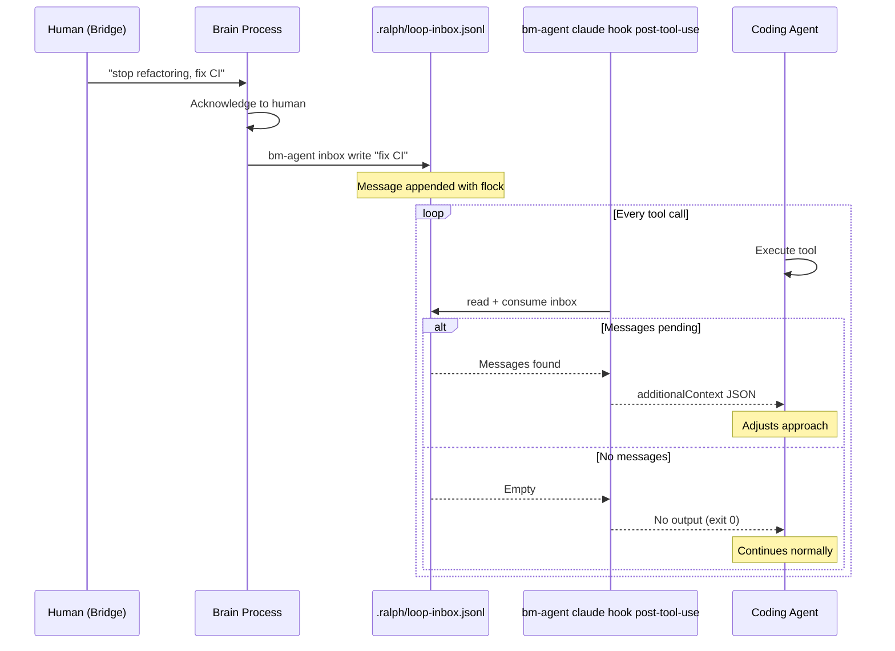

# Design: Loop Inbox — Brain-to-Loop Feedback Channel

## Overview

This document describes the architecture and implementation approach for the Loop Inbox feature, which enables the brain process to send feedback messages to coding agents running inside Ralph loops. The design satisfies all requirements in `requirements.md`.

## Invariant & ADR Compliance

| Constraint | Compliance |
|------------|-----------|
| **ADR-0006** (directory modules) | Inbox logic lives in `brain/inbox.rs` within the existing `brain/` directory module |
| **ADR-0007** (domain-command layering) | Thin `commands/agent_cmd.rs` (~50 lines); all business logic in `brain::inbox` submodule |
| **ADR-0004** (scenario-based e2e) | Inbox tested as cases within existing e2e scenarios, not standalone |
| **ADR-0005** (TestEnv/TestCommand) | All tests use `TestEnv`, no raw `Command::new()` |
| **CLI idempotency** | `bm-agent inbox write` is an intentional append action — exempt from idempotency invariant. Sync surfacing uses `copy_if_newer_verbose`. |
| **Test path isolation** | All tests use `TestEnv` (temp HOME) |
| **Profiles updated** | Profile path references audited; no existing references broken (new paths only) |
| **Zero test failures** | Full `just test` + `just exploratory-test` required before done |
| **Exploratory tests** | Workspace sync changes require PLAN.md update with concrete test cases |
| **No hardcoded profiles** | Inbox is profile-agnostic; settings surfacing works for any profile |

## Architecture Overview

```
Brain (Claude Code #1)                    Ralph's coding agent (Claude Code #2)
  |                                              |
  |-- bm-agent inbox write "fix CI" ----->| .ralph/loop-inbox.jsonl
  |                                              |-- PostToolUse hook: bm-agent claude hook post-tool-use
  |                                              |-- additionalContext injected
  |<-- .ralph/events-*.jsonl (existing) ---------|
```

The inbox is a **file-based message queue** using JSONL (one JSON object per line). The brain writes messages via `bm-agent inbox write`. The coding agent receives messages via a Claude Code PostToolUse hook that invokes `bm-agent claude hook post-tool-use`, which checks the inbox and returns `additionalContext` if messages are pending.

### `bm-agent` — agent-facing CLI namespace

All commands consumed by agents (brain, coding agent) live under `bm-agent`, separated from operator-facing commands. This namespace currently has two subcommand groups:

- `bm-agent inbox` — brain-to-loop messaging (write, read, peek)
- `bm-agent claude hook` — Claude Code hook handlers (post-tool-use)

This is extensible: future agent tools (e.g., `bm-agent context`, `bm-agent observe`) slot into the same namespace.

### Why JSONL + file locks (not a database, socket, or named pipe)

1. **Consistency with existing patterns**: The `.ralph/` directory already uses JSONL for events (`events-*.jsonl`) and tasks (`agent/tasks.jsonl`). Zero new infrastructure.
2. **Append safety**: Append-only JSONL with `flock` gives atomic writes.
3. **Cross-process safety**: `flock` handles concurrent brain-writes and agent-reads without coordination.
4. **Simplicity**: No daemon, no socket, no IPC — just a file. Graceful degradation (NFR-3) is trivial: if the file doesn't exist, there are no messages.

### Why a dedicated hook subcommand (not a shell script shim)

1. **Graceful degradation in Rust**: The `bm-agent claude hook post-tool-use` command guarantees exit 0 and suppresses stderr internally — no shell `|| true` hack needed.
2. **Testable**: Unit-test the hook command directly. No shell semantics to reason about.
3. **Eliminates shell script artifacts**: No scripts to create, chmod, extract, surface, or sync. The `settings.json` directly references `bm-agent claude hook post-tool-use`.
4. **Extensible**: Future hooks (PreToolUse, Notification, etc.) become `bm-agent claude hook <event>` subcommands.

### Known limitation: best-effort consumption (FR-4)

Truncate-on-consume happens atomically within `bm-agent inbox read`. However, there is a gap between the hook returning `additionalContext` and the Claude Code agent processing it. If the agent crashes in this window, the messages are lost. This is accepted because:
- PostToolUse hooks have no acknowledgment channel
- Fire-and-forget semantics make this an acceptable tradeoff
- The operator can always re-send via `bm-agent inbox write`

## Components

### 1. Inbox Submodule (`crates/bm/src/brain/inbox.rs`)

The inbox is the reverse direction of `brain/event_watcher.rs` — the event watcher reads loop->brain, the inbox writes brain->loop. Both are brain communication channels and belong in the same domain module.

Per **ADR-0007**, all inbox business logic lives in this submodule. The command layer is thin and only calls into `brain::inbox`.

Add `mod inbox;` to `brain/mod.rs` and re-export needed types via `pub use inbox::{...};`, following the existing pattern (e.g., `event_watcher` uses private `mod` with selective re-exports).

#### Data Types

```rust
/// A single inbox message with attribution (NFR-4)
#[derive(Debug, Clone, Serialize, Deserialize)]
pub struct InboxMessage {
    pub ts: String,       // ISO 8601 timestamp (machine-parseable per NFR-4)
    pub from: String,     // Sender identity (e.g., "brain")
    pub message: String,  // Message content
}

/// Result of a read operation — structured data, not strings (ADR-0007)
pub struct InboxReadResult {
    pub messages: Vec<InboxMessage>,
    pub consumed: bool,
}
```

#### Public API

All functions return structured types. No `println!` or formatting in the domain layer (ADR-0007).

| Function | Signature | Notes |
|----------|-----------|-------|
| `write_message` | `(path: &Path, from: &str, message: &str) -> Result<()>` | Validates non-empty message (FR-1). Acquires exclusive `flock`. Creates parent dirs. Appends one JSONL line. |
| `read_messages` | `(path: &Path, consume: bool) -> Result<InboxReadResult>` | Acquires exclusive `flock`. If `consume=true`, truncates after read (best-effort, see FR-4). Skips malformed lines with a warning logged to stderr. |
| `inbox_path` | `(workspace_root: &Path) -> PathBuf` | Returns `<root>/.ralph/loop-inbox.jsonl`. No `loop_id` parameter in v1 (FR-2: multi-loop deferred). |
| `discover_workspace_root` | `(start: &Path) -> Option<PathBuf>` | Walk up from `start` looking for `.botminter.workspace` marker. |
| `format_hook_response` | `(messages: &[InboxMessage]) -> Option<String>` | Returns `Some(json)` with `additionalContext` if messages non-empty, `None` if empty. |

#### Walk-up discovery vs. known-path lookup

The existing codebase uses known-path workspace lookup (e.g., `sync.rs` takes `team_ws_base` + `member_dir_name`). The inbox introduces a **new pattern**: walk-up discovery from cwd, needed because the brain and hook invoke `bm-agent` from within the workspace without knowing the team topology.

This is an intentional new pattern. The walk-up approach is appropriate for commands invoked from within a workspace (like `git` finding `.git/`). The existing known-path approach is appropriate for commands that operate on teams from outside (like `bm teams sync`). Both coexist for different use cases.

#### File Locking Strategy

Uses `flock(2)` (advisory file locks). Prefer `fs2` crate (`FileExt::lock_exclusive()`). Add `fs2` to `crates/bm/Cargo.toml`. If `fs2` is undesirable, use `libc::flock` with `unsafe`.

- **Writers** (`write_message`): acquire exclusive lock, append line, release.
- **Readers** (`read_messages`): acquire exclusive lock, read all lines, optionally truncate, release.
- Both use exclusive locks because consume=true modifies the file. Critical section is microseconds.

#### Hook Response Format

When messages are pending, `format_hook_response` returns:

```json
{
  "additionalContext": "## Brain Feedback\n\nYou have received feedback from your brain — the consciousness that monitors your work and relays human directives.\n\n**Messages:**\n\n[2026-03-21T14:30:00Z] (brain): Stop working on the CSS. Focus on the API endpoint instead.\n\n**Instructions:** Brain feedback takes priority over your current subtask. Acknowledge by adjusting your approach. If this feedback conflicts with your current task, comply with the feedback."
}
```

When no messages are pending, returns `None`.

### 2. `bm-agent` binary (`crates/bm/src/agent_main.rs`)

A second `[[bin]]` target in the same crate. Per **ADR-0007**, the command layer is thin — it routes to domain functions and handles display.

```
bm-agent inbox write <message> [--from <name>]
bm-agent inbox read [--format json|hook]
bm-agent inbox peek
bm-agent claude hook post-tool-use
```

#### Binary configuration

In `Cargo.toml`:

```toml
[[bin]]
name = "bm"
path = "src/main.rs"

[[bin]]
name = "bm-agent"
path = "src/agent_main.rs"
```

#### CLI Integration

In `agent_cli.rs` (the Clap parser, imported by `agent_main.rs`):

```rust
#[derive(Parser)]
#[command(name = "bm-agent", version, about = "Agent-facing tools for BotMinter")]
pub struct AgentCli {
    #[command(subcommand)]
    pub command: AgentCommand,
}

#[derive(Subcommand)]
pub enum AgentCommand {
    /// Brain-to-loop messaging (coding-agent-agnostic)
    Inbox {
        #[command(subcommand)]
        command: InboxCommand,
    },
    /// Claude Code specific tools
    Claude {
        #[command(subcommand)]
        command: ClaudeCommand,
    },
}

#[derive(Subcommand)]
pub enum ClaudeCommand {
    /// Claude Code hook handlers
    Hook {
        #[command(subcommand)]
        command: ClaudeHookCommand,
    },
}

#[derive(Subcommand)]
pub enum InboxCommand {
    /// Send a message to a loop's inbox
    Write {
        /// Message text
        message: String,
        /// Sender identity
        #[arg(long, default_value = "brain")]
        from: String,
    },
    /// Read and consume pending messages
    Read {
        /// Output format
        #[arg(long, default_value = "hook")]
        format: InboxFormat,
    },
    /// View pending messages without consuming
    Peek,
}

#[derive(Subcommand)]
pub enum ClaudeHookCommand {
    /// PostToolUse hook — checks inbox, returns additionalContext
    PostToolUse,
}

#[derive(Clone, ValueEnum)]
pub enum InboxFormat {
    Json,
    Hook,
}
```

The `agent_main.rs` dispatches to command handlers in the same `commands/` directory (or a dedicated `agent_commands/` if needed).

#### Inbox subcommands

All follow the same pattern:
1. Discover workspace root via `brain::inbox::discover_workspace_root(cwd)`. Error if not found.
2. Construct path via `brain::inbox::inbox_path(root)`.
3. Call domain function. Format and display result.

- **`inbox write`**: call `write_message`. Confirmation to stderr on success, error + exit 1 on failure.
- **`inbox read --format hook`** (default): call `read_messages(consume=true)` then `format_hook_response`. Print to stdout if `Some`, nothing if `None`.
- **`inbox read --format json`**: call `read_messages(consume=true)`. JSON array to stdout.
- **`inbox peek`**: call `read_messages(consume=false)`. Human-readable table, or "No pending messages."

#### `hook post-tool-use` command

This is the command invoked by Claude Code's PostToolUse hook. It has built-in graceful degradation:

1. Discover workspace root. If not found: **exit 0 silently** (not an error — the hook may run outside a workspace).
2. Construct inbox path, call `read_messages(consume=true)`.
3. If messages: call `format_hook_response`, print to stdout.
4. If no messages or any error: produce no output, **always exit 0**.
5. Stderr is suppressed internally (not printed).

The key difference from `inbox read --format hook` is: **`hook post-tool-use` never fails**. It always exits 0. It's designed to be invoked by Claude Code without any wrapper.

### 3. Hook Configuration

**File:** `profiles/scrum-compact/coding-agent/settings.json`

```json
{
  "hooks": {
    "PostToolUse": [
      {
        "hooks": [
          {
            "type": "command",
            "command": "bm-agent claude hook post-tool-use"
          }
        ]
      }
    ]
  }
}
```

This is a project-level `settings.json` (not `settings.local.json`), committed to git and shared via workspace sync.

**No shell script needed.** The hook command is `bm-agent claude hook post-tool-use` directly. The `bm` binary handles all error suppression and graceful degradation internally.

**Prerequisite:** `bm` must be on PATH in the workspace. In a BotMinter workspace, this is always true because `bm` is the tool that created the workspace.

### 4. Workspace Surfacing

Only `settings.json` needs surfacing. No hooks directory, no shell scripts, no chmod.

#### Full Path Chain (profile -> team repo -> workspace)

```
Profile source (compile-time):
  profiles/scrum-compact/coding-agent/settings.json

After `bm init` (profile extraction):
  team-repo/coding-agent/settings.json

After `bm teams sync` (workspace surfacing):
  workspace/.claude/settings.json
```

#### Initial Creation (`workspace/repo.rs`)

In `assemble_workspace_repo_context`, after the existing `settings.local.json` copy step:

- **Copy `settings.json`**: From `team/coding-agent/settings.json` to `<workspace>/.claude/settings.json`. Single source (team-level, shared across all members). This differs from `settings.local.json` which is member-level. The reason: `settings.json` contains shared project hooks that apply to all members, while `settings.local.json` contains per-member overrides.

#### Incremental Sync (`workspace/sync.rs`)

In `sync_workspace`, after the existing `settings.local.json` re-copy:

- Re-copy `settings.json` using `copy_if_newer_verbose()` with `SyncEvent` emissions.

**Known limitation:** `settings.json` sync uses `copy_if_newer_verbose` which overwrites user modifications. Acceptable for v1 — operator customizations should go in `settings.local.json`.

**Profile path audit**: No existing profile references point to `.claude/settings.json`. This is a new path — no breakage.

### 5. Brain System Prompt Update

**File:** `profiles/scrum-compact/brain/system-prompt.md`

Add a `## Loop Feedback (Inbox)` section after `## Loop Management`:

```markdown
## Loop Feedback (Inbox)

You can send feedback to your running loops. Messages are delivered to the
coding agent inside the loop — the agent sees your message after its next
tool call.

**Send feedback:**
````bash
bm-agent inbox write "Stop working on the CSS. Focus on the API endpoint instead."
````

**When to use:** human sends a redirect, you observe a loop going wrong,
you need to pass context from another loop or the board.

**When NOT to use:** routine status checks (just observe events),
stopping a loop (`ralph loops stop`), starting new work (start a new loop).
```

### 6. Coding Agent Context Update

**File:** `profiles/scrum-compact/context.md`

Add a `## Brain Feedback` section:

```markdown
## Brain Feedback

You may receive messages marked "Brain Feedback" injected after tool calls.
These come from your team member's brain — the consciousness that monitors
your work, receives human messages, and manages the board.

When you receive brain feedback:
1. It takes priority over your current subtask
2. Acknowledge by adjusting your approach
3. If feedback conflicts with your current task, comply with the feedback
```

## Data Flow



## Error Handling

| Scenario | Behavior |
|----------|----------|
| `agent inbox write` with empty message | Error: "Message cannot be empty", exit 1 |
| `agent inbox write` outside workspace | Error: "Not in a BotMinter workspace", exit 1 |
| `agent inbox read` with missing/empty file | Return empty result, no error |
| `agent inbox read` with malformed lines | Skip malformed lines, log warning to stderr, return valid messages |
| `agent claude hook post-tool-use` outside workspace | No output, exit 0 (graceful) |
| `agent claude hook post-tool-use` with any error | No output, exit 0 (never fails) |
| Disk full on write | Error propagated to caller (brain), exit 1 |
| Concurrent write+read | `flock` serializes access, no corruption |

## Testing Strategy

### Unit Tests (in `brain/inbox.rs`)

- write + read roundtrip, multiple messages preserve order
- consume=true truncates, consume=false preserves
- empty/missing file returns empty vec (no error)
- malformed lines skipped gracefully
- hook format output is valid JSON with `additionalContext` key
- empty message rejected with error
- workspace root discovery (marker in parent, subdirectory cwd)
- path construction for primary loop

All unit tests use `tempfile::tempdir()` for isolation (**test-path-isolation invariant**).

### E2E Tests (within existing scenarios, per ADR-0004)

Add inbox as new cases within the appropriate `GithubSuite` scenario:

- After `bm teams sync`: verify `.claude/settings.json` has PostToolUse hook config referencing `bm-agent claude hook post-tool-use`
- `bm-agent inbox write "test" && bm-agent inbox peek`: verify message visible
- `bm-agent inbox read --format json`: verify JSON output and consumption
- `bm-agent inbox peek` after read: verify empty
- `bm-agent claude hook post-tool-use`: verify exit 0 with no output when inbox empty
- Re-sync preserves pending messages

All e2e tests use `TestEnv`/`TestCommand` (**ADR-0005**).

### Exploratory Tests

Update `crates/bm/tests/exploratory/PLAN.md` with inbox-related test cases:

```
## Phase D: Workspace Sync (inbox additions)

D.10 Settings.json surfaced
  - After `bm teams sync`, verify `<workspace>/.claude/settings.json` exists
  - Verify it contains PostToolUse hook referencing `bm-agent claude hook post-tool-use`
  - Expected: valid JSON with hook configuration

D.11 Inbox write/peek/read lifecycle
  - cd into workspace, run `bm-agent inbox write "test message"`
  - Run `bm-agent inbox peek`, verify message visible
  - Run `bm-agent inbox read --format json`, verify JSON output
  - Run `bm-agent inbox peek`, verify empty
  - Expected: full lifecycle completes, messages consumed correctly

D.12 Hook command graceful degradation
  - cd into workspace with no inbox, run `bm-agent claude hook post-tool-use`
  - Expected: exit 0, no output
  - cd into a non-workspace directory, run `bm-agent claude hook post-tool-use`
  - Expected: exit 0, no output

D.13 Re-sync preserves inbox messages
  - Write a message to inbox
  - Run `bm teams sync`
  - Run `bm-agent inbox peek`, verify message still present
  - Expected: sync does not touch .ralph/ directory contents
```

## Requirements Traceability

| Requirement | Design Component |
|-------------|-----------------|
| FR-1 (send messages) | `brain::inbox::write_message` + `bm-agent inbox write` |
| FR-2 (primary loop target) | `brain::inbox::inbox_path(root)` — single inbox per workspace |
| FR-3 (automatic delivery) | PostToolUse hook → `bm-agent claude hook post-tool-use` |
| FR-4 (consume on delivery) | `read_messages(consume=true)` with file truncation (best-effort) |
| FR-5 (agent guidance) | `context.md` Brain Feedback section |
| FR-6 (peek) | `bm-agent inbox peek` / `read_messages(consume=false)` |
| FR-7 (workspace-scoped) | Inbox path derived from workspace root |
| FR-8 (provisioning) | Workspace surfacing of `settings.json` |
| FR-9 (brain docs) | `system-prompt.md` Loop Feedback section |
| FR-10 (orphaned messages) | File persists across loop restarts |
| NFR-1 (concurrency) | `flock` advisory locks |
| NFR-2 (minimal overhead) | Hook exits immediately when no messages |
| NFR-3 (graceful degradation) | `hook post-tool-use` always exits 0, suppresses errors internally |
| NFR-4 (attribution) | `InboxMessage { ts, from, message }` with ISO 8601 |

## Files Summary

### New files (4)
| File | Purpose |
|------|---------|
| `crates/bm/src/agent_main.rs` | Entry point for `bm-agent` binary |
| `crates/bm/src/agent_cli.rs` | Clap parser + command dispatch for `bm-agent` |
| `crates/bm/src/brain/inbox.rs` | Inbox types, JSONL I/O, hook response formatting (submodule of `brain/`) |
| `profiles/scrum-compact/coding-agent/settings.json` | Claude Code project settings with PostToolUse hook config |

### Modified files (6)
| File | Change |
|------|--------|
| `crates/bm/Cargo.toml` | Add `[[bin]]` target for `bm-agent`, add `fs2` dependency |
| `crates/bm/src/brain/mod.rs` | Add `mod inbox;` + selective `pub use` re-exports |
| `crates/bm/src/workspace/repo.rs` | Surface settings.json during creation |
| `crates/bm/src/workspace/sync.rs` | Surface settings.json during sync |
| `profiles/scrum-compact/brain/system-prompt.md` | Add Loop Feedback section |
| `profiles/scrum-compact/context.md` | Add Brain Feedback section |

### Appendix A: Alternatives Considered

**Shell script shim for PostToolUse hook**: A `check-loop-inbox.sh` script calling `bm inbox read --format hook || true`. Rejected because: (a) requires chmod+x handling during profile extraction, (b) adds a hooks directory to surface during sync, (c) shell error handling is fragile, (d) a dedicated Rust command is testable and extensible.

**Named pipe / Unix socket instead of JSONL file**: Would give instant delivery. Rejected because: (a) requires a daemon, (b) PostToolUse hooks already provide poll-on-tool-call granularity, (c) named pipes don't persist across crashes.

**Agent-side polling instruction**: Would tell the agent "check your inbox periodically." Rejected because: (a) relies on LLM compliance, (b) adds cognitive load, (c) PostToolUse hooks are deterministic.

**SQLite instead of JSONL**: Rejected because: (a) JSONL matches existing `.ralph/` patterns, (b) inbox is append-only + truncate — no query complexity, (c) adds a dependency for minimal benefit.

### Appendix B: Scrum Profile Parity

Only `scrum-compact` is modified in v1. The `scrum` profile can adopt inbox by adding `coding-agent/settings.json`. The domain module and CLI are profile-agnostic — they work in any workspace with `.botminter.workspace`.
