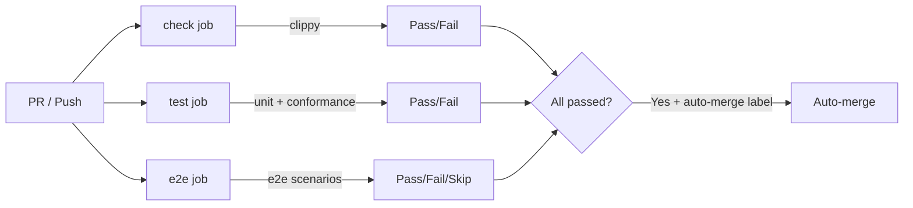

# Proposal: Autonomous CI Setup for BotMinter

**Date:** 2026-04-03
**Author:** superman-bob (autonomous agent)
**Status:** Draft

## Motivation

BotMinter uses autonomous agents (Ralph orchestrator instances) to implement features, fix bugs, and maintain the codebase. These agents create pull requests that currently require manual verification before merging. To close the loop and enable fully autonomous development workflows, we need CI that:

1. **Validates every PR automatically** — clippy, unit tests, conformance tests, and E2E tests
2. **Enables auto-merge for agent PRs** — when all checks pass, agent PRs merge without human intervention
3. **Provides confidence** — the test suite is comprehensive enough that passing CI means the change is safe to merge

Without CI, agents produce PRs that sit idle until a human manually runs the test suite and merges. This defeats the purpose of autonomous development.

## Current State

### Existing Workflows
| Workflow | Purpose | Trigger |
|----------|---------|---------|
| `docs.yml` | Deploy GitHub Pages (MkDocs) | Push to main |
| `release.yml` | Build and publish releases (cargo-dist) | Version tags |

**No test CI exists.** There is no workflow that runs clippy, unit tests, conformance tests, or E2E tests.

### Test Tiers

| Tier | Command | Tests | External Deps | Approx. Time |
|------|---------|-------|---------------|---------------|
| Clippy | `just clippy` | Static analysis | None | ~1 min |
| Unit | `just unit` | ~576 tests | None | ~2 min |
| Conformance | `just conformance` | Schema validation | None | <30 sec |
| E2E | `just e2e` | ~20 scenarios | GitHub API, App credentials | ~5 min |
| Exploratory | `just exploratory-test` | Real infrastructure | podman, keyring, SSH, Lima | ~5-15 min |

## Proposed Architecture

### Three-Job CI Pipeline



### Job Design

#### Job 1: `check` (Lint)
- **Trigger:** All PRs and pushes to main
- **Steps:** Install system deps, Rust toolchain, Node.js, build console, run clippy
- **System deps:** `pkg-config`, `libdbus-1-dev`
- **Console:** The `console` Cargo feature requires built SvelteKit assets (`npm ci && npm run build` in `console/`)
- **Command:** `cargo clippy -p bm --features console -- -D warnings`
- **Time estimate:** ~3 min (with caching)

#### Job 2: `test` (Unit + Conformance)
- **Trigger:** All PRs and pushes to main
- **Steps:** Same setup as check, then unit and conformance tests
- **Commands:**
  - `cargo test -p bm --features console` (unit)
  - `cargo test -p bm --test conformance` (conformance)
- **Time estimate:** ~4 min (with caching)

#### Job 3: `e2e` (End-to-End)
- **Trigger:** All PRs and pushes to main, **skips fork PRs** (secrets unavailable)
- **Steps:** Full setup including D-Bus + gnome-keyring, gh CLI auth, private key file
- **Concurrency:** One E2E run at a time globally (shared GitHub resources)
- **Command:** `cargo test -p bm --features e2e --test e2e -- --gh-token ... --test-threads=1`
- **Secrets required:** 6 (see table below)
- **Time estimate:** ~8 min (with caching)

### Workflow Files

| File | Purpose |
|------|---------|
| `.github/workflows/ci.yml` | Three-job CI pipeline (check, test, e2e) |
| `.github/workflows/auto-merge.yml` | Label-based auto-merge for agent PRs |

## Secrets Required

All secrets must be configured in the GitHub repository settings.

| Secret | Description | Source |
|--------|-------------|--------|
| `TESTS_GH_TOKEN` | GitHub PAT with repo/org access for E2E tests | Personal access token for test org |
| `TESTS_GH_ORG` | GitHub organization for E2E test repos | `devguyio-bot-quad` |
| `TESTS_APP_ID` | GitHub App ID for identity tests | App settings page |
| `TESTS_APP_CLIENT_ID` | GitHub App Client ID | App settings page |
| `TESTS_APP_INSTALLATION_ID` | GitHub App Installation ID | App installations page |
| `TESTS_APP_PRIVATE_KEY` | GitHub App private key (PEM content) | App settings → Generate key |

**Note:** The private key is stored as PEM content in the secret. The CI workflow writes it to a temporary file at runtime (`$RUNNER_TEMP/app-private-key.pem`).

## Branch Protection Configuration

Branch protection is recommended as a safety net for manual merges and direct pushes, though it is **not required** for the auto-merge workflow (which performs its own check verification). To configure:

```bash
# Enable branch protection with required status checks
gh api repos/devguyio-bot-squad/botminter/branches/main/protection \
  --method PUT \
  --field required_status_checks='{"strict":true,"contexts":["Lint","Test","E2E Tests"]}' \
  --field enforce_admins=false \
  --field required_pull_request_reviews=null \
  --field restrictions=null
```

**Required status checks:**
- `Lint` (clippy)
- `Test` (unit + conformance)
- `E2E Tests` (e2e scenarios)

**Note:** `E2E Tests` may skip on fork PRs. Branch protection should handle skipped checks appropriately (not require them when they legitimately skip).

## Auto-Merge Strategy

### Label-Based Approach (Direct Merge)

The auto-merge workflow uses a `workflow_run` trigger — it only runs after the CI workflow completes successfully:

1. Agent creates a PR
2. Agent (or operator) adds the `auto-merge` label
3. CI workflow runs all checks (Lint, Test, E2E)
4. When CI completes successfully, `auto-merge.yml` fires via `workflow_run`
5. The workflow finds the PR by commit SHA, verifies the `auto-merge` label is present
6. The workflow independently verifies all check suites passed (`gh pr checks`)
7. The workflow **directly merges** the PR (`gh pr merge --squash --delete-branch`)

**Important:** This is a direct merge, not GitHub's auto-merge feature (`--auto`). The workflow itself acts as the merge gate — it checks all statuses before merging. This means branch protection is **not required** for auto-merge to function, though it is still recommended as a safety net for manual merges.

**Why label-based over actor-based:**
- Simpler to implement and maintain
- Works with any contributor (agents, humans who want auto-merge)
- Easy to opt out (remove the label)
- No need to maintain an actor allowlist
- Operators can selectively enable auto-merge on specific PRs

**Why `workflow_run` over label events:**
- Label events fire immediately — CI may not have completed yet
- `workflow_run` guarantees CI has finished before attempting merge
- Prevents race conditions where merge is attempted with pending checks

### Agent Integration

Agents should be configured to:
1. Create PRs normally
2. Add the `auto-merge` label to their PRs: `gh pr edit --add-label auto-merge`

## Exploratory Test Gap Analysis

### What ADR-0009 Says

ADR-0009 explicitly states:
> "Tests must not run in CI — they require a workstation with podman, keyring, gh auth, and sometimes Lima"
> "Do NOT attempt to run exploratory tests in CI — they require real infrastructure that CI cannot reliably provide."

### Why Exploratory Tests Are Excluded From CI

| Requirement | CI Feasibility |
|-------------|---------------|
| Rootless podman | Possible but fragile (requires `--privileged` or specific kernel configs) |
| Real gnome-keyring via PAM | Not available in CI (PAM unlock is desktop-specific) |
| Lima VM | Requires nested virtualization (unavailable on most CI runners) |
| SSH to `bm-test-user@localhost` | Requires a local user account (not available in CI) |
| Real Matrix server (Tuwunel) | Possible but adds significant setup time |

### Mitigation

The three-tier CI (clippy + unit/conformance + e2e) catches the vast majority of regressions:
- **Clippy** catches type errors, unused code, common mistakes
- **Unit tests** (~576) cover internal logic, parsing, configuration
- **Conformance tests** validate bridge protocol schemas
- **E2E tests** (~20 scenarios) test the full operator journey against real GitHub APIs

Exploratory tests remain a **local-only verification step** run by developers and agents before declaring work complete. This is enforced by convention in CLAUDE.md, not by CI gates.

### Future Consideration

If a self-hosted runner with the required infrastructure (podman, keyring, Lima) becomes available, exploratory tests could be added as a fourth CI job. This would require:
- A dedicated machine or VM with all prerequisites
- GitHub Actions self-hosted runner agent installed
- Careful concurrency control (exploratory tests are destructive to the test user)

## Migration Steps

### Phase 1: CI Workflow (this PR)
1. Create `.github/workflows/ci.yml` with check, test, e2e jobs
2. Create `.github/workflows/auto-merge.yml` with label-based trigger
3. Verify check and test jobs pass on the PR itself
4. E2E job will skip until secrets are configured

### Phase 2: Secrets Configuration
1. Configure all 6 secrets in GitHub repository settings
2. Re-run CI to verify E2E tests pass
3. Monitor first few E2E runs for flakiness

### Phase 3: Auto-Merge Activation
1. ~~Create the `auto-merge` label in the repository~~ (already created)
2. Test auto-merge end-to-end: create a trivial PR with the `auto-merge` label, verify it merges after CI passes
3. Configure agents to add the label to their PRs

### Phase 4: Branch Protection (Optional)
1. Enable branch protection on `main` with required status checks (recommended safety net)
2. Require `Lint` and `Test` checks to pass
3. Make `E2E Tests` required but allow skipping (for fork PRs)

## Open Questions

1. **E2E concurrency:** The current setup uses a global concurrency group. If multiple PRs queue E2E tests, they run sequentially. Should we add a timeout or limit the queue depth?

2. **Secrets rotation:** GitHub App keys expire. How should we handle key rotation for CI secrets?

3. **Flaky E2E tests:** E2E tests hit real GitHub APIs and may be subject to rate limiting or transient failures. Should we add retry logic to the E2E job?

4. **Console build caching:** The console build adds ~30 seconds per job. Should we cache the `console/build/` directory as a separate artifact to share across jobs?

5. **Self-hosted runner:** Is there interest in setting up a self-hosted runner for exploratory tests? This would close the gap between local verification and CI.
