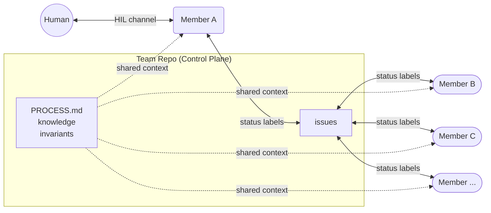

# BotMinter

Lead your own Claude Code agents. Each team member is an independent [Ralph](https://github.com/mikeyobrien/ralph-orchestrator) orchestrator instance running in its own workspace. Members coordinate through GitHub issues on a shared team repo via the `gh` CLI — no central orchestrator.

> [!WARNING]
> **Pre-Alpha** — botminter is under active development and not yet ready for production use. Commands, configuration format, and behavior may change without notice between releases. See the [Roadmap](docs/content/roadmap.md) for current status.



> The diagram shows the generic coordination pattern. Specific roles (e.g., human-assistant, architect, dev) are defined by the **profile** you choose.

## Prerequisites

- [Ralph orchestrator](https://github.com/mikeyobrien/ralph-orchestrator) (for launching team members)
- [gh CLI](https://cli.github.com/) (GitHub CLI for issue coordination)
- Git

## Quick Start

### 1. Install

```bash
cargo install --path crates/bm
```

### 2. Create a team

```bash
bm init
```

The interactive wizard walks you through:
- Team name and workzone directory
- Profile selection (`scrum`, `scrum-compact`, `scrum-compact-telegram`)
- GitHub org/repo selection (auto-detects your auth)
- Optional member hiring and project selection

### 3. Hire a member and sync

```bash
bm hire human-assistant
bm teams sync
```

### 4. Launch

```bash
bm start
bm status
```

## How It Works

### Profile-Based Generation

| Layer | What It Contains |
|-------|------------------|
| **Profile** (`profiles/<name>/`) | Team process, role definitions, member skeletons, knowledge, invariants |
| **Team repo instance** | Project-specific knowledge, hired members, runtime state |

`bm init` extracts the selected profile into a new team repo, creates the GitHub remote, bootstraps labels and a Project board, and registers the team in your config.

### Runtime Model (Two Layers)

- **Inner loop:** Each team member is a full Ralph instance with its own hats, memories, and workflow.
- **Outer loop:** The team repo is the control plane. GitHub issues on the team repo are the coordination fabric. Members pull work by scanning for status labels matching their role via `gh issue list`.

### Workspace Layout

```
workzone/
  my-team/                           # Team directory
    team/                            # Team repo (control plane)
      team/human-assistant/          # Member config
    human-assistant/                  # Member workspace
      .botminter/                    # Clone of team repo
      PROMPT.md → .botminter/...     # Symlinked from team repo
      CLAUDE.md → .botminter/...     # Symlinked from team repo
      ralph.yml                      # Copied from team repo
```

### GitHub Coordination

Issues, milestones, and PRs live on the team repo's GitHub. Status transitions use a single-select Status field on the GitHub Project board, following the pattern `<role>:<phase>`. Members watch for statuses matching their role and hand off work by updating the Status field via the `gh` CLI. The specific roles and phases are defined by the profile.

## Profiles

Three profiles are available:

| Profile | Description |
|---------|-------------|
| `scrum` | Multi-member scrum team with PO, architect, dev, QE roles. Epic-driven workflow with status tracking and rejection loops. |
| `scrum-compact` | Single-agent "superman" profile. GitHub comment-based human review. |
| `scrum-compact-telegram` | Same as scrum-compact but uses Telegram for blocking HIL approval gates. |

```bash
bm profiles list                # See all profiles
bm profiles describe scrum      # Detailed profile info
```

## CLI Commands

```bash
bm init                              # Interactive wizard — create a new team
bm hire <role> [--name <n>] [-t team] # Hire a member into a role
bm projects add <url> [-t team]       # Add a project to the team
bm teams list                         # List registered teams
bm teams sync [--push] [-t team]      # Provision and reconcile workspaces
bm start [-t team]                    # Launch all members
bm stop [-t team] [--force]           # Stop all members
bm status [-t team] [-v]              # Status dashboard
bm members list [-t team]             # List hired members
bm roles list [-t team]               # List available roles
bm profiles list                      # List embedded profiles
bm profiles describe <profile>        # Show detailed profile information
```

## Project Structure

```
botminter/
├── crates/bm/                       # Rust CLI crate
│   ├── src/                         # Source code
│   └── tests/                       # Unit, integration, and E2E tests
├── profiles/
│   ├── scrum/                       # Scrum profile
│   ├── scrum-compact/               # Compact solo profile (GitHub HIL)
│   └── scrum-compact-telegram/      # Compact solo profile (Telegram HIL)
├── docs/                            # MkDocs documentation site
├── knowledge/                       # Development knowledge
└── invariants/                      # Development invariants
```

## Built on                                                                                                                                                                                   
                                                                                                                                                                                                
botminter uses [Ralph Orchestrator](https://github.com/mikeyobrien/ralph-orchestrator) as its agent runtime — each team member is an independent Ralph instance with its own hats, memories, and event loop.

## Development

```bash
just build    # cargo build -p bm
just test     # cargo test -p bm
just clippy   # cargo clippy -p bm -- -D warnings
```

## License

Apache License 2.0 — see [LICENSE](LICENSE).
