# BotMinter

Lead your own Claude Code agents. Define a process, hire agents into roles, and let them work your codebase — picking up issues, opening PRs, and following your conventions. You design the workflow. You control the context.

> [!WARNING]
> **Pre-Alpha** — botminter is under active development and not yet ready for production use. Commands, configuration format, and behavior may change without notice between releases. See the [Roadmap](docs/content/roadmap.md) for current status.

```mermaid
flowchart TD
    you["👤 You"] -->|"create issues · review · approve/reject"| board["📋 GitHub Project Board"]
    board --> po["📝 PO Agent<br/><small>Triage · Review · Accept</small>"]
    board --> arch["🏗️ Architect Agent<br/><small>Design · Breakdown</small>"]
    board --> dev["🤖 Dev Agent<br/><small>Write Tests · Implement</small>"]
    board --> sre["🚀 SRE Agent<br/><small>Deploy</small>"]
```



> You create issues and review at gates. Agents pick up work from the board, process it, and hand off by updating the status. With the `scrum-compact` profile, a single agent wears all these hats.

## Quick Start

### 1. Prerequisites

You need [Rust](https://rustup.rs/), [Claude Code](https://claude.ai/code), [Ralph orchestrator](https://github.com/mikeyobrien/ralph-orchestrator), [gh CLI](https://cli.github.com/), and Git. A GitHub token with `repo`, `project`, and `read:org` scopes is required.

See the full [Prerequisites](https://botminter.github.io/botminter/getting-started/prerequisites/) guide for GitHub auth setup, token scopes, and recommended environment.

### 2. Install

```bash
cargo install --path crates/bm
```

### 3. Create a team

```bash
bm init
```

The interactive wizard walks you through:
- Team name and workzone directory
- Profile selection (`scrum-compact`, `scrum`, `scrum-compact-telegram`)
- GitHub org/repo selection (auto-detects your auth)
- Optional member hiring and project setup

### 4. Hire, add a project, and sync

```bash
bm hire superman                                          # Hire an agent
bm projects add https://github.com/my-org/my-project-fork # Add your project fork
bm teams sync --push                                      # Provision workspaces
bm projects sync                                          # Set up Project board views
```

Skip `bm hire` and `bm projects add` if you already did this during `bm init`.

### 5. Launch

```bash
bm start     # Launch agents
bm status    # Check status
```

See [Your First Journey](https://botminter.github.io/botminter/getting-started/first-journey/) for a complete walkthrough of creating your first epic, interacting at review gates, and watching the pipeline in action.

## How It Works

### Profiles — conventions, not code

Profiles define a team methodology: roles, status pipelines, quality gates, knowledge structure. Think of it like Rails for web — baked-in conventions you can customize. `bm init` extracts a profile into a team repo that becomes your control plane.

| Profile | What it is | Best for |
|---------|-----------|----------|
| `scrum-compact` | Single agent (`superman`) wearing all hats — PO, architect, dev, QE | Getting started, solo engineers |
| `scrum-compact-telegram` | Same, but uses Telegram for real-time approval gates | Real-time notification flow |
| `scrum` | Multiple specialized agents, one per role | Parallel execution across roles |

```bash
bm profiles list                    # See all profiles
bm profiles describe scrum-compact  # Detailed profile info
```

### Two-layer runtime

- **Inner loop:** Each agent is a Claude Code instance orchestrated by Ralph — with its own hats, knowledge, and workflow.
- **Outer loop:** The team repo is the control plane. GitHub issues and a Project board are the coordination fabric. Agents pull work by scanning for statuses matching their role.

### Workspace layout

```
workzone/
  my-team/
    team/                              # Team repo (control plane)
      team/superman-01/                # Agent config
      projects/my-project/             # Project-specific knowledge
    superman-01/                       # Agent directory
      my-project/                      # Project fork clone
        .botminter/                    # Team repo clone
        PROMPT.md → .botminter/...     # Symlinked from team repo
        CLAUDE.md → .botminter/...
        ralph.yml                      # Copied from team repo
```

### GitHub coordination

Agents coordinate through GitHub issues on the team repo. Status transitions use a single-select Status field on the GitHub Project board, following the pattern `<role>:<phase>` (e.g., `po:triage`, `arch:design`, `dev:implement`). Issues are classified with labels (`kind/epic`, `kind/story`, `project/<name>`). Human review happens via issue comments — the agent posts a review request, you respond with `@bot Approved` or `@bot Rejected: <feedback>`.

## CLI Commands

```bash
bm init                              # Interactive wizard — create a new team
bm hire <role> [--name <n>] [-t team] # Hire an agent into a role
bm projects add <url> [-t team]       # Add a project fork
bm projects sync [-t team]            # Sync Project board and print view setup
bm teams list                         # List registered teams
bm teams sync [--push] [-t team]      # Provision and reconcile workspaces
bm start [-t team]                    # Launch all agents
bm stop [-t team] [--force]           # Stop all agents
bm status [-t team] [-v]              # Status dashboard
bm members list [-t team]             # List hired agents
bm roles list [-t team]               # List available roles
bm profiles list                      # List embedded profiles
bm profiles describe <profile>        # Show detailed profile information
```

## Documentation

Full documentation at **[botminter.github.io/botminter](https://botminter.github.io/botminter/)**:

- [Prerequisites](https://botminter.github.io/botminter/getting-started/prerequisites/) — Tools, GitHub auth, recommended setup
- [Getting Started](https://botminter.github.io/botminter/getting-started/) — Step-by-step team creation
- [Your First Journey](https://botminter.github.io/botminter/getting-started/first-journey/) — End-to-end walkthrough
- [Profiles](https://botminter.github.io/botminter/concepts/profiles/) — Available profiles and customization
- [FAQ](https://botminter.github.io/botminter/faq/) — Common questions

## Project Structure

```
botminter/
├── crates/bm/                       # Rust CLI crate
│   ├── src/                         # Source code
│   └── tests/                       # Unit, integration, and E2E tests
├── profiles/
│   ├── scrum/                       # Multi-member scrum profile
│   ├── scrum-compact/               # Solo profile (GitHub HIL)
│   └── scrum-compact-telegram/      # Solo profile (Telegram HIL)
├── docs/                            # MkDocs documentation site
├── specs/                           # Design artifacts and milestone plans
├── knowledge/                       # Development knowledge
└── invariants/                      # Development invariants
```

## Development

```bash
just build    # cargo build -p bm
just test     # cargo test -p bm
just clippy   # cargo clippy -p bm -- -D warnings
```

## License

Apache License 2.0 — see [LICENSE](LICENSE).
