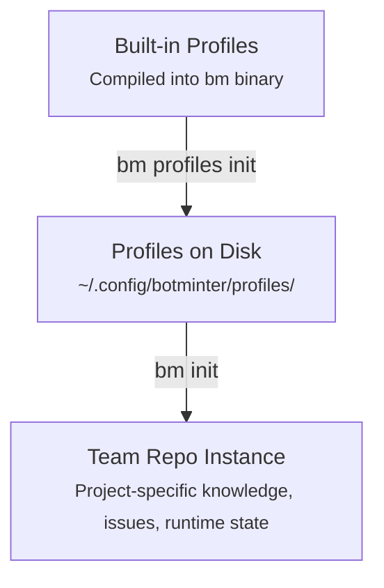
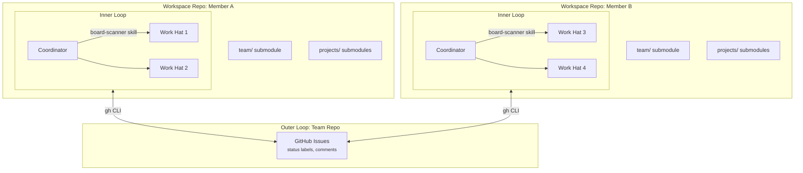

# Architecture

BotMinter's architecture has two fundamental models: a **profile-based generation model** that produces team repos, and a **two-layer runtime model** that governs how agents operate.

## Profile-based generation model

The `bm` CLI embeds profiles at compile time. When you run `bm init`, it extracts a profile's content into a new team repo:

| Layer | Location | What lives here | Who changes it |
|-------|----------|-----------------|----------------|
| **Profile** | `profiles/<name>/` | Team process, role definitions, member skeletons, norms | Profile authors |
| **Team repo instance** | e.g., `~/workspaces/my-team/team/` | Project-specific knowledge, hired members, runtime state | Team operators (via `bm` CLI) |



### Layer examples

| Content | Layer | Rationale |
|---------|-------|-----------|
| PROCESS.md (issue format, labels, workflow) | Profile | Defines how this type of team works |
| Member skeletons (role definitions) | Profile | Roles are methodology-specific |
| Team knowledge (commit conventions, PR standards) | Profile | Methodology norms |
| Project-specific knowledge (e.g., architecture docs) | Team repo instance | Not reusable across teams |

### Feedback loop

Learnings flow in both directions:

```
Profile <-- Team repo instance
(frequent)    (continuous)
```

- **Instance to Profile**: Non-project-specific learnings (process improvements, better prompts) flow back to the profile for reuse across teams.
- **Project-specific knowledge stays**: Project-specific learnings remain in the team repo instance.

## Two-layer runtime model

At runtime, the system operates in two nested loops:

### Inner loop — Ralph instances

Each team member is a full [Ralph orchestrator](https://github.com/mikeyobrien/ralph-orchestrator) instance with its own:

- **Hats** — specialized behaviors activated by events (defined by the profile)
- **Memories** — persistent state across sessions
- **Workflow** — event-driven loop with configurable persistence

Ralph handles hat selection, event routing, and the execution loop. Each agent runs independently in its own workspace repo — a dedicated git repository with the team repo and project forks as submodules.

### Outer loop — team repo control plane

The team repo is the coordination fabric. Members coordinate through:

- **GitHub issues** as work items
- **Status labels** (`status/<role>:<phase>`) to signal state transitions
- **Pull-based discovery** — each member scans for labels matching its role

No central orchestrator manages the outer loop. Coordination is emergent from shared process conventions defined in `PROCESS.md`. The specific roles, labels, and work item types are defined by the [profile](profiles.md).

### Execution models

Members support two execution models:

- **Poll-based** (`persistent: true`) — the member runs continuously, scanning the board on each loop cycle. Suitable for always-on operation.
- **Event-triggered** (`persistent: false`) — the member runs once, processes all matching work, then exits. An external [daemon](../reference/cli.md#daemon) restarts the member when new GitHub events arrive (via webhooks or API polling). This eliminates idle token burn.

See [Design Principles — Two Execution Models](../reference/design-principles.md#two-execution-models) for configuration details.



???+ example "Example: scrum runtime model"
    In the `scrum` profile, Member A is the `human-assistant` (backlog manager, review gater) and Member B is the `architect` (designer, planner, breakdown executor, epic monitor). Both use the board-scanner skill (auto-injected into the coordinator) to scan for matching status labels — the human-assistant watches for `status/po:*` and the architect watches for `status/arch:*`.

## Skills extraction

Operational knowledge that was originally embedded in hat instructions (e.g., status transition logic, board scanning) is extracted into **composable skills** — standalone units of knowledge that can be loaded on demand by any hat or interactive session.

### Why extract skills?

Hat instructions in `ralph.yml` contained duplicated logic — the same status transition GraphQL commands were repeated across every hat that needed to change an issue's project status. Extracting this into a shared `status-workflow` skill:

- **Eliminates duplication** — one source of truth for status transition logic instead of copies in every hat
- **Enables interactive use** — skills are available during `bm chat` sessions (not just Ralph orchestration loops), enabling team members to perform workflow operations outside their normal hat context
- **Follows recursive scoping** — skills use the same team/project/member resolution model as knowledge and invariants

### Skill architecture

```
coding-agent/skills/
  board-scanner/SKILL.md        # Auto-injected coordinator skill
  status-workflow/SKILL.md      # On-demand workflow operations
  gh/SKILL.md                   # GitHub CLI patterns and scripts
```

Skills are discovered from directories listed in `skills.dirs` in `ralph.yml`. Each skill is a directory containing a `SKILL.md` file (YAML frontmatter for metadata + markdown instructions), with optional `references/` and `scripts/` subdirectories.

Hats reference skills instead of inlining operational logic. For example, a hat's status transition instructions become:

```
Use the `status-workflow` skill for all project status transitions.
```

The agent loads the skill on demand (`ralph tools skill load status-workflow`) when it needs to perform the operation. See [Configuration — Skills](../reference/configuration.md#skills) for the full format specification.

## Related topics

- [Workspace Model](workspace-model.md) — how agent workspaces are structured
- [Coordination Model](coordination-model.md) — pull-based work discovery
- [Profiles](profiles.md) — reusable team process definitions
- [Knowledge & Invariants](knowledge-invariants.md) — recursive scoping model
