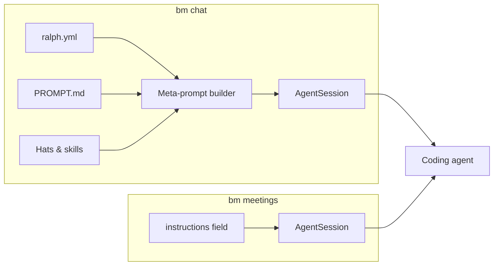

# Meetings

A **meeting** is a named shortcut for launching a coding agent with custom instructions and an initial prompt. Meetings are defined in a profile's `botminter.yml` and exposed as subcommands of `bm meetings`.

Where `bm chat` gives you a full role-based session — hats, guardrails, skills, and the member's complete identity — meetings strip all of that away. A meeting is just instructions and a prompt. This makes meetings the right tool when you want a focused, purpose-built interaction that doesn't need the full member pipeline.

## Meetings vs. chat

| | `bm chat` | `bm meetings` |
|---|---|---|
| **System prompt** | Built from ralph.yml, PROMPT.md, hats, guardrails, skills | Written directly from the meeting's `instructions` field |
| **Identity** | Full role identity — the agent knows its name, role, team, and capabilities | Whatever the instructions say — typically a role description and task framing |
| **Scope** | Open-ended — the agent can switch hats, access all its knowledge | Focused — scoped to one specific interaction pattern |
| **Who defines it** | The member's configuration in the team repo | The profile author in `botminter.yml` |
| **Initial message** | None (you start the conversation) | Optional `prompt` field, plus free-form trailing input |

The key distinction: `bm chat` launches a member in their full operational context. `bm meetings` launches a fresh agent session with nothing but what the meeting defines.

## When to use meetings

Meetings are designed for **repeatable, structured interactions** that follow a predictable pattern:

- **Planning sessions** — walk through an idea with a structured methodology
- **Verification sessions** — check acceptance criteria against completed work
- **Review sessions** — guided code review with specific checklists
- **Retrospectives** — structured reflection with prompts and templates

If you find yourself repeatedly opening `bm chat`, loading a specific skill, and giving the same framing instructions, that's a meeting waiting to be defined.

???+ example "Example: planning meeting"
    The `agentic-sdlc-planning` profile defines a `planning` meeting that launches an engineer into a structured planning session:

    ```yaml
    meetings:
      - name: planning
        description: "Collaborative planning session"
        member: engineer
        instructions: |
          - You are an engineer on this team.
          - Right now you are in an interactive planning meeting with the human (PO).
          - When the user says "start" you must start the planning meeting...
        prompt: start
    ```

    Running `bm meetings planning` starts the session with the engineer's coding agent, the instructions as the system prompt, and `start` as the first message — the engineer immediately greets you and begins the planning workflow.

## How meetings work

When you run `bm meetings <name>`:

1. BotMinter reads the meeting definition from the profile's `botminter.yml`
2. The `member` field is resolved to a hired member of that role (e.g., `engineer` → `engineer-01`)
3. The meeting's `instructions` are written to a temporary file
4. An `AgentSession` is constructed directly — no meta-prompt pipeline, no hat resolution
5. The coding agent launches with the instructions as the system prompt via `--append-system-prompt-file`
6. If the meeting has a `prompt`, it becomes the initial message. Any trailing arguments you pass are appended



## Meeting YAML schema

Meetings are defined in the `meetings` list in a profile's `botminter.yml`:

```yaml
meetings:
  - name: planning                        # Subcommand name (bm meetings planning)
    description: "Collaborative planning" # Shown in --help
    member: engineer                      # Role name — resolved to a hired member
    instructions: |                       # System prompt — the entire agent context
      You are an engineer on this team.
      Right now you are in a planning meeting.
      ...
    prompt: start                         # Optional initial message
```

| Field | Required | Description |
|-------|----------|-------------|
| `name` | Yes | Meeting subcommand name. Must be unique within the profile. |
| `description` | Yes | Human-readable description, shown in CLI help text. |
| `member` | Yes | Role name (e.g., `engineer`, `chief-of-staff`). Resolved to a hired member at runtime. |
| `instructions` | Yes | The complete system prompt for the session. Written to a temp file and passed to the coding agent. |
| `prompt` | No | Initial message sent to the agent when the session starts. Combined with trailing CLI arguments if any. |

### Writing instructions

The `instructions` field is the system prompt — it controls everything about the agent's behavior during the meeting. Profile authors have full control and full responsibility.

Guidelines:

- **Be self-contained.** The agent has no other context — no hats, no PROMPT.md, no skills. Everything the agent needs to know must be in the instructions.
- **Use role-level language.** Write "You are an engineer on this team" rather than "You are engineer-01 on the acme team." Template variables are not supported.
- **Load skills explicitly.** If the meeting should use a skill, include the instruction to load it (e.g., "You MUST load the `verification` skill").
- **Define the interaction pattern.** Meetings are structured — tell the agent what to do when the session starts, what phases to follow, and when the meeting is done.

!!! tip "Instructions are independently maintained"
    Unlike `bm chat`, meetings don't automatically pick up changes to hats, guardrails, or skills. If you update a hat's instructions, the meeting's instructions are unaffected. This is by design — meetings trade automatic updates for explicit control.

## Related topics

- [Run Meetings](../how-to/run-meetings.md) — step-by-step guide to running and authoring meetings
- [Profiles](profiles.md) — how profiles define team methodology
- [Coordination Model](coordination-model.md) — pull-based work and the role-as-skill pattern
- [CLI Reference — `bm meetings`](../reference/cli.md#bm-meetings) — full command documentation
