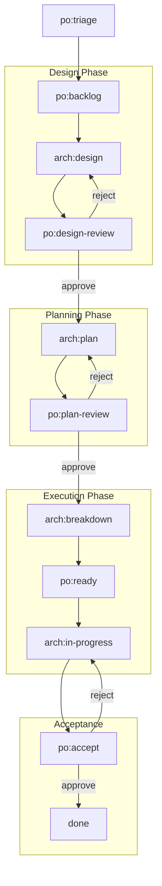
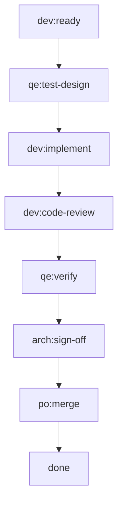

# Profiles

A profile defines a team methodology — how the team is structured, what roles exist, what processes are followed, and what norms are enforced. Profiles are embedded in the `bm` binary at compile time and extracted when creating a team with `bm init`.

Think of profiles as convention packages. The value is in the baked-in conventions — status pipelines, knowledge scoping, quality gates — not in the tool itself. Like Rails for web or Spring for enterprise: opinionated defaults that you can customize.

## What a profile contains

| Content | File/Directory | Purpose |
|---------|---------------|---------|
| Process definition | `PROCESS.md` | Issue format, label conventions, status transitions, communication protocols |
| Team context | `CLAUDE.md` | Agent orientation — what the repo is, workspace model, coordination model |
| Team knowledge | `knowledge/` | Shared norms (commit conventions, PR standards, communication protocols) |
| Team invariants | `invariants/` | Quality rules (code review required, test coverage) |
| Member skeletons | `members/` | Pre-configured role definitions with Ralph configs and prompts |
| Shared agents | `agent/` | Skills and sub-agents available to all members |
| Profile skills | `skills/` | Profile-level skills (e.g., `knowledge-manager` for interactive knowledge management) |
| Formations | `formations/` | Deployment targets (`local`, `k8s`) with formation configs and optional manager hats |
| Schema definition | `.schema/` | Expected directory layout for schema validation |

## Available profiles

botminter ships with three profiles. Each runs Claude Code agents orchestrated by Ralph — they differ in how many agents you run and how human approval works.

### `scrum-compact` (recommended starting point)

A single agent (role: `superman`) that wears all hats — product owner, architect, developer, QE, SRE, and content writer. The agent self-transitions through the entire issue lifecycle by switching hats.

- **One agent, all roles** — no coordination overhead, simplest setup
- **GitHub-based HIL** — human approves/rejects via GitHub issue comments. The agent posts a review request, moves on to other work, and checks for the human's response on the next scan cycle. Non-blocking.
- **Full pipeline** — same epic lifecycle and status transitions as the multi-member `scrum` profile

Best for: individual engineers who want to get started quickly with a single Claude Code agent.

### `scrum-compact-telegram`

Same as `scrum-compact` — a single `superman` agent — but uses **Telegram** for human-in-the-loop approval gates instead of GitHub comments. The agent blocks the loop waiting for a response via Telegram (RObot), then continues.

- **Blocking HIL** — the agent pauses and waits for your Telegram response before proceeding
- **Requires a Telegram bot token** — configured during `bm init`

Best for: engineers who want real-time notifications and instant approval flow via Telegram.

### `scrum`

A multi-member team with specialized roles. Each role runs as a separate Claude Code agent in its own workspace.

| Role | Purpose | Key hats |
|------|---------|----------|
| `human-assistant` | PO's proxy — board scanning, backlog management, review gating | board_scanner, backlog_manager, review_gater |
| `architect` | Technical authority — design docs, story breakdowns, issue creation | board_scanner, designer, planner, breakdown_executor, epic_monitor |

Additional roles (developer, QE, reviewer) are defined in the status pipeline but not yet implemented as member skeletons. They are planned for future milestones.

Best for: teams that want dedicated agents per role with parallel execution.

### Labels and status tracking

Profiles use two separate GitHub mechanisms for tracking work:

**Labels** (regular GitHub issue labels) — classify work items by type and project:

| Label | Created by | Purpose |
|-------|-----------|---------|
| `kind/epic` | `bm init` | Epic-level work item |
| `kind/story` | `bm init` | Story-level work item |
| `kind/docs` | `bm init` | Documentation story, routed to content writer hats |
| `project/<name>` | `bm projects add` | Tags an issue to a specific project (e.g., `project/my-app`) |

**Statuses** (GitHub Projects v2 Status field) — track where an issue is in the pipeline. Statuses use the format `<role>:<phase>` (e.g., `arch:design`, `po:triage`). These are managed as single-select options on the Project board's Status field, not as regular labels. `bm projects sync` keeps them in sync with the profile.

This separation matters: labels are static classification, statuses are dynamic pipeline position.

### Epic lifecycle

All three profiles share the same epic lifecycle. An epic flows through design, planning, breakdown, execution, and acceptance — with human review gates at each stage:



### Story lifecycle

When an epic reaches `arch:breakdown`, the architect creates individual story issues (labeled `kind/story`). Each story goes through its own pipeline:



The story pipeline is linear — no rejection loops. QE designs tests before development starts (test-first), the developer implements, code review and QE verification follow, then the architect signs off and the story is merged. `arch:sign-off` and `po:merge` are auto-advance gates in the compact profiles.

There are also **specialist statuses** for non-standard work: `sre:infra-setup` for infrastructure tasks, and `cw:write` → `cw:review` for documentation stories (labeled `kind/docs`).

### Views

Profiles define role-based views for the GitHub Project board. Since the API doesn't support creating views programmatically, `bm projects sync` syncs the Status field options and prints filter strings for manual setup in the GitHub UI.

```yaml
views:
  - name: "PO"
    prefixes: ["po"]
    also_include: ["done", "error"]
  - name: "Architect"
    prefixes: ["arch"]
    also_include: ["done", "error"]
```

Each view matches statuses by prefix (e.g., `["po"]` matches `po:triage`, `po:backlog`, etc.) and adds the `also_include` entries. See the [Getting Started guide](../getting-started/index.md#step-4-set-up-the-project-board) for example output.

## Listing profiles

Use the `bm` CLI to see available profiles:

```bash
bm profiles list                    # Table of all embedded profiles
bm profiles describe scrum-compact  # Detailed profile information
```

## Creating a new profile

Profiles live in `profiles/<name>/`. To create a new profile:

1. Create the profile directory under `profiles/`
2. Add a `botminter.yml` with name, display_name, description, version, schema_version, roles, labels, statuses, and views
3. Add a `.schema/` directory defining the expected directory layout
4. Add a `PROCESS.md` defining issue format, labels, and communication protocols
5. Add a `CLAUDE.md` providing team-wide context for agents
6. Add `knowledge/` with methodology-specific norms
7. Add `invariants/` with quality rules
8. Add `members/` with role skeleton directories
9. Add `skills/` with profile-level skills (e.g., `knowledge-manager`)
10. Add `formations/` with deployment targets (at minimum, `local/formation.yml`)

Each member skeleton needs:

| File | Purpose |
|------|---------|
| `ralph.yml` | Ralph orchestrator configuration (hats, events, persistence) |
| `PROMPT.md` | Role identity and cross-hat behavioral rules |
| `CLAUDE.md` | Role context (workspace model, knowledge paths, invariant paths) |
| `.botminter.yml` | Member metadata template (role name, emoji for comments) |

## Profiles vs team repos

Profiles are **baked into the `bm` CLI** — you can't modify them after installation. When you run `bm init`, the profile is extracted into a new team repo, and from that point on, the team repo is a standalone copy.

- **Profiles** are templates — they define the methodology. You pick one when creating a team. Currently, profiles ship with the CLI.

!!! warning "Custom profile repositories coming soon"
    Support for configurable profile sources is in development — you'll be able to point `bm` at your own repository of custom profiles instead of being limited to the ones baked into the CLI.
- **Team repos** are instances — they hold your team's actual configuration, knowledge, and state. This is where your customizations go: project-specific knowledge, architectural patterns, codebase context, and any process tweaks.

The same profile can be used to create multiple teams (`bm init` with the same profile, different team name). Each team repo evolves independently after creation.

## Related topics

- [Architecture](architecture.md) — where profiles fit in the generation model
- [Knowledge & Invariants](knowledge-invariants.md) — recursive scoping model
- [Process Conventions](../reference/process.md) — full label scheme and issue format
- [Member Roles](../reference/member-roles.md) — detailed role definitions
