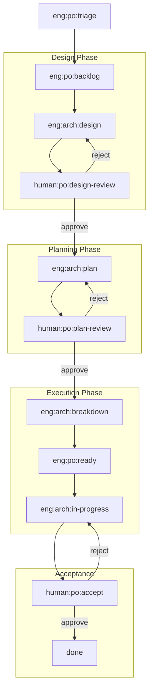
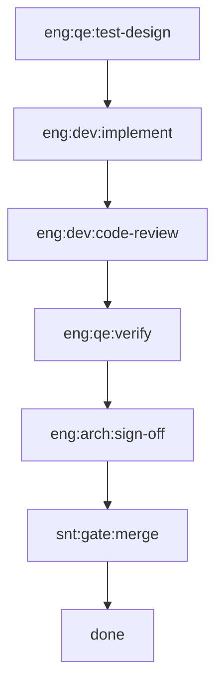

# Profiles

A profile defines a team methodology — how the team is structured, what roles exist, what processes are followed, and what norms are enforced. Profiles are stored on disk at `~/.config/botminter/profiles/` and read by all profile-related commands (`bm init`, `bm hire`, `bm profiles list`, etc.).

Think of profiles as convention packages. The value is in the baked-in conventions — status pipelines, knowledge scoping, quality gates — not in the tool itself. Like Rails for web or Spring for enterprise: opinionated defaults that you can customize.

## Storage model

Profiles live on disk at `~/.config/botminter/profiles/<profile-name>/`. The `bm` binary ships with built-in profiles that are extracted to this location on first use.

```
~/.config/botminter/
  profiles/
    scrum/                          # Multi-member team profile
      botminter.yml
      PROCESS.md
      context.md
      knowledge/
      invariants/
      roles/
      ...
    agentic-sdlc-minimal/                  # Minimal agentic SDLC profile (three roles)
      ...
  minty/                            # Minty interactive assistant config
    prompt.md                       # Persona prompt
    config.yml                      # Config (prompt path, skills directory)
    skills/                         # Composable skills
      team-overview/
      profile-browser/
      hire-guide/
      workspace-doctor/
```

Minty's config lives alongside profiles under `~/.config/botminter/minty/`. It is extracted automatically by `bm profiles init` or on first run of `bm minty`. Unlike profiles, Minty's config is always updated on every init run — there is no per-file overwrite prompt. See [`bm minty`](../reference/cli.md#bm-minty) for usage.

### First-run initialization

When you first run any profile-reading command (like `bm init`, `bm hire`, or `bm profiles list`), BotMinter detects that no profiles exist on disk and offers to initialize them:

- **Interactive (TTY):** Prompts "Profiles not initialized. Initialize now? [Y/n]" — defaults to Yes
- **Non-interactive:** Auto-initializes silently

You can also initialize explicitly with `bm profiles init`, or reset to built-in defaults with `bm profiles init --force`. See the [CLI reference](../reference/cli.md#bm-profiles-init) for details.

### Profile version detection

When you upgrade or downgrade `bm` to a different version, the embedded profiles may have a different version than what is on disk. BotMinter detects this by comparing the `version` field in each profile's `botminter.yml` (embedded vs on-disk).

When a version difference is detected:

- **Interactive (TTY):** Shows what changed and asks for confirmation:
    ```
    Profile 'scrum': found v1.0.0, installing v2.0.0
    Update profiles? [y/N]
    ```
    For downgrades (e.g., using an older `bm` binary), a warning is shown:
    ```
    Profile 'scrum': found v2.0.0, installing v1.0.0 -- this is a downgrade
    Update profiles? [y/N]
    ```
    Default is No -- your on-disk profiles are not overwritten without explicit consent.
- **Non-interactive:** Auto-updates silently (same as `--force`)

If you have local customizations to profiles, declining the update preserves them. Use `bm profiles init --force` to reset to built-in defaults at any time.

### Customization

After initialization, profiles on disk are yours to edit. You can:

- Modify role definitions, status pipelines, or labels in `botminter.yml`
- Edit `PROCESS.md` to change team conventions
- Add or modify member skeletons in `roles/`
- Add knowledge or invariant files

Changes take effect the next time you create a team (`bm init`) or hire a member (`bm hire`). Existing team repos are not affected — they are standalone copies.

When upgrading `bm`, version detection will notify you if the embedded profiles differ from your on-disk versions. Declining the update preserves your customizations. See [Profile version detection](#profile-version-detection) above.

To reset a profile to its built-in defaults, run `bm profiles init` and confirm the overwrite prompt, or use `--force` to overwrite all profiles.

## What a profile contains

| Content | File/Directory | Purpose |
|---------|---------------|---------|
| Process definition | `PROCESS.md` | Issue format, label conventions, status transitions, communication protocols |
| Team context | `context.md` | Agent orientation — what the repo is, workspace model, coordination model |
| Team knowledge | `knowledge/` | Shared norms (commit conventions, PR standards, communication protocols) |
| Team invariants | `invariants/` | Quality rules (code review required, test coverage) |
| Member skeletons | `roles/` | Pre-configured role definitions with Ralph configs and prompts |
| Shared coding-agent files | `coding-agent/` | Skills, sub-agents, and hooks (e.g., `settings.json`) available to all members |
| Profile skills | `skills/` | Profile-level skills (e.g., `knowledge-manager` for interactive knowledge management) |
| Formations | `formations/` | Deployment targets (`local`, `k8s`) with formation configs and optional manager hats |
| Schema definition | `.schema/` | Expected directory layout for schema validation |

## Coding-agent abstraction

Profiles are **coding-agent-agnostic** — they don't hardcode assumptions about which coding agent (Claude Code, Gemini CLI, etc.) runs underneath. Instead, the profile's `botminter.yml` declares a `coding_agents` map and a `default_coding_agent`:

```yaml
coding_agents:
  claude-code:
    name: claude-code
    display_name: "Claude Code"
    context_file: "CLAUDE.md"
    agent_dir: ".claude"
    binary: "claude"

default_coding_agent: claude-code
```

Each coding agent definition specifies:

| Field | Purpose | Example |
|-------|---------|---------|
| `context_file` | Name of the context file the agent reads at startup | `CLAUDE.md` |
| `agent_dir` | Agent-specific config directory in the workspace | `.claude` |
| `binary` | Binary name used to launch the agent | `claude` |

### How it works

Profile source files use **agent-neutral names**: `context.md` instead of `CLAUDE.md`, and `coding-agent/` instead of `.claude/`. During extraction (`bm init`, `bm hire`), the CLI:

1. **Renames** `context.md` → the agent's `context_file` (e.g., `CLAUDE.md`)
2. **Filters** inline agent tags — agent-specific sections marked with `<!-- +agent:NAME -->` / `<!-- -agent -->` tags are included or excluded based on the resolved agent

This means profiles can contain content for multiple coding agents in a single file. Use `bm profiles describe --show-tags` to see which files contain agent-specific sections.

Teams can override the default coding agent in `~/.botminter/config.yml` via the `coding_agent` field on the team entry.

!!! note "Claude Code only — for now"
    The architecture supports multiple coding agents, but Claude Code is the only concrete implementation today. Future agents (e.g., Gemini CLI) can be added to `coding_agents` without changing existing profile content.

## Available profiles

BotMinter ships with the `agentic-sdlc-minimal` profile. The `scrum` profile (multi-role teams) is in development and will ship in a future release.

### `agentic-sdlc-minimal` (recommended starting point)

A minimal agentic software development lifecycle with three roles and clear separation of concerns:

| Role | Purpose | Key hats |
|------|---------|----------|
| `engineer` | Full SDLC engineer — PO, architect, dev, QE, SRE, and content writer in one member | po, architect, dev, qe, sre, content_writer |
| `chief-of-staff` | The operator's chief of staff — handles operational tasks, reviews member activity, and drives improvements | executor |
| `sentinel` | Merge gatekeeper — runs project-specific tests before merging PRs, triages orphaned PRs | pr_gate, pr_triage |

- **Three roles, clear boundaries** — the `engineer` handles the full issue lifecycle by switching hats, `chief-of-staff` is the operator's AI assistant, and `sentinel` gatekeeps merges
- **Human review gates** — statuses prefixed with `human:` (e.g., `human:po:design-review`) require human approval via GitHub issue comments. The agent posts a review request, moves on to other work, and checks for the human's response on the next scan cycle. Non-blocking.
- **Sentinel merge gating** — PRs are merged by the `sentinel` role, not by the engineer, enforcing automated quality gates before merge
- **`<role-slug>:<persona>:<activity>` status convention** — statuses carry a role slug prefix (`eng:`, `cos:`, `snt:`, `human:`) making ownership unambiguous across the board

Best for: individual engineers or small teams who want a structured agentic SDLC with human oversight and automated merge gating.

### `scrum` (in development)

!!! warning "Not yet available"
    The `scrum` profile is included in development builds but does not ship in release binaries. It will be available in a future release.

A multi-member team with specialized roles. Each role runs as a separate Claude Code agent in its own workspace.

| Role | Purpose | Key hats |
|------|---------|----------|
| `human-assistant` | PO's proxy — backlog management, review gating | backlog_manager, review_gater |
| `architect` | Technical authority — design docs, story breakdowns, issue creation | designer, planner, breakdown_executor, epic_monitor |
| `chief-of-staff` | Process improvement and team coordination | executor |

Additional roles (developer, QE, reviewer) are defined in the status pipeline but not yet implemented as member skeletons. They are planned for future milestones.

Best for: teams that want dedicated agents per role with parallel execution.

### Labels and status tracking

Profiles use two separate GitHub mechanisms for tracking work:

**Labels** (regular GitHub issue labels) — classify work items by project:

| Label | Created by | Purpose |
|-------|-----------|---------|
| `kind/docs` | `bm init` | Documentation story, routed to content writer hats |
| `project/<name>` | `bm projects add` | Tags an issue to a specific project (e.g., `project/my-app`) |

!!! note "GitHub native issue types"
    The `agentic-sdlc-minimal` profile uses GitHub native issue types (Epic, Task, Bug) instead of `kind/epic` and `kind/story` labels. Issue types are set via the `issueTypeId` field in the GitHub API. The `project/<name>` label is required on every issue to associate it with a project.

**Statuses** (GitHub Projects v2 Status field) — track where an issue is in the pipeline. Statuses use the format `<role-slug>:<persona>:<activity>` (e.g., `eng:arch:design`, `eng:po:triage`, `human:po:design-review`). The role slug prefix identifies who owns the status:

| Prefix | Owner | Examples |
|--------|-------|----------|
| `eng:` | Engineer agent | `eng:po:triage`, `eng:arch:design`, `eng:dev:implement` |
| `cos:` | Chief of staff agent | `cos:exec:review` |
| `snt:` | Sentinel agent | `snt:gate:merge` |
| `human:` | Human operator (review gate) | `human:po:design-review`, `human:po:plan-review` |

Statuses are managed as single-select options on the Project board's Status field, not as regular labels. `bm projects sync` keeps them in sync with the profile.

This separation matters: labels are static classification, statuses are dynamic pipeline position.

### Epic lifecycle

All three profiles share the same epic lifecycle. An epic flows through design, planning, breakdown, execution, and acceptance — with human review gates at each stage:


```mermaid
flowchart TD
    triage["eng:po:triage"] --> backlog["eng:po:backlog"]

    subgraph Design Phase
        backlog --> design["eng:arch:design"]
        design --> dreview["human:po:design-review"]
        dreview -->|reject| design
    end

    subgraph Planning Phase
        dreview -->|approve| plan["eng:arch:plan"]
        plan --> preview["human:po:plan-review"]
        preview -->|reject| plan
    end

    subgraph Execution Phase
        preview -->|approve| breakdown["eng:arch:breakdown"]
        breakdown --> ready["eng:po:ready"]
        ready --> inprog["eng:arch:in-progress"]
    end

    subgraph Acceptance
        inprog --> accept["human:po:accept"]
        accept -->|reject| inprog
        accept -->|approve| done["done"]
    end
```

### Story lifecycle

When an epic reaches `eng:arch:breakdown`, the architect creates individual story issues (using the Task issue type). Each story goes through its own pipeline:


```mermaid
flowchart TD
    testdesign["eng:qe:test-design"] --> implement["eng:dev:implement"]
    implement --> codereview["eng:dev:code-review"]
    codereview --> verify["eng:qe:verify"]
    verify --> signoff["eng:arch:sign-off"]
    signoff --> merge["snt:gate:merge"]
    merge --> done["done"]
```

The story pipeline is linear — no rejection loops. QE designs tests before development starts (test-first), the developer implements, code review and QE verification follow, then the architect signs off. The `sentinel` role handles the final merge via `snt:gate:merge`, enforcing automated quality gates before the PR is merged. `eng:arch:sign-off` is an auto-advance gate in the engineer's workflow.

There are also **specialist statuses** for non-standard work: `eng:sre:infra-setup` for infrastructure tasks, and `eng:cw:write` followed by `eng:cw:review` for documentation stories (labeled `kind/docs`).

### Views

Profiles define role-based views for the GitHub Project board. Since the API doesn't support creating views programmatically, `bm projects sync` syncs the Status field options and prints filter strings for manual setup in the GitHub UI.

```yaml
views:
  - name: "Engineer"
    prefixes: ["eng"]
    also_include: ["done", "error"]
  - name: "Human Gates"
    prefixes: ["human"]
    also_include: ["done", "error"]
```

Each view matches statuses by role-slug prefix (e.g., `["eng"]` matches `eng:po:triage`, `eng:arch:design`, `eng:dev:implement`, etc.) and adds the `also_include` entries. See the [Getting Started guide](../getting-started/index.md#step-4-set-up-the-project-board) for example output.

## Listing profiles

Use the `bm` CLI to see available profiles:

```bash
bm profiles list                    # Table of all profiles on disk
bm profiles describe agentic-sdlc-minimal  # Detailed profile information
```

## Creating a new profile

Profiles live in `profiles/<name>/`. To create a new profile:

1. Create the profile directory under `profiles/`
2. Add a `botminter.yml` with name, display_name, description, version, schema_version, coding_agents, default_coding_agent, roles, labels, statuses, and views
3. Add a `.schema/` directory defining the expected directory layout
4. Add a `PROCESS.md` defining issue format, labels, and communication protocols
5. Add a `context.md` providing team-wide context for agents (renamed to the agent's `context_file` during extraction)
6. Add `knowledge/` with methodology-specific norms
7. Add `invariants/` with quality rules
8. Add `roles/` with role skeleton directories
9. Add `skills/` with profile-level skills (e.g., `knowledge-manager`)
10. Add `formations/` with deployment targets (at minimum, `local/formation.yml`)

Each member skeleton needs:

| File | Purpose |
|------|---------|
| `ralph.yml` | Ralph orchestrator configuration (hats, events, persistence) |
| `PROMPT.md` | Role identity and cross-hat behavioral rules |
| `context.md` | Role context (workspace model, knowledge paths, invariant paths) — renamed to agent's `context_file` during extraction |
| `.botminter.yml` | Member metadata template (role name, emoji for comments) |

## Profiles vs team repos

Profiles live on disk at `~/.config/botminter/profiles/` and can be customized after initialization. When you run `bm init`, the selected profile is extracted into a new team repo, and from that point on, the team repo is a standalone copy.

- **Profiles** are templates — they define the methodology. You pick one when creating a team. After initialization, you can edit them on disk to customize conventions for future teams.
- **Team repos** are instances — they hold your team's actual configuration, knowledge, and state. This is where your project-specific customizations go: knowledge, architectural patterns, codebase context, and any process tweaks.

The same profile can be used to create multiple teams (`bm init` with the same profile, different team name). Each team repo evolves independently after creation.

## Related topics

- [Architecture](architecture.md) — where profiles fit in the generation model
- [Knowledge & Invariants](knowledge-invariants.md) — recursive scoping model
- [Process Conventions](../reference/process.md) — full label scheme and issue format
- [Member Roles](../reference/member-roles.md) — detailed role definitions
