# The Agentic Workflow

## LLMs can build. They just can't be trusted alone.

LLMs are powerful enough to design, plan, decompose, implement, and review software. But they're not reliable enough to hand them a task and walk away. They hallucinate. They miss edge cases. They produce code that looks correct but isn't. The fully autonomous "just let the AI build it" pitch doesn't hold up when you're shipping to production.

The opposite extreme — treating LLMs as autocomplete and doing all the thinking yourself — wastes most of what they're good at.

botminter takes a different approach: let agents do the building, but give yourself the right controls to shape *how* they build.

## Your own agentic team

Most agentic tools put you inside the AI's workflow. You sit in a terminal, watch an agent run sub-agents, and hope it gets things right. The AI is in control. You're the observer.

botminter flips this. You build your own team of Claude Code agents that you work with the same way you work with any engineering team. You don't sit inside their tool. You coordinate through GitHub issues. You define the process, the workflow, and the constraints.

```mermaid
flowchart TD
    you["👤 You"] -->|"create issues · review · approve/reject"| board["📋 GitHub Project Board"]
    board --> po["📝 PO Agent<br/><small>Triage · Review · Accept</small>"]
    board --> arch["🏗️ Architect Agent<br/><small>Design · Breakdown</small>"]
    board --> dev["🤖 Dev Agent<br/><small>Write Tests · Implement</small>"]
    board --> sre["🚀 SRE Agent<br/><small>Deploy</small>"]
```



And these aren't broad, "do everything" agents. Each agent wears multiple **hats** — focused specialists that activate based on the type of work. You can't hire a human whose sole purpose is to write test definitions. But you can give an agent a hat that does exactly that.

Each hat has:

- **Its own scoped knowledge** — the test hat knows your testing patterns, the implementation hat knows your codebase architecture
- **Its own quality checks** — gates that must pass before work moves forward
- **Its own isolated context** — the AWS deployment knowledge doesn't leak into Azure work, the way it would if everything lived in one long conversation

```mermaid
flowchart TD
    subgraph agent ["🤖 Dev Agent"]
        hat1["🧪 Write Tests<br/><small>test patterns · acceptance criteria</small>"]
        hat2["💻 Implement<br/><small>architecture docs · code conventions</small>"]
        hat3["🚀 Deploy<br/><small>CI pipeline · infrastructure</small>"]
        hat1 --> hat2 --> hat3
    end
```



You have full visibility into each hat and can tweak one hat's instructions without touching the others.

The goal is concrete: your agentic team produces a pull request that has been designed, reviewed, implemented, tested, and verified — all under your constraints. You take that PR and propose it to your human team. It's not "the AI made this, good luck reviewing it." It's a vetted contribution with a traceable history of every decision that shaped it.

## You control how much autonomy they get

Every agent starts in **training mode** — every state-modifying action is presented to you for confirmation before it happens. Triage decisions, status transitions, design submissions. You see everything, approve everything.

This is how you learn what the team does. It's also how the team learns what you expect. Your approvals and rejections shape the knowledge base that agents reference in future work.

As confidence builds, you turn down the supervision. The target model has three levels — per agent, not global:

- **Training** — every action requires your confirmation
- **Supervised** — only review gates require your input; routine transitions happen automatically
- **Autonomous** — agents act independently; you review outputs, not actions

You can keep the architect supervised while the human-assistant auto-triages. The control is per-agent, not global.

---

## Your role shifts

You stop doing the work. You start steering decisions.

```mermaid
flowchart BT
    subgraph team [" "]
        arch["🏗️ Architect"] -.-> ha["📝 Human Assistant"]
        dev["💻 Dev"] -.-> ha
        qe["🧪 QE"] -.-> ha
        label["🤖 Your Agentic Team"]
        style label fill:none,stroke:none,color:#666
    end
    ha -->|"✅ Vetted PR"| you["👤 You"]
    you -->|"Propose upstream"| humans["👥 Your Human Team"]
```



1. You open the GitHub Project board and see where things stand
2. You drop a new idea as an issue, or nudge an existing one forward
3. Agents pick it up, produce artifacts, and hand off to the next role
4. You review what needs your attention — designs, plans, final sign-offs
5. Rejected work goes back with your feedback; approved work moves forward

There are no standups. There are no syncs. The GitHub Project board *is* the standup. You check `bm status` whenever you want. Agents work at their pace. You review at yours.

## How an idea becomes code

!!! info "Profiles — not a hardcoded workflow"
    botminter ships with **profiles** — reference implementations of team methodologies that define roles, pipeline stages, quality gates, and knowledge structure. Use the built-in profiles as-is, fork them, or create your own from scratch. Each profile's pipeline can be distributed however you want — spread across multiple agents, or collapsed into a single agent wearing many hats.

The following is an example of what a profile's pipeline looks like. Every feature follows a structured set of stages. The value is in the **forced decomposition**: each step produces a reviewable artifact before the next step begins.

```mermaid
flowchart TD
    triage["📥 PO: Triage"] --> backlog["📋 PO: Backlog"]
    backlog -.->|"you activate"| design["🏗️ Architect: Design"]
    design --> dreview["👀 PO: Design Review"]
    dreview --> plan["📐 Architect: Breakdown"]
    plan --> preview["👀 PO: Plan Review"]
    preview --> testdesign["🧪 QE: Write Tests"]
    testdesign --> implement["💻 Dev: Implement"]
    implement --> codereview["🔍 Dev: Code Review"]
    codereview --> deploy["🚀 SRE: Deploy"]
    deploy --> done["✅ Done"]

    dreview -.->|"reject"| design
    preview -.->|"reject"| plan
    codereview -.->|"reject"| implement
```



!!! tip "Reading the diagram"
    Notice how the same role appears at multiple stages — the PO triages, reviews designs, and reviews plans. The architect designs and breaks down stories. Each appearance is a different **hat** on the same agent, with its own focused context. The dotted rejection lines are review gates — every one has a way back.

Agents scan the board for statuses matching their role and pull work automatically.

### Triage

You create a GitHub issue describing what you want. The human-assistant — the agent that acts as your interface to the team — picks it up on its next board scan and presents it to you:

- Accept → issue moves to backlog
- Reject → half-baked ideas get caught here, not three days into implementation

### Design

The architect agent reads the issue and the project's actual source code, then produces a design document:

- References real modules, real interfaces, real constraints — not a generic template
- Posted as a comment on the issue
- Saved to the project's knowledge directory for future reference

### Review

The design comes back to you:

- **Approve** → moves to story breakdown
- **Reject with feedback** → architect revises incorporating your specific concerns
- The rejection comment becomes part of the issue's permanent history
- This loop can run multiple times — each cycle costs one board-scan cycle, typically minutes

### Breakdown and story creation

The architect decomposes the approved design into stories:

- Each story has Given-When-Then acceptance criteria
- Each is scoped to be independently deliverable
- The breakdown comes back to you for review — your second major quality gate
- After you approve, the architect creates the story issues, each linked to the parent epic
- The epic moves to your ready backlog — you decide *when* to activate it

### Execution

Stories flow through focused specialists:

- The QE hat writes test definitions from acceptance criteria
- The Dev hat implements against those test contracts
- The Code Review hat verifies
- The SRE hat deploys

Each hat activates with only the context it needs.

!!! success "End result"
    At the end of the pipeline, you receive a pull request that has passed every gate — ready for you to propose to your human team.

---

## What makes this work

The pipeline gives the workflow structure. The hat model gives each step a focused specialist. Four mechanisms tie it all together.

### Context isolation

In a typical single-agent session, everything accumulates in one context — your deployment runbook, your API design notes, your test patterns, your frontend conventions — all competing for attention. The longer the session, the more the context drifts.

Hats solve this. Each hat loads only the knowledge relevant to its concern:

- **Test-definition hat** → sees testing patterns and acceptance criteria
- **Implementation hat** → sees architecture docs and code conventions
- **Deploy hat** → sees CI pipeline and infrastructure config

!!! quote "Key insight"
    The context is clean every time — not because the agent is disciplined, but because the system only gives it what it needs.

### Quality gates

Each agent role has quality checks defined in its instructions that must pass before it can move an issue forward. The architect's design role, for example, checks:

- Does the design doc include a security considerations section?
- Does the design include acceptance criteria?
- Does the design reference applicable project knowledge?

These checks catch problems *before* work reaches your review queue. You see artifacts that have already passed their own sanity checks.

### Knowledge files

Every agent consults knowledge files before producing work. Knowledge is scoped — team-wide, project-specific, or role-specific:

| Scope | Example | Who uses it |
|-------|---------|-------------|
| Team-wide | Commit conventions, PR standards | Every agent |
| Project-specific | Architecture docs, API contracts | Agents working on that project |
| Role-specific | Design templates, review checklists | That role only |

When the architect designs a feature for Project X, it automatically reads:

- Team-level knowledge (commit conventions, PR standards)
- Project X's knowledge (architecture docs, API contracts)
- The architect's own role knowledge (design templates, checklists)

You don't tell it what to consult. The scoping model handles it. Knowledge grows through normal work:

- The architect writes a design doc → it becomes project knowledge
- You reject a design because it missed caching concerns → you add a "caching considerations" item to the design checklist
- A story fails code review for missing error handling → you tighten the invariant

The pattern you corrected once doesn't need correcting again.

### Invariants

Knowledge is advisory — agents consult it when relevant. Invariants are mandatory — all applicable invariants must be satisfied, every time.

!!! example "Knowledge vs. Invariant"
    - *Knowledge:* "Our API uses cursor-based pagination" — useful context, referenced when relevant
    - *Invariant:* "All public endpoints must have integration tests" — non-negotiable

Invariants follow the same scoping model as knowledge:

- **Team-wide** invariants apply to everyone
- **Project** invariants apply to that project
- **Role** invariants apply to that role

They're additive — a more specific scope adds constraints, never loosens them.

!!! tip "The team doesn't forget"
    When you find a recurring quality gap, you add an invariant. It applies to all future work in that scope.

---

## Everything on the record

Everything happens on GitHub. Every status transition gets an attribution comment. Every design decision is a file in the repo. Every rejection has a written rationale.

???+ example "What an issue's comment history looks like"
    ```markdown
    ### 📝 po — 2026-01-15T10:30:00Z

    Triaged. Accepting into backlog — aligns with Q1 priorities.

    ### 🏗️ architect — 2026-01-15T10:45:00Z

    Design complete. Proposing event-driven approach using existing
    message bus. Design doc: projects/api/knowledge/designs/epic-42.md

    ### 📝 po — 2026-01-15T11:00:00Z

    Rejecting design. The message bus approach adds latency we can't
    afford for this use case. Consider direct service calls with
    circuit breaker pattern instead.

    ### 🏗️ architect — 2026-01-15T11:15:00Z

    Revised design. Switched to direct calls with circuit breaker.
    Added latency budget analysis per your feedback.
    ```

Over time, your issues become a searchable history of every design decision, every rejection rationale, every tradeoff your team made. New agents inherit the knowledge base. New humans read the record.

The team's process itself is version-controlled in the team repo:

- Every knowledge file, invariant, and quality gate is a file in Git
- You tighten an invariant after a quality miss
- You add a knowledge file after a recurring question
- Every change is a commit — `git log` shows the evolution of your team's methodology

---

## Scaling out

With one project and two agent roles, this workflow is straightforward. As you add projects and roles, the value compounds.

- **Multiple projects** share team-level knowledge while maintaining project-specific context
- **Multiple roles** create a pipeline where each step has a specialist — each with their own knowledge and constraints
- **Multiple agents in the same role** work in parallel on different stories, all pulling from the same board

No central dispatcher. No bottleneck. Each agent independently scans, produces, and hands off. GitHub is the only shared state.

---

The workflow is the same whether you're running two agents or ten. The knowledge base is what changes — it starts empty and compounds with every feature, every review, every rejection. The agents aren't just following a pipeline. They're following *your* pipeline, shaped by your decisions, constrained by your standards, improving with every iteration.

When you take the resulting PR to your human team, it comes with a traceable record — every design decision, every review comment, every rejection and revision, all on GitHub. Your teammates don't have to trust "the AI made this." They can read the history and see exactly how it was built.

Ready to set it up? Start with the [Getting Started guide](getting-started/index.md).
