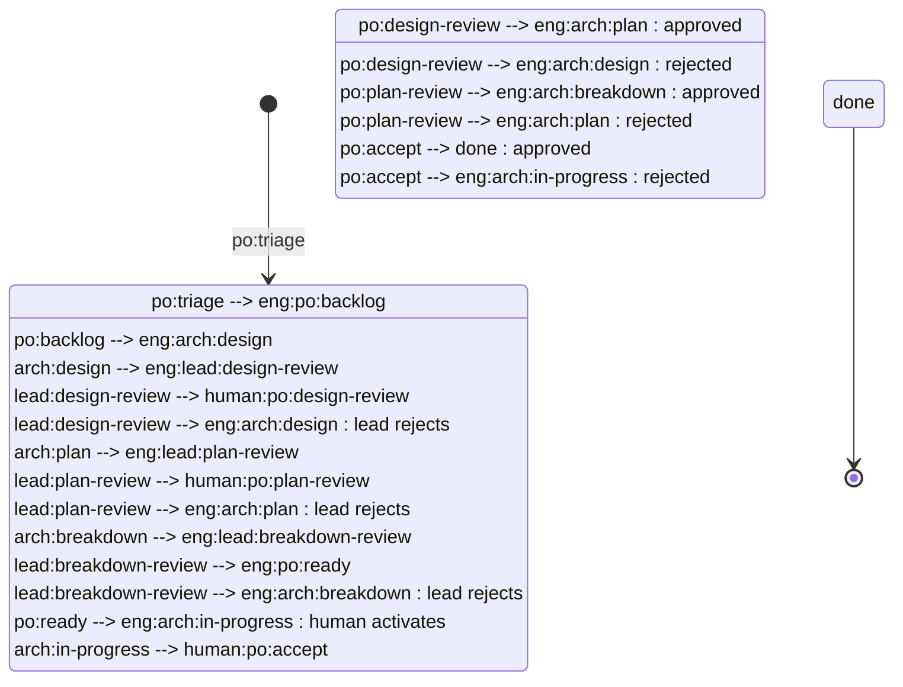
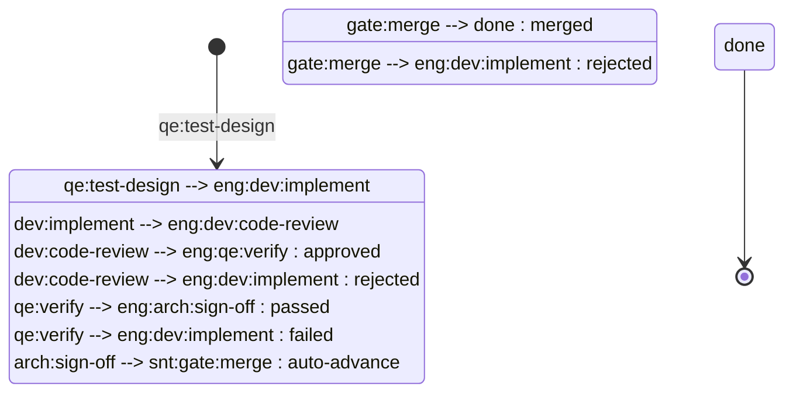

# Agentic SDLC Minimal — Process

This document defines the conventions used by the agentic-sdlc-minimal team profile. All hats follow these formats when creating and updating issues, milestones, PRs, and comments on GitHub. All GitHub operations go through the `github-project` skill.

The agentic-sdlc-minimal profile has three members:

| Member | Role Slug | Description |
|--------|-----------|-------------|
| **engineer** | `eng` | The primary execution agent — self-transitions through the full issue lifecycle wearing different hats (po, architect, dev, qe, lead, sre, cw). |
| **chief-of-staff** | `cos` | Coordinates process improvements, team-level tasks, and operational health. |
| **sentinel** | `snt` | Automated merge gating — runs tests, validates quality, merges or rejects PRs. |

---

## Issue Format

Issues are GitHub issues on the **team repo** (not the project repo). The `github-project` skill auto-detects the team repo from `team/`'s git remote.

### Fields

| Field | GitHub Mapping | Description |
|-------|---------------|-------------|
| `title` | Issue title | Concise, descriptive issue title |
| `state` | Issue state | `open` or `closed` |
| `type` | Native issue type | Epic, Task (story), Bug |
| `assignee` | Issue assignee | GitHub username or unassigned |
| `milestone` | Issue milestone | Milestone name or none |
| `parent` | Native sub-issue relationship | Links stories to their parent epic |
| `body` | Issue body | Description, acceptance criteria, and context (markdown) |

Issues are created via the `github-project` skill (create-issue operation). See the skill for exact commands.

---

## Issue Types

Issue classification uses GitHub's native issue types:

| Issue Type | Kind | Description |
|------------|------|-------------|
| **Epic** | `epic` | A large body of work spanning multiple stories |
| **Task** | `story` | A single deliverable unit of work (sub-issue of an Epic) |
| **Bug** | `bug` | A bug requiring investigation, planning, and fix |

Stories are linked to epics as native sub-issues.
Subtasks for complex bugs are also native sub-issues (Task type under a Bug).

Every issue MUST have exactly one issue type set.

### Labels

Labels are used as modifiers on any issue type, not for classification:

| Label | Description |
|-------|-------------|
| `kind/docs` | Routes the issue to content writer hats for documentation work |
| `role/*` | Assigns the issue to a specific role |
| `project/<project>` | Associates the issue with a specific project. Every issue MUST have exactly one `project/<project>` label. |

---

## Project Status Convention

Status is tracked via a single-select "Status" field on the team's GitHub Project board (v2). Status values follow the naming pattern:

```
<role-slug>:<persona>:<activity>
```

- `<role-slug>` — the team member responsible: `eng` (engineer), `cos` (chief-of-staff), `snt` (sentinel), or `human` (human gates)
- `<persona>` — the hat/persona acting within that member (e.g., `po`, `arch`, `dev`, `qe`, `lead`, `sre`, `cw`, `exec`, `gate`, `bug`)
- `<activity>` — the current activity within that persona's workflow (e.g., `triage`, `design`, `implement`, `verify`, `merge`)

**Exceptions:** `done` and `error` are terminal statuses with no role prefix.

### Role Slug Reference

| Slug | Member | Meaning |
|------|--------|---------|
| `eng` | engineer | The primary execution agent wearing various hats |
| `cos` | chief-of-staff | Team coordination and process management |
| `snt` | sentinel | Automated quality and merge gating |
| `human` | (operator) | Human decision gates — requires human response via GitHub comments |

### Examples

- `eng:po:triage` — the engineer (wearing the PO hat) is triaging the issue
- `eng:dev:implement` — the engineer (wearing the dev hat) is implementing the story
- `eng:qe:verify` — the engineer (wearing the QE hat) is verifying the implementation
- `human:po:design-review` — a human must review and approve the design
- `snt:gate:merge` — the sentinel is running merge checks
- `cos:exec:in-progress` — the chief-of-staff is executing a task

The engineer self-transitions through all `eng:*` statuses by switching hats. Comment headers still use the persona of the active hat (e.g., architect, dev, qe) for audit trail clarity.

The `human:` prefix clearly distinguishes statuses that require a human response from agent-automated statuses. Agents NEVER auto-advance `human:*` statuses.

---

## Epic Statuses

The epic lifecycle statuses, with the role responsible at each stage:

| Status | Persona | Description |
|--------|---------|-------------|
| `eng:po:triage` | PO | New epic, awaiting evaluation |
| `eng:po:backlog` | PO | Accepted, prioritized, awaiting activation |
| `eng:arch:design` | architect | Producing design doc |
| `eng:lead:design-review` | team lead | Design doc awaiting lead review |
| `human:po:design-review` | PO (human) | Design doc awaiting human review |
| `eng:arch:plan` | architect | Proposing story breakdown (plan) |
| `eng:lead:plan-review` | team lead | Story breakdown awaiting lead review |
| `human:po:plan-review` | PO (human) | Story breakdown awaiting human review |
| `eng:arch:breakdown` | architect | Creating story issues |
| `eng:lead:breakdown-review` | team lead | Story issues awaiting lead review |
| `eng:po:ready` | PO | Stories created, epic parked in ready backlog. Human decides when to activate. |
| `eng:arch:in-progress` | architect | Monitoring story execution (fast-forwards to `human:po:accept`) |
| `human:po:accept` | PO (human) | Epic awaiting human acceptance |
| `done` | -- | Epic complete |



### Rejection Loops

At human review gates, the human can reject and send the epic back:
- `human:po:design-review` -> `eng:arch:design` (with feedback comment)
- `human:po:plan-review` -> `eng:arch:plan` (with feedback comment)
- `human:po:accept` -> `eng:arch:in-progress` (with feedback comment)

At team lead review gates, the lead can reject and send back to the work hat:
- `eng:lead:design-review` -> `eng:arch:design` (with feedback comment)
- `eng:lead:plan-review` -> `eng:arch:plan` (with feedback comment)
- `eng:lead:breakdown-review` -> `eng:arch:breakdown` (with feedback comment)

The feedback comment uses the standard comment format and includes specific concerns.

---

## Story Statuses

The story lifecycle follows a TDD flow. Stories start directly at `eng:qe:test-design` (there is no separate "ready" status):

| Status | Persona | Description |
|--------|---------|-------------|
| `eng:qe:test-design` | QE | QE designing tests and writing test stubs |
| `eng:dev:implement` | dev | Developer implementing the story |
| `eng:dev:code-review` | dev | Code review of implementation |
| `eng:qe:verify` | QE | QE verifying implementation against acceptance criteria |
| `eng:arch:sign-off` | architect | Auto-advance (see below) |
| `snt:gate:merge` | sentinel | Sentinel runs tests, validates quality, merges or rejects |
| `done` | -- | Story complete |



### Story Rejection Loops

- `eng:dev:code-review` -> `eng:dev:implement` (code reviewer rejects with feedback)
- `eng:qe:verify` -> `eng:dev:implement` (QE rejects with feedback)
- `snt:gate:merge` -> `eng:dev:implement` (sentinel rejects — tests fail or quality gate not met)

---

## Bug Statuses

The bug workflow has two tracks: **simple** (fast path) and **complex** (full planning).

| Status | Persona | Description |
|--------|---------|-------------|
| `eng:bug:investigate` | QE | QE reproduces bug, determines simple vs complex, and either fixes (simple) or plans (complex) |
| `eng:arch:review` | architect | Reviews simple bug fix — approves or escalates to complex track |
| `eng:arch:refine` | architect | Refines complex bug plan (after QE's proposal or arch escalation) |
| `human:po:plan-review` | PO (human) | Human reviews complex bug plan (reused from epic workflow) |
| `eng:bug:breakdown` | architect | Creates GitHub native subtask issues for complex bugs |
| `eng:bug:in-progress` | architect | Monitors subtask completion |
| `eng:qe:verify` | QE | Verifies the fix (reused from story workflow) |
| `done` | -- | Bug complete |

```mermaid
stateDiagram-v2
    state "Simple Track" as simple {
        eng:bug:investigate_s: eng:bug:investigate
        eng:arch:review_s: eng:arch:review
        eng:qe:verify_s: eng:qe:verify
        eng:bug:investigate_s --> eng:arch:review_s
        eng:arch:review_s --> eng:qe:verify_s : approved
        eng:qe:verify_s --> done_s : passed
        eng:qe:verify_s --> eng:bug:investigate_s : failed
    }

    state "Complex Track" as complex {
        eng:bug:investigate_c: eng:bug:investigate
        eng:arch:refine_c: eng:arch:refine
        human:po:plan-review_c: human:po:plan-review
        eng:bug:breakdown_c: eng:bug:breakdown
        eng:bug:in-progress_c: eng:bug:in-progress
        eng:qe:verify_c: eng:qe:verify
        eng:bug:investigate_c --> eng:arch:refine_c
        eng:arch:refine_c --> human:po:plan-review_c
        human:po:plan-review_c --> eng:bug:breakdown_c : approved
        human:po:plan-review_c --> eng:arch:refine_c : rejected
        eng:bug:breakdown_c --> eng:bug:in-progress_c
        eng:bug:in-progress_c --> eng:qe:verify_c
        eng:qe:verify_c --> done_c : passed
        eng:qe:verify_c --> eng:bug:in-progress_c : failed
    }

    [*] --> eng:bug:investigate
    eng:bug:investigate --> simple : simple criteria met
    eng:bug:investigate --> complex : complex criteria met
    eng:arch:review_s --> eng:arch:refine_c : escalated
```

### Simple vs Complex Criteria

During `eng:bug:investigate`, QE determines track using these criteria:

| Criterion | Simple | Complex |
|-----------|--------|---------|
| Files affected | Single file | Multiple files/modules |
| Lines changed | < 20 lines | > 20 lines |
| Scope | Isolated fix | Touches shared code/APIs |
| Architecture | No design change | Requires architectural change |
| Dependencies | No new dependencies | New libraries/packages |
| Testing | Covered by existing tests or trivial addition | Requires new test infrastructure |
| Risk | Low - localized impact | Medium/High - wide impact |

**Rule of thumb:** If QE can fix it in one sitting without subtasks, it's simple.

### Simple Bug Track (Fast Path)

```
eng:bug:investigate -> eng:arch:review -> eng:qe:verify -> done
```

QE implements the fix during investigation, arch reviews code quality, QE validates the fix works.

### Complex Bug Track (Full Planning)

```
eng:bug:investigate -> eng:arch:refine -> human:po:plan-review -> eng:bug:breakdown -> eng:bug:in-progress -> eng:qe:verify -> done
```

QE proposes plan, arch refines, PO approves, arch creates subtasks, monitor tracks completion, QE validates integrated fix.

### Bug Rejection Loops

- `eng:arch:review` -> `eng:arch:refine` (Arch escalates simple bug as too complex)
- `human:po:plan-review` -> `eng:arch:refine` (PO rejects complex bug plan with feedback)
- `eng:qe:verify` -> `eng:bug:investigate` (QE verification fails - simple bugs)
- `eng:qe:verify` -> `eng:bug:in-progress` (QE verification fails - complex bugs)

### Detailed Workflow

#### Simple Bug Track

| Status | Actions | Next |
|--------|---------|------|
| `eng:bug:investigate` | QE: Reproduce, apply criteria, implement fix, commit to branch | `eng:arch:review` |
| `eng:arch:review` | Arch: Code review, verify simplicity. Approve -> next, Too complex -> escalate | `eng:qe:verify` or `eng:arch:refine` |
| `eng:qe:verify` | QE: Re-run reproduction, verify bug resolved, test suite. Pass -> close, Fail -> reopen | `done` or `eng:bug:investigate` |

#### Complex Bug Track

| Status | Actions | Next |
|--------|---------|------|
| `eng:bug:investigate` | QE: Reproduce, root cause, propose solution + subtask breakdown | `eng:arch:refine` |
| `eng:arch:refine` | Arch: Review/amend plan, refine subtasks, add architectural notes | `human:po:plan-review` |
| `human:po:plan-review` | PO (human): Approve via comment or reject with feedback | `eng:bug:breakdown` or `eng:arch:refine` |
| `eng:bug:breakdown` | Arch: Create GitHub native subtask issues, set to `eng:dev:implement` | `eng:bug:in-progress` |
| `eng:bug:in-progress` | Arch (monitor): Query subtask status, wait for all to reach `done` | `eng:qe:verify` |
| `eng:qe:verify` | QE: Integration test, re-run original reproduction, verify full fix. Pass -> close, Fail -> reopen | `done` or `eng:bug:in-progress` |

### Subtask Integration (Complex Bugs Only)

Subtasks created during `eng:bug:breakdown` use GitHub's native sub-issue feature. Each subtask:
- Has native issue type "Task"
- Is a native sub-issue of the parent Bug
- Flows through the normal story workflow: `eng:dev:implement` -> `eng:dev:code-review` -> `eng:qe:verify` -> `eng:arch:sign-off` -> `snt:gate:merge` -> `done`

When all subtasks reach `done`, the bug monitor advances the parent bug to `eng:qe:verify` for final verification.

---

## SRE Statuses

| Status | Persona | Description |
|--------|---------|-------------|
| `eng:sre:infra-setup` | SRE | Setting up test infrastructure |

SRE is a service role — after completing infrastructure work, the issue returns to its previous status.

---

## Content Writer Statuses

For documentation stories (`kind/docs`):

| Status | Persona | Description |
|--------|---------|-------------|
| `eng:cw:write` | content writer | Writing documentation |
| `eng:cw:review` | content writer | Reviewing documentation |

Content stories follow the same terminal path as regular stories: on review approval, transition to `snt:gate:merge` where the sentinel runs merge gates before merging to `done`.

---

## Chief of Staff Statuses

| Status | Persona | Description |
|--------|---------|-------------|
| `cos:exec:todo` | executor | Task queued for chief-of-staff execution |
| `cos:exec:in-progress` | executor | Chief-of-staff is actively working the task |
| `cos:exec:done` | executor | Task completed by chief-of-staff |

---

## Auto-Advance Statuses

Some statuses are handled automatically by the board scanner without dispatching a hat:

- `eng:arch:sign-off` -> auto-advances to `snt:gate:merge`. In the agentic-sdlc-minimal profile, the same agent that designed the epic signs off — no separate architect gate needed. The sentinel takes over from here.

The sentinel at `snt:gate:merge` is NOT an auto-advance — it actively runs tests, validates quality gates, and either merges (advancing to `done`) or rejects (reverting to `eng:dev:implement` with feedback).

---

## Human Gates

The following statuses require explicit human approval via GitHub issue comments. The `human:` prefix distinguishes these from agent-automated statuses. Agents MUST NOT auto-advance any `human:*` status.

| Gate | Status | What's Presented |
|------|--------|-----------------|
| Design approval | `human:po:design-review` | Design doc summary |
| Plan approval | `human:po:plan-review` | Story breakdown (epics) or complex bug plan (bugs) |
| Final acceptance | `human:po:accept` | Completed epic summary |

All other transitions auto-advance without human interaction.

### How approval works

1. The agent adds a **review request comment** on the issue summarizing the artifact
2. The agent **returns control** and moves on to other work
3. The **human** reviews the artifact on GitHub and responds via an issue comment:
   - `Approved` (or `LGTM`) -> agent advances the status on the next scan cycle
   - `Rejected: <feedback>` -> agent reverts the status and appends the feedback
4. If no human comment is found, the issue stays at its review status — **the agent NEVER auto-approves**

### Idempotency

The agent adds only ONE review request comment per review gate. On subsequent scan cycles, it checks for a human response but does NOT re-comment if a review request is already present.

---

## Sentinel Merge Gate

The sentinel member handles `snt:gate:merge`. Unlike auto-advance statuses, the sentinel actively validates before merging:

1. **Runs the project's test suite** — all tests must pass
2. **Checks code quality gates** — linting, formatting, coverage thresholds
3. **Validates PR metadata** — title format, linked issues, labels
4. **Merges the PR** via `gh pr merge` if all checks pass
5. **Rejects** by setting status back to `eng:dev:implement` with a feedback comment if any check fails

Per-project merge gate configuration lives at `team/projects/<project>/knowledge/merge-gate.md`. This file defines project-specific test commands, coverage thresholds, and quality requirements the sentinel enforces.

---

## Error Status

| Status | Description |
|--------|-------------|
| `error` | Issue failed processing 3 times. Board scanner skips it. Human investigates and resets the status to retry. |

---

## Comment Format

Comments are GitHub issue comments, added via `gh issue comment`. Each comment uses this format:

```markdown
### <emoji> <persona> — <ISO-8601-UTC-timestamp>

Comment text here. May contain markdown formatting, code blocks, etc.
```

The `<emoji>` and `<persona>` are read from the member's `.botminter.yml` file at runtime by the `github-project` skill. Each member has its own GitHub App identity (e.g., `team-engineer[bot]`). The persona attribution in the comment body provides additional context about which hat/persona wrote the comment.

### Standard Emoji Mapping

| Persona | Emoji | Example Header |
|---------|-------|----------------|
| po | 📝 | `### 📝 po — 2026-01-15T10:30:00Z` |
| architect | 🏗️ | `### 🏗️ architect — 2026-01-15T10:30:00Z` |
| dev | 💻 | `### 💻 dev — 2026-01-15T10:30:00Z` |
| qe | 🧪 | `### 🧪 qe — 2026-01-15T10:30:00Z` |
| sre | 🛠️ | `### 🛠️ sre — 2026-01-15T10:30:00Z` |
| cw | ✍️ | `### ✍️ cw — 2026-01-15T10:30:00Z` |
| lead | 👑 | `### 👑 lead — 2026-01-15T10:30:00Z` |

The three team members map to these comment personas as follows:

| Member | Role Slug | Comment Personas Used |
|--------|-----------|----------------------|
| **engineer** | `eng` | po, architect, dev, qe, lead, sre, cw (all execution personas) |
| **chief-of-staff** | `cos` | Uses `📋 cos` header for all comments |
| **sentinel** | `snt` | Uses `🛡️ sentinel` header for all comments |

In the agentic-sdlc-minimal profile, the engineer's `<persona>` in the comment header reflects which hat is acting (e.g., architect, dev, qe, lead, sre, cw) even though it is the same agent. This preserves audit trail clarity and compatibility with multi-member profiles.

Example:

````markdown
### 🏗️ architect — 2026-01-15T10:30:00Z

Design document produced. See `projects/my-project/knowledge/designs/epic-1.md`.
````

Comments are append-only. Never edit or delete existing comments.

---

## Milestone Format

Milestones are GitHub milestones on the team repo, managed via the `github-project` skill.

**Fields:**

| Field | GitHub Mapping | Description |
|-------|---------------|-------------|
| `title` | Milestone title | Milestone name (e.g., `M1: Initial setup`) |
| `state` | Milestone state | `open` or `closed` |
| `description` | Milestone description | Goals and scope of the milestone |
| `due_on` | Milestone due date | Optional ISO 8601 date |

Issues are assigned to milestones via the `github-project` skill (milestone-ops operation).

---

## Pull Request Format

Pull requests are real GitHub PRs on the **project repo** for code changes and on the **team repo** for team evolution changes.

**Fields:**

| Field | GitHub Mapping | Description |
|-------|---------------|-------------|
| `title` | PR title | Descriptive title of the change |
| `state` | PR state | `open`, `merged`, or `closed` |
| `base` | Base branch | Target branch (usually `main`) |
| `head` | Head branch | Feature branch |
| `labels` | PR labels | e.g., `kind/process-change` |
| `body` | PR body | Description of the change (markdown) |

### Reviews

Reviews use GitHub's native review system via `gh pr review`:

- `gh pr review <number> --approve` — approve the PR
- `gh pr review <number> --request-changes` — request changes

Review comments follow the standard comment format with an explicit status:

```markdown
### <emoji> <persona> — <ISO-8601-UTC-timestamp>

**Status: approved**

Review comments here.
```

Valid review statuses: `approved`, `changes-requested`.

---

## PR Lifecycle

Code PRs follow a structured lifecycle tied to the story workflow.

### Branch Naming

```
feature/<type>-<issue-number>-<description>
```

Examples:
- `feature/story-42-add-user-auth`
- `feature/bug-87-fix-null-pointer`
- `feature/docs-15-api-reference`

### PR Title Format

```
[#<issue-number>] <description>
```

Examples:
- `[#42] Add user authentication module`
- `[#87] Fix null pointer in session handler`

### PR Creation and Lifecycle

1. **Draft PR created during `eng:qe:test-design`** — the QE test designer creates a draft PR with the test branch. This establishes the PR early for visibility and links it to the issue.

2. **Draft PR updated during `eng:dev:implement`** — the developer pushes implementation commits to the same branch. When implementation is complete, the PR is marked ready for review.

3. **Code review via `eng:dev:code-review`** — the code reviewer uses `gh pr review` to approve or request changes. Code review feedback goes through the PR review system, NOT through issue comments.

4. **Merge gated by sentinel at `snt:gate:merge`** — the sentinel validates all quality gates and merges the PR. No manual merge is permitted.

### Merge Gate Configuration

Each project defines its merge gate requirements at:

```
team/projects/<project>/knowledge/merge-gate.md
```

This file specifies:
- Test commands to run before merge
- Coverage thresholds
- Required status checks
- Merge strategy (squash, merge commit, rebase)

If no `merge-gate.md` exists, the sentinel uses default checks (all CI passes, at least one approval).

### Team Repo PRs

PRs on the team repo are for team-level changes only:
- Process document updates
- Knowledge file additions or modifications
- Invariant changes

These follow the same review format but are NOT gated by the sentinel — they are reviewed and merged by team members directly.

---

## Communication Protocols

The agentic-sdlc-minimal profile uses a three-member model. All operations use the `github-project` skill:

### Status Transitions

The agent transitions an issue's status by:
1. Using `gh project item-edit` to update the Status field on the project board
2. Adding an attribution comment documenting the transition

The board scanner detects the new status on the next scan cycle (querying the project board via `gh project item-list`) and dispatches the appropriate hat on the appropriate member.

### Comments

The agent records work output by:
1. Adding a GitHub issue comment via `gh issue comment` using the standard comment format

### Pull Requests

Code PRs on the project repo follow the PR Lifecycle section above.

Team repo PRs are for team-level changes:
- Process document updates
- Knowledge file additions or modifications
- Invariant changes

---

## Team Agreements

All significant process changes, role changes, and team decisions MUST be recorded as team agreements before the change is applied. Agreements provide traceability for why changes were made and who participated in the decision.

- **Decisions** go in `agreements/decisions/` — role changes, process changes, tool adoption
- **Retrospective outcomes** go in `agreements/retros/` — summaries from retrospective sessions
- **Working norms** go in `agreements/norms/` — living team agreements (e.g., "we prefer small PRs")

See `knowledge/team-agreements.md` for the full convention including file format and lifecycle.

---

## Process Evolution

The team process can evolve through two paths:

### Formal Path

1. Create a PR on the team repo proposing the change
2. Review the PR (self-review via lead hat)
3. Approve and merge

### Informal Path

1. Human comments on an issue or the team repo with the change request
2. Agent edits the process file directly
3. Commit the change to the team repo

The informal path is appropriate for urgent corrections or clarifications. The formal path is preferred for significant process changes.
