## The Idea

A GitOps-style agentic team where independent Ralph instances act as team members — developer, QE, architect, reviewer — coordinated by a human PO/Tech Lead. There is no central orchestrator. Instead, a shared team repo serves as the control plane: file-based issues, status labels, and process conventions form the coordination fabric. Each member runs in its own workspace, watches for work matching its role (pull model), and hands off to the next member by updating issue status. The human-assistant is the human's proxy — it scans the board, presents state and reasoning, and gates key decisions (epic creation, design approval, merge) through a Telegram-based human-in-the-loop channel. Knowledge, invariants, and process rules live in the repo at recursive scopes (team, project, member), making the entire team definition git-portable and reproducible.

```mermaid
flowchart LR
    Human((Human<br>PO / Tech Lead))

    Human <-->|"Telegram HIL"| HA(🤖 Human-Assistant)
    HA <-->|"create · gate · merge"| board

    subgraph repo["Team Repo (Control Plane)"]
        board["issues"]
        docs["PROCESS.md<br>knowledge<br>invariants"]
    end

    board <-->|"design · sign-off"| Arch([🤖 Architect])
    board <-->|"test-write · verify"| QE([🤖 QE])
    board <-->|"implement"| Dev([🤖 Dev])
    board <-->|"review"| Rev([🤖 Reviewer])

    docs -.->|"shared context"| HA & Arch & QE & Dev & Rev
```

## Vision
After consolidating our POC explorations, the direction is to build the HyperShift Agentic Team orchestrator (reusing ralph-orchestrator with the option to fork/modify):

- My role will shift to be a "po + tech lead", one that presents and proposes the output of its teams to stakeholders, and vice versa.
- The team members are the agents. 
- The team is composed of engineers/developers,  QE,  UX,  content writers, SREs and field architects.
- Just as a team, there will be a "team fork" that's a fork of "my fork", and I and my fork will gate the PRs that gets opened against upstream.
- Just as a team, we'll use branches, GitHub issues, projects, discussions, etc on that fork.
- The team will able to provision infra and CI/CD that's not the same as the upstream project (e.g. not ci-operator for OpenShift) with the sole purpose of increasing the quality and confidence in PRs that're candidate for upstream proposal.
- The team embodies the same processes for a real team to "self-correct", explore process optimization between myself and the team.
    - e.g. by default, the team follows sprints, and I am the PO+Tech Lead. So at the end of the sprint, I must approve or deny the sprint output.
    - however, since the tool allows for self-correction, one can issue a "retrospective" session with the team, and the process gets modified based on either my insights, or the teams.
- The team purpose is to establish a process, tooling, and a workflow to increase the rate of PRs that I accept without having me to go through the code line by line.
## Requirements
Before starting, we need to make some discovery about how an agentic-workflow should look like that satisfies the following requirements:

1. Can be configured to match Red Hat's planning process: RFE -> Feature -> Epics -> Story
2. 100% unattended agentic with optional human-in-the-loop when needed (configurable)
3. For the planning
    1. Covers breakdown of a Feature (OCPSTRAT JIRA issue) to a Epics and stories
4. For the implementation
    1. Can be configured per each phase of the SDLC. A phase can be prompt-driven (i.e. prompt-driven for planning, discovery, design, implementation plan, etc), or spec driven, or hybrid (start a conversation with a spec template that gets filled based on conversation output)
    2. Allows evidence-based validation of quality and implementation.
    3. Covers the PR reviews, CI runs, CI debugging, etc.
    4. Suitable for the nature of HyperShift, OpenShift, Kubernetes.
5. Ralph-Wiggum style, not swarm style.
6. Includes knowledge accumulation between team members. E.g.:
    1. Team member A runs the workflow and find that the agentic workflow isn't good in debugging nodepool tests.
    2. When checking slack, he finds that team member B just pushed an improvement of debugging nodepool tests to the agentic workflow setup/repo/.claude/whatever
    3. team member A pulls that somehow, and he's unblocked.
7. Increases the confidence of agentic-authored PRs without requiring the team members to review every line of code of such PRs
8. Since all agents can run with tools, it's required that those tools are configurable (mcp, tools, permissions) per phase, persona, or shared team config.

## The 7 Workflow Aspects

These are the transferable assets that the tool empowers

| #   | Aspect                      | What It Means                                                                     |
| --- | --------------------------- | --------------------------------------------------------------------------------- |
| 1   | **Spec-Driven Development** | Requirements → design → tasks before code. Structured specs, not ad-hoc prompting |
| 2   | **Context Engineering**     | CLAUDE.md, project context, domain knowledge loaded efficiently                   |
| 3   | **Prompt Engineering**      | Reusable, tested prompts for common tasks (review, debug, implement, test)        |
| 4   | **Agent Memories**          | Persistent state across sessions — what was done, what failed, what's next        |
| 5   | **Agent Tasks**             | Structured task tracking with dependencies, status, assignment                    |
| 6   | **Team Knowledge**          | Shared patterns, troubleshooting guides, domain expertise — git-portable          |
| 7   | **Agent Personas**          | Role-specific behavior profiles (planner, builder, tester, reviewer)              |

## Dream UX
We will pick whatever suitable aspects from the different UX research we did in the Dream UX files. Each one has things that might be useful for us, and things that shouldn't be considered.

## Proposal

**What's being built:** A team generator metaprompting toolkit (`botminter`). It is a generator repo that stamps out fully configured agentic team repos — complete with Justfile recipes, role definitions, process documents, knowledge layers, and coordination infrastructure. The generator produces self-contained team repos where independent Ralph instances operate as team members, coordinated through file-based conventions.

**How it's built:** The machinery and the HyperShift task (OCPSTRAT-1751) are developed hand-in-hand through incremental milestones. Each milestone adds features to the machinery — generator skeleton, profiles, prompts, ralph configs, Justfile recipes — and validates them by running agents with synthetic test tasks, observing behavior, and iterating on prompts until the agents behave correctly. After each milestone is complete, the human spins up the team for real operational use on OCPSTRAT-1751 as a case study. Learnings from real usage feed back into the machinery (process improvements flow to the profile, project-specific knowledge stays in the team repo instance).

**Milestones:**
1. **Structure + human-assistant** — Generator skeleton, `rh-scrum` profile, workspace model, human-assistant as first member, HIL via Telegram
2. **Architect + First Epic** — Second member (architect), epic lifecycle, two-member coordination, write-lock mechanism
3. **Full Team + First Story** — Dev, QE, reviewer members, full story kanban, TDD flow, codebase access
4. **Eval/Confidence System** — Formalized eval framework, scored confidence, HIL graduation
5. **GitHub Integration** — Replace file-based coordination with real GitHub, fork chain, CI