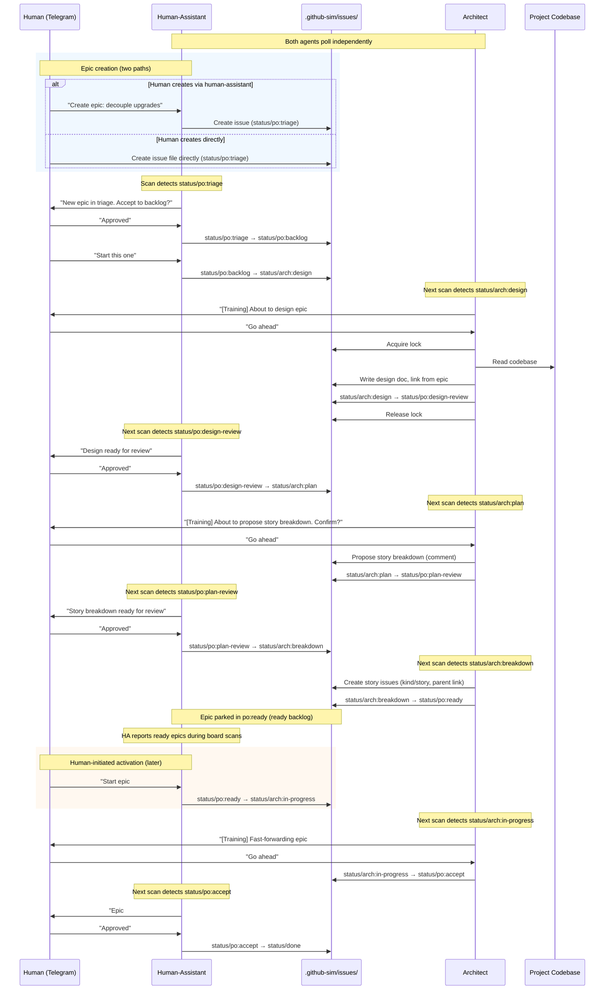
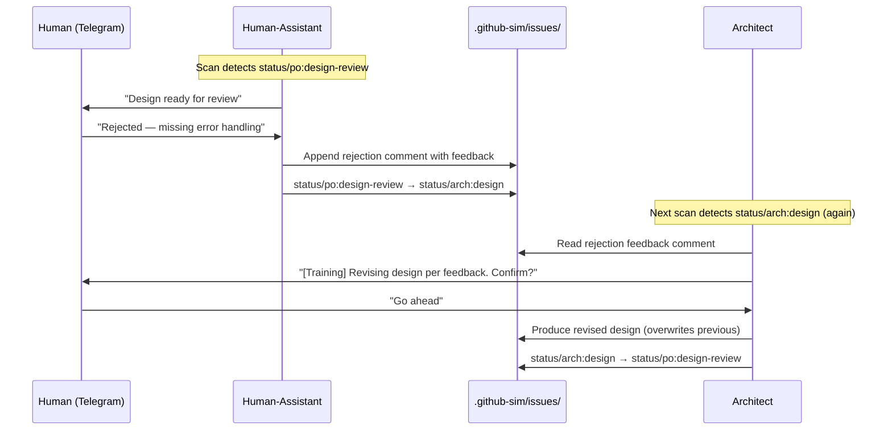
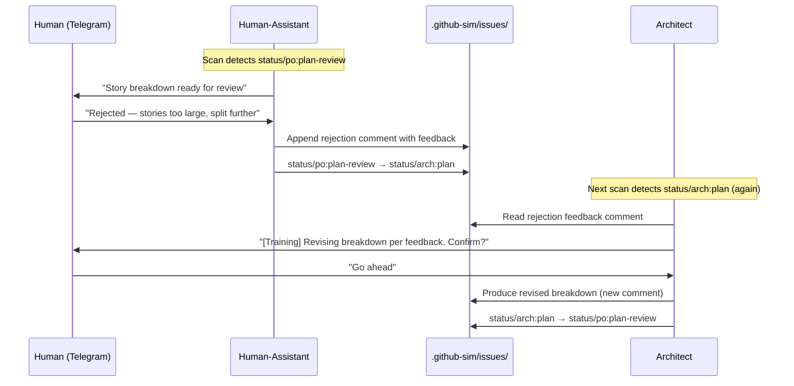
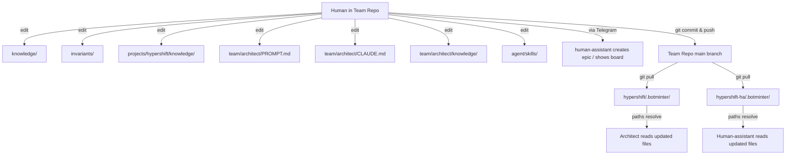
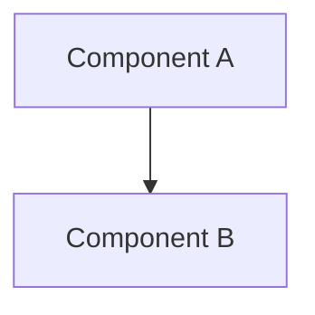

# Design — Milestone 2: Architect + First Epic

> Detailed design for M2. Standalone — understandable without reading other files.
> Inputs: [requirements.md](requirements.md), [research/](research/), [master-plan design.md](../master-plan/design.md) Section 5, [M1.5 spike findings](../milestone-1.5-autonomous-ralph/findings.md).

---

## 1. Overview

**What:** Add the architect as a second team member and build the two-member coordination machinery. M2 proves the outer loop — two independent Ralph instances coordinating through `.github-sim/` without direct communication.

**Why:** M1 proved the inner loop (one agent scanning an empty board). M2 proves that pull-based coordination works: the human-assistant creates and gates epics, the architect picks them up via status labels, produces design artifacts, and transitions statuses for the human-assistant to detect on its next scan.

**End state:** Two agents running simultaneously. The human-assistant manages the backlog and gates reviews. The architect picks up design work, produces design docs, and proposes story breakdowns. A synthetic epic has traversed the full epic lifecycle from triage to story creation.

**Does NOT exercise:** Story kanban flow (stories created but not executed), code work on any project repo, TDD (no dev or QE yet).

---

## 2. Detailed Requirements

Consolidated from [requirements.md](requirements.md) (Q1–Q14).

### 2.1 Architect Role

The architect is the technical authority. It produces two artifacts per epic:

1. **Design doc** — standalone document covering architecture, components, data models, error handling. Produced when the architect sees `status/arch:design`. Lives in `projects/<project>/knowledge/designs/epic-<number>.md`, linked from the epic issue.
2. **Story breakdown** — proposed decomposition of the epic into implementable stories with descriptions and acceptance criteria. Produced when the architect sees `status/arch:plan`.

The architect needs **codebase access**. The agent's workspace IS the project repo clone (agentic-team fork). The team repo is cloned into `.botminter/` inside the project repo, providing team configuration, knowledge, and coordination files.

**Fork chain:**
```
openshift/hypershift (upstream)
  └── devguyio/hypershift (human's fork)
        └── devguyio-minions/hypershift (agentic-team fork)
```

### 2.2 Epic Lifecycle

Statuses are not a rigid pipeline. Each role defines what it watches for and what it transitions to. The end-to-end lifecycle emerges from combining all roles' perspectives. Any status can move to any other when needed (e.g., rejection loops).

**Happy-path epic lifecycle:**

```
status/po:triage
  → status/po:backlog
    → status/arch:design
      → status/po:design-review
        → status/arch:plan
          → status/po:plan-review
            → status/arch:breakdown
              → status/po:ready
                → status/arch:in-progress
                  → status/po:accept
                    → status/done
```

### 2.3 Architect's Status Transitions

The architect watches for `status/arch:*` labels and ignores `status/po:*`:

| Watches for              | Action                                                                                      | Transitions to            |
| ------------------------ | ------------------------------------------------------------------------------------------- | ------------------------- |
| `status/arch:design`     | Reads epic + project codebase. Produces design doc, links from epic.                        | `status/po:design-review` |
| `status/arch:plan`       | Takes PO-approved design, proposes story breakdown.                                         | `status/po:plan-review`   |
| `status/arch:breakdown`  | Creates story issues in `.github-sim/issues/` with `kind/story` + `parent` linking to epic. | `status/po:ready`         |
| `status/arch:in-progress`| M2: fast-forward (no dev/qe yet). Future: watches stories, reviews, finds gaps.             | `status/po:accept`        |

### 2.4 Human-Assistant's Status Transitions

The human-assistant watches for `status/po:*` labels:

| Watches for | Action | Transitions to |
|---|---|---|
| `status/po:triage` | Presents new epic to human for evaluation. | `status/po:backlog` (accepted) |
| `status/po:backlog` | Helps human prioritize backlog. When human says "start this one," advances. | `status/arch:design` |
| `status/po:design-review` | Presents architect's design doc to human via HIL. Approved → advance. Rejected → back with feedback. | `status/arch:plan` or back to `status/arch:design` |
| `status/po:plan-review` | Presents story breakdown to human via HIL. Approved → advance. Rejected → back with feedback. | `status/arch:breakdown` or back to `status/arch:plan` |
| `status/po:ready` | Stories created, epic parked in ready backlog. Human decides when to activate. HA reminds about stale ready epics. | `status/arch:in-progress` (human-initiated) |
| `status/po:accept` | Presents completed epic to human for final acceptance. | `status/done` |

All review gates are HIL — the human-assistant presents to the human and waits.

**Training mode** applies to ALL team members, not just the human-assistant. In training mode, every agent reports what it's about to do and waits for human confirmation before acting — like a TRACE log level. The architect reports "I'm about to produce a design for epic #1" and waits. The human-assistant reports "I'm about to transition this epic to backlog" and waits. No agent acts autonomously in training mode.

### 2.5 Concurrent Access: Write-Locks

Both agents read/write `.botminter/.github-sim/` via their team repo clones. A per-issue locking mechanism prevents clobbering:

- **Scope:** Per-issue and per-pull-request (not a global lock).
- **Lock files:** `.botminter/.github-sim/issues/{number}.lock`, `.botminter/.github-sim/pulls/{number}.lock`
- **New issue/PR creation:** To create a new issue, the agent first determines the next available number (scan for highest existing number + 1), acquires the lock for that number, then creates the issue file. This prevents two agents from creating issues with the same number simultaneously.
- **Write-only:** Locks required for writes, not reads. Any member can read at any time.
- **Acquire:** Agent writes its ID to the lock file, commits, and pushes. If the lock file already exists, the lock cannot be acquired.
- **Lock ID format:** `{role}:{ralph_loop_id}` — role prefix (e.g., `architect`, `human-assistant`) + current loop ID from Ralph.
- **Release:** Agent deletes the lock file, commits, and pushes.
- **Lock file contents:** `{role}:{ralph_loop_id}` + ISO 8601 timestamp.

**Stale lock handling:**
- The human-assistant's board scanner scans for stale locks and cleans them up (assumed crashed agent). The stale lock threshold is configurable in PROCESS.md (default: 5 minutes).
- Agents check for stale locks with their own role on startup (previous crash cleanup).
- Agents verify their lock still exists before pushing (defense against lock deletion).

### 2.6 Team Repo Sync

Team members pull the `.botminter/` team repo at the beginning of each loop iteration (board scan). Agents may also pull mid-loop when they need fresh state (e.g., before acting on an issue). Push after every write operation (status transition, comment, issue creation).

### 2.7 Telegram Routing

Separate Telegram bot per member. Each gets its own bot token and 1:1 chat with the human. This works with Ralph's current implementation (single `chat_id` per instance). No Ralph code changes needed.

**Token delivery:** `just launch <member> --telegram-bot-token <TOKEN>` is a **mandatory argument**. The Justfile sets `RALPH_TELEGRAM_BOT_TOKEN` from this arg before launching Ralph. Exporting `RALPH_TELEGRAM_BOT_TOKEN` from the parent shell does NOT work for multi-member on the same machine — each `just launch` invocation needs its own token passed explicitly. This replaces M1's env-var-only approach.

### 2.8 Knowledge and Invariant Validation

M2 must validate that the architect respects knowledge and invariants at all levels (team, project, member). Validation uses **synthetic test fixtures** — not real project content.

Two phases per milestone:
1. **Implementation phase:** Build and validate machinery with synthetic data. Knowledge/invariant files populated with test content designed to verify propagation.
2. **Operational phase:** Human populates real project content and uses the validated machinery for actual work.

Synthetic data must be designed so violations are detectable — proving the architect actually reads and respects each scope.

---

## 3. Architecture Overview

### 3.1 Two-Member Outer Loop

#### Scenario A: Happy Path (all approved)



#### Scenario B: Design Rejected



#### Scenario C: Plan Rejected



### 3.2 Layer Placement

All M2 artifacts are **profile-layer** changes (`skeletons/profiles/rh-scrum/`), except Justfile recipes which go in the **generator skeleton** (`skeletons/team-repo/Justfile`).

| Artifact | Layer | Location |
|----------|-------|----------|
| Architect member skeleton | Profile | `skeletons/profiles/rh-scrum/members/architect/` |
| Human-assistant hat updates | Profile | `skeletons/profiles/rh-scrum/members/human-assistant/` |
| Epic lifecycle statuses | Profile | `skeletons/profiles/rh-scrum/PROCESS.md` |
| Team-level skills (`create-epic`, `board`) | Profile | `skeletons/profiles/rh-scrum/agent/skills/` |
| Team-level `agent/` directory | Profile | `skeletons/profiles/rh-scrum/agent/` |
| Justfile updates (`sync`, `.botminter/`-based `create-workspace`, `.claude/` assembly) | Generator skeleton | `skeletons/team-repo/Justfile` |
| Synthetic test fixtures | Test artifacts | `specs/milestone-2-architect-first-epic/fixtures/` |

---

## 4. Components and Interfaces

### 4.1 Architect Member Skeleton

**Location:** `skeletons/profiles/rh-scrum/members/architect/`

```
skeletons/profiles/rh-scrum/members/architect/
├── ralph.yml          # Event loop: persistent, board.scan starting event, 5 hats
├── PROMPT.md          # Role identity, hat dispatch, codebase access instructions
├── CLAUDE.md          # Role-specific context, references team-repo CLAUDE.md
├── knowledge/         # Member-level knowledge (all hats)
├── invariants/        # Member-level invariants (all hats)
│   └── design-quality.md    # Design docs must address all required sections
├── agent/             # Member-level agent capabilities (all hats)
│   ├── skills/        # Member-level skills (arch-* prefix)
│   └── agents/        # Member-level sub-agents (arch-* prefix)
├── hats/              # Per-hat knowledge (hat-level skills deferred to post-POC)
│   ├── designer/
│   │   └── knowledge/     # Designer-specific knowledge
│   └── planner/
│       └── knowledge/     # Planner-specific knowledge (e.g., sizing guidelines)
└── projects/          # Member-project knowledge (empty initially)
```

#### 4.1.1 ralph.yml

```yaml
event_loop:
  prompt_file: PROMPT.md
  completion_promise: LOOP_COMPLETE
  max_iterations: 10000
  max_runtime_seconds: 86400
  starting_event: board.scan
  persistent: true                    # M1.5 validated — suppresses LOOP_COMPLETE, injects task.resume for idle re-trigger

cli:
  backend: claude

core:
  guardrails:
    - "Comply with all invariants in .botminter/invariants/, .botminter/projects/<project>/invariants/, and .botminter/team/architect/invariants/"
    - "Lock-late: think first, then acquire lock → write → push → release"

hats:
  board_scanner:
    name: Board Scanner
    description: Scans .github-sim/issues/ for status/arch:* labels, dispatches to appropriate hat.
    triggers:
      - board.scan
      - board.rescan
    publishes:
      - arch.design
      - arch.plan
      - arch.breakdown
      - arch.in_progress
      - LOOP_COMPLETE
    default_publishes: LOOP_COMPLETE
    instructions: |
      ## Board Scanner

      You are the architect's board scanner. Scan the board for work assigned to the architect role.

      ### Every cycle:

      1. **Self-clear:** Overwrite scratchpad with current scan context. Delete `tasks.jsonl` if it exists.
         This ensures no state bleeds between scan cycles or from previous hat activations.

      2. Sync workspace: `just -f .botminter/Justfile sync`

      3. Read all issues in `.botminter/.github-sim/issues/`.
         - Parse YAML frontmatter for state, labels, assignee.
         - Filter for open issues with `status/arch:*` labels.

      4. Append to `poll-log.txt`:
         ```
         <ISO-8601-UTC> — board.scan — START
         <ISO-8601-UTC> — board.scan — <N> arch issues found | no arch work found
         <ISO-8601-UTC> — board.scan — END
         ```

      5. **If TRAINING MODE is ENABLED** (see PROMPT.md): Report board state to human before dispatching:
         ```
         Board scan complete:
         - [N] arch issues found: [list issue numbers and statuses]
         About to dispatch: [event name] for issue #[number]
         Confirm?
         ```
         Wait for human confirmation before publishing.
         On timeout: do NOT dispatch. Publish `board.rescan` to retry next cycle.

      6. Dispatch based on the highest-priority `status/arch:*` label found:
         - `status/arch:design` → publish `arch.design`
         - `status/arch:plan` → publish `arch.plan` (story breakdown proposal)
         - `status/arch:breakdown` → publish `arch.breakdown`
         - `status/arch:in-progress` → publish `arch.in_progress`
         - No arch work → publish `LOOP_COMPLETE`

      ### Idempotency
      Before dispatching, verify the issue is not already at the target output status.
      If it is (e.g., already at `status/po:design-review` when you'd dispatch `arch.design`),
      skip it and check the next issue. This prevents duplicate processing observed in M1.5.

      ### Priority
      If multiple arch issues exist, process one at a time. Priority order:
      `arch:breakdown` > `arch:plan` > `arch:design` > `arch:in-progress`

      Include the issue number in the published event context so downstream hats know which issue to work on.

      ### Failed Processing Escalation
      Before dispatching, count comments matching `Processing failed:` from the architect role on the issue.
      - Count < 3 → dispatch normally.
      - Count >= 3 → add `status/error` label to the issue, skip dispatch, notify human via `human.interact`:
        `"Issue #N failed 3 times: [last error]. Labeled status/error. Please investigate."`
      Skip issues with `status/error` label during dispatch.

      ### Rules
      - Publish LOOP_COMPLETE ONLY when no arch work is found (idle).
      - ALWAYS log to poll-log.txt before publishing.

  designer:
    name: Designer
    description: Produces a design doc for an epic in status/arch:design.
    triggers:
      - arch.design
    publishes:
      - board.rescan
    default_publishes: board.rescan
    instructions: |
      ## Designer

      You are the architect's designer hat. Produce a design document for the epic.

      ### Knowledge

      Reference these when producing designs — consult as needed, not all upfront:
      - Team: `.botminter/knowledge/`
      - Project: `.botminter/projects/<project>/knowledge/`
      - Member: `.botminter/team/architect/knowledge/`
      - Member-project: `.botminter/team/architect/projects/<project>/knowledge/`
      - Hat: `.botminter/team/architect/hats/designer/knowledge/`

      ### Workflow:

      1. Read the epic issue from `.botminter/.github-sim/issues/<number>.md`.
      2. If needed, read the project codebase from `./` (agent CWD is the project repo).
      3. Consult relevant knowledge from the paths above as needed for the design.
      4. **If TRAINING MODE is ENABLED** (see PROMPT.md): Report to human what you're about to do via `human.interact` and wait for confirmation before proceeding.
      5. Acquire the write-lock on the issue:
         - Write `architect:<loop_id>` + timestamp to `.botminter/.github-sim/issues/<number>.lock`
         - Commit and push. If the lock file already exists, wait and retry on next scan.
      6. Produce the design doc at `.botminter/projects/<project>/knowledge/designs/epic-<number>.md`.
         The design must include:
         - Overview
         - Architecture
         - Components and interfaces
         - Data models (if applicable)
         - Error handling
         - Acceptance criteria
         - Impact on existing system
      7. Append a comment to the epic issue linking to the design doc.
      8. Update the epic's status label: `status/arch:design` → `status/po:design-review`.
      9. Commit, push, release the lock.
      10. Publish `board.rescan`.

      ### Backpressure

      Before transitioning to `status/po:design-review`, verify:
      - Design doc has a Security Considerations section
      - Design doc has acceptance criteria (Given-When-Then)
      - Design doc references applicable project knowledge
      - Design doc addresses all applicable invariants

      ### On Failure
      If you cannot complete the work (e.g., missing context, lock contention, push failure),
      append a comment to the issue: `Processing failed: <reason>. Attempt N/3.`
      Publish `board.rescan` — the board scanner tracks retry count and escalates after 3 failures.

  planner:
    name: Planner
    description: Proposes a story breakdown for an epic in status/arch:plan.
    triggers:
      - arch.plan
    publishes:
      - board.rescan
    default_publishes: board.rescan
    instructions: |
      ## Planner

      Propose a story breakdown for the PO-approved design.

      ### Knowledge

      Reference these when decomposing — consult as needed, not all upfront:
      - Team: `.botminter/knowledge/`
      - Project: `.botminter/projects/<project>/knowledge/`
      - Member: `.botminter/team/architect/knowledge/`
      - Member-project: `.botminter/team/architect/projects/<project>/knowledge/`
      - Hat: `.botminter/team/architect/hats/planner/knowledge/`

      ### Workflow:

      1. Read the epic issue and its linked design doc.
      2. Consult relevant knowledge from the paths above as needed for decomposition.
      3. **If TRAINING MODE is ENABLED** (see PROMPT.md): Report to human what you're about to do via `human.interact` and wait for confirmation.
      4. Acquire the write-lock on the issue.
      5. Decompose the design into implementable stories. Each story needs:
         - Title
         - Description (what to implement)
         - Acceptance criteria (Given-When-Then)
         - Dependencies on other stories (if any)
      6. Append the proposed breakdown as a comment on the epic issue.
      7. Update status: `status/arch:plan` → `status/po:plan-review`.
      8. Commit, push, release the lock.
      9. Publish `board.rescan`.

      ### Backpressure

      Before transitioning to `status/po:plan-review`, verify:
      - Each story is independently deployable and testable
      - Each story has acceptance criteria (Given-When-Then)
      - Dependencies between stories are explicit
      - Core end-to-end functionality is in early stories

      ### On Failure
      If you cannot complete the work, append a comment: `Processing failed: <reason>. Attempt N/3.`
      Publish `board.rescan`.

      ### Story Sizing
      Each story should be independently implementable and testable.
      Stories should follow TDD (test-first) where applicable.
      Core end-to-end functionality should be in early stories.

  breakdown_executor:
    name: Breakdown Executor
    description: Creates story issues from the approved breakdown.
    triggers:
      - arch.breakdown
    publishes:
      - board.rescan
    default_publishes: board.rescan
    instructions: |
      ## Breakdown Executor

      Create story issues from the PO-approved breakdown.

      ### Workflow:

      1. Read the epic issue and the approved breakdown comment.
      2. **If TRAINING MODE is ENABLED** (see PROMPT.md): Report to human what you're about to do via `human.interact` and wait for confirmation before proceeding.
      3. Acquire the write-lock on the epic.
      4. For each story in the breakdown:
         - Determine the next available issue number (scan `.botminter/.github-sim/issues/` for highest number + 1).
         - Create `.botminter/.github-sim/issues/<number>.md` with:
           ```yaml
           ---
           number: <N>
           title: "Story title"
           state: open
           labels:
             - kind/story
             - status/dev:ready
           assignee: null
           milestone: <epic's milestone>
           parent: <epic number>
           created: "<ISO-8601-UTC>"
           ---
           ```
         - Body includes description and acceptance criteria from the breakdown.
      5. Append a comment to the epic listing created story numbers.
      6. Update epic status: `status/arch:breakdown` → `status/po:ready`.
      7. Commit all new issues + epic update in one commit, push, release the lock.
      8. Publish `board.rescan`.

      ### Backpressure

      Before transitioning to `status/po:ready`, verify:
      - Each created story issue has acceptance criteria in Given-When-Then format
      - Each story has `kind/story`, `parent`, and `status/dev:ready` labels
      - Epic comment lists all created story numbers

      ### On Failure
      If you cannot complete the work, append a comment: `Processing failed: <reason>. Attempt N/3.`
      Publish `board.rescan`.

  epic_monitor:
    name: Epic Monitor
    description: Monitors story progress under an epic. M2 fast-forward.
    triggers:
      - arch.in_progress
    publishes:
      - board.rescan
    default_publishes: board.rescan
    instructions: |
      ## Epic Monitor

      M2: Fast-forward. No dev/qe agents exist yet, so skip straight to acceptance.

      1. **If TRAINING MODE is ENABLED** (see PROMPT.md): Report to human what you're about to do via `human.interact` and wait for confirmation before proceeding.
      2. Acquire the write-lock on the epic.
      3. Append a comment to the epic: "Epic monitor: no stories in progress (M2 — dev/qe not yet available). Fast-forwarding to acceptance."
      4. Update status: `status/arch:in-progress` → `status/po:accept`.
      5. Commit, push, release the lock. Publish `board.rescan`.

      ### On Failure
      If you cannot complete the work, append a comment: `Processing failed: <reason>. Attempt N/3.`
      Publish `board.rescan`.

      Future (M3+): Monitor story completion, review quality, find gaps, create additional stories if needed.

tasks:
  enabled: true

memories:
  enabled: true
  inject: auto
  budget: 2000

skills:
  enabled: true
  dirs:
    - .botminter/agent/skills                                    # Team-level
    - .botminter/projects/hypershift/agent/skills                 # Project-level (hypershift.*)
    - .botminter/team/architect/agent/skills                      # Member-level (architect.*)

RObot:
  enabled: true
  timeout_seconds: 600
  checkin_interval_seconds: 300
```

#### 4.1.2 PROMPT.md

```markdown
# Architect

You are the architect for an agentic scrum team. You are the technical
authority — you produce designs and story breakdowns for epics.

## How You Work

You are a pull-based agent. You scan the board for epics with
`status/arch:*` labels and act on them. You never receive direct
instructions from other team members — you discover work through
board state.

## !IMPORTANT — OPERATING MODE

**TRAINING MODE: ENABLED**

- You MUST report every state-modifying action to the human via `human.interact` and wait for confirmation before proceeding
- State-modifying actions: writing design docs, proposing breakdowns, creating issues, transitioning statuses
- Do NOT act autonomously while training mode is enabled

## Codebase Access

See CLAUDE.md for codebase access and fork chain details.

## Team Configuration

Team configuration, knowledge, and coordination files live in
`.botminter/` — the team repo cloned inside your project repo.

## Knowledge and Invariant Compliance

Each hat's instructions specify which knowledge and invariant paths to read.
Follow the scoping defined in your current hat's instructions.

## Write-Lock Protocol

Before modifying any issue, acquire the write-lock:
1. Check if `.botminter/.github-sim/issues/<number>.lock` exists.
   - If yes: cannot acquire. Log and retry next scan.
   - If no: write `architect:<loop_id> <ISO-8601-UTC>` to the lock file.
2. Commit and push the lock file (from `.botminter/`).
3. Do your work.
4. Verify your lock still exists before pushing your work.
5. Delete the lock file, commit, push.

## Workspace Sync

Sync workspace at the start of every scan cycle:
```
just -f .botminter/Justfile sync
```
Push after every write operation (commit to `.botminter/`, push from there).

## Team Context

Read these files for team-wide context:
- `.botminter/CLAUDE.md` — workspace model, codebase access, coordination model
- `.botminter/PROCESS.md` — issue format, labels, comments, milestones
- `.botminter/knowledge/` — team norms
- `.botminter/projects/<project>/knowledge/` — project-specific context

## Constraints

- NEVER modify issues without holding the write-lock.
- ALWAYS pull `.botminter/` before scanning, push after writing.
- ALWAYS follow knowledge and invariant scoping defined in your hat's instructions.
```

#### 4.1.3 CLAUDE.md

```markdown
# Architect Context

Read `.botminter/CLAUDE.md` for team-wide context (workspace model,
coordination model, knowledge resolution, invariant scoping, access paths).

## Role

You are the **architect** — the team's technical authority. You produce
design documents and story breakdowns for epics. You are a pull-based
agent: you scan the board for `status/arch:*` issues and act on them.

## Workspace Model

Your CWD is the project repo (agentic-team fork). Team configuration
lives in `.botminter/` — a clone of the team repo inside the project.

## Codebase Access

Your working directory IS the project codebase — a clone of the
agentic-team fork. You have direct access to all source code at `./`.

Fork chain:
- `openshift/hypershift` (upstream)
- `devguyio/hypershift` (human's fork)
- `devguyio-minions/hypershift` (agentic-team fork — your CWD)

## Hats

## Knowledge Resolution

## Invariant Compliance

## Write-Lock Protocol

You MUST acquire a per-issue write-lock before modifying any issue.
See PROMPT.md for the full protocol.

## Push-Conflict Protocol

When pushing to `.botminter/` (team repo), pushes may fail if the other
agent pushed first. Handle this:

1. If `git push` fails, run `git pull --rebase origin main`.
2. After rebase, verify your lock file still exists and contains your ID.
   - If lock is gone or changed → abort. Re-acquire on next scan cycle.
   - If lock is intact → retry `git push`.
3. If push fails again after retry, release your lock and abort.
   The board scanner will re-dispatch on the next cycle.

This applies to ALL push operations from any hat.
```

#### 4.1.4 invariants/design-quality.md

```markdown
# Design Quality

## Rule
Every design document produced by the architect MUST include:
- Overview
- Architecture (with diagram where applicable)
- Components and interfaces
- Acceptance criteria (Given-When-Then format)
- Impact on existing system

## Applies To
All `designer` hat outputs.

## Verification
The design document contains all required sections. Each section has
substantive content (not just headers or TODOs).
```

### 4.2 Human-Assistant Evolution

The human-assistant gains two new hats and its board scanner is extended. The `ralph.yml` changes from one hat to three.

#### 4.2.1 ralph.yml

**M1→M2 event model transition:** M1 used `board.report`, `board.act`, `board.idle` events for a single-hat model. M2 replaces these with `po.backlog`, `po.review`, `board.rescan` to support multi-hat dispatch. The M1 events are removed entirely.

```yaml
event_loop:
  prompt_file: PROMPT.md
  completion_promise: LOOP_COMPLETE
  max_iterations: 10000
  max_runtime_seconds: 86400
  starting_event: board.scan
  persistent: true                    # M1.5 validated — suppresses LOOP_COMPLETE, injects task.resume for idle re-trigger

cli:
  backend: claude

hats:
  board_scanner:
    name: Board Scanner
    description: Scans .github-sim/issues/ for status/po:* labels, cleans stale locks, dispatches to appropriate hat.
    triggers:
      - board.scan
      - board.rescan
    publishes:
      - po.backlog
      - po.review
      - LOOP_COMPLETE
    default_publishes: LOOP_COMPLETE
    instructions: |
      ## Board Scanner

      You are the human-assistant's board scanner. Scan the board for work assigned to the PO role.

      ### Every cycle:

      1. **Self-clear:** Overwrite scratchpad with current scan context. Delete `tasks.jsonl` if it exists.

      2. Sync workspace: `just -f .botminter/Justfile sync`

      3. Scan for stale locks:
         - Check all `.lock` files in `.botminter/.github-sim/issues/` and `.botminter/.github-sim/pulls/`.
         - If any lock's timestamp exceeds `stale_lock_threshold_minutes`, delete it, commit, push.
         - Log cleanup to poll-log.txt.

      4. Read all issues in `.botminter/.github-sim/issues/`.
         - Parse YAML frontmatter for state, labels.
         - Filter for open issues with `status/po:*` labels.

      5. Append to `poll-log.txt` (ALWAYS, regardless of mode):

            ```
            <ISO-8601-UTC> — board.scan — START
            <ISO-8601-UTC> — board.scan — <N> po issues found | no po work found
            <ISO-8601-UTC> — board.scan — END
            ```

      6. **If TRAINING MODE is ENABLED** (see PROMPT.md): Report to human via `human.interact`:
            ```
            Board scan complete:
            - [N] po issues found: [list issue numbers and statuses]
            About to dispatch: [event name] for issue #[number]
            Confirm?
            ```
            Wait for human confirmation before publishing.

      7. Dispatch based on `status/po:*` labels:
         - `status/po:triage`, `status/po:backlog`, or `status/po:ready` → publish `po.backlog`
         - `status/po:design-review`, `status/po:plan-review`, or `status/po:accept` → publish `po.review`
         - No po work → publish `LOOP_COMPLETE`

      ### Idempotency
      Before dispatching, verify the issue is not already at the target output status.
      If it is, skip it and check the next issue. Prevents duplicate processing (M1.5 finding).

      ### Priority
      If multiple po issues exist, process one at a time. Priority order:
      `po:triage` > `po:design-review` > `po:plan-review` > `po:accept` > `po:backlog` > `po:ready`

      Include the issue number in the published event context so downstream hats know which issue to work on.

      ### Rules
      ### Failed Processing Escalation
      Before dispatching, count comments matching `Processing failed:` from the human-assistant role on the issue.
      - Count < 3 → dispatch normally.
      - Count >= 3 → add `status/error` label to the issue, skip dispatch, notify human via `human.interact`:
        `"Issue #N failed 3 times: [last error]. Labeled status/error. Please investigate."`
      Skip issues with `status/error` label during dispatch.

      - Publish LOOP_COMPLETE ONLY when no po work is found (idle).
      - ALWAYS log to poll-log.txt before publishing.

  backlog_manager:
    name: Backlog Manager
    description: Handles status/po:triage, status/po:backlog, and status/po:ready — helps human evaluate, prioritize, and activate epics.
    triggers:
      - po.backlog
    publishes:
      - board.rescan
    default_publishes: board.rescan
    instructions: |
      ## Backlog Manager

      Handle epic triage, backlog management, and ready backlog activation.

      ### For status/po:triage issues:
      1. Read the epic issue.
      2. Present a summary to the human via HIL:
         ```
         New epic in triage:
         [Epic title and summary]
         Recommendation: [your assessment]
         Accept to backlog, or reject?
         ```
      3. On human approval:
         - Acquire write-lock, update status to `status/po:backlog`, release lock, push.
      4. On human rejection:
         - Acquire write-lock, close the issue with a rejection comment, release lock, push.
      5. On timeout (no response within `timeout_seconds`):
         - No action. Epic stays in `po:triage`. Will be presented again next cycle.

      ### For status/po:backlog issues:
      1. Present the prioritized backlog to the human.
      2. When human says "start this one":
         - Acquire write-lock, update status to `status/arch:design`, release lock, push.
      3. Publish `board.rescan`.

      ### For status/po:ready issues:
      `po:ready` is a parking state — the human decides when to activate.
      1. Report ready epics to the human (informational, not a gate):
         ```
         Ready backlog:
         - Epic #[N]: [title] — [M] stories, ready since [date]
         ```
      2. If the human says "start epic #N":
         - Acquire write-lock, update status to `status/arch:in-progress`, release lock, push.
      3. Otherwise, no action — the epic stays parked in `po:ready`.
      4. Remind the human about stale `po:ready` epics (e.g., ready for more than a week).

      ### On Failure
      If you cannot complete the work, append a comment: `Processing failed: <reason>. Attempt N/3.`
      Publish `board.rescan`.

  review_gater:
    name: Review Gater
    description: Handles status/po review gates — presents artifacts to human, gets approval/rejection.
    triggers:
      - po.review
    publishes:
      - board.rescan
    default_publishes: board.rescan
    instructions: |
      ## Review Gater

      Gate all review stages by presenting artifacts to the human and acting on their decision.

      ### For status/po:design-review:
      1. Read the epic issue and its linked design doc.
      2. Present the design summary to the human via HIL:
         ```
         Design review for: [Epic title]
         Design doc: [path]
         [Key highlights from the design]
         Approve or request changes?
         ```
      3. On approval: acquire lock, update to `status/arch:plan`, release, push.
      4. On rejection: acquire lock, update back to `status/arch:design`, append feedback as comment, release, push.

      ### For status/po:plan-review:
      1. Read the epic issue and the story breakdown proposal comment.
      2. Present the story breakdown to the human via HIL.
      3. On approval: acquire lock, update to `status/arch:breakdown`, release, push.
      4. On rejection: acquire lock, update back to `status/arch:plan`, append feedback, release, push.

      ### For status/po:accept:
      1. Present the completed epic to the human for final acceptance.
      2. On approval: acquire lock, update to `status/done`, close the issue, release, push.
      3. On rejection: acquire lock, update back to `status/arch:in-progress`, append feedback, release, push.

      ### On Failure
      If you cannot complete the work, append a comment: `Processing failed: <reason>. Attempt N/3.`
      Publish `board.rescan`.

tasks:
  enabled: true

memories:
  enabled: true
  inject: auto
  budget: 2000

skills:
  enabled: true
  dirs:
    - .botminter/agent/skills                                          # Team-level
    - .botminter/projects/hypershift/agent/skills                       # Project-level (hypershift.*)
    - .botminter/team/human-assistant/agent/skills                      # Member-level (human-assistant.*)

RObot:
  enabled: true
  timeout_seconds: 600
  checkin_interval_seconds: 300
```

#### 4.2.2 Board Scanner Notes

Key differences from the architect's board scanner:
- Includes stale lock cleanup (architect doesn't clean locks)
- Dispatches to `po.backlog` and `po.review` (architect dispatches to `arch.*` events)
- `po:ready` routes to backlog_manager (not review_gater) — it's a parking state, not a review gate

### 4.3 PROCESS.md Updates

Add the epic lifecycle statuses to PROCESS.md. New section after "Status Label Convention":

```markdown
## Epic Statuses (M2)

The epic lifecycle statuses, with the role responsible at each stage:

| Status | Role | Description |
|--------|------|-------------|
| `status/po:triage` | human-assistant | New epic, awaiting evaluation |
| `status/po:backlog` | human-assistant | Accepted, prioritized, awaiting activation |
| `status/arch:design` | architect | Architect producing design doc |
| `status/po:design-review` | human-assistant | Design doc awaiting human review |
| `status/arch:plan` | architect | Architect proposing story breakdown (plan) |
| `status/po:plan-review` | human-assistant | Story breakdown plan awaiting human review |
| `status/arch:breakdown` | architect | Architect creating story issues |
| `status/po:ready` | human-assistant | Stories created, epic parked in ready backlog. Human decides when to activate. |
| `status/arch:in-progress` | architect | Architect monitoring story execution (M2: fast-forward to `po:accept`) |
| `status/po:accept` | human-assistant | Epic awaiting human acceptance |
| `status/done` | — | Epic complete |

### Rejection Loops

At any review gate, the human can reject and send the epic back:
- `status/po:design-review` → `status/arch:design` (with feedback comment)
- `status/po:plan-review` → `status/arch:plan` (with feedback comment)
- `status/po:accept` → `status/arch:in-progress` (with feedback comment)

The feedback comment uses the standard comment format and includes the human's specific concerns.

### Story Statuses (M2 Placeholder)

| Status | Description |
|--------|-------------|
| `status/dev:ready` | Deliberate M3 placeholder. Stories sit idle until M3 brings dev/qe agents. |

### Error Status

| Status | Description |
|--------|-------------|
| `status/error` | Issue failed processing 3 times. Board scanner skips it. Human investigates and removes the label to retry. |

### Write-Lock Settings

| Setting | Default | Description |
|---------|---------|-------------|
| `stale_lock_threshold_minutes` | 5 | Locks older than this are considered stale and cleaned up |
```

### 4.4 Write-Lock Implementation

#### 4.4.1 Lock File Format

```
architect:loop-1749abc 2026-02-16T10:30:00Z
```

Line 1: `{role}:{ralph_loop_id} {ISO-8601-UTC-timestamp}`

#### 4.4.2 Lock Operations

**Acquire:**
1. Check if `.botminter/.github-sim/issues/{number}.lock` exists.
2. If exists → lock cannot be acquired. Log and retry next cycle.
3. If not → write lock contents, `cd .botminter && git add`, `git commit -m "Lock issue {number} for {role}"`, `git push`.

**Release:**
1. Verify the lock file still contains your lock ID.
2. `cd .botminter && git rm .github-sim/issues/{number}.lock`, `git commit -m "Release lock on issue {number}"`, `git push`.

**Verify (before push):**
1. `git pull` to get latest.
2. Read lock file. If your lock ID is still there → proceed with push.
3. If lock is gone or changed → abort, re-acquire on next cycle.

**Acquire for new issue/PR creation:**
1. Scan `.botminter/.github-sim/issues/` (or `pulls/`) for the highest existing number.
2. Next number = highest + 1.
3. Acquire lock for that number (same as above).
4. After acquiring, verify no issue file with that number was created between scan and lock (race check).
5. Create the issue file, commit, push, release lock.

**Stale cleanup (human-assistant board scanner):**
1. Read all `.lock` files in `.botminter/.github-sim/issues/` and `.botminter/.github-sim/pulls/`.
2. Parse timestamp. If older than `stale_lock_threshold_minutes` → delete, commit, push.
3. Log cleanup action.

**Agent startup self-cleanup:**
1. On startup, scan for any lock files containing your own role prefix.
2. If found → delete (previous crash left stale lock).

### 4.5 Codebase Access

The agent's workspace IS the project repo clone. No separate codebase clone is needed — the agent has direct access to all source code at `./`.

**At workspace creation** (`just -f .botminter/Justfile create-workspace architect`):
1. Clone the agentic-team fork (this becomes the agent's CWD).
2. Clone the team repo into `.botminter/` inside the project repo.
3. Set up symlinks and `.git/info/exclude`.

**At workspace sync** (`just -f .botminter/Justfile sync`):
1. Pull `.botminter/` (team repo): `cd .botminter && git pull origin main`.
2. Pull the project repo itself: `git pull` (to get latest code from the fork).
3. Re-copy ralph.yml if changed, verify symlinks.

**Design doc placement:** The architect writes design docs to `.botminter/projects/<project>/knowledge/designs/epic-<number>.md`. This is inside the team repo (`.botminter/`), so other members can read it via their own `.botminter/` clone. The project source code at `./` is separate from team knowledge.

### 4.6 Workspace Model: `.botminter/`

M1 used a separate workspace directory with the team repo as a submodule. M2 reverses the model: **the agent works directly in the project repo**, and the team repo is cloned into `.botminter/` inside it. This eliminates path collisions between project code and team knowledge, and gives agents native codebase access.

**Migration from M1:** Destroy and recreate workspaces. M1 workspaces are not compatible with the `.botminter/` model.

**Non-code-working roles (human-assistant):** The human-assistant follows the same `.botminter/` workspace model for consistency. While the HA does not need codebase access, using the same model simplifies tooling — `create-workspace`, `sync`, and `launch` work identically for all members.

**Design departure from Q4:** Requirements Q4 specified "agent-cloned into a gitignored `projects/` directory in the workspace" (project inside workspace). The design inverts this — the agent's CWD IS the project repo, with the team repo cloned into `.botminter/` inside it. This eliminates path collisions and gives agents native codebase access. See requirements.md Q4 for the original requirement.

#### 4.6.1 Workspace Layout

```
hypershift/                                        # Agent CWD — cloned from agentic-team fork
├── .botminter/                                  # Team repo (separate clone, gitignored)
│   ├── .github-sim/                               # Board (issues, PRs, locks)
│   ├── knowledge/                                 # Team-level knowledge
│   ├── invariants/                                # Team-level invariants
│   ├── agent/                                     # Team-level skills, agents
│   │   ├── skills/
│   │   └── agents/
│   ├── projects/hypershift/
│   │   ├── knowledge/                             # Project-level knowledge
│   │   │   └── designs/                           # Design docs (architect output)
│   │   ├── invariants/                            # Project-level invariants
│   │   └── agent/                                 # Project-level skills, agents
│   ├── team/architect/
│   │   ├── PROMPT.md                              # Role identity
│   │   ├── CLAUDE.md                              # Role context
│   │   ├── ralph.yml                              # Event loop config
│   │   ├── knowledge/                             # Member-level knowledge
│   │   ├── invariants/                            # Member-level invariants
│   │   ├── agent/                                 # Member-level skills, agents, settings
│   │   ├── hats/                                  # Per-hat knowledge
│   │   │   ├── designer/
│   │   │   │   └── knowledge/
│   │   │   └── planner/
│   │   │       └── knowledge/
│   │   └── projects/hypershift/                   # Member-project knowledge
│   │       └── knowledge/
│   ├── PROCESS.md
│   ├── CLAUDE.md                                  # Team CLAUDE.md
│   └── Justfile
├── PROMPT.md → .botminter/team/architect/PROMPT.md    # SYMLINK
├── CLAUDE.md → .botminter/team/architect/CLAUDE.md    # SYMLINK
├── .claude/                                       # ASSEMBLED from agent/ layers
│   ├── agents/                                    # Symlinks from team + project + member + hat
│   │   ├── board.md → .botminter/agent/agents/board.md
│   │   └── architect.design-helper.md → ...
│   └── settings.local.json                        # COPY from member agent/
├── ralph.yml                                      # COPY (Ralph needs fixed path)
├── .ralph/                                        # Runtime state
└── .git/info/exclude                              # Gitignore for botminter artifacts
```

**What's symlinked:** PROMPT.md, CLAUDE.md. These point into `.botminter/team/<role>/` so pulling the team repo updates them automatically.

**What's copied:** `ralph.yml` and `.claude/settings.local.json`. Ralph requires ralph.yml at a fixed path. Claude Code requires settings.local.json in `.claude/`.

**What's assembled:** `.claude/agents/` — symlinks from all `agent/agents/` layers (team, project, member) merged into one directory.

**What's read directly:** All knowledge, invariants, PROCESS.md, and team CLAUDE.md are read via `.botminter/` paths. No symlinks needed — hat instructions reference the full paths.

**Skills are NOT assembled** — Ralph reads them directly from the source directories via `skills.dirs` in ralph.yml. No merging needed.

**`.git/info/exclude`** — written during workspace creation to keep agent artifacts out of the project repo's git:
```
.botminter/
PROMPT.md
CLAUDE.md
.claude
.ralph/
ralph.yml
poll-log.txt
```

**Belt-and-suspenders `.gitignore`:** In addition to `.git/info/exclude`, `create-workspace` also writes a `.gitignore` at the project root containing the same patterns. This protects against `.git/info/exclude` being lost (it is local-only and not shared between clones). The `.gitignore` itself is listed in `.git/info/exclude` so it is not committed to the project repo.

**`.botminter/.member`** — a marker file written during `create-workspace` containing the member role name (e.g., `architect`). Used by `just sync` to determine which member's ralph.yml and settings.local.json to check for freshness.

#### 4.6.2 Propagation Model

| What changes | Where human edits | How it reaches agents |
|---|---|---|
| Team knowledge (`knowledge/`) | Team repo | Auto — agents pull `.botminter/` every scan, read directly |
| Team invariants (`invariants/`) | Team repo | Auto — same path |
| Project knowledge (`projects/<project>/knowledge/`) | Team repo | Auto — same path |
| PROCESS.md | Team repo | Auto — agents read via `.botminter/PROCESS.md` |
| Team CLAUDE.md | Team repo | Auto — agents read via `.botminter/CLAUDE.md` |
| Member PROMPT.md (`team/<member>/PROMPT.md`) | Team repo | Auto — workspace PROMPT.md is a symlink into `.botminter/` |
| Member CLAUDE.md (`team/<member>/CLAUDE.md`) | Team repo | Auto — same symlink model |
| Member knowledge (`team/<member>/knowledge/`) | Team repo | Auto — read directly via `.botminter/` |
| Member invariants (`team/<member>/invariants/`) | Team repo | Auto — read directly via `.botminter/` |
| Team/project skills (`agent/skills/`) | Team repo | Auto — Ralph reads via `skills.dirs` through `.botminter/` |
| Team/project agents (`agent/agents/`) | Team repo | Auto — symlinks in `.claude/agents/` resolve through `.botminter/` |
| Member skills/agents | Team repo | Auto — same model |
| Hat-level knowledge/invariants | Team repo | Auto — read directly via `.botminter/` paths |
| ralph.yml (`team/<member>/ralph.yml`) | Team repo | **Manual** — requires `just sync` + agent restart |
| settings.local.json (`team/<member>/agent/settings.local.json`) | Team repo | **Manual** — requires `just sync` (re-copy) |

The key insight: pulling `.botminter/` (a simple `git pull`) updates almost everything automatically. PROMPT.md and CLAUDE.md are symlinks, so they resolve to the updated content. Knowledge, invariants, and skills are read directly via `.botminter/` paths. Only ralph.yml and settings.local.json require re-copy.

#### 4.6.3 `just sync`

`just -f .botminter/Justfile sync` is called by agents (or the human) to sync the workspace:

0. Read member name from `.botminter/.member` marker file.
1. Pull the team repo: `cd .botminter && git pull origin main && cd ..`
2. Pull the project repo: `git pull` (latest code from agentic-team fork).
3. If `.botminter/team/<member>/ralph.yml` is newer than `./ralph.yml`, copy it and warn that a restart is needed.
4. If `.botminter/team/<member>/agent/settings.local.json` is newer than `.claude/settings.local.json`, re-copy it.
5. Re-assemble `.claude/agents/` symlinks (idempotent — re-link from all `agent/agents/` layers).
6. Verify PROMPT.md and CLAUDE.md symlinks are intact (recreate if broken).
7. Verify `.git/info/exclude` contains all required patterns (repair if missing).

**Board scanner integration:** Each agent's board scanner calls `just -f .botminter/Justfile sync` at the start of every scan cycle. This centralizes all sync logic in the Justfile.

### 4.7 Agent Capabilities Scoping (`agent/` directory)

Skills, sub-agents, and settings are scoped across multiple levels using an `agent/` directory that mirrors the knowledge/invariant scoping model. At workspace assembly, these layers compose into the workspace's `.claude/` directory that Claude Code discovers by convention. All layers live inside `.botminter/`.

#### 4.7.1 Layer Structure

Five scoping levels, from broadest to narrowest. All levels are optional except team.

```
.botminter/                                     # Team repo (inside project repo)
│
│ # ── Level 1: Team ──────────────────────────
├── knowledge/                                # e.g., commit-convention.md
├── invariants/                               # e.g., code-review-required.md
├── agent/
│   ├── skills/                               # e.g., create-epic/SKILL.md, board/SKILL.md
│   └── agents/                               # e.g., board.md
│
│ # ── Level 2: Project ───────────────────────
├── projects/hypershift/
│   ├── knowledge/                            # e.g., hcp-architecture.md
│   ├── invariants/                           # e.g., upgrade-path-tests.md
│   └── agent/
│       ├── skills/                           # e.g., hypershift.codebase-search/SKILL.md
│       └── agents/                           # e.g., hypershift.code-reviewer.md
│
│ # ── Level 3: Member ────────────────────────
├── team/architect/
│   ├── knowledge/                            # e.g., design-patterns.md
│   ├── invariants/                           # e.g., design-quality.md
│   ├── agent/
│   │   ├── skills/                           # e.g., architect.design-template/SKILL.md
│   │   ├── agents/                           # e.g., architect.code-analyst.md
│   │   └── settings.local.json               # Optional: Claude Code settings
│   │
│   │ # ── Level 4: Hat (optional) ────────────
│   └── hats/
│       ├── designer/
│       │   ├── knowledge/                    # e.g., doc-structure.md
│       │   ├── invariants/                   # e.g., section-requirements.md
│       │   └── agent/
│       │       └── skills/                   # e.g., architect.designer.produce-design/SKILL.md
│       └── planner/
│           ├── knowledge/                    # e.g., sizing-guide.md
│           └── agent/
│               └── skills/                   # e.g., architect.planner.story-template/SKILL.md
```

All items are **additive** — every level accumulates on top of previous levels. Nothing overrides. The dot-delimited name makes each item's origin explicit and prevents collisions.

**Level 5: Member+Project** — `team/<member>/projects/<project>/knowledge/` exists for knowledge (established in M1) but is not extended to `agent/` or `invariants/` in M2. Can be added later if needed.

#### 4.7.2 Naming Convention

All items (skills, agents, knowledge, invariants) across all levels are **additive** — each level accumulates on top of the previous. Nothing overrides. The dot (`.`) delimiter separates scope levels in names, encoding the item's origin and preventing collisions structurally.

**Format:** `{scope-path}.{item-name}` where scope segments are joined by dots.

| Scope | Pattern | Examples |
|-------|---------|----------|
| Team | `{item-name}` | `create-epic`, `board` |
| Project | `{project}.{item-name}` | `hypershift.hcp-patterns`, `hypershift.upgrade-constraints` |
| Member | `{member}.{item-name}` | `architect.design-template`, `human-assistant.triage-checklist` |
| Hat | `{member}.{hat}.{item-name}` | `architect.designer.doc-structure`, `architect.planner.sizing-guide` (post-POC) |

**Rules:**
- Dot (`.`) separates scope levels — never used within a single name segment
- Hyphens (`-`) separate words within a name segment (kebab-case)
- Items at all levels coexist in the same namespace — the scope prefix makes each unique
- Skill names must be valid in XML element names (letters, digits, hyphens, dots — no slashes or spaces)
- The convention applies to **skills and agents only** — knowledge and invariant files don't need it because their directory path already provides the scope

#### 4.7.3 How Hat-Level Context Reaches Agents

**Skills:** Hat-level skills are deferred to post-POC. Ralph has the infrastructure for hat-scoped skill filtering (`hats:` frontmatter + `SkillRegistry::is_visible()`), but the runtime does not currently wire up the active hat ID when querying skills. All skills at team, project, and member levels are visible to all hats. Hat-level skill directories and filtering will be added when Ralph activates the runtime wiring.

**Knowledge** is instruction-driven. Each hat's `instructions:` block includes a `### Knowledge` section listing the directories the agent can consult. The agent references these as needed — it does NOT read all knowledge upfront. Example:

```yaml
designer:
  instructions: |
    ### Knowledge
    Reference these when producing designs — consult as needed, not all upfront:
    - Team: .botminter/knowledge/
    - Project: .botminter/projects/<project>/knowledge/
    - Member: .botminter/team/architect/knowledge/
    - Hat: .botminter/team/architect/hats/designer/knowledge/
```

**Invariants** use three complementary mechanisms:

1. **Generic invariants** — go in the member's CLAUDE.md `# INVARIANTS` section (see Section 4.1.3). CLAUDE.md tells the agent where to find invariant files (team, project, member scopes). These are always available to all hats via Claude Code's native CLAUDE.md injection.

2. **Global guardrails** — `core.guardrails` in ralph.yml. Ralph injects these as numbered `### GUARDRAILS` rules (starting at 999) into every hat prompt. These encode universal behavioral rules (lock discipline, invariant compliance):
   ```yaml
   core:
     guardrails:
       - "Comply with all invariants in .botminter/invariants/..."
       - "Lock-late: think first, then acquire lock → write → push → release"
   ```

3. **Per-hat backpressure** — quality gates in each hat's `instructions:` block as a `### Backpressure` section. These define what must be true before the hat can transition status. Following Ralph's backpressure pattern: don't prescribe how, define gates that reject incomplete work.
   ```yaml
   designer:
     instructions: |
       ### Backpressure
       Before transitioning to status/po:design-review, verify:
       - Design doc has a Security Considerations section
       - Design doc has acceptance criteria (Given-When-Then)
   ```

This separation means: CLAUDE.md points to invariant files for deep context; `core.guardrails` encodes universal rules; per-hat `### Backpressure` sections define hat-specific quality gates.

#### 4.7.4 Workspace Assembly

During workspace creation, the `.claude/` directory is assembled from all `agent/` layers inside `.botminter/`:

**Skills** — no merging needed. Ralph's `skills.dirs` in the member's ralph.yml points to team, project, and member skill directories (all under `.botminter/`). Ralph scans them independently. Hat-level skills are deferred to post-POC.

**Agents** — symlinked into `.claude/agents/`:
```bash
mkdir -p .claude/agents
# Symlink each agent file from team, project, and member scopes
for dir in .botminter/agent/agents \
           .botminter/projects/*/agent/agents \
           .botminter/team/$member/agent/agents; do
    for f in "$dir"/*.md 2>/dev/null; do
        [ -f "$f" ] && ln -sf "$f" .claude/agents/
    done
done
```

**Settings** — copied from member level if it exists:
```bash
if [ -f ".botminter/team/$member/agent/settings.local.json" ]; then
    mkdir -p .claude
    cp .botminter/team/$member/agent/settings.local.json .claude/settings.local.json
fi
```

**Knowledge and invariants** — no assembly needed. Hat instructions reference the full `.botminter/` paths directly.

#### 4.7.5 Propagation

| What changes | How it reaches agents |
|---|---|
| Team skills (`agent/skills/`) | Auto — Ralph reads via `.botminter/agent/skills/` (git pull) |
| Team agents (`agent/agents/`) | Auto — symlinks in `.claude/agents/` resolve through `.botminter/` |
| Project skills/agents | Auto — same `.botminter/` path |
| Member skills/agents | Auto — same model |
| Hat-level knowledge | Auto — hat instructions reference `.botminter/` paths directly |
| Member `settings.local.json` | **Manual** — requires `just sync` (re-copy like ralph.yml) |

### 4.8 New Justfile Targets (M2)

The team repo Justfile (`skeletons/team-repo/Justfile`) gains new recipes for M2. Agents invoke it as `just -f .botminter/Justfile <recipe>`. Recipes use `project_root := parent_directory(justfile())` to reference the project repo root.

#### Team Repo Justfile (existing + new)

| Recipe | Exists | Description |
|--------|--------|-------------|
| `add-member <role>` | M1 | Copy member skeleton to `team/<role>/`, commit |
| `create-workspace <member> <project-repo-url>` | **M2 update** | Clone project repo, clone team repo into `.botminter/`, set up symlinks, assemble `.claude/`, write `.git/info/exclude` |
| `launch <member> --telegram-bot-token <TOKEN>` | **M2 update** | Sync workspace, set `RALPH_TELEGRAM_BOT_TOKEN`, start Ralph |
| `sync` | **M2 new** | Pull `.botminter/` + project repo, re-copy ralph.yml + settings.local.json if changed, verify symlinks, re-assemble `.claude/agents/` |

**Removed from Justfile:** `create-epic` and `board` are team-level skills, not Justfile recipes. The human requests these via the human-assistant (Telegram) or any member that has the skill loaded. Skill specifications (parameters, output format) are defined during implementation.

#### `just create-workspace` (updated for M2)

The M1 copy-based surfacing is replaced with the `.botminter/` model:

```bash
# 1. Clone the project repo (agentic-team fork):
git clone $project_repo_url $workspace_dir
cd $workspace_dir

# 2. Clone the team repo into .botminter/:
git clone $team_repo_url .botminter

# 3. Create symlinks at project root:
ln -sf .botminter/team/$member/PROMPT.md ./PROMPT.md
ln -sf .botminter/team/$member/CLAUDE.md ./CLAUDE.md

# 4. Copy ralph.yml (Ralph needs fixed path):
cp .botminter/team/$member/ralph.yml ./ralph.yml

# 5. Assemble .claude/ from agent/ layers (team, project, member):
mkdir -p .claude/agents
for dir in .botminter/agent/agents \
           .botminter/projects/*/agent/agents \
           .botminter/team/$member/agent/agents; do
    for f in "$dir"/*.md 2>/dev/null; do
        [ -f "$f" ] && ln -sf "$f" .claude/agents/
    done
done
if [ -f ".botminter/team/$member/agent/settings.local.json" ]; then
    cp .botminter/team/$member/agent/settings.local.json .claude/settings.local.json
fi

# 6. Write member marker (so `just sync` knows which member):
echo "$member" > .botminter/.member

# 7. Write .git/info/exclude (keep agent artifacts out of project repo):
cat >> .git/info/exclude << 'EXCLUDE'
.botminter/
PROMPT.md
CLAUDE.md
.claude
.ralph/
ralph.yml
poll-log.txt
.gitignore
EXCLUDE

# 8. Write belt-and-suspenders .gitignore (protects if .git/info/exclude is lost):
cat > .gitignore << 'GITIGNORE'
.botminter/
PROMPT.md
CLAUDE.md
.claude
.ralph/
ralph.yml
poll-log.txt
GITIGNORE
```

### 4.9 Day-2 Operational Flow

The human operates entirely from the **team repo**. Agent workspaces (project repo clones) are agent territory.



**Typical day-2 workflow:**

1. Human edits a knowledge file in the team repo (e.g., adds architecture notes to `projects/hypershift/knowledge/`)
2. Human commits and pushes to main
3. On next scan cycle, agents call `just -f .botminter/Justfile sync` which pulls `.botminter/`
4. Symlinked files (PROMPT.md, CLAUDE.md) auto-resolve to the new content
5. Files read directly via `.botminter/` paths (knowledge, invariants, PROCESS.md) are also updated

**No manual sync needed** for anything except ralph.yml changes.

### 4.10 Open Questions (Beyond POC Scope)

1. **ralph.yml hot-reload:** Can Ralph detect and reload ralph.yml changes without a restart? If so, ralph.yml could also be a symlink. For M2 POC, it's a copy that requires manual `just sync` + restart.
2. **Symlink compatibility:** Verify that Ralph and Claude Code handle symlinked PROMPT.md and CLAUDE.md correctly (they should — they're regular file reads at the OS level).
3. **Shared hat definitions:** Hats are currently defined inline in each member's ralph.yml. If multiple members need the same hat (e.g., a `board_scanner` with common logic), there's no way to share the definition. A future mechanism could allow hat definitions to live as standalone files (e.g., `hats/board-scanner/hat.yml`) that members reference, rather than duplicating instructions across ralph.yml files.
4. **Hat composition:** A member might need capabilities from multiple hats combined (e.g., a "designer-reviewer" that has both design and review context). A composition model — where a hat can inherit from or extend another hat's knowledge, invariants, and skills — would reduce duplication and allow building specialized hats from reusable building blocks.
5. **`human.guidance` and bot commands:** Ralph supports proactive human guidance (non-blocking messages injected as `## ROBOT GUIDANCE` on the next iteration) and Telegram bot commands (`/status`, `/tasks`, `/memories`, `/tail`, `/stop`, `/restart`). These work out-of-the-box but are not addressed in hat instructions. Future work: document how hats should handle guidance and how the human can use bot commands for operational control (especially `/stop` for emergency shutdown).

### 4.11 Team CLAUDE.md Updates

Update `skeletons/profiles/rh-scrum/CLAUDE.md` to reflect the `.botminter/` model and second member:

```markdown
## Workspace Model (M2)

parent-directory/
  hypershift-team/                    # Team repo (human operates here)
  hypershift-ha/                      # human-assistant workspace (project repo clone)
    .botminter/                     # Team repo clone
    PROMPT.md → .botminter/team/human-assistant/PROMPT.md
    CLAUDE.md → .botminter/team/human-assistant/CLAUDE.md
    .claude/                          # Assembled from agent/ layers
    ralph.yml                         # Copy
  hypershift-arch/                    # architect workspace (project repo clone)
    .botminter/                     # Team repo clone
    PROMPT.md → .botminter/team/architect/PROMPT.md
    CLAUDE.md → .botminter/team/architect/CLAUDE.md
    .claude/                          # Assembled from agent/ layers
    ralph.yml                         # Copy

Each agent's CWD is a clone of the project repo (agentic-team fork).
The team repo is cloned into `.botminter/` inside the project repo.
Pulling `.botminter/` updates all team configuration. Copies
(ralph.yml, settings.local.json) require `just sync`.

Knowledge, invariants, and skills are read via `.botminter/` paths.
Sub-agents are symlinked into `.claude/agents/`.
```

---

## 5. Data Models

### 5.1 Epic Issue

```yaml
---
number: 1
title: "Decouple Control-plane and NodePool Upgrades"
state: open
labels:
  - kind/epic
  - status/po:triage
assignee: null
milestone: "M2: Architect + First Epic"
parent: null
created: "2026-02-16T10:00:00Z"
---

## Description

[Epic description — what problem this solves, what the desired outcome is]

## Context

[Links to relevant project knowledge, codebase references, etc.]

### @human-assistant — 2026-02-16T10:00:00Z

Created epic from human request. Awaiting triage.
```

### 5.2 Story Issue (created by architect)

```yaml
---
number: 5
title: "Add version field to NodePool spec"
state: open
labels:
  - kind/story
  - status/dev:ready
assignee: null
milestone: "M2: Architect + First Epic"
parent: 1
created: "2026-02-16T14:00:00Z"
---

## Description

[What to implement]

## Acceptance Criteria

- Given [context], when [action], then [expected result]
- Given [context], when [action], then [expected result]

### @architect — 2026-02-16T14:00:00Z

Created from epic #1 breakdown. Dependency: none.
```

### 5.3 Design Doc

**Location:** `.botminter/projects/<project>/knowledge/designs/epic-<number>.md`

````markdown
# Design: [Epic Title]

> Design for epic #<number>. Produced by the architect.
> Epic: `.github-sim/issues/<number>.md`

## Overview
[What this epic achieves and why]

## Architecture
[System-level design, component relationships]



## Components and Interfaces
[Detailed component descriptions, APIs, contracts]

## Data Models
[Schema changes, new types, data flow]

## Error Handling
[Failure modes, recovery strategies]

## Acceptance Criteria
- Given [context], when [action], then [expected result]

## Impact on Existing System
[What existing code/behavior changes, migration considerations]
````

### 5.4 Lock File

**Location:** `.botminter/.github-sim/issues/<number>.lock`

```
architect:loop-abc123 2026-02-16T10:30:00Z
```

---

## 6. Error Handling

### 6.1 Lock Contention

If an agent cannot acquire a lock, it logs the failure and moves on. The board scanner will retry on the next scan cycle. Since M2 has only two agents and they watch for different status prefixes, genuine contention should be rare — the main risk is stale locks from crashes.

### 6.2 Team Repo Push Conflicts

If a push fails due to a conflict:
1. Pull with rebase: `git pull --rebase origin main`
2. If the conflict is in a lock file → re-check lock ownership, abort if lock was taken.
3. If the conflict is in issue content → the agent should not be modifying issues it doesn't hold a lock for. Log an error and skip.
4. Retry push.

### 6.3 Stale Locks

The human-assistant's board scanner cleans up locks older than `stale_lock_threshold_minutes` (default: 5 minutes, configurable in PROCESS.md). The default threshold is generous — lock-protected operations (status transitions, comments) should take seconds, not minutes. The only potentially long operation is the architect's design work, but the lock should be acquired just before writing, not held during thinking.

**Revised lock strategy:** Agents should acquire locks late — think first, then lock-write-push-unlock. The lock protects the write operation, not the thinking time.

### 6.4 Agent Crash Recovery

If an agent crashes:
- Its lock (if held) becomes stale. The human-assistant cleans it up within the configured threshold.
- On restart, the agent scans for its own stale locks and cleans them up immediately.
- Work in progress is lost (no crash recovery in M2 — noted in Gastown research as a future improvement).
- The board state is consistent because incomplete work was never pushed (lock-late strategy).

### 6.5 Failed Processing

If a work hat fails to process an issue (e.g., can't produce a design, lock contention, push failure), it publishes `board.rescan` as normal. The board scanner tracks retry counts via comments on the issue.

**Three-stage escalation:**

1. **Retry** (attempts 1–3): The board scanner re-dispatches the issue. Each failed attempt, the work hat appends a comment: `### @<role> — <timestamp>\nProcessing failed: <reason>. Attempt <N>/3.`
2. **Error label** (after 3 failures): The board scanner adds `status/error` label to the issue and stops dispatching it. The issue retains its original `status/arch:*` or `status/po:*` label for context.
3. **HIL notification**: The board scanner reports the errored issue to the human via `human.interact`: `"Issue #N failed 3 times: [last error]. Labeled status/error. Please investigate."`

The board scanner skips issues with the `status/error` label during dispatch. The human removes the label manually after investigating to re-enable processing.

**Retry detection:** The board scanner counts comments matching `Processing failed:` from the current role on the issue. If count >= 3 → escalate to error.

### 6.6 Design Rejection Loop

If the human rejects a design:
1. The human-assistant appends rejection feedback as a comment on the epic.
2. The status reverts to `status/arch:design`.
3. On next scan, the architect detects the epic again, reads the rejection feedback, and produces a revised design.
4. The revised design replaces the previous design doc (same file path).
5. The cycle repeats until approved.

There is no limit on rejection cycles. The human controls when to approve.

---

## 7. Acceptance Criteria

### 7.1 Architect Member

- **Given** the `rh-scrum` profile has an architect member skeleton, **when** `just add-member architect` is run in a team repo, **then** `team/architect/` is created with ralph.yml, PROMPT.md, CLAUDE.md, knowledge/, invariants/design-quality.md, agent/, hats/, and projects/.
- **Given** an architect workspace is created, **when** Ralph starts, **then** the board scanner hat fires, scans `.botminter/.github-sim/issues/`, and logs to poll-log.txt.
- **Given** an epic exists with `status/arch:design`, **when** the architect scans the board, **then** the designer hat fires and produces a design doc at `.botminter/projects/<project>/knowledge/designs/epic-<number>.md`.
- **Given** the architect produces a design, **when** the design is complete, **then** the epic's status is updated to `status/po:design-review` and a comment links to the design doc.
- **Given** an epic exists with `status/arch:plan`, **when** the architect scans the board, **then** the planner hat fires and appends a story breakdown comment.
- **Given** an epic exists with `status/arch:breakdown`, **when** the architect scans the board, **then** the breakdown executor hat creates story issues with `kind/story`, `parent` linking to the epic, and the epic transitions to `status/po:ready`.

### 7.2 Human-Assistant Evolution

- **Given** the updated human-assistant skeleton, **when** Ralph starts, **then** the board scanner hat fires, pulls `.botminter/`, scans for `status/po:*` issues, and scans for stale locks.
- **Given** an epic exists with `status/po:triage`, **when** the human-assistant scans the board, **then** the backlog manager hat fires and presents the epic to the human via HIL.
- **Given** an epic exists with `status/po:design-review`, **when** the human-assistant scans the board, **then** the review gater hat fires and presents the design doc to the human via HIL.
- **Given** the human approves a design review, **when** the review gater processes the approval, **then** the epic transitions to `status/arch:plan`.
- **Given** the human rejects a design review with feedback, **when** the review gater processes the rejection, **then** the epic transitions back to `status/arch:design` with a rejection comment.
- **Given** a stale lock exists (older than `stale_lock_threshold_minutes`), **when** the human-assistant scans the board, **then** the stale lock is deleted, committed, and pushed.

### 7.3 Epic Lifecycle — Triage to Ready

- **Given** a synthetic epic is created with `status/po:triage`, **when** both agents run simultaneously, **then** the epic traverses the happy-path lifecycle through to `status/po:ready` (stories created, epic parked in ready backlog).
- **Given** the human rejects a design review, **when** the architect next scans, **then** it reads the rejection feedback and produces a revised design.
- **Given** the human rejects a plan review, **when** the architect next scans, **then** it reads the rejection feedback and produces a revised story breakdown.
- **Given** the architect creates story issues during breakdown, **when** the stories are created, **then** each story has `kind/story`, a `parent` linking to the epic, and `status/dev:ready` (M3 placeholder).

### 7.3b Epic Lifecycle — Ready to Done

- **Given** an epic is parked at `status/po:ready`, **when** the human tells the human-assistant to "start epic #N", **then** the backlog manager transitions the epic to `status/arch:in-progress`.
- **Given** an epic is at `status/arch:in-progress`, **when** the architect's epic monitor fires, **then** it fast-forwards the epic to `status/po:accept` (M2 — no stories to monitor).
- **Given** an epic is at `status/po:accept`, **when** the human approves via the review gater, **then** the epic transitions to `status/done` and the issue is closed.
- **Given** an epic has been in `status/po:ready` for an extended period, **when** the human-assistant scans the board, **then** it reminds the human about the stale ready epic.

### 7.4 Write-Locks

- **Given** an agent acquires a lock, **when** another agent tries to acquire the same lock, **then** the second agent fails to acquire and retries next cycle.
- **Given** an agent holds a lock, **when** the agent completes its work, **then** the lock file is deleted, committed, and pushed.
- **Given** a stale lock exists, **when** the human-assistant scans, **then** the lock is cleaned up within one scan cycle.
- **Given** an agent restarts after a crash, **when** it starts up, **then** it cleans up any stale locks with its own role prefix.

### 7.5 Knowledge and Invariant Propagation

- **Given** synthetic knowledge exists at team scope (`knowledge/commit-convention.md`: "All commits must reference an issue number"), **when** the architect produces a design, **then** the design doc references issue-number-based commits.
- **Given** synthetic knowledge exists at project scope (`projects/hypershift/knowledge/hcp-architecture.md`: "HCP uses a reconciler pattern with controller-runtime"), **when** the architect produces a design, **then** the design doc references the reconciler pattern.
- **Given** synthetic knowledge exists at member scope (`architect/knowledge/design-patterns.md`: "Prefer composition over inheritance in Go designs"), **when** the architect produces a design, **then** the design doc uses composition-based patterns.
- **Given** synthetic invariants exist at team, project, and member scopes, **when** the architect produces a design, **then** the design complies with ALL applicable invariants (includes review step, upgrade test plan, and Given-When-Then acceptance criteria per Section 8.1 fixtures).
- **Given** a team-level invariant that designs must address security considerations, **when** the architect produces a design without a security section, **then** the design is non-compliant (detectable violation).

### 7.6 Workspace Symlinks and Sync

- **Given** `just create-workspace architect` is run, **when** the workspace is created, **then** PROMPT.md and CLAUDE.md are symlinks to `.botminter/team/architect/...`; ralph.yml and `.claude/settings.local.json` are copies; `.claude/agents/` contains symlinks assembled from all `agent/agents/` layers; and `.git/info/exclude` contains the agent artifact patterns.
- **Given** the human edits `team/architect/PROMPT.md` in the team repo and pushes, **when** the architect runs `just sync`, **then** the architect's PROMPT.md reflects the new content (via symlink + `.botminter/` pull).
- **Given** the human edits team-level `knowledge/commit-convention.md` and pushes, **when** any agent runs `just sync`, **then** the agent reads the updated content via `.botminter/knowledge/`.
- **Given** the architect pushes a status transition (to `.botminter/`), **when** the human-assistant runs `just sync` on its next cycle, **then** the human-assistant detects the new status.
- **Given** the human-assistant pushes a status transition (to `.botminter/`), **when** the architect runs `just sync` on its next cycle, **then** the architect detects the new status.

### 7.6b Generator Init

- **Given** the `rh-scrum` profile contains an `agent/` directory with team-level skills, **when** `just init --repo=<path> --profile=rh-scrum project=hypershift` is run, **then** the generated team repo contains `agent/skills/`, `agent/agents/`, and `projects/hypershift/agent/skills/` at the correct scoping levels.

### 7.7 Justfile Targets

- **Given** a workspace exists, **when** `just sync` is run, **then** `.botminter/` and the project repo are pulled, ralph.yml and settings.local.json are re-copied if newer, and `.claude/agents/` symlinks are re-assembled.

### 7.8 Agent Capabilities Scoping

- **Given** `just create-workspace architect` is run, **when** the workspace is created, **then** `.claude/agents/` contains symlinks from all three `agent/agents/` layers (team, project, member).
- **Given** the team repo has `agent/skills/create-epic/SKILL.md`, **when** the architect's Ralph starts, **then** the skill is discoverable via `skills.dirs` (through `.botminter/`) and listed in the skill index.
- **Given** the human asks "create an epic about X" via Telegram, **when** the human-assistant loads the `create-epic` skill, **then** it creates the issue in `.botminter/.github-sim/issues/` with `kind/epic`, `status/po:triage`, and the next available number.
- **Given** the human asks "show me the board" via Telegram, **when** the human-assistant loads the `board` skill, **then** it reads all issues and presents them grouped by status.
- **Given** a new team-level skill is added to `agent/skills/` and pushed, **when** an agent runs `just sync`, **then** the skill is available on the next Ralph scan cycle (auto-propagated via `.botminter/` pull).

### 7.9 Telegram

- **Given** `just launch architect --telegram-bot-token <TOKEN>` is run, **when** Ralph starts, **then** `RALPH_TELEGRAM_BOT_TOKEN` is set to the provided token and the architect communicates with the human via its own 1:1 chat (separate from the human-assistant's chat).
- **Given** `just launch architect` is run **without** `--telegram-bot-token`, **when** the recipe parses arguments, **then** it aborts with a clear error requiring the token arg.

### 7.10 Failed Processing

- **Given** a work hat fails to process an issue 3 times, **when** the board scanner detects 3 failure comments, **then** it adds `status/error` to the issue, stops dispatching it, and notifies the human via `human.interact`.
- **Given** an issue has the `status/error` label, **when** the board scanner scans, **then** it skips the issue during dispatch.
- **Given** the human removes the `status/error` label, **when** the board scanner scans next, **then** it resumes dispatching the issue.

---

## 8. Testing Strategy

### 8.1 Synthetic Test Fixtures

Create test fixtures in `specs/milestone-2-architect-first-epic/fixtures/` that validate the machinery without real project content.

#### Synthetic Knowledge (propagation test)

| Scope | File | Content | Detection |
|-------|------|---------|-----------|
| Team | `knowledge/commit-convention.md` | "All commits must reference an issue number" | Design doc mentions issue-referencing commits |
| Project | `projects/hypershift/knowledge/hcp-architecture.md` | "HCP uses a reconciler pattern with controller-runtime" | Design doc references reconciler pattern |
| Member | `architect/knowledge/design-patterns.md` | "Prefer composition over inheritance in Go designs" | Design doc uses composition |

#### Synthetic Invariants (compliance test — file-based)

| Scope | File | Content | Detection |
|-------|------|---------|-----------|
| Team | `invariants/code-review-required.md` | "All changes require code review" | Design includes review step |
| Project | `projects/hypershift/invariants/upgrade-path-tests.md` | "Upgrade paths must have integration tests" | Design includes upgrade test plan |
| Member | `architect/invariants/design-quality.md` | "Designs must include acceptance criteria" | Design has Given-When-Then criteria |

#### Per-Hat Backpressure (compliance test — hat instructions)

| Hat | Backpressure Gate | Detection |
|-----|------------------|-----------|
| Designer | "Design doc has a Security Considerations section" | Design doc has a "Security Considerations" heading |
| Designer | "Design doc has acceptance criteria (Given-When-Then)" | Design doc contains Given-When-Then criteria |
| Planner | "Each story is independently deployable and testable" | Each story in the breakdown includes independent test criteria |
| Breakdown executor | "Each created story issue has acceptance criteria in Given-When-Then format" | Created story issues contain Given-When-Then |

#### Synthetic Epic

A simple, verifiable epic that exercises the full lifecycle:

```yaml
---
number: 1
title: "[SYNTHETIC] Add health check endpoint to HCP controller"
state: open
labels:
  - kind/epic
  - status/po:triage
assignee: null
milestone: null
parent: null
created: "2026-02-16T10:00:00Z"
---

## Description

Add a `/healthz` endpoint to the HCP controller that reports reconciler
health. This is a synthetic test epic for M2 validation.

## Context

See `projects/hypershift/knowledge/hcp-architecture.md` for the
reconciler pattern used by HCP.
```

### 8.2 Integration Test Sequence

Steps marked **(A)** can be automated. Steps marked **(M)** require manual Telegram interaction.

> **Future idea:** Simulate Telegram interactions programmatically to enable fully automated integration tests.

1. **(A)** Generate team repo: `just init --repo=/tmp/m2-test --profile=rh-scrum project=hypershift`
2. **(A)** Populate synthetic knowledge and invariants at all scopes.
3. **(A)** Add both members: `just add-member human-assistant && just add-member architect`
4. **(A)** Create workspaces: `just -f /tmp/m2-test/Justfile create-workspace human-assistant <fork-url> && just -f /tmp/m2-test/Justfile create-workspace architect <fork-url>`
5. **(A)** Verify workspace: PROMPT.md and CLAUDE.md are symlinks to `.botminter/team/<member>/...`; ralph.yml is a copy; `.git/info/exclude` contains agent artifact patterns; `.botminter/.member` contains the member role name; `.gitignore` exists with agent artifact patterns.
6. **(A)** Create the synthetic epic (place issue file in `.botminter/.github-sim/issues/`).
7. **(A)** Verify board shows the epic in `status/po:triage`.
8. **(M)** Launch human-assistant, verify it detects the epic and presents to human.
9. **(M)** Approve through triage → backlog → activate.
10. **(M)** Launch architect, verify it detects `status/arch:design` and produces a design.
11. **(A)** Verify design doc exists at `.botminter/projects/hypershift/knowledge/designs/` and reflects all knowledge scopes. Specifically verify the design references: issue-number-based commits (team knowledge), reconciler pattern (project knowledge), and composition-based patterns (member knowledge).
12. **(A)** Verify design doc complies with all invariant scopes (includes review step, upgrade test plan, Given-When-Then acceptance criteria).
13. **(M)** Approve design via human-assistant → verify plan proposal.
14. **(M)** Approve plan → verify story issues created.
15. **(A)** Verify epic lifecycle paused at `status/po:ready` (ready backlog — human decides when to activate).
16. **(M)** **Activation test:** Human tells human-assistant to "start epic #1". Verify backlog_manager transitions to `status/arch:in-progress`.
17. **(A)** Verify architect's epic_monitor fast-forwards to `status/po:accept`.
18. **(M)** Approve acceptance via human-assistant → verify epic reaches `status/done`.
19. **(M)** **Day-2 test:**
    - 19a. Edit a team-level knowledge file in the team repo (e.g., add a line to `knowledge/commit-convention.md`), commit, push.
    - 19b. Edit a project-level knowledge file (e.g., `projects/hypershift/knowledge/hcp-architecture.md`), commit, push.
    - 19c. Edit a member-level knowledge file (e.g., `team/architect/knowledge/design-patterns.md`), commit, push.
    - 19d. Run `just sync` on the architect workspace. Verify the updated files are readable at their `.botminter/` paths.
    - 19e. Verify PROMPT.md symlink resolves to the current content (edit `team/architect/PROMPT.md` in the team repo, push, sync, verify).

### 8.3 Lock Contention Test

1. Manually create a lock file for an issue.
2. Start the architect. Verify it detects the lock and skips the issue.
3. Delete the lock. Verify the architect picks up the issue on next scan.

### 8.4 Stale Lock Test

1. Create a lock file with a timestamp older than the configured threshold.
2. Start the human-assistant. Verify it detects and cleans the stale lock.

### 8.5 Rejection Loop Test — Design

1. Get the architect to produce a design.
2. Reject the design via the human-assistant with specific feedback.
3. Verify the architect reads the feedback and produces a revised design.
4. Approve the revised design. Verify lifecycle continues.

### 8.6 Rejection Loop Test — Plan

1. Get the architect to produce a story breakdown (plan).
2. Reject the plan via the human-assistant with specific feedback (e.g., "stories too large, split further").
3. Verify the architect reads the feedback and produces a revised breakdown (appended as a new comment).
4. Approve the revised plan. Verify breakdown executor creates story issues.

### 8.7 Concurrent Operations Test

1. Launch both agents simultaneously (human-assistant + architect).
2. Create a synthetic epic at `status/po:triage`.
3. Approve through the full lifecycle via Telegram interactions with both bots.
4. Verify the epic traverses the complete lifecycle without lock collisions, lost updates, or duplicate processing.
5. Verify both agents' poll-log.txt files show clean scan cycles (no errors, no duplicate dispatches).

### 8.8 Push-Conflict Resolution Test

1. Launch both agents simultaneously.
2. Create two epics: one at `status/po:triage`, one at `status/arch:design`.
3. Trigger both agents to push to `.botminter/` near-simultaneously (HA triaging one epic while architect designs the other).
4. Verify both pushes eventually succeed (one directly, one via pull-rebase-retry).
5. Verify no data loss — both status transitions are reflected in the final state.

### 8.9 Crash-During-Lock Test

1. Create a lock file for an issue simulating a crashed architect (lock contents: `architect:loop-crashed 2026-02-16T10:00:00Z`).
2. Start the human-assistant. Verify it detects the stale lock (timestamp exceeds threshold) and cleans it up.
3. Start the architect. Verify it also checks for its own stale locks on startup and cleans any found.
4. Verify the issue is subsequently processed normally.

### 8.10 Knowledge Propagation Verification Test

1. After the architect produces a design (step 11 of integration test), verify the following grep-able markers in the design doc:
   - Contains reference to issue-number-based commits (team-level knowledge propagation).
   - Contains reference to reconciler pattern (project-level knowledge propagation).
   - Contains composition-based design patterns (member-level knowledge propagation).
2. Verify the design doc includes all required sections per `invariants/design-quality.md` (overview, architecture, components, acceptance criteria, impact).

---

## Appendices

### A. Technology Choices

| Decision | Choice | Rationale |
|----------|--------|-----------|
| Agent runtime | Ralph (as-is) | Proven in M1.5 spike; persistent polling, multi-hat dispatch, self-clear, RObot HIL |
| Coordination | `.github-sim/` files | Established in M1; mirrors GitHub for future migration |
| Locking | File-based per-issue locks | Simple, git-native, sufficient for 2 agents |
| Telegram | Separate bot per member, mandatory `--telegram-bot-token` arg | Works with Ralph's single-chat_id model, no cross-contamination on same machine |
| Workspace model | `.botminter/` (team repo inside project repo) | Agent CWD = project repo, no path collisions, natural for code-working agents |
| Reusable capabilities | `agent/` directory with Ralph `skills.dirs` | Scoped like knowledge/invariants; skills are the only Ralph extension point with multi-dir support |

### B. Research Findings

From [gastown-comparison.md](research/gastown-comparison.md):

**Borrowed ideas:**
- **Lock-late strategy:** Inspired by Gastown's NDI principle — decouple thinking from writing. Agents should think first, then acquire lock → write → push → release. Minimizes lock hold time.
- **Exponential backoff:** Gastown's witness patrol uses 30s/2x/5m backoff. Our 60s fixed cooldown is simpler but could evolve to adaptive backoff if cost becomes an issue.
- **Structured fan-out (future):** Gastown's convoy pattern (parallel analysis + synthesis) is powerful for design. Could inform how the architect produces multi-faceted designs in M3+.

**Not borrowed (and why):**
- **NDI/crash recovery:** Valuable but complex. M2 uses the simpler lock-late strategy instead. Crash recovery is a future improvement.
- **Fixed agent types:** Gastown's 7 hardcoded roles are antithetical to our profile-based extensibility.
- **Formula DAGs:** Our hat event loops with conditional branching are more flexible for the pull-based coordination model.

### B2. M1.5 Spike Findings (Validated Pattern)

From [../milestone-1.5-autonomous-ralph/findings.md](../milestone-1.5-autonomous-ralph/findings.md):

**Validated behaviors adopted in M2:**
- `persistent: true` + `board.scan`/`board.rescan` routing (M1.5 §4)
- Self-clear between phases: scratchpad overwrite + tasks.jsonl deletion (M1.5 §4)
- `default_publishes` on every hat prevents fallback exhaustion (M1.5 §4)
- LOOP_COMPLETE only from board scanner; work hats publish `board.rescan` (M1.5 §4)
- `task.resume` is reserved by Ralph coordinator — not in hat triggers (M1.5 §3, anomaly 4)

**M1.5 recommendations applied:**
- Idempotent dispatch: board scanner skips issues already at target status (M1.5 §5 item 4)
- Poll-log for all modes, not just training (M1.5 §5 item 5)
- `CLAUDECODE` nested invocation issue (M1.5 §6 question 5) — not a production concern; dev workaround in generator repo

**M1.5 recommendations deferred:**
- Per-event cooldown tuning (M1.5 §6 question 1) — not available in Ralph; using fixed cooldown
- Memory usage instructions (M1.5 §5 item 5) — accepted as optional for M2
- Diagnostics rotation (M1.5 §6 question 4) — deferred to M3+
- Coordinator recovery logging (M1.5 §5 "Error Handling" item 1) — deferred

### C. Alternative Approaches Considered

1. **Global lock instead of per-issue:** Simpler but would serialize all operations. With only 2 agents this would work, but it wouldn't scale to M3 (5 agents). Per-issue locking is the right investment.

2. **Human-assistant as message router:** Instead of pull-based coordination, the human-assistant could explicitly assign work to the architect. Rejected because it creates a single point of failure and doesn't match the emergent coordination model.

3. **Shared Telegram bot with topic routing:** Instead of separate bots, a single bot with message topics. Rejected because Ralph's current implementation doesn't support it, and separate bots are simpler.

4. **Design doc in `.github-sim/`:** Instead of `projects/<project>/knowledge/designs/`. Rejected because `.github-sim/` is strictly a simulation of GitHub's data model (issues, PRs, milestones). Design docs are project knowledge.

### D. Future Improvements (Post-POC)

From [design-review.md](design-review.md) — findings deferred from M2 POC scope.

#### Testing
- Test for `status/error` label removal and retry resumption (#24)
- Test for `just launch` without `--telegram-bot-token` error (#25)
- Test for invariant updates propagating to running agents mid-operation (#27)
- Test for training mode vs autonomous mode (#28)
- Test for multi-bot Telegram setup (#29)
- Test for `create-epic` and `board` skills (#30)
- Test for epic rejection at `po:accept` stage (#55)
- Test for PROMPT.md symlink propagation (#56)
- Test for ralph.yml change detection and warning (#57)
- Test for `.claude/agents/` symlink assembly correctness (#37)
- Test for `just sync` re-assembly behavior (#38)
- Test for board scanner priority ordering (#40)
- Test for idempotent dispatch (#41)
- Lock contention test with true simultaneous contention (#34)
- Simulate Telegram interactions for automated testing (#23 future idea)

#### Acceptance Criteria
- AC for lock-verify-before-push behavior (#32)
- AC for new issue number allocation uniqueness (#33)
- Tighten "discoverable via skills.dirs" verification method (#51)
- Commit to specific threshold for "extended period" in AC 7.3b (#52)
- Split compound AC 7.2 into individual assertions (#53)
- Tighten AC for agent startup self-cleanup (#54)

#### Design & Architecture
- Hat-level skills: Ralph has the infrastructure (`hats:` frontmatter, `SkillRegistry::is_visible()`) but the runtime doesn't pass the active hat ID when querying skills (`build_index(None)`). Wire up hat filtering in Ralph, then add hat-level skill directories to member skeletons and `skills.dirs` (#12)
- Stale lock threshold may need tuning for breakdown_executor (#31)
- Skills dirs should be templated for project name, not hardcoded (#35)
- `just sync` error handling for pull conflicts (#36)
- HA priority order: consider unblocking in-progress work before triaging (#39)
- Explicitly state M1 Justfile recipes are fully replaced (#42)
- Stale lock cleanup: consider all agents cleaning, not just HA (#43)
- Centralized issue counter file for M3 scale (#44)
- Align "no-op" vs "fast-forward" terminology (#45)
- Align skills.dirs list with skeleton directory tree (#46)
- Add `project` field to epic frontmatter for multi-project (#47)
- Show `just launch` recipe implementation (#48)
- Update PROCESS.md sync protocol to reference `.botminter/` model (#49)
- Add timeout handling to review_gater instructions (#50)
- Lock files in git create commit noise at scale (#58)
- Document training mode double-confirmation volume (#59)
- Separate Telegram bots noisy at scale — consider group topics (#62)
- Cross-role stale lock cleanup (#64)
- Review presets for scaling review depth (from Gastown) (#67)
