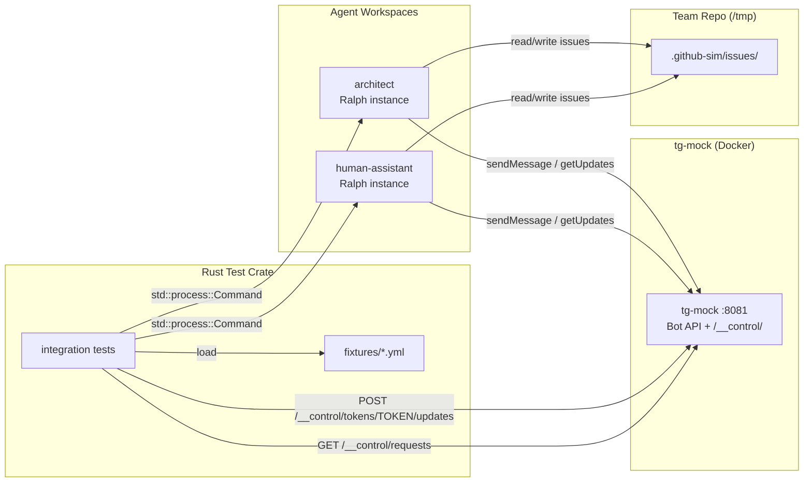

# Sprint 4 Design: Automated HIL Telegram Tests

> Automated end-to-end tests for the full M2 epic lifecycle with human-in-the-loop
> via a mock Telegram server. No real Telegram bots, no manual interaction.

## Overview

Sprint 4 replaces Sprint 3's unexecuted manual test plan with fully automated tests.
Rust integration tests drive both agents through the epic lifecycle by injecting
canned responses via [tg-mock](https://github.com/watzon/tg-mock)'s control API.
Response sequences are defined in YAML fixture files — test scenarios are data, not code.

**Important context:** Ralph's `telegram.api_url` / `RALPH_TELEGRAM_API_URL` feature
is freshly developed and untested. Sprint 4 is the first real validation.

## Architecture



### How It Works

1. **tg-mock** runs as a Docker container on port 8081 (started via `just test-server-up`).
   Implements the full Telegram Bot API. Each agent gets its own bot token.

2. **Fixture files** define test scenarios as YAML: initial epic state, a sequence of
   response rules (match on bot message content → inject reply), and expected outcomes.

3. **Rust integration tests** load a fixture, set up the team repo and workspaces via
   `std::process::Command` (calling `just` recipes), launch agents, then run a
   response loop:
   - Poll `GET /__control/requests?method=sendMessage&token=<TOKEN>` for new bot messages
   - Match against the fixture's response rules
   - Inject replies via `POST /__control/tokens/<TOKEN>/updates`
   - Poll issue files for expected status transitions
   - Assert final state (design doc content, story issues, lock cleanup, etc.)

4. **Just tasks** handle tg-mock lifecycle and provide convenience wrappers.

## Components

### `tests/hil/fixtures/*.yml` — Test Scenario Fixtures

Each fixture defines a complete test scenario:

```yaml
name: full-lifecycle
description: Epic traverses triage to done with all gates approved
initial_status: "status/po:triage"

responses:
  - match: "triage"
    reply: "Approved. Accept to backlog and activate."
  - match: "design"
    context: "review"
    reply: "Approved. Design looks good, proceed to planning."
  - match: "plan"
    context: "review"
    reply: "Approved. Story breakdown is acceptable."
  - match: "accept"
    reply: "Approved. Epic is complete."
  - match: ".*"
    reply: "Confirmed, proceed."

expectations:
  epic_status: "status/done"
  epic_state: closed
  design_doc_exists: true
  design_doc_contains:
    - "reconciler"       # project knowledge marker
    - "composition"      # member knowledge marker
  story_issues_created: true
  no_stale_locks: true
```

Rejection fixture example:

```yaml
name: design-rejection
description: Reject design once with feedback, approve on revision
initial_status: "status/po:triage"

responses:
  - match: "design"
    context: "review"
    reply: "Rejected. Missing error handling section."
    times: 1
  - match: "design"
    context: "review"
    reply: "Approved. Error handling addressed."
  - match: ".*"
    reply: "Approved, proceed."

expectations:
  epic_status: "status/done"
  rejection_comments: 1
```

The `times` field controls how many times a rule fires before falling through
to the next matching rule (similar to tg-mock's own scenario `times` field).
The `context` field narrows matches (e.g., only match "design" when it appears
in a review context, not in a status update).

### `tests/hil/` — Rust Test Crate

```
tests/hil/
├── Cargo.toml
├── fixtures/
│   ├── approve-all.yml
│   ├── reject-design-once.yml
│   ├── reject-plan-once.yml
│   ├── two-epics.yml
│   └── stale-lock.yml
└── src/
    ├── lib.rs            # Fixture loader, tg-mock client, test helpers
    ├── mock_client.rs    # Typed wrapper around tg-mock's /__control/ API
    ├── setup.rs          # Team repo setup, workspace creation, agent lifecycle
    └── tests/
        ├── lifecycle.rs
        ├── design_rejection.rs
        ├── plan_rejection.rs
        ├── push_conflict.rs
        └── crash_recovery.rs
```

**Dependencies:** `reqwest` (HTTP client for tg-mock control API), `serde` + `serde_yaml`
(fixture loading), `tokio` (async runtime), `regex` (message matching).

**Key modules:**

- `mock_client.rs` — typed wrapper around tg-mock's control API:
  - `get_requests(token, method) -> Vec<Request>` — poll request inspector
  - `inject_update(token, text) -> Result` — inject a user message
  - `clear_requests() -> Result` — reset between tests
  - `clear_scenarios() -> Result`

- `setup.rs` — test environment helpers using `std::process::Command`:
  - `setup_team_repo(path) -> Result` — `just init` + deploy fixtures + add members
  - `create_workspace(team_repo, member, project_repo) -> PathBuf`
  - `start_agent(workspace, token) -> Child` — launch Ralph in background
  - `stop_agent(child) -> Result`
  - `wait_for_status(issue_path, expected, timeout) -> Result`
  - `read_issue_status(path) -> String`
  - `assert_no_locks(github_sim_dir) -> Result`

- `lib.rs` — fixture loading and the response loop:
  - `load_fixture(path) -> Fixture`
  - `run_scenario(fixture, ha_token, arch_token) -> TestResult` — the main driver
    that polls tg-mock for bot messages, matches against fixture rules, injects replies

### Justfile Recipes

```just
# Start tg-mock Docker container for HIL tests
test-server-up:
    docker run -d --name botminter-tg-mock -p 8081:8081 \
        ghcr.io/watzon/tg-mock --faker-seed 42
    @echo "Waiting for tg-mock..."
    @for i in $(seq 1 30); do \
        curl -sf http://localhost:8081/__control/requests >/dev/null 2>&1 && break; \
        sleep 0.5; \
    done
    @echo "tg-mock ready on :8081"

# Stop tg-mock Docker container
test-server-down:
    docker rm -f botminter-tg-mock 2>/dev/null || true

# Run HIL integration tests (requires tg-mock running)
test-hil: test-server-up
    cd tests/hil && cargo test -- --test-threads=1
    just test-server-down
```

## Error Handling

- **Agent timeout:** Tests set bounded `max_iterations` and `max_runtime_seconds`
  on agent ralph.yml. `wait_for_status` has a configurable timeout.
- **tg-mock unavailable:** `test-server-up` health-checks before tests run.
- **api_url bugs:** Step 1 validates Ralph→tg-mock round-trip before building on it.
- **Test isolation:** `clear_requests()` and `clear_scenarios()` between tests.
  Each test uses its own team repo + workspaces in `/tmp/`.

## Acceptance Criteria

- **Given** tg-mock running and `approve-all.yml` fixture, **when** `just test-hil`
  runs, **then** the lifecycle test passes — epic triage→done, design doc has
  knowledge markers, story issues created, no stale locks.

- **Given** `reject-design-once.yml` fixture, **when** the test runs, **then**
  the architect revises after rejection and the epic completes.

- **Given** `reject-plan-once.yml` fixture, **when** the test runs, **then**
  the architect revises the breakdown and the epic completes.

- **Given** `two-epics.yml` fixture, **when** both agents process two epics
  simultaneously, **then** both reach done with no data loss.

- **Given** `stale-lock.yml` fixture (pre-created stale lock), **when** agents
  start, **then** the lock is cleaned and the epic processes normally.

- **Given** all tests pass, **then** zero real Telegram API calls were made.
