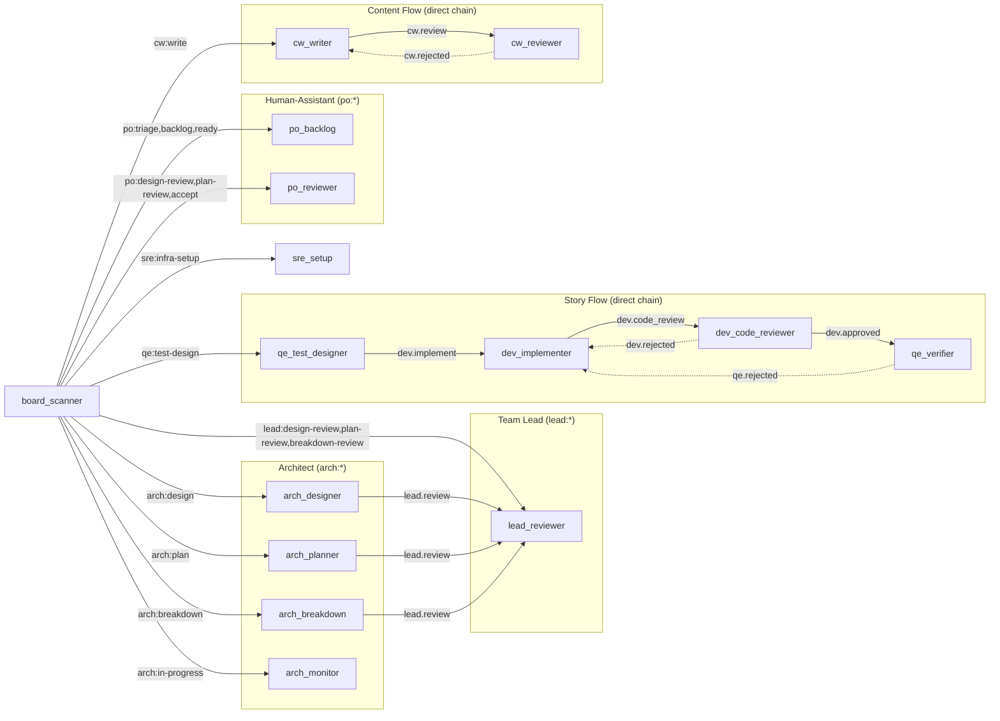
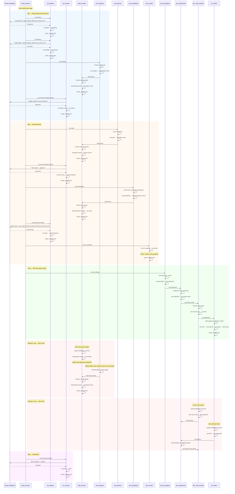

# Design — Sprint 5: Compact Single-Member Profile

> Standalone design document for the `compact` profile.
> Inputs: [requirements.md](requirements.md), [rough-idea.md](rough-idea.md)
> Parent: M2 [design.md](../design.md)

---

## 1. Overview

The `compact` profile produces a single-member team repo where one Ralph instance wears all hats — human-assistant, architect, dev, SRE, QE, and content writer. It targets small tasks that don't need multi-agent coordination overhead.

The profile reuses the same generator model (`just init --profile=compact`), the same `.github-sim/` coordination fabric, and the same status label conventions as `rh-scrum`. The key difference: one agent self-transitions through the entire lifecycle instead of multiple agents handing off via status labels.

---

## 2. Detailed Requirements

From [requirements.md](requirements.md):

- **Single Ralph instance** with 15 hats covering 7 roles (PO, team lead, architect, dev, QE, SRE, content writer)
- **Same `.github-sim/` model** — status labels, issue format, comment format
- **Same status label scheme** — `status/<role>:<phase>`, agent self-transitions
- **Unified board scanner** — watches all `status/*` labels
- **Supervised mode** — human gates major decisions only (design approval, plan approval, final acceptance); intermediate transitions auto-advance
- **No write-locks** — single member, no contention
- **Same fork chain** — agent-cloned repo, all hats share it
- **PROCESS.md** — copied and adapted from `rh-scrum`
- **Scope:** profile skeleton + generator compatibility + synthetic validation

---

## 3. Architecture Overview

### 3.1 Profile Structure

```
skeletons/profiles/compact/
├── PROCESS.md                          # Adapted from rh-scrum (no write-locks, story statuses added)
├── CLAUDE.md                           # Team context for single-member model
├── knowledge/
│   ├── commit-convention.md            # Copied from rh-scrum
│   ├── communication-protocols.md      # Adapted (single-member, supervised mode)
│   └── pr-standards.md                 # Copied from rh-scrum
├── invariants/
│   ├── code-review-required.md         # Adapted (self-review via dev_code_reviewer hat)
│   └── test-coverage.md               # Copied from rh-scrum
├── agent/
│   ├── skills/
│   │   ├── board/SKILL.md             # Copied from rh-scrum
│   │   └── create-epic/SKILL.md       # Copied from rh-scrum
│   └── agents/                         # Empty (.gitkeep)
└── members/
    └── superman/                     # Single member skeleton
        ├── ralph.yml                   # 15 hats, persistent loop
        ├── PROMPT.md                   # All-role instructions, supervised mode
        ├── CLAUDE.md                   # Single-member context
        ├── knowledge/                  # Empty (.gitkeep)
        ├── invariants/
        │   └── design-quality.md       # From rh-scrum architect
        ├── agent/
        │   ├── skills/                 # Empty (.gitkeep)
        │   └── agents/                 # Empty (.gitkeep)
        ├── hats/
        │   ├── arch_designer/knowledge/     # Empty (.gitkeep)
        │   ├── arch_planner/knowledge/      # Empty (.gitkeep)
        │   ├── dev_implementer/knowledge/  # Empty (.gitkeep)
        │   ├── qe_test_designer/knowledge/# Empty (.gitkeep)
        │   └── ...                     # One per non-trivial hat
        └── projects/                   # Empty (.gitkeep)
```

### 3.2 Workspace Model

Same as `rh-scrum` — project repo clone with `.botminter/` submodule:

```
project-repo-superman/               # Project repo clone (agent CWD)
  .botminter/                           # Team repo clone
    .github-sim/issues/                 # Board
    knowledge/, invariants/             # Team-level
    team/superman/                    # Single member config
    projects/<project>/                 # Project-specific
  PROMPT.md → .botminter/team/superman/PROMPT.md
  CLAUDE.md → .botminter/team/superman/CLAUDE.md
  ralph.yml                             # Copied
  poll-log.txt                          # Board scanner audit log
```

### 3.3 Event Flow



**Three dispatch patterns:**
- **Board-driven:** Board scanner picks up new work and dispatches to the first hat in a workflow. Hats publish `LOOP_COMPLETE` (via instructions, not the `publishes` config list) when done — the persistent loop restarts via `board.scan` and the board scanner re-scans.
- **Direct chain (work → review):** Within tight workflows (epic work hats → lead_reviewer, story TDD flow, content flow), hats trigger the next hat directly via Ralph events. No board scan overhead. Status labels still updated in `.github-sim/` for audit trail.
- **Decoupled review:** Review hats emit generic `.approved`/`.rejected` events. They do not encode return destinations. Rejection routing depends on whether the event is unique: if only one work hat subscribes (e.g., `dev.rejected` → `dev_implementer`), direct routing is safe. If multiple work hats share the same reviewer (e.g., three arch hats share `lead_reviewer`), the rejection event goes unmatched — the hatless Ralph orchestrator examines the context, determines which work hat was rejected, and routes directly back to it. Per design-principles Section 2: each event MUST appear in exactly one hat's triggers.

### 3.4 Lifecycle Sequence — Full Epic with One Story

> **Diagram convention:** Arrows labeled `LOOP_COMPLETE` represent: hat publishes LOOP_COMPLETE → persistent loop restarts → `board.scan` → board scanner re-scans and dispatches. Unmatched events (e.g., `lead.rejected`) are handled by the hatless Ralph orchestrator, which routes directly back to the originating work hat.



**Key observations:**
- Every work artifact is reviewed before reaching the next stage: arch_designer/arch_planner/arch_breakdown → lead_reviewer → human; dev_implementer → dev_code_reviewer → qe_verifier
- **Review hats are decoupled:** they emit `.approved`/`.rejected` events without encoding return destinations. When a rejection event is unique to one work hat (e.g., `dev.rejected` → only `dev_implementer`), direct routing is safe. When multiple work hats share a reviewer (e.g., `lead.rejected`), the event goes unmatched — the hatless Ralph orchestrator examines context and routes directly back to the originating work hat.
- The human drives the early epic phase — the po_backlog presents board state and asks "what do you want to do?"
- lead_reviewer gates ensure the human only sees quality-reviewed artifacts
- The entire story TDD flow (green section) runs without human interaction

---

## 4. Components and Interfaces

### 4.1 Hat Inventory

| # | Hat | Role Origin | Triggers | Publishes |
|---|-----|-------------|----------|-----------|
| 1 | `board_scanner` | unified | `board.scan` | all dispatch events |
| 2 | `po_backlog` | human-assistant | `po.backlog` | — |
| 3 | `po_reviewer` | human-assistant | `po.review` | — |
| 4 | `lead_reviewer` | team lead | `lead.review` | `lead.approved`, `lead.rejected` |
| 5 | `arch_designer` | architect | `arch.design` | `lead.review` |
| 6 | `arch_planner` | architect | `arch.plan` | `lead.review` |
| 7 | `arch_breakdown` | architect | `arch.breakdown` | `lead.review` |
| 8 | `arch_monitor` | architect | `arch.in_progress` | — |
| 9 | `qe_test_designer` | QE | `qe.test_design` | `dev.implement` |
| 10 | `dev_implementer` | dev | `dev.implement`, `dev.rejected`, `qe.rejected` | `dev.code_review` |
| 11 | `dev_code_reviewer` | dev | `dev.code_review` | `dev.approved`, `dev.rejected` |
| 12 | `qe_verifier` | QE | `dev.approved`, `qe.verify` | `qe.approved`, `qe.rejected` |
| 13 | `sre_setup` | SRE | `sre.setup` | — |
| 14 | `cw_writer` | content writer | `cw.write`, `cw.rejected` | `cw.review` |
| 15 | `cw_reviewer` | content writer | `cw.review` | `cw.approved`, `cw.rejected` |

**`LOOP_COMPLETE` convention:** Hats that show `—` in the Publishes column emit `LOOP_COMPLETE` via their instructions block, not via the `publishes` config list. Per design-principles Section 2: `LOOP_COMPLETE` MUST NOT appear in a hat's `publishes` list — only in instructions and `default_publishes`.

**Event uniqueness constraint:** Each event MUST appear in exactly one hat's `triggers` list. Duplicate subscriptions cause ambiguous routing and unreachable hats. This is a Ralph runtime constraint (validated in routing experiment — see `specs/design-principles.md` Section 2).

**Rejection routing via hatless Ralph orchestrator:** Review hats (lead_reviewer, dev_code_reviewer, qe_verifier, cw_reviewer) only emit `.approved` / `.rejected` events. They do not encode return destinations. When a review hat publishes a rejection event (e.g., `lead.rejected`) and no hat subscribes, the hatless Ralph orchestrator examines the context — it determines which work hat's output was rejected and routes directly back to that hat. No board scanner re-scan needed for rejections.

**Note:** `dev.rejected` and `qe.rejected` are safe because only `dev_implementer` subscribes to them (no ambiguity — one reviewer, one work hat). `lead.rejected` goes unmatched because three arch hats share the same reviewer and subscribing any of them would violate event uniqueness. The hatless Ralph orchestrator handles routing `lead.rejected` back to the correct arch hat.

**Auto-advance statuses (no hat dispatch):**
- `status/arch:sign-off` → auto-advance to `po:merge` (architect sign-off is implicit since same agent designed it)
- `status/po:merge` → auto-advance to `done` (no separate merge gate needed for stories)

### 4.2 Supervised Mode Gates

Only these transitions require human approval via HIL (po_reviewer hat):

| Gate | Status | What's Presented |
|------|--------|-----------------|
| Design approval | `po:design-review` | Design doc summary |
| Plan approval | `po:plan-review` | Story breakdown |
| Final acceptance | `po:accept` | Completed epic summary |

All other transitions auto-advance — the board scanner dispatches and the hat transitions without HIL.

### 4.3 Board Scanner — Unified Dispatch

The board scanner merges the `rh-scrum` architect and human-assistant scanners. It watches ALL `status/*` labels and dispatches via a single priority-ordered table:

**Epic priority (highest first):**
1. `po:triage` → `po.backlog`
2. `po:design-review` → `po.review`
3. `po:plan-review` → `po.review`
4. `po:accept` → `po.review`
5. `lead:design-review` → `lead.review`
6. `lead:plan-review` → `lead.review`
7. `lead:breakdown-review` → `lead.review`
8. `arch:breakdown` → `arch.breakdown`
9. `arch:plan` → `arch.plan`
10. `arch:design` → `arch.design`
11. `po:backlog` → `po.backlog`
12. `po:ready` → `po.backlog`
13. `arch:in-progress` → `arch.in_progress`

**Story priority (highest first):**
1. `qe:test-design` → `qe.test_design`
2. `dev:implement` → `dev.implement`
3. `qe:verify` → `qe.verify`
4. `dev:code-review` → `dev.code_review`
5. `sre:infra-setup` → `sre.setup`

**Content priority:**
1. `cw:write` → `cw.write`
2. `cw:review` → `cw.review`

**Dispatch rule:** Process one item at a time. Epics before stories. Within each category, follow priority order.

### 4.4 New Hats

#### lead_reviewer (team lead)

Triggered via `lead.review` event (from arch_designer, arch_planner, or arch_breakdown — direct chain). Reviews work artifacts before they reach the human. Responsibilities:
- Read the current issue status to determine review type (`lead:design-review`, `lead:plan-review`, `lead:breakdown-review`)
- Review the artifact for quality, completeness, and invariant compliance
- **If approved:** advance status to the next human gate (`po:design-review`, `po:plan-review`, or `po:ready`), publish `lead.approved`
- **If rejected:** append feedback comment, revert status to the work hat's input status (e.g., `arch:design`, `arch:plan`, or `arch:breakdown`), publish `lead.rejected`. No hat subscribes to `lead.rejected` — the hatless Ralph orchestrator examines the context, determines which arch hat's work was rejected, and routes directly back to that hat. The lead_reviewer does not encode return destinations.

Note: this is self-review (same agent produced the artifact). The value is the hat context switch — the lead_reviewer hat has a reviewer/lead mindset with different instructions than the producing hat, forcing a quality check before human review.

Knowledge paths: team, project, member (reviews artifacts from all scopes).

#### qe_test_designer (QE)

Triggered when a story reaches `status/qe:test-design`. Responsibilities:
- Read the story's acceptance criteria (Given-When-Then from breakdown)
- Read the parent epic's design doc for architectural context
- For bugs: reproduce the issue first, document reproduction steps
- Produce a test plan as a comment on the story issue
- Write test stubs/skeletons in the project repo if applicable
- Transition to `status/dev:implement`, publish `dev.implement` (direct chain to dev_implementer)

Knowledge paths: team, project, member, hat-specific (`hats/qe_test_designer/knowledge/`).

#### dev_implementer (dev)

Triggered via `dev.implement` (from qe_test_designer), `dev.rejected` (from dev_code_reviewer), or `qe.rejected` (from qe_verifier). Responsibilities:
- Read the story issue, test plan comment, and parent epic design
- **Rejection-awareness:** Check for feedback comments from `@dev` (code reviewer) or `@qe` (QE verifier). If present, address all feedback before proceeding.
- Implement the story in the project repo
- Ensure tests pass (run test suite)
- Create a branch, commit changes
- Transition to `status/dev:code-review`, publish `dev.code_review` (direct chain to dev_code_reviewer)

Knowledge paths: team, project, member, hat-specific (`hats/dev_implementer/knowledge/`).

#### dev_code_reviewer (dev)

Triggered via `dev.code_review` event (from dev_implementer). Responsibilities:
- Review the implementation for code quality, patterns, standards
- Check compliance with project and team invariants
- **If approved:** transition to `status/qe:verify`, publish `dev.approved`
- **If rejected:** append feedback comment explaining issues, transition back to `status/dev:implement`, publish `dev.rejected`. Ralph routes the rejection to the dev_implementer via its `triggers` configuration.

Note: this is self-review (same agent wrote the code). The value is the hat context switch — the dev_code_reviewer hat has different instructions and invariants than the dev_implementer hat, forcing a second pass with a reviewer mindset.

#### qe_verifier (QE)

Triggered via `dev.approved` event (from dev_code_reviewer direct chain) or `qe.verify` (from board scanner recovery). Final quality gate before sign-off. Responsibilities:
- Verify the implementation against acceptance criteria
- Run tests, check coverage
- **If verification passes:** transition to `status/arch:sign-off` → auto-advance to `done`, publish `qe.approved`
- **If verification fails:** append feedback comment explaining what failed, transition back to `status/dev:implement`, publish `qe.rejected`. Ralph routes the rejection to the dev_implementer via its `triggers` configuration.

#### sre_setup (SRE)

Triggered on-demand when a story or epic needs infrastructure. Responsibilities:
- Set up test clusters, configure E2E test environments
- Document infrastructure state in a comment on the requesting issue
- Return the issue to its previous status (SRE is a service hat, not a lifecycle hat)

#### cw_writer / cw_reviewer (content writer)

For documentation stories (`kind/docs` label). Writer produces docs, cw_reviewer reviews them. Same decoupled pattern — cw_writer triggers on `cw.write` and `cw.rejected`, cw_reviewer publishes `cw.approved` or `cw.rejected`. Writer doesn't know who reviews; reviewer doesn't know who wrote. On approval, cw_reviewer transitions the story to `status/po:merge`, which auto-advances to `done` (same terminal path as regular stories — Section 4.5).

### 4.5 Auto-Advance Statuses

Some statuses don't need a dedicated hat because they're trivially handled by the board scanner:

- `status/arch:sign-off` → Auto-advance to `status/po:merge`. In the compact profile, the same agent that designed and planned the epic is the one signing off — the design review already happened at the human gate. The board scanner detects this status and advances it.
- `status/po:merge` → Auto-advance to `status/done` for stories. The compact profile doesn't have a separate merge gate for stories — the code review hat already approved.
- `status/cw:review` (when `cw_reviewer` approves) → `status/po:merge` → auto-advance to `status/done`. Content stories (`kind/docs`) follow the same terminal path as regular stories through `po:merge`.

---

## 5. Data Models

### 5.1 Issue Format

Identical to `rh-scrum` PROCESS.md. No changes to frontmatter schema.

### 5.2 New Labels

Added to the compact PROCESS.md:

**Kind labels:**
- `kind/story` (existing)
- `kind/epic` (existing)
- `kind/docs` — documentation story, routed to cw_writer/cw_reviewer hats

**Team lead status labels (new):**
- `status/lead:design-review`
- `status/lead:plan-review`
- `status/lead:breakdown-review`

**Story status labels (new):**
- `status/qe:test-design`
- `status/dev:implement`
- `status/dev:code-review`
- `status/qe:verify`
- `status/arch:sign-off`
- `status/po:merge`

**SRE status labels (new):**
- `status/sre:infra-setup`

**Content cw_writer status labels (new):**
- `status/cw:write`
- `status/cw:review`

### 5.3 Comment Format

Same as `rh-scrum`: `### @<role> — <ISO-timestamp>`. In the compact profile, the role in the comment header reflects which hat is acting (e.g., `@architect`, `@dev`, `@qe`) even though it's the same agent. This preserves audit trail clarity and compatibility with `rh-scrum`.

---

## 6. Error Handling

### 6.1 Failed Processing

Same pattern as `rh-scrum`: append `Processing failed: <reason>. Attempt N/3.` comment. Board scanner tracks retry count and escalates after 3 failures by adding `status/error` and notifying the human.

### 6.2 Push Conflicts

Not applicable — single member, no concurrent pushes to `.botminter/`.

### 6.3 Stale Locks

Not applicable — no write-locks in the compact profile.

### 6.4 Hat Failure Recovery

If a hat fails mid-work (e.g., Claude context limit), the issue stays at its current status. The board scanner re-dispatches on the next cycle. The failed processing counter prevents infinite loops.

---

## 7. Acceptance Criteria

### AC1: Profile Generation
- **Given** the `compact` profile exists in `skeletons/profiles/compact/`
- **When** `just init --repo=/tmp/test-compact --profile=compact` is run
- **Then** the generated team repo contains PROCESS.md, CLAUDE.md, knowledge/, invariants/, `.github-sim/`, and `.team-template/` with the `superman` member skeleton

### AC2: Member Addition
- **Given** a generated compact team repo
- **When** `just add-member superman` is run
- **Then** `team/superman/` contains ralph.yml (15 hats), PROMPT.md, CLAUDE.md, invariants/, knowledge/, hats/

### AC3: Workspace Creation and Launch
- **Given** a compact team repo with `superman` member added
- **When** `just create-workspace superman <project-url>` and `just launch superman --telegram-bot-token <token>` are run
- **Then** workspace is created with `.botminter/` submodule, surfaced files, and Ralph starts with the unified board scanner

### AC4: Epic Lifecycle — Design Phase
- **Given** a running `superman` agent and a seeded epic at `status/po:triage`
- **When** the agent processes the epic through the design phase
- **Then** the epic traverses: `po:triage → po:backlog → arch:design → lead:design-review → po:design-review` with lead_reviewer reviewing before human gate

### AC5: Epic Lifecycle — Planning Phase
- **Given** design approved by human (epic at `status/arch:plan`)
- **When** the agent processes planning and breakdown
- **Then** the epic traverses: `arch:plan → lead:plan-review → po:plan-review → arch:breakdown → lead:breakdown-review → po:ready` with lead_reviewer reviewing before each human gate, and story issues are created

### AC6: Story Lifecycle — TDD Flow
- **Given** stories created from breakdown at `status/qe:test-design`
- **When** the agent processes a story through the TDD flow
- **Then** the story traverses: `qe:test-design → dev:implement → dev:code-review → qe:verify → arch:sign-off → po:merge → done` with code review before QE verification, and auto-advance at sign-off and merge

### AC7: Knowledge Propagation
- **Given** knowledge files at team, project, and member levels
- **When** the arch_designer hat produces a design doc
- **Then** the design doc reflects knowledge from all applicable scopes

### AC8: Supervised Mode
- **Given** the agent is in supervised mode
- **When** the epic reaches `po:design-review`, `po:plan-review`, or `po:accept`
- **Then** the po_reviewer hat presents the artifact to the human via Telegram and waits for approval/rejection
- **And** all other transitions auto-advance without HIL

---

## 8. Testing Strategy

### 8.1 Synthetic Validation

Reuse the fixture pattern from M2 sprints:
- Seed a synthetic epic at `status/po:triage`
- Populate knowledge/invariant files with test markers
- Run the `superman` agent
- Verify the epic completes the full lifecycle
- Verify stories are created and complete the TDD flow
- Verify knowledge markers appear in design output
- Verify supervised mode gates fire at the correct points

### 8.2 Fixture Design

Adapt M2 Sprint 2's `deploy.sh` pattern:
- Synthetic epic with title, description, acceptance criteria
- Team knowledge with a detectable marker (e.g., commit convention reference)
- Project knowledge with a detectable marker (e.g., reconciler pattern)
- Member knowledge with a detectable marker
- Project invariants that the design must satisfy

### 8.3 What to Validate

1. **Profile generation:** `just init --profile=compact` produces correct structure
2. **Full epic lifecycle:** `po:triage` → `done` with all intermediate statuses
3. **Story lifecycle:** TDD flow end-to-end
4. **Supervised mode:** Human gates fire only at major decision points
5. **Knowledge propagation:** All scopes consumed by arch_designer hat
6. **Auto-advance:** `arch:sign-off` and `po:merge` advance without hat dispatch
7. **Comment audit trail:** Comments use correct role headers despite single agent

---

## 9. Appendices

### 9.1 Differences from `rh-scrum`

| Aspect | `rh-scrum` | `compact` |
|--------|-----------|-----------|
| Members | Multiple (architect, human-assistant, ...) | Single (`superman`) |
| Board scanner | Per-member, watches own role labels | Unified, watches all labels |
| Write-locks | Required (concurrent agents) | Skipped (single agent) |
| HIL mode | Training (all gates) | Supervised (major gates only) |
| Telegram bots | One per member | One total |
| Workspace count | One per member | One total |
| Status labels | Same scheme | Same scheme + story/SRE/CW statuses |
| PROCESS.md | Multi-agent coordination | Single-agent self-transition |

### 9.2 What's Reused Verbatim from `rh-scrum`

- Generator skeleton (Justfile `init`, `add-member`, `create-workspace`, `launch`)
- `.github-sim/` structure and conventions
- Issue frontmatter format
- Comment format (`### @<role> — <ISO-timestamp>`)
- Knowledge/invariant recursive scoping model
- Skills (`board`, `create-epic`)
- `commit-convention.md`, `pr-standards.md`
- `test-coverage.md` invariant
- `design-quality.md` invariant
- arch_designer, arch_planner, arch_breakdown hat instruction patterns
- po_backlog, po_reviewer hat instruction patterns

### 9.3 What's New

- Team lead review gate: `lead_reviewer` hat reviews arch_designer/arch_planner/arch_breakdown output before human review
- Story lifecycle statuses (`qe:*`, `dev:*`, `sre:*`, `cw:*`) and team lead statuses (`lead:*`)
- 8 new hats: `lead_reviewer`, `qe_test_designer`, `dev_implementer`, `dev_code_reviewer`, `qe_verifier`, `sre_setup`, `cw_writer`, `cw_reviewer`
- Unified board scanner with combined dispatch table
- Auto-advance for `arch:sign-off` and `po:merge`
- `kind/docs` label for documentation stories
- Supervised mode as default (vs. training mode)

### 9.4 Open Questions

1. **Content writer scope:** Should the cw_writer hat also handle inline code documentation (comments, READMEs in the project repo), or only standalone documentation stories?
2. **SRE infra lifecycle:** How does the SRE hat know when infrastructure is no longer needed? Should there be a `sre:teardown` status?
3. **Self-review effectiveness:** The dev_code_reviewer hat reviews code written by the same agent. How effective is this in practice? M3 validation will inform whether this pattern needs adjustment.
