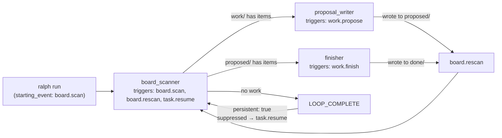

# Design — Spike: Autonomous Ralph Runner

> Standalone design for the autonomous loop spike.
> Inputs: [requirements.md](requirements.md), [rough-idea.md](rough-idea.md), [continuous-agent-design.md](research/continuous-agent-design.md).

---

## 1. Overview

**What:** A minimal working prototype that proves Ralph can run autonomously in a persistent loop — picking up work items from a directory, advancing them through multiple phases (propose → finish), self-clearing state between phases, and idling when no work remains.

**Why:** M2 requires team members (human-assistant, architect) to run indefinitely, pulling work from `.github-sim/` and advancing issues through multi-phase lifecycles (design → review → plan → breakdown). Before building that machinery, we need to validate: persistent mode, multi-hat dispatch based on item state, self-clearing scratchpad between phases, `LOOP_COMPLETE` as idle signal, and `task.resume` routing.

**End state:** A validated ralph.yml pattern and PROMPT.md template that M2 can adopt directly. Captured diagnostics proving each behavior works.

**Does NOT exercise:** `.github-sim/` format, Telegram/HIL, multi-agent coordination, write-locks, knowledge/invariant scoping.

---

## 2. Detailed Requirements

Consolidated from [requirements.md](requirements.md) (Q1–Q12) and informed by [continuous-agent-design.md](research/continuous-agent-design.md).

### 2.1 Loop Lifecycle

- `persistent: true` — LOOP_COMPLETE is suppressed, `task.resume` injected instead.
- Board scanner subscribes to `[board.scan, board.rescan, task.resume]`.
- Work hats (proposal_writer, finisher) publish `board.rescan` when done — routing back to the board scanner immediately for the next phase or item.
- Board scanner publishes `LOOP_COMPLETE` only when the board is empty (no items in `work/` or `proposed/`).
- Persistent mode converts LOOP_COMPLETE to `task.resume` → board scanner fires again after cooldown.
- The `## DONE` section (which instructs the agent to emit LOOP_COMPLETE) is **hat-gated** — only injected when no hat is active. Our hats handle event publishing explicitly in their instructions.

### 2.2 State Hygiene

- **Clear between items:** scratchpad (`.ralph/agent/scratchpad.md`) and tasks (`.ralph/agent/tasks.jsonl`).
- **Keep across items:** memories (`.ralph/agent/memories.md`).
- Self-clear is done by the board scanner hat when it detects a new work item to process.
- The agent overwrites the scratchpad file directly (no CLI command exists). Ralph reads it fresh from disk each iteration.
- **Orphaned events:** Events emitted before LOOP_COMPLETE in the same turn carry over to the next cycle alongside `task.resume`. The board scanner must not be confused by stale pending events — it should ignore any events that aren't its triggers and focus on scanning directories.
- **Open tasks carry over:** If a work hat leaves tasks open, they appear in `<ready-tasks>` for the next phase/item. The board scanner's self-clear (deleting `tasks.jsonl`) prevents this.

### 2.3 Observability

- Run with `RALPH_DIAGNOSTICS=1` and `-v`.
- Capture scratchpad, task state, and events at work-item boundaries.
- Preserve `.ralph/` directory post-run.

### 2.4 Known Tradeoffs (from research)

- **`cooldown_delay_seconds` is global.** It applies to ALL hat transitions, not just idle scans. A 30s delay between board scanner → worker is acceptable for the spike but would be wasteful in M2. The spike should document the observed impact.
- **No per-issue cost isolation.** A single `max_cost_usd` covers the entire run. Accepted for the spike.
- **Error propagation.** A bad state on item N persists into item N+1. The self-clear mitigates this for scratchpad/tasks, but other state (e.g., files left in unexpected places) could carry over. Accepted for the spike.

---

## 3. Architecture Overview

### 3.1 Event Flow



### 3.2 Work Item Model

Directories represent item state. Items advance through phases:

```
work/ → proposed/ → done/
```

```
specs/milestone-1.5-autonomous-ralph/artifacts/
├── work/                    # Phase 1: pending items (need proposals)
│   ├── item-1.txt           # "Summarize the benefits of TDD"
│   ├── item-2.txt           # "List 3 design patterns for Go"
│   └── item-3.txt           # "Explain what a reconciler pattern is"
├── proposed/                # Phase 2: proposals awaiting finalization
│   └── (populated by proposal_writer)
├── done/                    # Completed: final results
│   └── (populated by finisher)
├── ralph.yml                # Event loop config
├── PROMPT.md                # Reusable role identity
├── poll-log.txt             # Board scanner log (created at runtime)
└── .ralph/                  # Runtime state (created by Ralph)
    ├── agent/
    │   ├── scratchpad.md    # Cleared between phases
    │   ├── tasks.jsonl      # Cleared between phases
    │   └── memories.md      # Persists across all phases and items
    ├── diagnostics/         # Captured with RALPH_DIAGNOSTICS=1
    └── events-*.jsonl       # Event history
```

The prototype lives permanently in-repo. Runtime state (`.ralph/`, `done/`, `proposed/`, `poll-log.txt`) is generated during the spike run and preserved as artifacts alongside the source files (`ralph.yml`, `PROMPT.md`, `work/`). To re-run the spike, restore the `work/` items and delete runtime state.

### 3.3 Self-Clear Sequence

When the board scanner dispatches to any work hat (proposal_writer or finisher):

1. Overwrite `.ralph/agent/scratchpad.md` with: `# Phase: <propose|finish> — <item-name>`
2. Delete `.ralph/agent/tasks.jsonl` if it exists.
3. Publish the appropriate event (`work.propose` or `work.finish`) with the filename as context.

Self-clear happens between **phases**, not just between items. This mirrors M2 where each hat activation (designer, planner, breakdown executor) starts with clean context.

---

## 4. Components

### 4.1 ralph.yml

```yaml
event_loop:
  prompt_file: PROMPT.md
  completion_promise: LOOP_COMPLETE
  max_iterations: 100
  max_runtime_seconds: 3600
  cooldown_delay_seconds: 30
  starting_event: board.scan
  persistent: true

cli:
  backend: claude

hats:
  board_scanner:
    name: Board Scanner
    description: Scans work/ and proposed/ for items, self-clears state, dispatches to the appropriate work hat.
    triggers:
      - board.scan
      - board.rescan
      - task.resume
    publishes:
      - work.propose
      - work.finish
      - LOOP_COMPLETE
    default_publishes: LOOP_COMPLETE
    instructions: |
      ## Board Scanner

      Scan for work items and dispatch them to the appropriate hat.

      ### Context
      You may see stale pending events from a previous work cycle
      alongside your trigger event. Ignore them — focus only on
      scanning the directories below.

      ### Priority order:

      1. List files in `work/` directory.
         - If files exist, pick the first one alphabetically.
         - Self-clear state (see below).
         - Publish `work.propose` with the filename as context.
         - STOP.

      2. If `work/` is empty, list files in `proposed/` directory.
         - If files exist, pick the first one alphabetically.
         - Self-clear state (see below).
         - Publish `work.finish` with the filename as context.
         - STOP.

      3. If both directories are empty → publish `LOOP_COMPLETE`.
         Persistent mode will keep the loop alive and retry later.

      ### Self-clear (before every dispatch):
      - Overwrite `.ralph/agent/scratchpad.md` with:
        ```
        # Phase: <propose|finish> — <filename>
        Starting fresh.
        ```
      - Delete `.ralph/agent/tasks.jsonl` if it exists.

      ### Logging:
      Append to `poll-log.txt`:
      ```
      <ISO-8601-UTC> — board.scan — START
      <ISO-8601-UTC> — board.scan — dispatching: work.propose <filename> | work.finish <filename> | idle (no work)
      <ISO-8601-UTC> — board.scan — END
      ```

      ### Rules
      - ALWAYS clear scratchpad and tasks before dispatching.
      - Dispatch ONE item per cycle.
      - Check `work/` before `proposed/` (priority order).
      - IGNORE any pending events that are not your triggers.

  proposal_writer:
    name: Proposal Writer
    description: Reads a work item and writes a proposal for it.
    triggers:
      - work.propose
    publishes:
      - board.rescan
    default_publishes: board.rescan
    instructions: |
      ## Proposal Writer

      Create a proposal for the work item.

      ### Workflow:

      1. Read the work item file from `work/<filename>`.
      2. The file contains a task description. Write a short proposal
         (2-3 sentences) outlining how you would approach it.
      3. Write the proposal to `proposed/<filename>`.
      4. Delete the original file from `work/<filename>`.
      5. Update the scratchpad:
         ```
         ## Proposed
         - Item: <filename>
         - Proposal written to: proposed/<filename>
         ```
      6. Publish `board.rescan`.

      ### Rules
      - Do NOT scan for more work — that's the board scanner's job.
      - Do NOT modify files outside `work/` and `proposed/`.
      - ALWAYS delete the source file after writing the proposal.
      - NEVER publish LOOP_COMPLETE.

  finisher:
    name: Finisher
    description: Reads a proposal and produces the final result.
    triggers:
      - work.finish
    publishes:
      - board.rescan
    default_publishes: board.rescan
    instructions: |
      ## Finisher

      Produce the final result from a proposal.

      ### Workflow:

      1. Read the proposal from `proposed/<filename>`.
      2. Based on the proposal, produce the final result
         (3-5 sentences — the actual content, not a proposal).
      3. Write the result to `done/<filename>`.
      4. Delete the proposal from `proposed/<filename>`.
      5. Update the scratchpad:
         ```
         ## Finished
         - Item: <filename>
         - Result written to: done/<filename>
         ```
      6. Publish `board.rescan`.

      ### Rules
      - Do NOT scan for more work — that's the board scanner's job.
      - Do NOT modify files outside `proposed/` and `done/`.
      - ALWAYS delete the source file after writing the result.
      - NEVER publish LOOP_COMPLETE.

tasks:
  enabled: true

memories:
  enabled: true
  inject: auto
  budget: 2000

RObot:
  enabled: false
```

### 4.2 PROMPT.md

```markdown
# Autonomous Worker

You are an autonomous worker agent running in a persistent loop.
Your job is to process work items through a two-phase pipeline:
propose, then finish.

## How You Work

You are a pull-based agent. You scan for work, dispatch it to
the appropriate phase hat, and repeat. Each phase is a separate
hat activation with clean state.

## Workspace

- `work/` — pending items needing proposals (phase 1 input)
- `proposed/` — proposals awaiting finalization (phase 2 input)
- `done/` — completed results (final output)
- `poll-log.txt` — scan log (board scanner appends to this)

## Item Lifecycle

1. Item starts in `work/` (plain text task description)
2. Proposal writer reads it, writes a proposal to `proposed/`, deletes from `work/`
3. Finisher reads the proposal, writes the final result to `done/`, deletes from `proposed/`

## State Management

Between phases, your scratchpad and tasks are cleared so each
hat starts fresh. Your memories persist — use them for learnings
that apply across items and phases.

## Constraints

- Process ONE item per hat activation.
- Only the board scanner publishes LOOP_COMPLETE (when no work exists).
- Work hats publish board.rescan to return control to the scanner.
```

### 4.3 Work Items

Three plain text files with trivial tasks. Each will traverse two phases (propose → finish):

**`work/item-1.txt`:**
```
Summarize the benefits of test-driven development in 3 bullet points.
```

**`work/item-2.txt`:**
```
List 3 common design patterns used in Go projects and briefly describe each.
```

**`work/item-3.txt`:**
```
Explain what a reconciler pattern is in Kubernetes controllers in 2-3 sentences.
```

Also create the `proposed/` and `done/` directories (empty at start):

```bash
mkdir -p specs/milestone-1.5-autonomous-ralph/artifacts/{work,proposed,done}
```

---

## 5. Observability Plan

### 5.1 Launch Command

```bash
cd specs/milestone-1.5-autonomous-ralph/artifacts
RALPH_DIAGNOSTICS=1 ralph run -v --no-tui -P PROMPT.md 2>&1 | tee ralph-output.log
```

- `-P` (capital) specifies a prompt file (`-p` is inline text)
- `--no-tui` disables the interactive TUI (on by default)
- `-v` enables verbose output (tool results streamed)
- `RALPH_DIAGNOSTICS=1` enables structured diagnostics in `.ralph/diagnostics/`

### 5.2 What Ralph Captures Automatically

With `RALPH_DIAGNOSTICS=1`:

| File | Contents |
|------|----------|
| `.ralph/diagnostics/<ts>/agent-output.jsonl` | Agent text, tool calls, tool results, token counts |
| `.ralph/diagnostics/<ts>/orchestration.jsonl` | Hat selection, event publishing, termination decisions |
| `.ralph/diagnostics/<ts>/performance.jsonl` | Iteration duration, agent latency, token counts |
| `.ralph/diagnostics/<ts>/trace.jsonl` | Full structured tracing with iteration/hat context |
| `.ralph/diagnostics/logs/ralph-*.log` | Rotating log files |
| `.ralph/events-*.jsonl` | All events (board.scan, work.propose, work.finish, board.rescan, LOOP_COMPLETE, task.resume) |

### 5.3 What poll-log.txt Captures

The board scanner appends START/dispatch/END triplets:
```
2026-02-17T10:00:05Z — board.scan — START
2026-02-17T10:00:06Z — board.scan — dispatching: work.propose item-1.txt
2026-02-17T10:00:06Z — board.scan — END
...
2026-02-17T10:01:15Z — board.scan — START
2026-02-17T10:01:15Z — board.scan — dispatching: work.finish item-1.txt
2026-02-17T10:01:15Z — board.scan — END
...
2026-02-17T10:05:30Z — board.scan — START
2026-02-17T10:05:30Z — board.scan — idle (no work)
2026-02-17T10:05:30Z — board.scan — END
```

### 5.4 Artifact Preservation

Since the prototype runs in-repo at `specs/milestone-1.5-autonomous-ralph/artifacts/`, all runtime state is captured in place — no post-run copy step needed. After the run, the directory contains both the source files (ralph.yml, PROMPT.md, work items) and all generated artifacts (.ralph/, done/, poll-log.txt, ralph-output.log).

To re-run the spike from scratch:

```bash
cd specs/milestone-1.5-autonomous-ralph/artifacts

# Restore work items to initial state
git checkout -- work/
rm -rf proposed/* done/* .ralph/ poll-log.txt ralph-output.log
```

### 5.5 Verification Checks

After the run, verify each success criterion:

| # | Criterion | How to verify |
|---|-----------|---------------|
| 1 | Multi-phase processing | `proposed/` is empty and `done/` has 3 result files (items traversed both phases) |
| 2 | Two-hat dispatch | `orchestration.jsonl` shows both `proposal_writer` and `finisher` hat activations |
| 3 | Work hats publish board.rescan | `ralph events` shows `board.rescan` after each `work.propose` and `work.finish` |
| 4 | LOOP_COMPLETE only on idle | `ralph events` shows LOOP_COMPLETE only after all items are processed, not between phases |
| 5 | Persistent mode keeps alive | `ralph events` shows `task.resume` after LOOP_COMPLETE |
| 6 | Self-clear between phases | Diagnostics show scratchpad overwritten before each hat dispatch (proposal and finish phases) |
| 7 | No context pollution | Scratchpad at finisher start has no proposal_writer content from a different item |
| 8 | Idle on empty board | `poll-log.txt` shows "idle (no work)" entries after all items done |
| 9 | No crashes | Ralph process still running (or terminated cleanly via manual stop/max_iterations) |
| 10 | Memories persist | `.ralph/agent/memories.md` contains entries spanning multiple items/phases |

---

## 6. Error Handling

### 6.1 Fallback Exhaustion

Ralph terminates after 3 consecutive fallbacks (no hat matches). Mitigations:
- Board scanner has `default_publishes: LOOP_COMPLETE` — if it writes no events, Ralph injects LOOP_COMPLETE automatically (idle path).
- Proposal writer has `default_publishes: board.rescan` — same safety net.
- Finisher has `default_publishes: board.rescan` — same safety net.
- All hats cover all expected events in their triggers.

### 6.2 Self-Clear Failure

If the agent fails to clear the scratchpad (e.g., file write error), the next phase runs with stale context. This is detectable via the diagnostics — scratchpad content at iteration start shows stale content. Not catastrophic for the spike; document the failure mode.

### 6.3 Work Item Read/Write Failure

If a work hat can't read its input or write its output, it should log the error to scratchpad and emit `board.rescan` anyway (let the board scanner re-evaluate). The board scanner will find the same item again next cycle if the source wasn't deleted — creating an infinite retry. This is acceptable for the spike; M2 would need a skip/error mechanism.

---

## 7. Acceptance Criteria

### Multi-Phase Lifecycle
- **Given** Ralph starts with `persistent: true` and 3 work items in `work/`, **when** the run completes, **then** all 3 items are in `done/`, `work/` and `proposed/` are empty.
- **Given** a work item in `work/`, **when** the board scanner dispatches it, **then** the proposal_writer fires, writes to `proposed/`, and publishes `board.rescan`.
- **Given** a proposal in `proposed/`, **when** the board scanner dispatches it, **then** the finisher fires, writes to `done/`, and publishes `board.rescan`.

### Multi-Hat Dispatch
- **Given** items exist in both `work/` and `proposed/`, **when** the board scanner fires, **then** it prioritizes `work/` (phase 1 before phase 2).
- **Given** the proposal_writer publishes `board.rescan`, **when** the board scanner fires next, **then** it dispatches the appropriate hat based on what directories have items.

### LOOP_COMPLETE and Persistent Mode
- **Given** all items are in `done/`, **when** the board scanner fires, **then** it publishes LOOP_COMPLETE (not `board.rescan`).
- **Given** the board scanner publishes LOOP_COMPLETE, **when** persistent mode suppresses it, **then** `task.resume` is injected and the board scanner fires again after cooldown.

### State Hygiene
- **Given** the board scanner dispatches to any work hat, **when** it self-clears, **then** scratchpad is overwritten and tasks.jsonl is deleted before the event is published.
- **Given** the proposal_writer just processed item-1, **when** the finisher starts on item-1's proposal, **then** the scratchpad contains only finisher context (no proposal_writer content).

### Observability
- **Given** `RALPH_DIAGNOSTICS=1` is set, **when** the run completes, **then** `.ralph/diagnostics/` contains orchestration, agent-output, and trace JSONL files spanning all phases and items.
- **Given** the agent writes a memory during item 1, **when** item 3 is processed, **then** `.ralph/agent/memories.md` still contains the item-1 memory.

---

## Appendices

### A. Technology Choices

| Decision | Choice | Rationale |
|----------|--------|-----------|
| Loop mode | `persistent: true` | Suppresses LOOP_COMPLETE without external runner |
| State reset | Agent self-clear (file overwrite) | No CLI command exists; file overwrite works because Ralph reads from disk each iteration |
| Resume routing | Board scanner subscribes to `task.resume` | Hats support multiple triggers; clean routing without hatless Ralph involvement |
| Work items | Plain text files, directories as state | Decoupled from `.github-sim/`; directories model status transitions |
| Multi-phase | Two work hats (propose → finish) | Mirrors M2's multi-hat dispatch (design → review → plan → breakdown) |
| LOOP_COMPLETE | Only from board scanner on idle | Work hats publish `board.rescan` to stay in the active loop |
| Observability | `RALPH_DIAGNOSTICS=1` + `-v` + poll-log.txt | Comprehensive without custom tooling |

### B. How This Feeds Into M2

| Spike output | M2 usage |
|-------------|----------|
| `persistent: true` + `task.resume` trigger | Architect and human-assistant ralph.yml configs |
| Self-clear between phases | Board scanner hat instructions for both members |
| Multi-hat dispatch based on state | Board scanner checks status labels instead of directories; same routing pattern |
| Work hats → `board.rescan` (not LOOP_COMPLETE) | Designer/planner/etc. return to scanner after each phase |
| LOOP_COMPLETE only on idle | Board scanner signals idle when no issues match its status filters |
| `cooldown_delay_seconds` tuning | Only affects idle polling (LOOP_COMPLETE path); active work uses `board.rescan` (no cooldown) |
| Diagnostics capture pattern | M2 integration test observability |
| Orphaned event handling | Board scanner must ignore stale events from previous cycles |
| Hybrid batch model validated | Future: launch Ralph to process N issues, then terminate. Relaunch on demand. |

### C. Research References

- [continuous-agent-design.md](research/continuous-agent-design.md) — Full analysis of Proposal A (outer loop) vs Proposal B (persistent mode). We chose Proposal B with self-clear, accepting the tradeoffs. The report's Proposal A remains a valid fallback if persistent mode proves unreliable.
