# Design — `bm` CLI (Milestone 3)

> Standalone design for the `bm` CLI. Replaces Justfile-based tooling with a Rust CLI binary.
> Inputs: [rough-idea.md](rough-idea.md), [requirements.md](requirements.md), [UX.md](UX.md), [research/](research/).
>
> **Scope:** Replace every Justfile recipe with a `bm` command. Establish the versioned profile model (`botminter.yml` + `.schema/`). No daemon, no Claude-assisted features, no upgrade mechanism — M3 builds the foundation.

---

## 1. Overview

### What

A Rust CLI binary (`bm`) that is the single operator interface for managing agentic teams. It replaces two Justfiles (generator + team repo) and introduces a discoverable workzone, stored credentials, multi-team support, and a versioned profile model.

### Why

1. **Product surface** — The CLI *is* the product. Without it, botminter is "a bunch of text files and Justfiles" — not something you can publish or attract users with.
2. **Fragility** — Justfiles are editable and breakable. A binary with embedded profiles is a stable, versionable artifact.
3. **Upgrade foundation** — The versioned profile model (`botminter.yml` + `.schema/v1`) establishes the infrastructure for future `bm upgrade` without implementing it now.

### Core Concept: Workspace

A **workspace** is where a member runs. It is the combination of two things:

1. **Target Project** — the team's fork of the project repo, checked out at the member's branch. Every member has their own branch on the team's fork (e.g., the team's fork of the human's Kubernetes fork, on the `architect-bob` branch).
2. **BM (botminter augmentation)** — the team's botminter repo checked out under `.botminter/`, plus surfaced files (`PROMPT.md`, `CLAUDE.md`, `ralph.yml`, `.claude/`).

Ralph runs inside the workspace. It sees a normal project checkout augmented with botminter's process, knowledge, and configuration — all sourced from `.botminter/`.

### Key Architectural Decisions

| Decision | Choice | Rationale |
|---|---|---|
| Language | Rust | Aligns with Ralph ecosystem, single toolchain |
| Repo location | This repo (`botminter`), Cargo workspace at root | Monorepo — future crates (daemon, TUI) slot in |
| Profile storage | Embedded in binary via `include_dir` | Self-contained distribution; external sources deferred |
| State model | Git = source of truth; `~/.botminter/` = convenience index | Delete index → reconstruct from disk/GitHub |
| CLI framework | clap (derive) + cliclack | Noun-verb subcommands + polished wizard UX |
| Process management | Direct PID tracking, no daemon | `bm start` → `ralph run` as background process; `bm stop` → `ralph loops stop` |
| Provisioning vs. operations | Separate commands | `bm teams sync` provisions workspaces; `bm start` launches processes |
| Target user | Author and real teammates | Not external early adopters; polish over completeness |

---

## 2. Detailed Requirements

Consolidated from [requirements.md](requirements.md) (Q1–Q28).

### 2.1 Scope: What M3 Delivers

| Command | Replaces | Description |
|---|---|---|
| `bm init` | `just init` (generator) | Interactive wizard — creates team inside workzone |
| `bm hire <role> [--name <name>]` | `just add-member` | Copies role skeleton from embedded profile into team repo |
| `bm teams sync [--push]` | `just create-workspace` + `just sync` | Reconciles workspaces with team repo state; optional push to GitHub |
| `bm start [-t team]` | `just launch` | Launches Ralph for all hired members |
| `bm stop [-t team] [--force]` | *(none)* | Graceful stop via Ralph; force-kill via PID |
| `bm status [-t team]` | *(none)* | Per-member alive/dead + Ralph runtime info |
| `bm teams list` | *(none)* | Lists all registered teams |
| `bm members list [-t team]` | *(none)* | Lists hired members for a team |
| `bm roles list [-t team]` | *(none)* | Lists available roles from the team's profile |
| `bm profiles list` | *(none)* | Lists embedded profiles |
| `bm profiles describe <profile>` | *(none)* | Shows profile details (roles, labels, metadata) |
| `bm projects add <url> [-t team]` | *(none)* | Adds a project to the team |

### 2.2 Scope: What M3 Does NOT Deliver

- `bm wake` — signal idle member
- `bm knowledge` — Claude-assisted knowledge management
- `bm upgrade` — profile version migration
- `bm validate` — workspace health check
- `bm teams set-default` — change default team (manual config edit for now)
- `bm import` / `bm register` — re-register existing team repo
- Auto-restart on crash
- Laptop sleep recovery
- Daemon process

### 2.3 Invariants

- **Git is the source of truth.** `~/.botminter/` is a cache. Delete it → reconstruct from team repos on disk.
- **Deterministic only.** No LLM calls in M3. All operations are file/process/git operations.
- **Profiles are immutable at runtime.** Baked into the binary. `bm hire` extracts from embedded assets.
- **Schema coherence.** A team stays on a single schema version. Any command that reads or writes team repo content (`hire`, `teams sync`, `start`, `stop`, `status`) checks the team's `botminter.yml` `schema_version` against the embedded profile's schema version. Mismatch → error with `bm upgrade` suggestion. No mixing of schema versions within a team.
- **Provisioning and operations are separate.** `bm teams sync` provisions workspaces; `bm start` launches processes. No implicit workspace creation during start.
- **No auto-push.** Commands that modify the team repo commit locally. Pushing to GitHub is explicit via `bm teams sync --push`.
- **Team repo structure is unchanged** (minus Justfile). Same dirs, same conventions, same GitHub coordination model.

---

## 3. Repo Structure Changes

### 3.1 Skeleton Collapse

The two-layer model (`skeletons/team-repo/` + `skeletons/profiles/`) collapses into a single-layer model where each profile is fully self-contained.

**Before (current):**

```
skeletons/
├── team-repo/                     # generic skeleton (process-agnostic)
│   ├── Justfile                   # → REMOVED
│   ├── agent/skills/gh/SKILL.md   # → moves into each profile
│   ├── projects/.gitkeep          # → created by bm init
│   └── team/.gitkeep              # → created by bm init
└── profiles/
    ├── rh-scrum/
    └── compact/
```

**After:**

```
profiles/                          # at repo root (was skeletons/profiles/)
├── rh-scrum/
│   ├── botminter.yml              # NEW — profile metadata + labels
│   ├── .schema/
│   │   └── v1.yml                 # NEW — directory layout schema
│   ├── agent/
│   │   ├── agents/.gitkeep
│   │   └── skills/
│   │       └── gh/SKILL.md        # moved from skeletons/team-repo/
│   ├── invariants/
│   ├── knowledge/
│   ├── members/
│   │   ├── architect/
│   │   └── human-assistant/
│   ├── CLAUDE.md
│   └── PROCESS.md
└── compact/
    ├── botminter.yml
    ├── .schema/
    │   └── v1.yml
    ├── agent/...
    ├── members/
    │   └── superman/
    ├── CLAUDE.md
    └── PROCESS.md
```

The `skeletons/` directory is removed. `bm init` creates the team repo structure (empty `team/`, `projects/` dirs) programmatically — no skeleton template needed for empty directories.

### 3.2 Cargo Workspace

New Rust workspace at repo root:

```
botminter/
├── Cargo.toml                     # [workspace] members = ["crates/*"]
├── Cargo.lock
├── crates/
│   └── bm/                       # CLI binary crate
│       ├── Cargo.toml             # [package] name = "bm"
│       └── src/
│           ├── main.rs
│           ├── cli.rs             # clap derive command definitions
│           ├── config.rs          # ~/.botminter/ config management
│           ├── profile.rs         # embedded profile access
│           ├── state.rs           # runtime state (PIDs, sessions)
│           ├── workspace.rs       # workspace creation and sync logic
│           └── commands/          # one module per command group
│               ├── init.rs
│               ├── hire.rs
│               ├── start.rs
│               ├── stop.rs
│               ├── status.rs
│               ├── teams.rs
│               ├── members.rs
│               ├── roles.rs
│               ├── profiles.rs
│               └── projects.rs
├── profiles/                      # embedded into binary at compile time
├── specs/
├── docs/
├── Justfile                       # wraps cargo commands
└── .gitignore                     # target/ added
```

Workspace `Cargo.toml`:

```toml
[workspace]
members = ["crates/*"]
resolver = "2"
```

Future crates (`bm-daemon`, `bm-tui`, `bm-core`) add to `crates/` with no workspace config change.

### 3.3 Dependencies

```toml
# crates/bm/Cargo.toml
[package]
name = "bm"
version = "0.1.0"
edition = "2021"

[dependencies]
clap = { version = "4", features = ["derive"] }
cliclack = "0.3"
console = "0.15"
indicatif = "0.17"
comfy-table = "7"
anyhow = "1"
serde = { version = "1", features = ["derive"] }
serde_json = "1"
serde_yml = "0.0.12"
include_dir = "0.7"
dirs = "5"
which = "7"
```

---

## 4. Architecture Overview


**What each command reads and writes:**

```
                    config.yml      state.json      embedded     team repo    workzone    GitHub    ralph
                    (~/.botminter/) (~/.botminter/) profiles     (git)        (disk)      (gh)      (proc)
                    ──────────    ──────────    ──────────   ──────────   ─────────   ───────   ──────
bm init             WRITE         —             READ         WRITE        WRITE       WRITE     —
bm hire             READ          —             READ         WRITE        —           —         —
bm projects add     READ          —             —            WRITE        —           —         —
bm teams sync       READ          —             READ*        READ         WRITE       WRITE**   —
bm start            READ          WRITE         READ*        READ         —           —         WRITE
bm stop             READ          WRITE         —            —            —           —         WRITE
bm stop --force     READ          WRITE         —            —            —           —         —
bm status           READ          READ          —            READ         —           —         READ
bm teams list       READ          —             —            —            —           —         —
bm members list     READ          —             —            READ         —           —         —
bm roles list       READ          —             READ         —            —           —         —
bm profiles list    —             —             READ         —            —           —         —
bm profiles desc    —             —             READ         —            —           —         —
```

`*` Schema version guard check only.
`**` `bm teams sync --push` pushes team repo to GitHub.

### 4.1 Component Responsibilities

| Component | Responsibility |
|---|---|
| **CLI layer** (`cli.rs`) | clap derive definitions, command dispatch |
| **Config** (`config.rs`) | Read/write `~/.botminter/config.yml` — teams, credentials, defaults |
| **State** (`state.rs`) | Read/write `~/.botminter/state.json` — running members, PIDs. Atomic writes. |
| **Profile** (`profile.rs`) | Access embedded profiles — list, read metadata, describe, extract to disk |
| **Workspace** (`workspace.rs`) | Workspace creation and sync — clone target project fork at member branch, clone team repo into `.botminter/`, surface files, assemble `.claude/` |
| **Commands** (`commands/`) | Business logic for each command. Each module is self-contained. |

### 4.2 External Dependencies

`bm` shells out to these tools (checked at startup via `which`):

| Tool | Used by | Purpose |
|---|---|---|
| `git` | `init`, `hire`, `teams sync`, `projects add` | Team repo and workspace git operations |
| `gh` | `init`, `teams sync --push` | Create GitHub repo, bootstrap labels, push |
| `ralph` | `start`, `stop`, `status -v` | Launch/stop orchestrator, query runtime state |

---

## 5. Data Models

### 5.1 Config (`~/.botminter/config.yml`)

Persistent, user-controlled. Survives `bm` upgrades. Created on first `bm init`.

```yaml
# ~/.botminter/config.yml
workzone: ~/.botminter/workspaces
default_team: hypershift
teams:
  - name: hypershift
    path: ~/.botminter/workspaces/hypershift
    profile: rh-scrum
    github_repo: bot-squad/hypershift-team
    credentials:
      gh_token: ghp_xxxxxxxxxxxx
      telegram_bot_token: "123456:ABC-DEF"
  - name: cluster-api
    path: ~/.botminter/workspaces/cluster-api
    profile: compact
    github_repo: bot-squad/cluster-api-team
    credentials:
      gh_token: ghp_yyyyyyyyyyyy
```

```rust
#[derive(Serialize, Deserialize)]
struct BotminterConfig {
    workzone: PathBuf,
    default_team: Option<String>,
    teams: Vec<TeamEntry>,
}

#[derive(Serialize, Deserialize)]
struct TeamEntry {
    name: String,
    path: PathBuf,      // team directory, e.g. ~/.botminter/workspaces/hypershift/
                        // team repo is at {path}/team/
                        // member workspaces are at {path}/{member_dir}/{project}/
    profile: String,
    github_repo: String,
    credentials: Credentials,
}

#[derive(Serialize, Deserialize)]
struct Credentials {
    gh_token: Option<String>,
    telegram_bot_token: Option<String>,
}
```

**Security note:** `config.yml` contains secrets (tokens). File permissions must be `0600`. `bm init` sets this. A warning is printed if permissions are wrong on read.

### 5.2 Runtime State (`~/.botminter/state.json`)

Ephemeral, system-managed. Atomic writes (write temp file → rename). Can be deleted without data loss — just means `bm` doesn't know about currently running processes until it re-discovers them.

```json
{
  "members": {
    "hypershift/architect-bob": {
      "pid": 12345,
      "started_at": "2026-02-20T10:00:00Z",
      "workspace": "/home/user/.botminter/workspaces/hypershift/architect-bob/hypershift"
    },
    "hypershift/human-assistant-01": {
      "pid": 12346,
      "started_at": "2026-02-20T10:00:01Z",
      "workspace": "/home/user/.botminter/workspaces/hypershift/human-assistant-01/hypershift"
    }
  }
}
```

```rust
#[derive(Serialize, Deserialize)]
struct RuntimeState {
    members: HashMap<String, MemberRuntime>,
}

#[derive(Serialize, Deserialize)]
struct MemberRuntime {
    pid: u32,
    started_at: String,  // ISO 8601
    workspace: PathBuf,  // path to workspace (target project + BM)
}
```

PID liveness is checked with `kill(pid, 0)` (signal 0 — checks if process exists without sending a signal).

### 5.3 Profile Manifest (`botminter.yml`)

Lives in each profile directory (embedded in binary AND copied to team repo root on `bm init`). Serves dual purpose: **profile identity** (static, from embedded profile) and **team configuration** (augmented by `bm` commands at runtime).

**In the embedded profile** (template — metadata + labels only):

```yaml
# profiles/rh-scrum/botminter.yml
name: rh-scrum
display_name: "Red Hat Scrum Team"
description: "Multi-member team with PO, architect, dev, QE, reviewer roles. Epic-driven workflow with status labels and rejection loops."
version: "1.0.0"
schema_version: v1

roles:
  - name: architect
    description: "Design and technical planning"
  - name: human-assistant
    description: "Human's proxy — board scanning and HIL"

labels:
  - name: "kind/epic"
    color: "0E8A16"
    description: "Epic-level work item"
  - name: "kind/story"
    color: "1D76DB"
    description: "Story-level work item"
  - name: "status/po:triage"
    color: "FBCA04"
    description: "New epic, awaiting evaluation"
  - name: "status/arch:design"
    color: "D93F0B"
    description: "Architect producing design doc"
  # ... (full label set from current Justfile bootstrap-labels)
```

**In the team repo** (augmented with team-specific config):

```yaml
# team repo root: botminter.yml
name: rh-scrum
display_name: "Red Hat Scrum Team"
description: "Multi-member team with PO, architect, dev, QE, reviewer roles."
version: "1.0.0"
schema_version: v1

labels:
  # ... (same as profile)

# Added by bm init / bm projects add
projects:
  - name: hypershift
    fork_url: "git@github.com:bot-squad/hypershift.git"
  - name: cluster-api
    fork_url: "git@github.com:bot-squad/cluster-api.git"
```

```rust
#[derive(Serialize, Deserialize)]
struct ProfileManifest {
    name: String,
    display_name: String,
    description: String,
    version: String,
    schema_version: String,
    #[serde(default)]
    roles: Vec<RoleDef>,
    #[serde(default)]
    labels: Vec<LabelDef>,
    #[serde(default)]
    projects: Vec<ProjectDef>,
}

#[derive(Serialize, Deserialize)]
struct RoleDef {
    name: String,
    description: String,
}

#[derive(Serialize, Deserialize)]
struct LabelDef {
    name: String,
    color: String,
    description: String,
}

#[derive(Serialize, Deserialize)]
struct ProjectDef {
    name: String,
    fork_url: String,
}
```

### 5.4 Member Manifest (`botminter.yml` in member dir)

Each hired member has a `botminter.yml` inside their directory that records identity and member-specific config (per Q27: "comment format, emoji, and other member-specific config also live here").

```yaml
# team/architect-bob/botminter.yml
name: bob
role: architect
comment_emoji: "🏗️"
```

```rust
#[derive(Serialize, Deserialize)]
struct MemberManifest {
    name: String,
    role: String,
    comment_emoji: String,
}
```

This file is created by `bm hire` after extracting the member skeleton. The member skeleton from the profile contains a template `.botminter.yml` (note: dotfile in the current skeletons) with role-specific defaults like `comment_emoji`. During `bm hire`, this template is read, augmented with the `name` field (from `--name` flag or auto-generated suffix), renamed to `botminter.yml` (no dot), and written to the member directory.

### 5.5 Profile Schema (`.schema/v1.yml`)

Defines the directory layout for team-level and member-level scoping. Read by `bm` to know where to find/place knowledge, invariants, and projects.

```yaml
# profiles/rh-scrum/.schema/v1.yml
name: v1
team:
  knowledge: "knowledge"
  invariants: "invariants"
  projects: "projects"
  members: "team"
member:
  knowledge: "knowledge"
  invariants: "invariants"
  projects: "projects"
```

```rust
#[derive(Serialize, Deserialize)]
struct ProfileSchema {
    name: String,
    team: ScopeLayout,
    member: ScopeLayout,
}

#[derive(Serialize, Deserialize)]
struct ScopeLayout {
    knowledge: String,
    invariants: String,
    projects: String,
    #[serde(skip_serializing_if = "Option::is_none")]
    members: Option<String>,  // only at team level
}
```

---

## 6. CLI Commands

### 6.1 Command Tree

```
bm
├── init                                    # Interactive wizard — create team
├── hire <role> [--name <name>] [-t team]   # Hire a member into a role
├── start [-t team]                         # Start all members (alias: bm up)
├── stop [-t team] [--force/-f]             # Stop all members
├── status [-t team] [-v]                   # Status dashboard
├── teams
│   ├── list                                # List all teams
│   └── sync [--push] [-t team]             # Reconcile workspaces + optional push
├── members
│   └── list [-t team]                      # List hired members
├── roles
│   └── list [-t team]                      # List available roles from profile
├── profiles
│   ├── list                                # List embedded profiles
│   └── describe <profile>                  # Show profile details
└── projects
    └── add <url> [-t team]                 # Add project to team
```

`-t`/`--team` flag defaults to the default team in config. If no default team and no flag, error with hint.

### 6.2 `bm init`

**Purpose:** Interactive wizard that creates a new team — workzone directory, team repo, GitHub remote, initial members and projects.

**Flow:**


**Execution steps** (after confirmation):

1. Create workzone dir if not exists
2. Create team dir: `{workzone}/{team_name}/`
3. Create team repo dir: `{workzone}/{team_name}/team/`
4. `git init` in team repo
5. Extract profile content into team repo:
   - `PROCESS.md`, `CLAUDE.md` → team repo root
   - `knowledge/` → team repo root
   - `invariants/` → team repo root
   - `agent/` → team repo root
   - `botminter.yml` → team repo root (records which profile created this repo)
6. Augment `botminter.yml` with `projects:` section (fork URLs collected during wizard)
7. Create empty dirs per schema: `team/`, `projects/`
8. For each hired member: run hire logic (extract skeleton, generate member `botminter.yml` with `{role}-{name}` dir)
9. For each project: create `projects/{name}/knowledge/`, `projects/{name}/invariants/`
10. `git add -A && git commit -m "feat: initialize team repo ({profile} profile)"`
11. If GitHub repo: `gh repo create {repo} --private --source . --push`
12. If GitHub repo: bootstrap labels from `botminter.yml` `labels:` section
13. Register team in `~/.botminter/config.yml`
14. If first team, set as default

**Idempotency:** Fails if team dir already exists. Does NOT overwrite.

**Interruption/partial failure:** If `bm init` is interrupted mid-execution (Ctrl-C, network error during `gh repo create`), the team directory may be left in a partial state. Since the idempotency check prevents re-running `bm init` on the same path, the error message should include: "If this is from a failed init, delete the directory and retry." No automatic cleanup.

**Credentials:** Collected during wizard after GitHub repo prompt — GH token (required if GitHub repo specified), Telegram bot token (optional). Stored in `config.yml` with `0600` permissions.

### 6.3 `bm hire <role> [--name <name>]`

**Purpose:** Hire a member into a role. Extracts the role's member skeleton from the embedded profile into the team repo.

**Member identity:** Members have unique identities separate from roles. The directory naming convention is `{role}-{name}`:

- `bm hire architect --name bob` → creates `team/architect-bob/`
- `bm hire dev --name charlie` → creates `team/dev-charlie/`
- `bm hire dev` (no name) → creates `team/dev-03/` (auto-generated unique 2-digit suffix, incrementing based on existing directories matching `team/{role}-*/`)

**Flow:**

1. Resolve team (from `-t` flag or default)
2. Read team repo's `botminter.yml` to find profile name
3. Schema version guard (see below)
4. Verify role exists in embedded profile's `members/` directory
5. Determine member directory name: `{role}-{name}` or `{role}-{suffix}`
6. Verify `team/{member_dir}/` does NOT exist in team repo (no overwrite)
7. Extract `members/{role}/` from embedded profile into `team/{member_dir}/`
8. Read `.botminter.yml` template from extracted skeleton (contains role-specific defaults like `comment_emoji`), augment with `name` field, write as `botminter.yml` (renamed, no dot)
9. `git add team/{member_dir}/ && git commit -m "feat: hire {role} as {name}"`

**No auto-push.** The commit is local. Push to GitHub via `bm teams sync --push`.

**Schema version guard:** Before extracting, `bm hire` compares the team repo's `botminter.yml` `schema_version` against the embedded profile's `schema_version`. If they differ, `bm hire` refuses with: "Team '{team}' uses schema {v1} but this version of `bm` carries schema {v2} for profile '{profile}'. Run `bm upgrade` to migrate the team first." This ensures the entire team stays on a single schema version — no mixing v1 team structure with v2 member skeletons.

**Why from embedded profile, not team repo?** The binary carries the profiles. Within the same schema version, this lets minor profile improvements (better prompts, refined knowledge) flow to new hires without an explicit upgrade. The schema guard prevents cross-version contamination.

### 6.4 `bm teams sync [--push] [-t team]`

**Purpose:** Provision and reconcile workspaces. Each workspace = target project (team's fork at member's branch) + BM (`.botminter/` clone + surfaced files). Creates missing workspaces, syncs existing ones. Optionally pushes team repo to GitHub first.

**Flow:**



```mermaid
flowchart TD
    A[Resolve team] --> B{--push flag?}
    B -->|Yes| C[git push team repo]
    B -->|No| D[Read botminter.yml for projects]
    C --> D
    D --> E[Read team/ dir for hired members]
    E --> F[For each member × project]
    F --> G{Workspace exists?}
    G -->|No| H[Create workspace]
    G -->|Yes| I[Sync workspace]
    H --> J[Next]
    I --> J
```

**Detailed interaction:**

```mermaid
sequenceDiagram
    actor Op as Operator
    participant BM as bm CLI
    participant Cfg as ~/.botminter/<br/>config.yml
    participant Prof as Embedded<br/>Profiles
    participant TR as Team Repo<br/>(canonical)
    participant GH as GitHub
    participant WS as Workspace<br/>(target project + BM)
    participant Fork as Fork Remote

    Op->>BM: bm teams sync [--push] [-t team]

    %% ── Resolve team ──
    BM->>Cfg: Read team entry (path, profile, creds)
    Cfg-->>BM: TeamEntry

    %% ── Schema version guard ──
    BM->>TR: Read botminter.yml → schema_version
    BM->>Prof: Read profile schema_version
    alt Schema mismatch
        BM-->>Op: ✗ "Run bm upgrade to migrate"
    end

    %% ── Optional push ──
    opt --push flag
        BM->>TR: git push
        TR->>GH: push commits
        GH-->>TR: ok
    end

    %% ── Discover what to sync ──
    BM->>TR: Read botminter.yml → projects[]
    BM->>TR: List team/ dir → hired members[]

    %% ── Per member × project loop ──
    loop For each member × project
        alt Workspace does NOT exist → Create
            BM->>WS: mkdir {member_dir}/{project}/
            BM->>Fork: git clone {fork_url} → workspace
            BM->>WS: git checkout <member branch>
            Fork-->>WS: project checkout
            BM->>TR: git clone → workspace/.botminter/
            TR-->>WS: .botminter/ created

            Note over BM,WS: Surface files from .botminter/
            BM->>WS: symlink PROMPT.md → .botminter/team/{member}/PROMPT.md
            BM->>WS: symlink CLAUDE.md → .botminter/team/{member}/CLAUDE.md
            BM->>WS: copy ralph.yml ← .botminter/team/{member}/ralph.yml

            Note over BM,WS: Assemble .claude/ directory
            BM->>WS: symlink .claude/agents/*.md ← .botminter/agent/agents/
            BM->>WS: symlink .claude/agents/*.md ← .botminter/projects/{proj}/agent/agents/
            BM->>WS: symlink .claude/agents/*.md ← .botminter/team/{member}/agent/agents/
            BM->>WS: copy .claude/settings.local.json ← .botminter/team/{member}/agent/

            BM->>WS: write .gitignore (hide surfaced files + .botminter/)
            BM->>WS: write .git/info/exclude

        else Workspace exists → Sync
            BM->>WS: cd .botminter/ && git pull
            WS->>TR: fetch + merge
            BM->>WS: cd project/ && git pull
            WS->>Fork: fetch + merge

            BM->>WS: re-copy ralph.yml if newer
            BM->>WS: re-copy settings.local.json if newer
            BM->>WS: rm + re-create .claude/agents/ symlinks
            BM->>WS: verify PROMPT.md symlink → .botminter/
            BM->>WS: verify CLAUDE.md symlink → .botminter/
            BM->>WS: verify .git/info/exclude entries
        end
    end

    BM-->>Op: ✔ Synced N workspaces (M created, K updated)
```



**Schema version guard:** Same as `bm hire` — before creating or syncing any workspace, `bm teams sync` compares the team's schema version against the embedded profile's schema version. If they differ, `bm teams sync` refuses entirely.

**Workspace creation** — assembles: target project (fork @ member branch) + BM (`.botminter/` + surfaced files):

1. Create member dir: `{workzone}/{team}/{member_dir}/`
2. For each project in `botminter.yml` `projects:`:
   - **Target project:** Clone team's fork and checkout member's branch:
     - `git clone {fork_url} {workzone}/{team}/{member_dir}/{project}/`
     - `git checkout -b {member_dir}` (or checkout existing member branch)
   - **BM — team repo clone:**
     - `git clone {team_repo_path} {workzone}/{team}/{member_dir}/{project}/.botminter/`
   - **BM — surfaced files** (from `.botminter/`):
     - Symlink `PROMPT.md` → `.botminter/team/{member_dir}/PROMPT.md`
     - Symlink `CLAUDE.md` → `.botminter/team/{member_dir}/CLAUDE.md`
     - Copy `ralph.yml` from `.botminter/team/{member_dir}/ralph.yml`
   - **BM — agent assembly:**
     - Assemble `.claude/` directory (see Section 6.4.1)
   - Write `.git/info/exclude` and `.gitignore` to hide BM files (`.botminter/`, surfaced files)
3. If no projects in `botminter.yml`, create a simple workspace at `{member_dir}/` with BM only (`.botminter/` clone + surfaced files, no target project)

**Workspace sync** — updates both halves of the workspace:

1. **BM sync:** Pull `.botminter/` (git pull inside the team repo clone)
2. **Target project sync:** Pull project repo (if remote exists)
3. Re-copy `ralph.yml` from `.botminter/team/{member_dir}/ralph.yml` if newer
4. Re-copy `settings.local.json` if newer
5. Re-assemble `.claude/agents/` symlinks (remove old, create new)
6. Verify `PROMPT.md` and `CLAUDE.md` symlinks point to `.botminter/team/{member_dir}/`
7. Verify `.git/info/exclude` entries

#### 6.4.1 `.claude/` Directory Assembly

The `.claude/` directory is assembled from three scopes, with agent `.md` files symlinked from the `.botminter/` clone:

```
.claude/
├── agents/
│   ├── team-agent.md          → symlink from .botminter/agent/agents/
│   ├── project-agent.md       → symlink from .botminter/projects/{project}/agent/agents/
│   └── member-agent.md        → symlink from .botminter/team/{member_dir}/agent/agents/
└── settings.local.json        → copied from .botminter/team/{member_dir}/agent/settings.local.json
```

Assembly rules (same order as current Justfile):

1. Symlink all `.md` files from `.botminter/agent/agents/` (team-level agents)
2. Symlink all `.md` files from `.botminter/projects/{project}/agent/agents/` (project-level agents)
3. Symlink all `.md` files from `.botminter/team/{member_dir}/agent/agents/` (member-level agents)
4. Copy `.botminter/team/{member_dir}/agent/settings.local.json` if it exists

Symlinks use absolute paths (via `realpath` on the `.botminter/` paths). On sync, existing symlinks are removed and re-created (idempotent).

### 6.5 `bm start [-t team]`

**Purpose:** Launch Ralph in each member's workspace (target project + BM). Does NOT create or sync workspaces — run `bm teams sync` first.

**Alias:** `bm up`

**Flow:**


**Schema version guard:** Before launching any member, `bm start` compares the team's schema version against the embedded profile's schema version. If they differ, `bm start` refuses entirely.

**Ralph launch:**

1. `cd {workspace} && ralph run -p PROMPT.md &`
2. Capture PID
3. Write to `state.json` atomically
4. Verify process is alive after 2 seconds

**Idempotency:** If a member's PID is in state.json and `kill(pid, 0)` succeeds → skip, show "already running." If PID is stale (process dead) → clean up state, re-launch.

**Credentials:** Read from `config.yml` and set as env vars for each Ralph process:

| config.yml field | Env var | Required? |
|---|---|---|
| `credentials.gh_token` | `GH_TOKEN` | Yes — Ralph needs GitHub access |
| `credentials.telegram_bot_token` | `RALPH_TELEGRAM_BOT_TOKEN` | No — Ralph runs without Telegram if absent |

If `gh_token` is missing, `bm start` errors: "No GH token configured for team '{team}'. Run `bm init` or edit `~/.botminter/config.yml`." If `telegram_bot_token` is missing, Ralph is launched without `RALPH_TELEGRAM_BOT_TOKEN` (it operates without a Telegram bot).

### 6.6 `bm stop [-t team] [--force/-f]`

**Purpose:** Stop all running members for a team. Two modes:

**Graceful stop** (default — `bm stop`):

1. Resolve team
2. Read state.json for running members of this team
3. For each running member:
   - `cd {workspace} && ralph loops stop`
   - Remove from state.json once process exits

**Force stop** (`bm stop --force` / `bm stop -f`):

1. Resolve team
2. Read state.json for running members of this team
3. For each running member:
   - Send `SIGTERM` to tracked PID
   - Remove from state.json

**Graceful stop behavior:**
- `bm stop` runs `ralph loops stop` for each member, then polls `kill(pid, 0)` every second to detect process exit.
- Per-member feedback: "Stopping architect-bob... done" / "Stopping dev-01... waiting".
- If `ralph loops stop` fails (command error, workspace missing), report the error and suggest `bm stop -f`.
- No automatic timeout fallback. If graceful stop hangs, the operator explicitly runs `bm stop -f`.

### 6.7 `bm status [-t team] [-v]`

**Purpose:** Dashboard showing team and member state.

**Output format:**

```
Team: hypershift
Profile: rh-scrum

 Member               Role       Status    Started              PID
 ──────────────────── ────────── ───────── ──────────────────── ─────
 architect-bob        architect  running   2026-02-20 10:00:00  12345
 human-assistant-01   h-a        stopped   —                    —

```

**How status is determined:**

1. Read state.json for PID and start time
2. Check PID liveness with `kill(pid, 0)`
3. If alive → `running`
4. If dead but in state → `crashed` (clean up stale entry)
5. If not in state → `stopped`

**Verbose mode (`-v`):** For running members, also show Ralph runtime info by executing:
- `ralph hats` — available hats
- `ralph loops list` — orchestration loop history
- `ralph events` — recent events
- `ralph bot status` — bot connectivity

These are run from within the member's workspace directory. Commands that are not available in the current Ralph CLI are skipped gracefully.

### 6.8 `bm teams list`

**Output:**

```
 Team           Profile     GitHub                        Default
 ────────────── ─────────── ───────────────────────────── ───────
 hypershift     rh-scrum    bot-squad/hypershift-team      ✔
 cluster-api    compact     bot-squad/cluster-api-team
```

Reads from `~/.botminter/config.yml`.

### 6.9 `bm members list [-t team]`

**Output:**

```
 Member               Role              Status
 ──────────────────── ───────────────── ─────────
 architect-bob        architect         running
 dev-charlie          dev               stopped
 dev-04               dev               stopped
 human-assistant-01   human-assistant   running
```

Reads member directories from team repo's `team/` directory. Each member's `botminter.yml` provides the `name` and `role`. Status from `state.json` PID check.

### 6.10 `bm roles list [-t team]`

**Output:**

```
 Role              Description
 ───────────────── ──────────────────────────────────────
 architect         Design and technical planning
 human-assistant   Human's proxy — board scanning and HIL
```

Reads from the embedded profile's `botminter.yml` `roles:` section. Role names and descriptions are defined there.

### 6.11 `bm profiles list`

**Output:**

```
 Profile        Version   Schema   Description
 ────────────── ───────── ──────── ──────────────────────────────────────────────────
 rh-scrum       1.0.0     v1       Multi-member team with PO, architect, dev, QE, reviewer roles
 compact        1.0.0     v1       Lightweight single-member team
```

Reads from embedded profiles' `botminter.yml` metadata. Pure local operation — no team context needed.

### 6.12 `bm profiles describe <profile>`

**Output:**

```
Profile: rh-scrum
Display Name: Red Hat Scrum Team
Version: 1.0.0
Schema: v1
Description: Multi-member team with PO, architect, dev, QE, reviewer roles.
             Epic-driven workflow with status labels and rejection loops.

Available Roles:
  architect          Design and technical planning
  human-assistant    Human's proxy — board scanning and HIL

Labels (32):
  kind/epic          Epic-level work item
  kind/story         Story-level work item
  status/po:triage   New epic, awaiting evaluation
  status/arch:design Architect producing design doc
  ...
```

Reads from embedded profile's `botminter.yml` (metadata + labels) and `members/` directory (roles).

### 6.13 `bm projects add <url> [-t team]`

**Purpose:** Add a project to a team. Appends a project entry to the team repo's `botminter.yml` and creates the project directory structure.

**Flow:**

1. Resolve team (from `-t` flag or default)
2. Read team repo's `botminter.yml`
3. Derive project name from URL (basename of repo, minus `.git`)
4. Verify project doesn't already exist in `botminter.yml` `projects:`
5. Append project to `botminter.yml` `projects:` section
6. Create `projects/{name}/knowledge/`, `projects/{name}/invariants/`
7. `git add -A && git commit -m "feat: add project {name}"`

**No auto-push.** Push via `bm teams sync --push`.

---

## 7. Workzone Layout

### 7.1 Directory Structure

```
~/.botminter/                              # bm home directory
├── config.yml                             # persistent config (teams, creds, defaults)
├── state.json                             # runtime state (PIDs, sessions)
└── workspaces/                            # workzone (configurable path)
    └── hypershift/                        # team directory
        ├── team/                          # team repo (git clone, GitHub remote)
        │   ├── botminter.yml              # profile metadata + projects (augmented)
        │   ├── PROCESS.md
        │   ├── CLAUDE.md
        │   ├── knowledge/
        │   ├── invariants/
        │   ├── agent/
        │   ├── projects/
        │   │   └── hypershift/
        │   │       ├── knowledge/
        │   │       └── invariants/
        │   └── team/
        │       ├── architect-bob/         # member config ({role}-{name})
        │       │   ├── botminter.yml      # member identity (name: bob, role: architect)
        │       │   ├── ralph.yml
        │       │   ├── PROMPT.md
        │       │   ├── CLAUDE.md
        │       │   └── agent/
        │       └── human-assistant-01/
        │           ├── botminter.yml
        │           ├── ralph.yml
        │           ├── PROMPT.md
        │           └── ...
        ├── architect-bob/                 # member dir (created by bm teams sync)
        │   └── hypershift/                # ── WORKSPACE ──────────────────────────
        │       │                          #
        │       │                          # Target Project (team's fork @ member branch)
        │       ├── .git/                  #   git checkout: fork @ architect-bob branch
        │       ├── <project files>        #   the actual codebase Ralph works on
        │       │                          #
        │       │                          # BM (botminter augmentation)
        │       ├── .botminter/            #   clone of team's BM repo
        │       ├── PROMPT.md              #   symlink → .botminter/team/architect-bob/PROMPT.md
        │       ├── CLAUDE.md              #   symlink → .botminter/team/architect-bob/CLAUDE.md
        │       ├── ralph.yml              #   copied from .botminter/team/architect-bob/ralph.yml
        │       ├── .claude/               #   assembled agents (see 6.4.1)
        │       └── .gitignore             #   hides all BM files from target project
        │                                  # ──────────────────────────────────────
        └── human-assistant-01/
            └── hypershift/                # same structure: target project + BM
```

### 7.2 Key Principles

- **Workspace = Target Project + BM.** Every workspace is the combination of (1) the team's project fork checked out at the member's branch, and (2) botminter augmentation — the team repo under `.botminter/` plus surfaced files. Ralph runs inside the workspace and sees a normal project checkout enriched with process, knowledge, and configuration from `.botminter/`.
- **Target Project** = `git clone {fork_url}` checked out at the member's branch. This is the actual codebase Ralph works on — it creates branches, makes commits, opens PRs against this repo.
- **BM** = `.botminter/` (clone of team's BM repo) + surfaced files (`PROMPT.md`, `CLAUDE.md`, `ralph.yml`, `.claude/`). All surfaced files originate from `.botminter/team/{member_dir}/`. The `.gitignore` hides all BM files so the target project stays clean.
- **Team dir = control plane.** The team repo (also the source for `.botminter/`) is the source of truth for team definition, process, and knowledge.
- **Member dir = runtime.** The workspace is ephemeral — `bm teams sync` can recreate it from the target project fork + team repo.
- **One member dir per hired member, one project subdir per project.** Even with a single project, there's a project subdirectory — no special cases.
- **Member identity in directory name.** `{role}-{name}` convention enables globbing by role (`team/dev-*`) and by name (`team/*-bob`).

---

## 8. Profile Model

### 8.1 Embedded Profiles

Profiles are embedded into the `bm` binary at compile time using `include_dir`:

```rust
use include_dir::{include_dir, Dir};

static PROFILES: Dir<'static> = include_dir!("$CARGO_MANIFEST_DIR/../../profiles");
```

The `profiles/` directory at the repo root is the canonical source. The binary carries a snapshot from build time.

### 8.2 Profile Operations

| Operation | How |
|---|---|
| List profiles | `PROFILES.dirs()` → names of top-level subdirectories |
| Read metadata | `PROFILES.get_file("{name}/botminter.yml")` → parse YAML |
| Describe profile | Parse `botminter.yml` for metadata + labels; list `members/` subdirs for roles |
| List roles | `PROFILES.get_dir("{name}/members")` → subdirectory names |
| Extract profile to team repo | Walk `Dir` recursively, write files to disk (skipping `members/` and `.schema/`) |
| Extract member skeleton | `PROFILES.get_dir("{name}/members/{role}")` → write to disk |

### 8.3 What Gets Copied to Team Repo

On `bm init`, the profile is extracted to the team repo root. But NOT everything:

| Content | Copied to team repo? | Rationale |
|---|---|---|
| `PROCESS.md`, `CLAUDE.md` | Yes | Team process definition |
| `knowledge/`, `invariants/` | Yes | Team-level norms |
| `agent/` | Yes | Shared skills |
| `botminter.yml` | Yes (then augmented) | Records profile identity; extended with `projects:` |
| `members/` | **No** | Extracted on demand by `bm hire` |
| `.schema/` | **No** | Internal to `bm`; the binary knows the schema |

### 8.4 Schema Version

The schema version (`v1`) is recorded in `botminter.yml` and tells `bm` how to interpret the team repo's directory structure. For M3, there is only `v1`. Future `bm upgrade` will migrate between schema versions.

---

## 9. Error Handling

### 9.1 Prerequisite Checks

On any command that needs external tools, `bm` checks with `which`:

| Tool | Required for | Error message |
|---|---|---|
| `git` | `init`, `hire`, `teams sync`, `projects add` | "`git` not found. Install git and try again." |
| `gh` | `init` (GitHub repo creation), `teams sync --push` | "`gh` not found. Install GitHub CLI to create remote repos." |
| `ralph` | `start`, `stop`, `status -v` | "`ralph` not found. Install ralph-orchestrator." |

### 9.2 Error Categories

| Category | Handling |
|---|---|
| Config missing | Create default on first `bm init`. Other commands: "No teams configured. Run `bm init` first." |
| Team not found | "Team '{name}' not found. Available teams: {list}" |
| Role not found | "Role '{role}' not available in profile '{profile}'. Available roles: {list}" |
| Member already exists | "Member '{member_dir}' already exists in team '{team}'." |
| Schema version mismatch | "Team '{team}' uses schema {v_team} but `bm` carries schema {v_binary} for profile '{profile}'. Run `bm upgrade` to migrate the team first." |
| Team dir exists | "Directory '{path}' already exists. Choose a different team name." |
| Workspace not found | "No workspace found for '{member}'. Run `bm teams sync` first." |
| Project already exists | "Project '{name}' already exists in team '{team}'." |
| No team specified | "No default team set. Use `-t <team>` or run `bm teams set-default`." |
| Missing credentials | "No GH token configured for team '{team}'. Run `bm init` or edit config.yml." |
| Profile not found | "Profile '{name}' not found. Available profiles: {list}" |
| Stale PID | Clean up state.json, report member as stopped |
| Ralph launch failure | Report exit code, suggest checking workspace and config |
| Graceful stop failure | "`ralph loops stop` failed for '{member}'. Use `bm stop -f` to force-kill." |
| Git/GitHub failure | Report the `git`/`gh` command that failed with its stderr |
| Tool not found | "`{tool}` not found. Install {tool} and try again." (see 9.1) |

### 9.3 Error Style

Use `anyhow` with `.context()` for actionable error messages:

```rust
fs::create_dir_all(&team_dir)
    .context(format!("Failed to create team directory at {}", team_dir.display()))?;
```

---

## 10. Acceptance Criteria

### 10.1 `bm init`

```
Given no existing team
When the operator runs `bm init` and completes the wizard
Then a team directory exists in the workzone
And the team repo is a valid git repo with initial commit
And botminter.yml exists at team repo root with correct profile name, schema version, and labels
And if projects were added, botminter.yml contains a projects section with fork URLs
And PROCESS.md, CLAUDE.md, knowledge/, invariants/, agent/ are extracted from profile
And the team is registered in ~/.botminter/config.yml
And credentials collected during the wizard are stored in ~/.botminter/config.yml with 0600 permissions
And if this is the first team, default_team in config.yml is set to this team's name
And if GitHub repo was specified, it exists on GitHub with the team repo pushed
And if GitHub repo was specified, labels from botminter.yml are bootstrapped on GitHub
And if members were hired, team/{role}-{name}/ directories exist with member skeletons and member botminter.yml
And if projects were added, projects/<name>/knowledge/ and projects/<name>/invariants/ exist
```

```
Given an existing team directory at the target path
When the operator runs `bm init` with the same team name
Then bm exits with an error "Directory already exists. If this is from a failed init, delete the directory and retry."
And no files are modified
```

### 10.2 `bm hire`

```
Given a team with profile rh-scrum and no architect hired
When the operator runs `bm hire architect --name bob`
Then team/architect-bob/ exists with ralph.yml, PROMPT.md, CLAUDE.md, and all skeleton content
And team/architect-bob/botminter.yml contains name: bob, role: architect
And a git commit is created with message "feat: hire architect as bob"
And no push to GitHub occurs
```

```
Given a team with profile rh-scrum and no dev hired
When the operator runs `bm hire dev` (no --name)
Then team/dev-01/ exists with a unique auto-generated 2-digit suffix
And team/dev-01/botminter.yml contains name: "01", role: dev
```

```
Given a team with architect-bob already hired
When the operator runs `bm hire architect --name bob`
Then bm exits with an error "Member 'architect-bob' already exists"
```

```
Given a team using the rh-scrum profile
When the operator runs `bm hire nonexistent-role`
Then bm exits with an error "Role 'nonexistent-role' not available in profile 'rh-scrum'. Available roles: architect, human-assistant"
And no files are modified
```

```
Given a team created with schema v1 and a bm binary carrying schema v2
When the operator runs `bm hire architect`
Then bm exits with an error about schema version mismatch
And suggests running `bm upgrade`
And no files are modified
```

### 10.3 `bm teams sync`

```
Given a team with architect-bob and dev-01 hired, and one project (hypershift) in botminter.yml
When the operator runs `bm teams sync`
Then workspaces are created: architect-bob/hypershift/ and dev-01/hypershift/
And each workspace contains the target project: a git clone of the fork URL checked out at the member's branch
And each workspace contains BM: a .botminter/ directory (clone of team repo) + surfaced files
And PROMPT.md and CLAUDE.md are symlinked from .botminter/team/{member_dir}/
And ralph.yml is copied from .botminter/team/{member_dir}/
And .claude/agents/ contains symlinks from .botminter/ agent directories (team, project, member scopes)
And .gitignore hides all BM files from the target project
```

```
Given an existing workspace with outdated ralph.yml
When the operator runs `bm teams sync`
Then .botminter/ is pulled (git pull) to get latest team repo state
And ralph.yml is re-copied from .botminter/team/{member_dir}/
And .claude/agents/ symlinks are refreshed from .botminter/
And PROMPT.md and CLAUDE.md symlinks to .botminter/team/{member_dir}/ are verified
```

```
Given a team repo with local commits not pushed
When the operator runs `bm teams sync --push`
Then team repo is pushed to GitHub before workspace reconciliation
```

```
Given a team with architect-bob hired and two projects (hypershift, cluster-api) in botminter.yml
When the operator runs `bm teams sync`
Then workspaces are created: architect-bob/hypershift/ and architect-bob/cluster-api/
And each workspace is a separate git clone of its respective fork URL
```

```
Given a team with architect-bob hired and no projects in botminter.yml
When the operator runs `bm teams sync`
Then a workspace is created at architect-bob/ (no project subdirectory)
And BM files (.botminter/, surfaced files) are present
```

```
Given a team created with schema v1 and a bm binary carrying schema v2
When the operator runs `bm teams sync`
Then bm exits with an error about schema version mismatch
And suggests running `bm upgrade`
And no workspaces are created or modified
```

### 10.4 `bm start`

```
Given a team with synced workspaces for architect-bob and dev-01, neither running
When the operator runs `bm start`
Then ralph run is launched in each workspace as a background process
And state.json contains PIDs and start times for both members
And both processes are alive (kill -0 succeeds)
```

```
Given a team with architect-bob already running
When the operator runs `bm start`
Then architect-bob is skipped with "already running" message
And only stopped members are launched
```

```
Given a team with no workspaces created
When the operator runs `bm start`
Then bm exits with an error suggesting to run `bm teams sync` first
```

```
Given a team with architect-bob whose PID in state.json refers to a dead process
When the operator runs `bm start`
Then the stale PID entry is cleaned from state.json
And ralph is re-launched for architect-bob
And state.json contains the new PID
```

```
Given a team created with schema v1 and a bm binary carrying schema v2
When the operator runs `bm start`
Then bm exits with an error about schema version mismatch
And suggests running `bm upgrade`
And no processes are launched
```

### 10.5 `bm stop`

```
Given a team with architect-bob running (PID in state.json)
When the operator runs `bm stop`
Then `ralph loops stop` is executed in architect-bob's workspace
And state.json no longer contains the architect-bob entry once the process exits
```

```
Given a team with architect-bob running (PID in state.json)
When the operator runs `bm stop --force`
Then SIGTERM is sent to the tracked PID
And state.json no longer contains the architect-bob entry
```

```
Given a team with no running members
When the operator runs `bm stop`
Then bm completes successfully with a message indicating no members are running
```

### 10.6 `bm status`

```
Given a team with architect-bob running and human-assistant-01 stopped
When the operator runs `bm status`
Then output shows a table with architect-bob as "running" (with role, PID, start time) and human-assistant-01 as "stopped"
```

```
Given a team with architect-bob whose PID in state.json refers to a dead process
When the operator runs `bm status`
Then architect-bob is shown as "crashed"
And the stale entry is removed from state.json
```

```
Given a team with architect-bob running
When the operator runs `bm status -v`
Then output includes Ralph runtime details for architect-bob (hats, loops, events, bot status)
And any Ralph CLI commands that are unavailable are skipped without error
```

### 10.7 List Commands

```
Given two teams registered in config.yml with one set as default
When the operator runs `bm teams list`
Then output shows both teams with profile, GitHub repo, and default marker

Given a team with architect-bob and dev-01 hired
When the operator runs `bm members list`
Then output shows both members with their names, roles, and status

Given a team using the rh-scrum profile
When the operator runs `bm roles list`
Then output shows all roles with descriptions from the embedded rh-scrum profile's botminter.yml roles section
```

### 10.7.1 `-t`/`--team` Flag Resolution

```
Given two teams (hypershift as default, cluster-api as non-default)
When the operator runs `bm members list -t cluster-api`
Then output shows members for cluster-api, not hypershift
```

```
Given two teams with no default set in config.yml
When the operator runs `bm members list` (no -t flag)
Then bm exits with an error: "No default team set. Use -t <team> or run bm teams set-default."
```

### 10.8 Profile Commands

```
Given the bm binary with embedded rh-scrum and compact profiles
When the operator runs `bm profiles list`
Then output shows both profiles with name, version, schema, and description

When the operator runs `bm profiles describe rh-scrum`
Then output shows full metadata, available roles (with descriptions), and label definitions

When the operator runs `bm profiles describe nonexistent`
Then bm exits with an error listing available profiles
```

### 10.8.1 Prerequisite Tool Checks

```
Given git is not installed (not in PATH)
When the operator runs `bm init`
Then bm exits with an error: "git not found. Install git and try again."

Given ralph is not installed (not in PATH)
When the operator runs `bm start`
Then bm exits with an error: "ralph not found. Install ralph-orchestrator."
```

### 10.9 Projects

```
Given a team with no projects
When the operator runs `bm projects add git@github.com:bot-squad/hypershift.git`
Then botminter.yml in the team repo contains a projects entry for hypershift
And projects/hypershift/knowledge/ and projects/hypershift/invariants/ exist
And a git commit is created
And no push to GitHub occurs
```

```
Given a team with project hypershift already in botminter.yml
When the operator runs `bm projects add git@github.com:bot-squad/hypershift.git`
Then bm exits with an error "Project 'hypershift' already exists in team '{team}'"
And no files are modified
```

---

## 11. Testing Strategy

### 11.1 Unit Tests

| Module | What to test |
|---|---|
| `config.rs` | Read/write config.yml, default values, missing file handling, permissions check |
| `state.rs` | Atomic writes, PID liveness check, stale entry cleanup |
| `profile.rs` | List profiles, read metadata, describe profile, list roles, extract to temp dir |
| `workspace.rs` | Workspace creation logic (with and without projects), symlink generation, `.claude/` assembly, sync idempotency |
| `cli.rs` | clap parsing — all subcommands parse correctly, flag defaults, `--name` optional, `bm up` alias |
| `commands/hire.rs` | Auto-suffix generation (gap filling, non-numeric suffix handling), `.botminter.yml` template merging |
| `commands/projects.rs` | URL-to-project-name derivation (basename, `.git` stripping, trailing slash) |
| `commands/start.rs` | Credential-to-env-var mapping, stale PID detection and cleanup |
| `commands/status.rs` | PID liveness check, crashed/running/stopped state classification |

### 11.2 Integration Tests

| Test | Description |
|---|---|
| Init → hire → sync → start → status → stop | Full lifecycle in a temp directory |
| Init with GitHub repo | Requires `gh` auth; skip in CI without token |
| Hire with name and without (auto-suffix) | Verify `{role}-{name}` and `{role}-{nn}` conventions |
| Hire unknown role | Error handling |
| Projects add → sync | Verify project workspace creation for all members |
| Start without sync | Error: "run `bm teams sync` first" |
| Start idempotency | Start twice, verify no duplicate launches |
| Stop graceful vs. force | Both modes work correctly |
| Stale PID cleanup | Write fake PID to state, verify `bm status` cleans it up |
| Multi-team | Init two teams, verify `bm teams list`, first team set as default |
| Profiles list and describe | Verify embedded profiles are accessible |
| Schema version mismatch | Create team with v1, modify botminter.yml to v2, verify `bm hire`/`bm start`/`bm teams sync` all refuse with upgrade suggestion |
| `-t` flag override | Init two teams, verify commands with `-t` operate on correct team |
| Missing prerequisite tools | Remove `ralph` from PATH, verify `bm start` errors with install message |

### 11.3 Manual Validation

| Scenario | How to validate |
|---|---|
| `bm init` wizard UX | Run interactively, verify cliclack prompts are clear and flow is natural |
| `bm status` output | Verify table renders correctly with running/stopped members, names, and roles |
| `bm profiles describe` output | Verify labels, roles, and metadata display correctly |
| Ralph integration | `bm start` launches Ralph, `bm stop` stops it, `bm status` reflects reality |
| Credential handling | Verify GH_TOKEN and Telegram token are passed to Ralph processes |
| Workspace assembly | Verify symlinks resolve correctly, `.claude/agents/` contains expected files |

---

## 12. Appendices

### Appendix A: Technology Choices

| Choice | Selected | Alternatives Considered | Rationale |
|---|---|---|---|
| CLI framework | clap derive | clap builder | Nested enums = noun-verb; `Option<SubEnum>` = interactive fallback |
| Prompts | cliclack | inquire, dialoguer | Cohesive wizard framing (intro/outro); modern visual style |
| Tables | comfy-table | tabled | Auto-wrapping, ANSI styling, higher downloads |
| Asset embedding | include_dir | rust-embed, build.rs | Native tree API; no surprising debug-mode behavior |
| YAML | serde_yml | serde_yaml (deprecated) | Active successor to serde_yaml |
| Project structure | Cargo workspace | cli/ subdir, root Cargo.toml | Monorepo future (daemon, TUI crates); single Cargo.lock |
| Full TUI | Deferred (ratatui) | cursive, tui-realm | Not needed for M3; CLI output sufficient for status/lists |

See [research/](research/) for detailed evaluations.

### Appendix B: Multiclaude Patterns

Adopted from [multiclaude](https://github.com/dlorenc/multiclaude):
- PID file / PID liveness check (signal 0)
- Atomic state persistence (temp file → rename)
- Session continuity concept (store IDs for resume)

Not adopted:
- tmux as process container (Ralph manages its own process)
- Supervisor agent (decentralized coordination via GitHub)
- Filesystem inter-agent messaging (GitHub issues are the communication channel)
- Git worktrees (botminter has its own workspace model)

See [research/multiclaude-prior-art.md](research/multiclaude-prior-art.md) for full analysis.

### Appendix C: Migration from Justfiles

| Old | New | Notes |
|---|---|---|
| `just init --repo=<path> --profile=<name>` | `bm init` (interactive) | Wizard replaces flags |
| `just add-member <role>` | `bm hire <role> [--name <name>]` | Identity separate from role; `{role}-{name}` dirs |
| `just create-workspace <member> <url>` | `bm teams sync` | Workspace reconciliation replaces explicit creation |
| `just sync` | `bm teams sync` | Same mechanics, unified command |
| `just launch <member> --telegram-bot-token T --gh-token G` | `bm start` | Credentials from config, not flags; all members at once |
| `just bootstrap-labels` | Part of `bm init` | Labels from `botminter.yml`, automatic during team creation |
| Generator Justfile + Team repo Justfile | Single `bm` binary | Two Justfiles replaced by one CLI |
| `skeletons/team-repo/` | Gone | Empty dirs created programmatically; content moved to profiles |
| `skeletons/profiles/` | `profiles/` at repo root | Same content, new location, plus botminter.yml and .schema/ |
| `.team-template/` in generated repos | Gone | `bm` carries profiles in binary; no need for local template copy |
| Member dir = role name (`team/architect/`) | Member dir = `{role}-{name}` (`team/architect-bob/`) | Supports multiple members per role |
