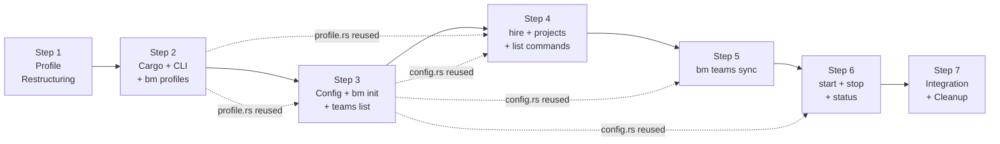

# Implementation Plan — `bm` CLI (Milestone 3)

> Incremental implementation steps. Each step builds on the previous, results in working demoable functionality, and follows TDD practices.
> Inputs: [design.md](design.md), [requirements.md](requirements.md), [UX.md](UX.md), [research/](research/).
>
> **Guiding principle:** Core end-to-end functionality (`init → hire → sync → start → status → stop`) available as early as possible. No orphaned code — every step ends with integration.

---

## Checklist

- [ ] Step 1: Profile restructuring — collapse `skeletons/` into `profiles/`
- [ ] Step 2: Cargo workspace + CLI skeleton + `bm profiles`
- [ ] Step 3: Config management + `bm init` + `bm teams list`
- [ ] Step 4: `bm hire` + `bm projects add` + `bm members list` + `bm roles list`
- [ ] Step 5: `bm teams sync` — workspace provisioning
- [ ] Step 6: `bm start` + `bm stop` + `bm status` — process lifecycle
- [ ] Step 7: Integration testing + cleanup

---

## Step 1: Profile Restructuring

**Objective:** Collapse the two-layer skeleton model (`skeletons/team-repo/` + `skeletons/profiles/`) into a single-layer profile model at `profiles/`. This is a prerequisite for everything — the `bm` binary embeds profiles from the new location.

**Implementation guidance:**

This is a structural migration, not code. Follows design Section 3.1.

1. Create `profiles/` at repo root
2. Move `skeletons/profiles/rh-scrum/` → `profiles/rh-scrum/`
3. Copy `skeletons/team-repo/agent/skills/gh/SKILL.md` into `profiles/rh-scrum/agent/skills/gh/SKILL.md` (each profile is now self-contained)
4. Create `profiles/rh-scrum/botminter.yml` — profile metadata:
   - `name`, `display_name`, `description`, `version: "1.0.0"`, `schema_version: v1`
   - `roles:` section with name + description for each role in `members/`
   - `labels:` section with all status/kind labels (migrated from current Justfile `bootstrap-labels` recipe)
5. Create `profiles/rh-scrum/.schema/v1.yml` — directory layout schema (see design Section 5.5)
6. Verify each member skeleton in `profiles/rh-scrum/members/` has a `.botminter.yml` template with `role` and `comment_emoji`
7. Do NOT delete `skeletons/` yet — that happens in Step 7 after all migration is verified

**Test requirements:**
- `profiles/rh-scrum/botminter.yml` is valid YAML with all required fields (name, display_name, description, version, schema_version, roles, labels)
- `profiles/rh-scrum/.schema/v1.yml` exists with team and member scope layouts
- `profiles/rh-scrum/agent/skills/gh/SKILL.md` exists (moved from skeleton)
- `profiles/rh-scrum/PROCESS.md`, `CLAUDE.md`, `knowledge/`, `invariants/` exist
- Each member dir in `profiles/rh-scrum/members/` has ralph.yml, PROMPT.md, CLAUDE.md, and `.botminter.yml`
- Profile is fully self-contained — everything needed to stamp a team repo is inside the profile directory

**Integration notes:** This step changes the repo's directory structure but doesn't break existing functionality (the old `skeletons/` directory still exists). The new `profiles/` directory is what the Cargo binary will embed via `include_dir`.

**Demo:**
```bash
tree profiles/rh-scrum/ -L 2
cat profiles/rh-scrum/botminter.yml
```

---

## Step 2: Cargo Workspace + CLI Skeleton + `bm profiles`

**Objective:** Set up the Rust project structure and deliver the first two working commands: `bm profiles list` and `bm profiles describe <profile>`. These are pure-local, no-state commands that validate the build pipeline and profile embedding.

**Implementation guidance:**

1. Create Cargo workspace at repo root (design Section 3.2):
   - `Cargo.toml` (workspace) at repo root
   - `crates/bm/` — CLI binary crate
   - Add `target/` to `.gitignore`
2. Add dependencies to `crates/bm/Cargo.toml` (design Section 3.3):
   - `clap` (derive), `cliclack`, `console`, `indicatif`, `comfy-table`, `anyhow`, `serde`, `serde_json`, `serde_yml`, `include_dir`, `dirs`, `which`
3. Implement `cli.rs` — clap derive definitions for the full command tree (design Section 6.1):
   - All subcommands defined upfront, even if handlers just print "not yet implemented"
   - `bm up` alias for `bm start`
   - `-t`/`--team` flag on all commands that need it
4. Implement `profile.rs` — embedded profile access (design Section 8):
   - `static PROFILES: Dir = include_dir!("$CARGO_MANIFEST_DIR/../../profiles")`
   - Functions: `list_profiles()`, `read_manifest(name)`, `describe_profile(name)`, `list_roles(name)`
5. Implement `commands/profiles.rs`:
   - `bm profiles list` — table with name, version, schema, description (design Section 6.11)
   - `bm profiles describe <profile>` — full metadata + roles + label count (design Section 6.12)
6. Implement `main.rs` — dispatch to command handlers
7. Add root `Justfile` recipe: `build := "cargo build -p bm"`, `run := "cargo run -p bm --"`

**Test requirements:**
- `cargo build -p bm` compiles without errors
- `bm profiles list` shows the rh-scrum profile with name, version, schema, and description
- `bm profiles describe rh-scrum` shows metadata, available roles with descriptions, and label count
- `bm profiles describe nonexistent` exits with error listing available profiles
- `bm --help` shows the full command tree
- `bm hire --help` shows role argument and `--name` flag
- Unit tests for `profile.rs`: `list_profiles()` returns expected names, `read_manifest()` parses correctly

**Integration notes:** All other subcommands print "not yet implemented" — this is the scaffold. Subsequent steps fill in one command group at a time. The profile embedding is verified end-to-end: Rust build → `include_dir` → YAML parsing → formatted output.

**Demo:**
```bash
cargo run -p bm -- profiles list
cargo run -p bm -- profiles describe rh-scrum
```

---

## Step 3: Config Management + `bm init` + `bm teams list`

**Objective:** Implement the first operational command (`bm init`) and the config layer that all subsequent commands depend on. After this step, the operator can create teams and list them.

**Implementation guidance:**

1. Implement `config.rs` — `~/.botminter/config.yml` management (design Section 5.1):
   - `BotminterConfig` struct with `workzone`, `default_team`, `teams: Vec<TeamEntry>`
   - `TeamEntry` with `name`, `path`, `profile`, `github_repo`, `credentials`
   - `load()` — reads config, returns error with "Run `bm init` first" if missing
   - `save()` — writes YAML, sets file permissions to `0600`
   - `resolve_team(flag: Option<&str>)` — resolves `-t` flag or default team
2. Implement `commands/init.rs` — interactive wizard (design Section 6.2):
   - Use `cliclack` for wizard flow: intro → workzone → team name → profile → GitHub → credentials → members → projects → summary → confirm → execute
   - Prerequisite check: `which git` (error if missing), `which gh` (warn if missing, skip GitHub features)
   - Execution sequence (design Section 6.2, 14 steps):
     - Create workzone and team dirs
     - Extract profile content to team repo (PROCESS.md, CLAUDE.md, knowledge/, invariants/, agent/, botminter.yml)
     - Augment `botminter.yml` with collected `projects:` section
     - Create empty dirs per schema (team/, projects/)
     - For each hired member: call hire logic (can reuse Step 4, or inline minimal version)
     - For each project: create project dirs (knowledge/, invariants/)
     - `git init && git add -A && git commit`
     - If GitHub: `gh repo create` + push + bootstrap labels from botminter.yml
     - Register team in config.yml, set as default if first team
   - Idempotency: fail if team dir exists, with recovery hint
3. Implement `commands/teams.rs` — `bm teams list` (design Section 6.8):
   - Read from config.yml, display table with name, profile, GitHub repo, default marker

**Test requirements:**
- `bm init` wizard completes and creates team directory in workzone
- Team repo is a valid git repo with initial commit
- `botminter.yml` at team repo root has correct profile name, schema_version, labels
- PROCESS.md, CLAUDE.md, knowledge/, invariants/, agent/ extracted from profile
- Team registered in `~/.botminter/config.yml` with credentials
- Config file has 0600 permissions
- First team auto-set as default
- `bm teams list` shows the created team
- `bm init` on existing team dir fails with recovery hint
- If GitHub repo specified: repo exists on GitHub, labels bootstrapped
- If members hired during init: `team/{role}-{name}/` directories exist
- If projects added during init: `projects/{name}/knowledge/` and `projects/{name}/invariants/` exist
- Unit tests for `config.rs`: load/save round-trip, resolve_team with/without default

**Integration notes:** This is the heaviest single step. The `bm init` wizard exercises config, profiles, git, and optionally GitHub. The hire logic during init can be a simplified inline version — the full `bm hire` command (Step 4) adds schema guards and auto-suffix generation on top. Profile extraction uses `profile.rs` from Step 2.

**Demo:**
```bash
bm init
# Complete wizard...
bm teams list
tree ~/.botminter/workspaces/my-team/team/ -L 2
```

---

## Step 4: `bm hire` + `bm projects add` + `bm members list` + `bm roles list`

**Objective:** Implement the commands that modify team composition — hiring members and adding projects. Plus the listing commands that inspect them.

**Implementation guidance:**

1. Implement `commands/hire.rs` (design Section 6.3):
   - Resolve team, read team repo's `botminter.yml` for profile name
   - **Schema version guard:** compare team's `schema_version` against embedded profile's `schema_version`. Mismatch → error with `bm upgrade` suggestion
   - Verify role exists in embedded profile's `members/` directory
   - Determine member dir name:
     - `--name bob` → `{role}-bob`
     - No name → `{role}-{nn}` where `nn` is next available 2-digit suffix (scan existing `team/{role}-*/` dirs)
   - Verify `team/{member_dir}/` does NOT exist
   - Extract `members/{role}/` from embedded profile into `team/{member_dir}/`
   - Read `.botminter.yml` template from skeleton, augment with `name` field, write as `botminter.yml` (no dot prefix)
   - `git add team/{member_dir}/ && git commit -m "feat: hire {role} as {name}"`
   - No auto-push

2. Implement `commands/projects.rs` (design Section 6.13):
   - Resolve team, read team repo's `botminter.yml`
   - Derive project name from URL: basename minus `.git`, handle trailing slash
   - Verify project not already in `botminter.yml` `projects:` section
   - Append project entry to `botminter.yml`
   - Create `projects/{name}/knowledge/`, `projects/{name}/invariants/`
   - `git add -A && git commit -m "feat: add project {name}"`

3. Implement `commands/members.rs` (design Section 6.9):
   - Resolve team, read `team/` directory in team repo
   - For each member dir: read `botminter.yml` for name and role
   - Display table with member, role, status (status from `state.json` — just show "unknown" for now, refined in Step 6)

4. Implement `commands/roles.rs` (design Section 6.10):
   - Resolve team, read embedded profile's `botminter.yml` `roles:` section
   - Display table with role name and description

**Test requirements:**
- `bm hire architect --name bob` creates `team/architect-bob/` with full skeleton content
- `team/architect-bob/botminter.yml` contains `name: bob`, `role: architect`, `comment_emoji`
- Git commit created with message "feat: hire architect as bob"
- No push to GitHub
- `bm hire dev` (no name) creates `team/dev-01/` with auto-generated suffix
- `bm hire architect --name bob` again → error "Member 'architect-bob' already exists"
- `bm hire nonexistent-role` → error listing available roles
- Schema version mismatch → error with upgrade suggestion
- `bm projects add git@github.com:org/repo.git` adds project to `botminter.yml` and creates project dirs
- `bm projects add` for existing project → error
- `bm members list` shows hired members with roles
- `bm roles list` shows available roles from embedded profile
- Unit tests: auto-suffix generation (gap filling, incrementing), URL-to-project-name derivation (basename, .git stripping, trailing slash)

**Integration notes:** The schema version guard is a cross-cutting concern implemented here and reused by `bm teams sync` and `bm start` in later steps. Extract it into a shared utility in `profile.rs` or a new `guards.rs`.

**Demo:**
```bash
bm hire architect --name bob
bm hire dev
bm projects add git@github.com:bot-squad/hypershift.git
bm members list
bm roles list
```

---

## Step 5: `bm teams sync` — Workspace Provisioning

**Objective:** Implement workspace creation and synchronization. This is the most complex command — it bridges the team repo (control plane) and the workzone (runtime). After this step, member workspaces are ready for Ralph to run in.

**Implementation guidance:**

1. Implement `workspace.rs` — workspace creation and sync logic (design Section 6.4):
   - **Workspace creation** (design Section 6.4, per member × project):
     - Create member dir: `{workzone}/{team}/{member_dir}/`
     - For each project:
       - **Target project:** `git clone {fork_url} {workspace_path}` → `git checkout -b {member_dir}` (or checkout existing member branch)
       - **BM — team repo clone:** `git clone {team_repo_path} {workspace_path}/.botminter/`
       - **BM — surfaced files:**
         - Symlink `PROMPT.md` → `.botminter/team/{member_dir}/PROMPT.md`
         - Symlink `CLAUDE.md` → `.botminter/team/{member_dir}/CLAUDE.md`
         - Copy `ralph.yml` from `.botminter/team/{member_dir}/ralph.yml`
       - **BM — `.claude/` assembly** (design Section 6.4.1):
         - Symlink `.md` files from `.botminter/agent/agents/` (team-level)
         - Symlink `.md` files from `.botminter/projects/{project}/agent/agents/` (project-level)
         - Symlink `.md` files from `.botminter/team/{member_dir}/agent/agents/` (member-level)
         - Copy `settings.local.json` from `.botminter/team/{member_dir}/agent/`
       - Write `.gitignore` + `.git/info/exclude` to hide BM files
     - If no projects: create simple workspace at `{member_dir}/` with BM only
   - **Workspace sync** (design Section 6.4, existing workspaces):
     - Pull `.botminter/` (git pull)
     - Pull target project (git pull)
     - Re-copy `ralph.yml` and `settings.local.json` if newer
     - Remove + re-create `.claude/agents/` symlinks
     - Verify `PROMPT.md` and `CLAUDE.md` symlinks
     - Verify `.git/info/exclude` entries

2. Implement `commands/teams.rs` — add `sync` subcommand (design Section 6.4):
   - Resolve team
   - Schema version guard
   - If `--push`: `git push` team repo first
   - Read `botminter.yml` for projects, read `team/` for hired members
   - For each member × project: create or sync workspace
   - Report: "Synced N workspaces (M created, K updated)"

**Test requirements:**
- `bm teams sync` creates workspaces for all hired members × all projects
- Each workspace contains target project (git clone of fork URL at member's branch)
- Each workspace contains `.botminter/` (clone of team repo)
- `PROMPT.md` and `CLAUDE.md` are symlinks to `.botminter/team/{member_dir}/`
- `ralph.yml` is copied from `.botminter/team/{member_dir}/`
- `.claude/agents/` contains symlinks from `.botminter/` (team, project, member scopes)
- `.gitignore` hides `.botminter/` and surfaced files
- Re-running `bm teams sync` on existing workspaces performs sync (git pull, re-copy, re-symlink)
- `bm teams sync --push` pushes team repo to GitHub first
- Multi-project: member gets one workspace subdir per project
- No-project: member gets a simple workspace without project subdir
- Schema version mismatch → error with upgrade suggestion
- Unit tests for `workspace.rs`: symlink generation, `.claude/` assembly logic, `.gitignore` content

**Integration notes:** This is the bridge between Steps 3-4 (team repo provisioning) and Step 6 (launching Ralph). Use absolute paths for symlinks (via `realpath` on `.botminter/` paths). The `.gitignore` is critical — without it, `git status` in the target project will show all BM files as untracked.

**Demo:**
```bash
bm teams sync
tree ~/.botminter/workspaces/my-team/architect-bob/hypershift/ -L 1 -a
readlink ~/.botminter/workspaces/my-team/architect-bob/hypershift/PROMPT.md
ls -la ~/.botminter/workspaces/my-team/architect-bob/hypershift/.claude/agents/
```

---

## Step 6: `bm start` + `bm stop` + `bm status` — Process Lifecycle

**Objective:** Implement the process lifecycle commands. After this step, the full operator workflow is operational: init → hire → sync → start → status → stop.

**Implementation guidance:**

1. Implement `state.rs` — runtime state management (design Section 5.2):
   - `RuntimeState` struct with `members: HashMap<String, MemberRuntime>`
   - `MemberRuntime` with `pid`, `started_at`, `workspace`
   - `load()` — read `~/.botminter/state.json`, return empty if missing
   - `save()` — atomic write (temp file → rename)
   - `is_alive(pid)` — `kill(pid, 0)` via `libc::kill` or `nix` crate
   - Stale PID cleanup: if PID in state but dead → remove entry

2. Implement `commands/start.rs` (design Section 6.5):
   - Prerequisite: `which ralph` (error if missing)
   - Resolve team, read `team/` for hired members
   - Schema version guard
   - For each member:
     - Determine workspace path(s) — one per project
     - Check state.json: if PID alive → skip ("already running")
     - If PID stale → clean up, re-launch
     - If no workspace → error: "run `bm teams sync` first"
     - Launch: set env vars (`GH_TOKEN`, `RALPH_TELEGRAM_BOT_TOKEN` if present), `cd {workspace} && ralph run -p PROMPT.md &`
     - Record PID + start time in state.json
     - Verify alive after 2 seconds
   - Credential-to-env-var mapping (design Section 6.5):
     - `credentials.gh_token` → `GH_TOKEN` (required — error if missing)
     - `credentials.telegram_bot_token` → `RALPH_TELEGRAM_BOT_TOKEN` (optional)
   - Alias `bm up` dispatches to `bm start`

3. Implement `commands/stop.rs` (design Section 6.6):
   - **Graceful** (`bm stop`): for each running member, `cd {workspace} && ralph loops stop`, poll `kill(pid, 0)` every second until exit, remove from state.json
   - **Force** (`bm stop --force`): for each running member, `SIGTERM` via tracked PID, remove from state.json
   - Per-member feedback: "Stopping architect-bob... done"
   - If `ralph loops stop` fails → report error, suggest `bm stop -f`
   - If no running members → "No members running"

4. Implement `commands/status.rs` (design Section 6.7):
   - Resolve team, read members from team repo
   - For each member: check state.json, check PID liveness
   - Status classification: running (alive), crashed (dead but in state → clean up), stopped (not in state)
   - Display table: member, role, status, started time, PID
   - **Verbose mode** (`-v`): for running members, execute Ralph CLI commands from workspace:
     - `ralph hats`, `ralph loops list`, `ralph events`, `ralph bot status`
     - Skip gracefully if command unavailable

5. Update `commands/members.rs` from Step 4 — now that `state.rs` exists, show real status (running/stopped/crashed) instead of "unknown"

**Test requirements:**
- `bm start` launches Ralph in each member's workspace as background process
- `state.json` contains PIDs and start times
- Both processes alive after launch (`kill -0` succeeds)
- `bm start` with member already running → skips with "already running"
- `bm start` with stale PID → cleans up, re-launches
- `bm start` without workspaces → error suggesting `bm teams sync`
- `bm start` with schema version mismatch → error
- `bm start` without `gh_token` → error
- `bm stop` gracefully stops all members via `ralph loops stop`
- `bm stop -f` force-kills via SIGTERM
- `bm stop` with no running members → clean message
- `bm status` shows running/stopped/crashed members with PID and start time
- `bm status -v` shows Ralph runtime details, skips unavailable commands
- `bm status` with crashed member → shown as crashed, stale entry cleaned
- `bm members list` now shows real status
- Unit tests for `state.rs`: atomic write round-trip, PID liveness (mock), stale cleanup
- Unit tests for `commands/start.rs`: credential-to-env-var mapping, stale PID detection

**Integration notes:** This completes the core end-to-end workflow. The operator can now go from zero to running team in one session: `bm init → bm hire × N → bm projects add → bm teams sync → bm start → bm status → bm stop`.

**Demo:**
```bash
bm start
bm status
# ...time passes...
bm status -v
bm stop
bm status    # all stopped
```

---

## Step 7: Integration Testing + Cleanup

**Objective:** Verify the full lifecycle end-to-end, exercise edge cases, clean up the old skeleton model, and update documentation.

**Implementation guidance:**

1. **Integration tests** (design Section 11.2) — all run against temp directories:
   - Full lifecycle: `init → hire → sync → start → status → stop` in a temp workzone
   - Init with GitHub repo (skip in CI without token)
   - Hire with name and without (auto-suffix) — verify `{role}-{name}` and `{role}-{nn}` conventions
   - Hire unknown role — error handling
   - Projects add → sync — verify workspace creation for all members
   - Start without sync — error: "run `bm teams sync` first"
   - Start idempotency — start twice, verify no duplicate launches
   - Stop graceful vs. force — both modes
   - Stale PID cleanup — write fake PID to state, verify cleanup
   - Multi-team — init two teams, verify `bm teams list`, default team behavior
   - Profiles list and describe — verify embedded profiles accessible
   - Schema version mismatch — modify `botminter.yml` schema_version, verify `bm hire`/`bm start`/`bm teams sync` refuse
   - `-t` flag override — init two teams, verify commands with `-t` operate on correct team
   - Missing prerequisite tools — remove `ralph` from PATH, verify `bm start` errors
   - Missing credentials — no `gh_token`, verify `bm start` errors

2. **Skeleton cleanup:**
   - Delete `skeletons/` directory (old two-layer model)
   - Remove any Justfile recipes that reference `skeletons/`
   - Update generator root Justfile to wrap `cargo` commands for `bm`

3. **Documentation updates:**
   - Update root `CLAUDE.md` — reflect new directory structure (`profiles/` instead of `skeletons/`), new commands (`bm` instead of `just`)
   - Update `specs/master-plan/plan.md` — mark M3 step as having its plan
   - Update `specs/master-plan/design.md` — M3 section with final command tree

4. **Manual validation checklist** (design Section 11.3):
   - `bm init` wizard UX — prompts clear, flow natural
   - `bm status` table — renders correctly
   - `bm profiles describe` — labels, roles, metadata display
   - Ralph integration — `bm start` launches Ralph, `bm stop` stops it
   - Credential handling — tokens passed to Ralph processes
   - Workspace assembly — symlinks resolve, `.claude/agents/` correct

**Test requirements:**
- All integration tests pass
- `skeletons/` directory removed
- Root CLAUDE.md reflects current architecture
- `bm --help` is self-documenting and matches the command tree in design.md
- No references to old Justfile commands remain in documentation

**Integration notes:** This step marks M3 as complete. The operator's workflow transitions from Justfile recipes to `bm` commands. The old `just init`, `just add-member`, `just create-workspace`, `just launch` are fully replaced.

**Demo:**
```bash
# Full lifecycle from scratch
bm init                    # wizard creates team
bm hire architect --name bob
bm hire dev
bm projects add git@github.com:org/project.git
bm teams sync
bm start
bm status
bm stop
bm teams list              # shows the team
```

---

## Dependency Graph



Steps are strictly sequential — each depends on the previous. Shared modules (`profile.rs`, `config.rs`, `state.rs`) are introduced when first needed and reused by later steps.

---

## Risk Register

| Risk | Mitigation |
|------|------------|
| `cliclack` doesn't support all wizard patterns needed by `bm init` | Fall back to `dialoguer` for specific prompts; `cliclack` handles the framing (intro/outro) |
| `include_dir` large embedded assets slow compile | Profile content is text files (~100KB total); not a concern for M3 |
| Ralph CLI commands (`ralph hats`, `ralph loops list`) don't exist yet | `bm status -v` skips unavailable commands gracefully (design C1 resolution) |
| `serde_yml` version instability (pre-1.0) | Pin exact version; limited surface area (read/write YAML config) |
| Git clone during `bm teams sync` fails (SSH keys, auth) | Report git error with context; operator manages git auth externally |
| Cross-platform issues (symlinks on Windows) | M3 targets Linux/macOS only (author + teammates); Windows deferred |
