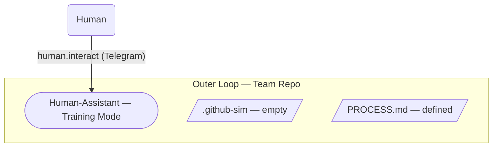
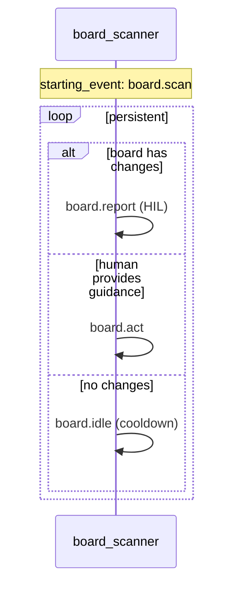

# Design — Milestone 1: Structure + Human-Assistant

> Extracted from [master-plan/design.md](../master-plan/design.md) Section 4.
> For generator architecture context (three-layer model, Justfiles, skeletons, profiles), see [master-plan/design.md](../master-plan/design.md) Section 3.

---

> **Implementation note:** M1 is delivered through the generator architecture (Section 3). The team repo structure, process documents, member skeletons, and Justfile recipes are built into the generator skeleton and the `rh-scrum` profile. The HyperShift team repo is then stamped out via `just init --repo=... --profile=rh-scrum` and operated via `just add-member`, `just launch`, etc. See Section 3 for the three-layer model and usage flow.

## 1. Scope

**What M1 builds:**
- Generator skeleton — bare team repo structure + Justfile (`add-member`, `create-workspace`, `launch`)
- `rh-scrum` profile — PROCESS.md, CLAUDE.md, team knowledge/invariants, human-assistant member skeleton
- `just init` recipe — layers skeleton + profile into a self-contained team repo instance
- human-assistant — the first team member (defined in the profile, instantiated via `just add-member human-assistant`)
- Workspace model — `just create-workspace` + `just launch` automate workspace setup and Ralph startup
- HIL round-trip via Telegram

**What M1 proves:**
- Persistent polling works (Ralph stays alive on idle, scanner loops without exiting)
- Inner loop works (Ralph + hats for human-assistant)
- Generator model works (skeleton + profile → team repo instance)
- Workspace model works (`just create-workspace` → surface → run)
- Launcher works (`just launch` launches a team of one)
- HIL works (human ↔ human-assistant via Telegram, training mode)
- The generated team repo is a functioning control plane

**What M1 does NOT exercise:**
- No outer loop coordination (only one team member)
- No .github-sim issues (board is empty)
- No kanban statuses (defined incrementally in M2/M3)
- No code work on any project repo

## 2. Key Assumptions

The entire pull-based coordination model depends on team members staying alive indefinitely, polling for work. If a member exits when idle, the team breaks.

1. **Persistent polling:** The scanner hat must never emit a terminal event. On idle (no status changes, no human input), it sleeps and re-emits `board.scan` to keep Ralph's event loop running. This must be validated as the first implementation task in M1 — before board scanning logic or HIL wiring.

2. **Submodule as shared state:** Team members read and write `.github-sim/` through the team repo submodule. The design assumes git commit + push through a submodule is a viable coordination mechanism for sequential (one-at-a-time) member operation. Concurrent access is deferred to M2.

## 3. Architecture

M1 introduces the two-layer model, but only the inner loop is exercised:



## 4. Repository Layout

The generated team repo has this structure. It is produced by `just init` (Section 3.4) from the generator skeleton + profile. Items marked `✓` are populated; items marked `○` are placeholder directories for future milestones.

```
<team-name>/                             # GENERATED TEAM REPO (control plane)
├── Justfile                       ✓    # add-member, create-workspace, launch (from skeleton)
├── PROCESS.md                     ✓    # Issue format conventions, label naming (from profile)
├── CLAUDE.md                      ✓    # Shared context for all team members (from profile)
├── knowledge/                     ✓    # Team-level knowledge (cross-project)
│   ├── commit-convention.md
│   ├── pr-standards.md
│   └── communication-protocols.md
├── invariants/                    ✓    # Team-level invariants (cross-project)
│   ├── test-coverage.md
│   └── code-review-required.md
├── projects/
│   └── hypershift/
│       ├── knowledge/             ✓    # Project-specific knowledge
│       │   ├── hcp-architecture.md
│       │   ├── nodepool-patterns.md
│       │   └── upgrade-flow.md
│       └── invariants/            ✓    # Project-specific invariants
│           ├── pre-commit.md
│           └── upgrade-path-tests.md
├── team/
│   ├── human-assistant/            ✓    # Human-Assistant (added via `just add-member human-assistant`)
│   │   ├── ralph.yml
│   │   ├── PROMPT.md
│   │   ├── CLAUDE.md
│   │   ├── knowledge/
│   │   ├── invariants/
│   │   └── projects/hypershift/...
│   ├── architect/                 ○    # `just add-member architect` in M2
│   ├── dev/                       ○    # `just add-member dev` in M3
│   ├── qe/                        ○    # `just add-member qe` in M3
│   └── reviewer/                  ○    # `just add-member reviewer` in M3
├── .github-sim/                   ✓    # Structure created, no issues yet
│   ├── issues/
│   ├── milestones/
│   └── pulls/
├── .team-template/                ✓    # Full generator content minus Justfile (copied by init)
└── .claude/                            # Claude Code project settings
```

## 5. Workspace Model

Each team member runs in its own workspace repo, isolated from other members. Workspaces are created via `just create-workspace <member>` from the generated team repo (see Section 3.3).

###### Team member workspace (runtime, one per member)

```
workspace-human-assistant/
├── .gitmodules
├── team-repo/           # Submodule (team repo — source of truth)
│   └── team/human-assistant/         # Human-assistant's definition files (read-only source)
├── ralph.yml            # ← Copied from team-repo/team/human-assistant/
├── PROMPT.md            # ← Copied from team-repo/team/human-assistant/
├── CLAUDE.md            # ← Copied from team-repo/team/human-assistant/ (references team-repo/CLAUDE.md)
├── knowledge/           # ← Copied from team-repo/team/human-assistant/
├── invariants/          # ← Copied from team-repo/team/human-assistant/
├── projects/            # ← Copied from team-repo/team/human-assistant/
└── .ralph/              # RUNTIME ONLY — workspace-local
    └── agent/
        ├── memories.md
        ├── scratchpad.md
        └── tasks/
```

###### Launch sequence (per member) — `just launch <member>`

```
1. Create workspace dir, init git       → workspace-<member>/
2. Add team repo as submodule            → workspace-<member>/team-repo/
3. Check ralph.yml version              → full setup or incremental sync?
4. Copy member files to workspace root  → surface team-repo/team/{member}/* to workspace root
5. ralph run -p PROMPT.md               → agent starts working
```

The launch recipe copies files from `team-repo/team/{member}/` to the workspace root. This gives Ralph a clean top-level view — `ralph.yml`, `PROMPT.md`, `CLAUDE.md`, `knowledge/`, `invariants/`, `projects/` are all at the workspace root where Ralph expects them. Each member's `CLAUDE.md` references the shared `team-repo/CLAUDE.md` (via submodule path) for team-wide context, then adds role-specific instructions.

Runtime files (`.ralph/agent/memories.md`, scratchpad, tasks) exist only in the workspace — never in the team repo.


###### Team repo access via submodule

All paths to shared resources go through the submodule:
- `.github-sim/` → `team-repo/.github-sim/`
- Team knowledge → `team-repo/knowledge/`
- Team invariants → `team-repo/invariants/`
- Project knowledge → `team-repo/projects/hypershift/knowledge/`
- `PROCESS.md` → `team-repo/PROCESS.md`

Members commit + push changes to the team repo (via submodule) for other members to see them.

## 6. Kanban Workflow Definition

PROCESS.md in M1 defines the conventions and protocols — no statuses yet. Statuses are added incrementally: epic lifecycle in M2, story lifecycle in M3.

###### What PROCESS.md covers in M1

- Issue format conventions (frontmatter fields, comment format)
- `kind/*` labels (`kind/epic`, `kind/story`)
- `status/<role>:<phase>` label naming convention
- Communication protocols (how members coordinate via `.github-sim/`)

**Process evolution:** Two paths for evolving the team:
1. **Formal (PR-based):** Team members propose changes to knowledge, invariants, or PROCESS.md as PRs in `.github-sim/pulls/`. Human reviews and merges via the human-assistant.
2. **Informal (direct):** Team members propose changes via `human.interact`. Human evaluates and the human-assistant edits PROCESS.md or team member configs directly.

Changes take effect on the next team member launch.

## 7. Human-Assistant

**Role:** Automates the PO/Tech Lead's tasks. In M1, the human-assistant scans the board, reports state to the human, and responds to human guidance. Additional hats (epic creation, design gating, prioritization, merge gating) are added in M2+ as the board becomes populated and other team members come online.

###### Inner hats (human-assistant/ralph.yml) — M1

- `board_scanner` — scans `team-repo/.github-sim/issues/` for status changes, builds board state summary, reports to human via `human.interact`

###### Event flow (human-assistant/ralph.yml) — M1



> The board_scanner reads board state and reports to the human. In M1 the board is empty, so the scanner reports "no issues found" and waits for human guidance. This same scanner becomes the dispatcher in M2+ when action hats are added.
>
> **Prerequisite:** The persistent polling model must be validated first — confirm the scanner hat can sleep on `board.idle` and loop back to `board.scan` without Ralph exiting. This is the first thing to build and test before any board scanning logic (see Section 2 Key Assumptions).

###### Training mode (POC)

In training mode, the human-assistant **observes and reports** board state to the human. In M1, with only the human-assistant running, this means reporting on the empty board and responding to human guidance. The full observation model (reporting status transitions made by other members) activates in M2+ when additional team members exist.

The human-assistant presents:
1. Its understanding of the current board state
2. What just happened (if anything)
3. What it expects will happen next and why (reasoning from PROCESS.md, knowledge, context)

The human can intervene at any time (e.g., provide guidance). In M2+, work continues in parallel while the human reviews reports — the human-assistant does not gate or block the next member from picking up work.

```
human-assistant → Human:
  "Board scan complete. No open issues found in .github-sim/issues/.
   Next: Continue monitoring. Board is empty — no action needed.
   Confirm, or provide guidance?"

Human → human-assistant:
  "Acknowledged, no work yet." / "Let's prepare for M2." / etc.
```

###### HIL graduation path (future)
- **Training** (this POC): human-assistant observes and reports every transition; human-gated decisions require confirmation
- **Supervised**: decisions require approval, mechanical actions are notify-only
- **Autonomous**: only escalations and exceptions require human input

###### Member invariants
- Always presents board state + reasoning to the human (training mode)
- Board state summary is accurate and up-to-date
- All actions are logged (M2+: as comments on the relevant issue)

## 8. .github-sim Structure

`.github-sim/` mirrors GitHub's data model. Created empty in M1, populated starting in M2. The format conventions are defined in PROCESS.md so all future team members follow them consistently.

###### Issue format (`issues/{number}.md`)

```markdown
---
number: 1
title: "Issue title"
state: open
labels: [kind/epic, status/po:triage]
assignee: null
milestone: null
parent: null
created: 2026-02-13T10:00:00Z
---

## Description
[What needs to be done]

## Acceptance Criteria
- [ ] Criterion 1

## Relevant Code Areas
- `path/to/code/`

---

## Comments

### @role — timestamp
Comment text...
```

###### Milestone format (`milestones/{name}.md`)

```markdown
---
title: "Milestone title"
state: open
issues: [1, 2, 3]
---

## Description
Milestone description.
```

###### Pull request format (`pulls/{number}.md`)

PRs are for **team evolution** — knowledge, invariants, process changes. NOT for code (code lives in project repos).

```markdown
---
number: 1
title: "PR title"
state: open
branch: knowledge/topic
base: main
labels: [knowledge, project:hypershift]
author: dev
---

## Description
...

## Changes
- Added/Updated files...

---

## Reviews

### @po — timestamp
**Status: approved/changes-requested**
Review text...
```

## 9. Knowledge & Invariants

M1 creates the recursive knowledge/invariant model and populates the first three scopes.

###### Recursive pattern

```
┌─────────────────────────────────────────────────────────────┐
│ Scope 1: Team (root)                                   ✓    │
│   knowledge/         — cross-project knowledge              │
│   invariants/        — cross-project invariants              │
│                                                             │
│ ┌─────────────────────────────────────────────────────────┐ │
│ │ Scope 2: Project (projects/hypershift/)             ✓   │ │
│ │   knowledge/       — project-specific knowledge         │ │
│ │   invariants/      — project-specific invariants         │ │
│ │                                                         │ │
│ │ ┌─────────────────────────────────────────────────────┐ │ │
│ │ │ Scope 3: Team Member (team/human-assistant/)    ✓   │ │ │
│ │ │   knowledge/     — member-specific knowledge        │ │ │
│ │ │   invariants/    — member-specific invariants        │ │ │
│ │ │   projects/hypershift/                              │ │ │
│ │ │     knowledge/   — member's project-specific        │ │ │
│ │ │     invariants/  — member's project-specific        │ │ │
│ │ │                                                     │ │ │
│ │ │ + Ralph agent memories (.ralph/agent/memories.md)   │ │ │
│ │ └─────────────────────────────────────────────────────┘ │ │
│ └─────────────────────────────────────────────────────────┘ │
└─────────────────────────────────────────────────────────────┘
```

###### Resolution order

```
1. team-repo/knowledge/                      (team-level, via submodule)
2. team-repo/projects/hypershift/knowledge/   (project-level, via submodule)
3. ./knowledge/                              (member-level, surfaced to workspace root)
4. ./projects/hypershift/knowledge/           (member's project-level, surfaced)
5. .ralph/agent/memories.md                  (runtime, workspace-local)
```

Same for invariants. Lower scopes can override or extend higher scopes.

###### What's populated in M1

| Scope | Knowledge | Invariants |
|-------|-----------|------------|
| Team | placeholder files (commit-convention, pr-standards, communication-protocols) | placeholder files (code-review-required, test-coverage) |
| Project (hypershift) | placeholder files (hcp-architecture, nodepool-patterns, upgrade-flow) | placeholder files (pre-commit, upgrade-path-tests) |
| human-assistant member | (empty initially) | always-confirm |

> **Note:** M1 creates the directory structure and placeholder files. Actual knowledge content (patterns, pitfalls, conventions) is populated before the team goes live.

## 10. Human-in-the-Loop

M1 establishes the primary HIL channel: human ↔ human-assistant via Telegram.

###### RObot configuration

```yaml
RObot:
  enabled: true
  timeout_seconds: 600
  checkin_interval_seconds: 300
  telegram:
    bot_token: "${RALPH_TELEGRAM_BOT_TOKEN}"
```

###### Training mode

All human-assistant actions are HIL in training mode.

| Mode | HIL frequency |
|------|---------------|
| **Training (M1–M3)** | human-assistant observes & reports; human-gated decisions require confirmation |
| Supervised (future) | Decisions require approval, mechanical actions notify-only |
| Autonomous (future) | Only escalations and exceptions require human input |

## 11. Acceptance Criteria

- [ ] Team repo directory structure created (knowledge/, invariants/, projects/, team/, .github-sim/)
- [ ] `PROCESS.md` exists with issue format conventions, label naming, and communication protocols
- [ ] Team knowledge directory exists with placeholder structure
- [ ] Project knowledge directory exists for hypershift with placeholder files (actual patterns/pitfalls populated before the team goes live)
- [ ] Team and project invariants directories exist with placeholder structure (actual rules populated before the team goes live)
- [ ] Workspace template repo created (scaffolding + submodule pointer to team repo)
- [ ] `team/human-assistant/` fully configured in team repo (ralph.yml with version, PROMPT.md, CLAUDE.md, knowledge, invariants)
- [ ] Launcher written (clone, surface, `ralph run -p PROMPT.md`)
- [ ] Launcher launches human-assistant — workspace cloned, files surfaced, Ralph starts correctly
- [ ] RObot configured for Telegram
- [ ] human-assistant scans empty board, sends training-mode message to human via Telegram
- [ ] Human receives message and responds — full HIL round-trip validated

## 12. Open Questions

1. ~~**Member isolation:** Does Ralph support running from a subdirectory (`team/dev/`) with `workspace_root` pointing elsewhere?~~ **Resolved by workspace model** — each member runs in its own workspace repo with files surfaced to the root. Ralph sees a clean top-level workspace.

2. ~~**Shared vs per-member CLAUDE.md:** Should each team member have its own CLAUDE.md, or should there be a shared one at the repo root that all members reference?~~ **Resolved** — both. Root `CLAUDE.md` is shared context in the team repo. Each member's `CLAUDE.md` is role-specific, surfaced to workspace root by the launcher, and references the shared one via `team-repo/CLAUDE.md` (submodule path).

3. ~~**External launcher:**~~ **Resolved** — POC: simple shell script. Future: Go binary with restart/crash/health-check handling. The launcher handles the full sequence: clone workspace → check version → surface files → `ralph run -p PROMPT.md`.

4. ~~**Persistent polling (file watching + idle handling):**~~ **Resolved** — team members must never quit. Two options to investigate: (a) never emit the terminal event — the scanner hat sleeps on idle and re-scans after a cooldown, keeping Ralph's event loop alive; (b) wrap Ralph in a restart script that sleeps and relaunches on exit. Option (a) is preferred (keeps state within a single Ralph session). **This is the first thing to validate when building the human-assistant** — before board scanning logic, confirm that the event loop stays alive when no work is found.
