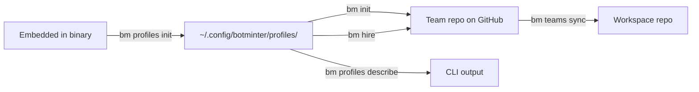
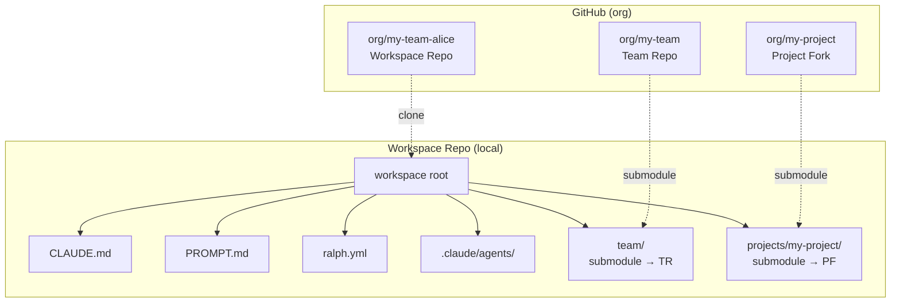
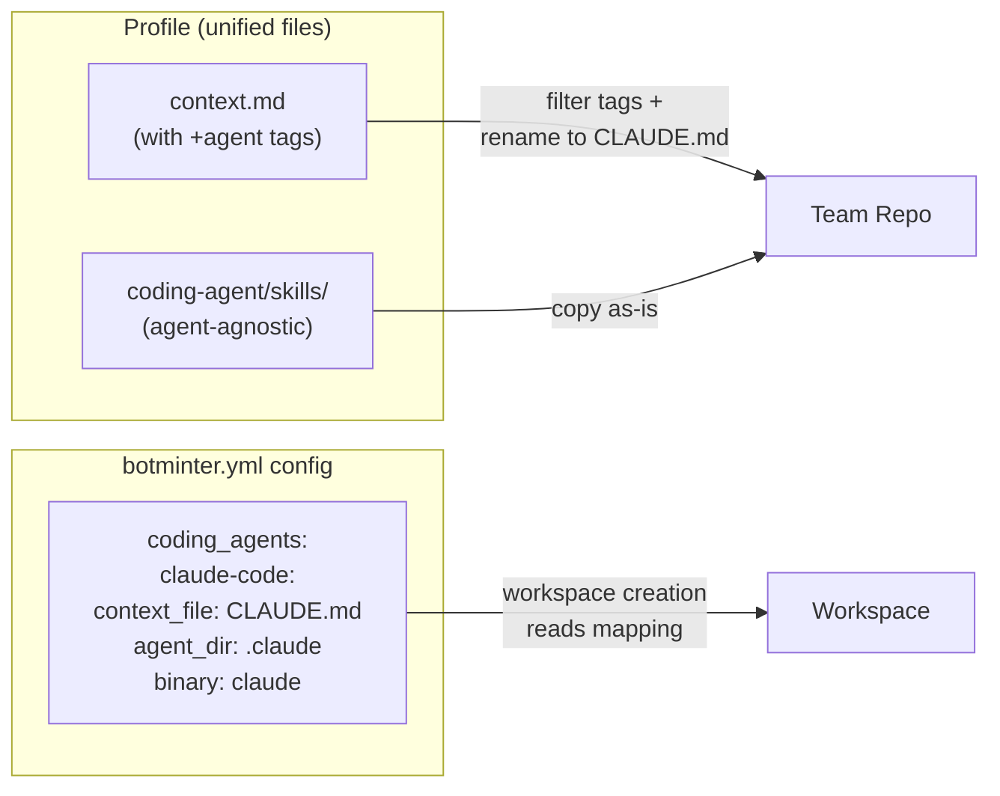

# Design — Minty and Friends [RAPID]

> Standalone design document for the Minty and Friends milestone.
> Six sprints delivered in sequence, each building on the previous.

---

## Overview

This milestone delivers six sprints improving the BotMinter operator experience:

1. **Coding-agent-agnostic cleanup** — abstract hardcoded Claude Code assumptions behind config-driven mappings
2. **Profile externalization** — move profiles from compile-time embedded to disk-based, editable storage
3. **Workspace repository model** — replace the `.botminter/` clone pattern with dedicated workspace repos using submodules
4. **Skills extraction** — extract embedded hat/process logic into composable, discoverable skills
5. **Team Manager role** — new role for process improvement, first experiment with role-as-skill pattern
6. **Minty** — BotMinter's interactive assistant persona with skill-driven architecture

All sprints share two unifying themes: **skills as building blocks** (Skills extraction + Team Manager + Minty) and **coding-agent-agnostic by design** (all new work avoids agent-specific assumptions).

Alpha policy applies: breaking changes, no migration, no backwards compatibility.

---

## Detailed Requirements

Consolidated from 19 Q&A entries in `requirements.md`.

### Coding-Agent-Agnostic

- **Config-driven mapping** (A2): profile declares `coding_agent` with file conventions; team can override (A3)
- **Inline agent tags** (refined from A4): files are unified with inline `<!-- +agent:NAME -->` tags for agent-specific sections; the CLI filters during extraction based on the resolved agent
- **Claude Code only** (A5): pluggable architecture, Claude Code as sole concrete implementation for now

### Profile Externalization

- **Dedicated command** (A6): `bm profiles init` extracts embedded profiles to disk
- **Auto-prompt** (A6): commands needing profiles detect missing disk profiles and offer to initialize inline; graceful abort if declined
- **Storage location** (A7): `~/.config/botminter/profiles/` for user configuration; `~/.botminter/` stays for runtime/operational data
- **All-at-once extraction** (A8): no selective extraction; user can delete unwanted profiles
- **Overwrite control** (A9): warn if profiles exist, offer overwrite/skip; `--force` flag for scripted use

### Workspace Repository Model

- **Dedicated workspace repos** (A10, A14): GitHub-hosted git repos, one per agent, using submodules for team repo and project forks
- **Naming convention** (A15): `<team-name>-<member-name>` in same GitHub org as team repo
- **Same lifecycle** (A14): `bm teams sync --push` creates on GitHub; `bm init` on new machine clones existing repos
- **Multi-project agents** (A10): multiple project submodules under `projects/`, work routed by issue labels; Team Manager works in `team/` submodule (always present)

### Skills Extraction

- **Prerequisite for chat and Minty**: hat instructions and process logic are currently embedded in ralph.yml — only accessible during Ralph orchestration loops, not during interactive coding agent sessions
- **Extract into composable skills**: board scanning, status transitions, issue operations, design/planning workflows become standalone skills discoverable by the coding agent
- **Skill format**: follows the existing SKILL.md pattern (YAML frontmatter + markdown + scripts) already used by the `gh` skill

### Team Manager

- **Independent role** (rough idea): operates separately from dev workflow
- **Minimal statuses** (A11): `mgr:todo`, `mgr:in-progress`, `mgr:done`
- **Role-as-skill** (A12): `bm chat <member>` launches coding agent in member's workspace repo

### Minty

- **Launch command** (A17): `bm minty`; runs in BotMinter's own context, not a team workspace
- **Config location** (A18): `~/.config/botminter/minty/` for skills, system prompt, and config
- **Skill-driven**: all capabilities as composable skills; Minty is a thin persona shell
- **Cross-team awareness** (A13): sees all registered teams, scopable with `-t`
- **Handles missing runtime** (A13): `~/.botminter/` may not exist on operator's machine

### Cross-Cutting

- **Alpha policy** (A16): breaking changes expected, no migration paths, operators re-create from scratch

---

## Architecture Overview

### Profile Lifecycle (Post-Externalization)



The embedded profiles are touched exactly once — by `bm profiles init`. All subsequent operations read exclusively from disk.

### Workspace Repository Model



Context files (CLAUDE.md, PROMPT.md, ralph.yml) live at the workspace repo root — no symlinks, no hiding. The agent has a clean, unambiguous context.

### Coding-Agent Abstraction



Files are unified — agent-specific sections are marked with inline tags (`<!-- +agent:claude-code -->`). During extraction, the tag filter includes matching sections and strips the tags. No variant directories.

---

## Sprints

### Sprint 1: Coding-Agent-Agnostic Cleanup

#### Unified Files with Inline Agent Tags

Instead of separate variant directories, all files remain unified. Agent-specific sections are marked with inline tags — similar to Go build tags or controller-runtime generator markers.

**Tag format (adapts to file type):**

Markdown files:
```markdown
<!-- +agent:claude-code -->
Agent capabilities live in `.claude/agents/`.
<!-- -agent -->
```

YAML files (ralph.yml, botminter.yml):
```yaml
cli:
  # +agent:claude-code
  backend: claude
  # -agent
  # +agent:gemini-cli
  backend: gemini
  # -agent
```

Shell scripts:
```bash
# +agent:claude-code
AGENT_CMD="claude"
# -agent
```

**Processing rules:**
1. Content outside any tags = **common**, included for all agents
2. Content inside `+agent:NAME` / `-agent` = included only when the resolved coding agent matches `NAME`
3. Tag lines are **stripped** from output — the extracted file has no trace of them
4. No nesting — tags are flat open/close pairs
5. Tag detection is comment-syntax-aware: `<!-- -->` for `.md`/`.html`, `#` for `.yml`/`.yaml`/`.sh`

**Implementation:** A simple line-based filter applied during file extraction. For each line: if it's an opening tag matching the resolved agent, include subsequent lines; if it's an opening tag for a different agent, skip; if it's a closing tag, resume including. Tag lines themselves are never copied to output. For YAML files with tagged duplicate keys (like `backend:`), the filter produces valid YAML because only one variant survives.

#### Directory Rename: `agent/` → `coding-agent/`

The current `agent/` directory holds coding-agent-specific configuration (sub-agents, skills, settings). This is ambiguous — "agent" could mean a team member or a Claude Code sub-agent. Rename to `coding-agent/` to make the distinction clear:

- **coding agent** = the product (Claude Code, Gemini CLI, etc.)
- **agent** (sub-agent) = a Claude Code `.claude/agents/*.md` file — lives *inside* `coding-agent/agents/`

#### Profile Structure (Flat — No Variant Directories)

```
profiles/scrum/
  botminter.yml                         # Updated with coding_agents section
  PROCESS.md                            # Agent-agnostic
  context.md                            # Unified context file (→ CLAUDE.md)
                                        #   with +agent tags for agent-specific sections
  coding-agent/                         # Coding-agent capabilities (unified)
    agents/                             # Sub-agents (symlinked to .claude/agents/)
    skills/                             # Skills (read by Ralph via skills.dirs)
      gh/
        SKILL.md
        scripts/
        references/
  knowledge/                            # Agent-agnostic
  invariants/                           # Agent-agnostic
  formations/                           # Agent-agnostic
  skills/                               # Team-level BotMinter skills (separate from coding-agent skills)
  members/
    architect/
      .botminter.yml
      context.md                        # Unified member context (→ CLAUDE.md)
      PROMPT.md                         # Agent-agnostic (Ralph)
      ralph.yml                         # Agent-agnostic (Ralph)
      coding-agent/                     # Member-level coding-agent capabilities
        agents/
        skills/
      hats/
      knowledge/
      invariants/
      projects/
    human-assistant/
      .botminter.yml
      context.md
      PROMPT.md
      ralph.yml
      coding-agent/
      hats/
      knowledge/
      invariants/
```

The rename `context.md` → `CLAUDE.md` (or whatever the resolved agent's `context_file` is) happens during extraction. No variant directories exist in the profile.

#### Scoping Rename Summary

All three scoping levels rename `agent/` → `coding-agent/`:

| Scope | Before | After |
|-------|--------|-------|
| Team | `agent/agents/`, `agent/skills/` | `coding-agent/agents/`, `coding-agent/skills/` |
| Project | `projects/<p>/agent/agents/` | `projects/<p>/coding-agent/agents/` |
| Member | `team/<m>/agent/agents/` | `team/<m>/coding-agent/agents/` |

#### `botminter.yml` Schema Changes

New fields in profile-level `botminter.yml`:

```yaml
coding_agents:
  claude-code:
    display_name: "Claude Code"
    context_file: "CLAUDE.md"           # What context.md becomes in workspaces
    agent_dir: ".claude"                # Agent directory name in workspaces
    binary: "claude"                    # Binary to invoke for sessions

default_coding_agent: claude-code
```

New optional field in team-level `botminter.yml`:

```yaml
coding_agent: claude-code               # Override profile default
```

#### Extraction Changes

`extract_profile_to(name, target, coding_agent)`:
1. Copy all files (skip `members/`, `.schema/`)
2. For `context.md`: run agent tag filter, rename to `coding_agent.context_file` (e.g., `CLAUDE.md`)
3. For all other `.md` files: run agent tag filter (strips non-matching sections)
4. Result: team repo has `CLAUDE.md` at root, `coding-agent/` directory, clean content with no tags

`extract_member_to(name, role, target, coding_agent)`:
1. Copy member files from `members/<role>/`
2. `context.md` → filtered + renamed to `CLAUDE.md`
3. All `.md` files → filtered (agent tags stripped)
4. Result: member dir has `CLAUDE.md`, agent-agnostic files, no tags in output

#### Workspace Parameterization

`workspace.rs` reads the resolved `CodingAgentDef` and uses parameterized names:

| Current (hardcoded) | New (from config) |
|---------------------|-------------------|
| `"CLAUDE.md"` | `coding_agent.context_file` |
| `".claude"` | `coding_agent.agent_dir` |

Affects: `BM_GITIGNORE_ENTRIES`, `surface_files()`, `assemble_claude_dir()`, `sync_workspace()`, `verify_symlink()`.

#### Ralph Backend Configuration

`ralph.yml` in member skeletons hardcodes `cli.backend: claude`. This becomes a tagged section:

```yaml
cli:
  # +agent:claude-code
  backend: claude
  # -agent
```

The agent tag filter processes ralph.yml during extraction just like any other file. When a second agent is added, its backend line is added as another tagged block.


---

### Sprint 2: Profile Externalization

#### New Command: `bm profiles init`

```
bm profiles init [--force]
```

- Extracts all embedded profiles to `~/.config/botminter/profiles/`
- If profiles exist and `--force` not set: warn, offer overwrite/skip per profile
- If `--force`: overwrite all without prompting

#### Storage Layout

```
~/.config/botminter/
  profiles/
    scrum/                              # Extracted from embedded
    scrum-compact/
    scrum-compact-telegram/
```

#### Profile API Changes

All profile functions switch from `include_dir!` reads to filesystem reads:

```rust
// Before:
static PROFILES: Dir<'static> = include_dir!("...");

pub fn list_profiles() -> Vec<String> {
    PROFILES.dirs().map(...)
}

// After:
fn profiles_dir() -> PathBuf {
    dirs::config_dir().join("botminter").join("profiles")
}

pub fn list_profiles() -> Result<Vec<String>> {
    // Read from ~/.config/botminter/profiles/
    let dir = profiles_dir();
    fs::read_dir(&dir)?.filter_map(...)
}
```

The `include_dir!` static remains in the binary but is only accessed by `bm profiles init` for extraction. No other command touches it.

#### Auto-Prompt Pattern

A helper function wraps profile access:

```rust
fn ensure_profiles_initialized() -> Result<()> {
    let dir = profiles_dir();
    if !dir.exists() {
        // Interactive prompt
        println!("Profiles not initialized.");
        if confirm("Do you want me to initialize them now?")? {
            extract_embedded_profiles(&dir)?;
            // Continue with original command
        } else {
            println!("OK. You can initialize them any time using `bm profiles init`.");
            bail!(""); // Graceful abort, not an error
        }
    }
    Ok(())
}
```

Commands that require profiles call `ensure_profiles_initialized()` before accessing them: `bm init`, `bm hire`, `bm teams sync`, `bm profiles list`, `bm profiles describe`, `bm roles list`.

---

### Sprint 3: Workspace Repository Model

#### Workspace Repo Structure

Each agent gets a dedicated GitHub-hosted git repo:

```
org/my-team-alice/                      # Workspace repo on GitHub
  .gitmodules
  team/                                 # Submodule → org/my-team (team repo)
  projects/
    my-project/                         # Submodule → org/my-project (fork)
  CLAUDE.md                             # Copied from team/team/<member>/CLAUDE.md
  PROMPT.md                             # Copied from team/team/<member>/PROMPT.md
  ralph.yml                             # Copied from team/team/<member>/ralph.yml
  .claude/
    agents/                             # Symlinks into team/ submodule paths
    settings.local.json
  .ralph/                               # Ralph runtime state (gitignored)
```

- Context files (CLAUDE.md, PROMPT.md) are **tracked** in the workspace repo — they're first-class citizens, not hidden symlinks
- ralph.yml is **tracked** — mutable by the agent, committed to workspace repo
- `.claude/agents/` uses **symlinks** into the team submodule — updated on sync
- `.ralph/` is **gitignored** — runtime state stays local

#### `bm teams sync --push` Flow (New Workspace)

1. Create GitHub repo: `gh repo create org/<team>-<member> --private`
2. Clone locally: `git clone org/<team>-<member> workzone/<team>/<member>/`
3. Add team repo submodule: `git submodule add <team-repo-url> team`
4. Checkout member branch in team submodule: `git -C team checkout -b <member>` (or checkout if exists)
5. For each assigned project: `git submodule add <fork-url> projects/<project>`
6. Checkout member branch in each project submodule: `git -C projects/<project> checkout -b <member>`
7. Copy context files from `team/team/<member>/` to workspace root
8. Assemble `.claude/agents/` with symlinks into submodule paths:
   - Team-level: `team/coding-agent/agents/*.md`
   - Project-level: `team/projects/<project>/coding-agent/agents/*.md`
   - Member-level: `team/team/<member>/coding-agent/agents/*.md`
9. Write `.gitignore` (for `.ralph/`, `.claude/`)
10. Write `.botminter.workspace` marker file
11. Commit and push

#### `bm teams sync` Flow (Existing Workspace)

1. `git submodule update --remote` to fetch latest team repo and project forks
2. Checkout member branch in each submodule (`git -C team checkout {member}`, `git -C projects/<name> checkout {member}`) — **never leave submodules in detached HEAD**
3. Re-copy context files if team submodule versions are newer
4. Re-copy ralph.yml if team submodule version is newer
5. Re-assemble `.claude/agents/` symlinks (idempotent)
6. Commit changes (if any) and push

#### `bm start` Flow

1. Discover workspaces by scanning `workzone/<team>/` for directories with `.botminter.workspace` marker
2. Launch: `cd workzone/<team>/<member>/ && ralph run -p PROMPT.md --env GH_TOKEN=...`
3. Same PID tracking in `~/.botminter/state.json`

#### Project Routing

Ralph runs at the workspace root. All projects are accessible as submodules. Routing to the right project is handled by hat instructions and issue labels — no "default project" config needed.

- **Team Manager**: hat instructions reference `team/` (the team repo submodule, always present in every workspace)
- **Dev/QE/etc.**: hat instructions reference `projects/<name>/`; multi-project agents read the project label from the issue to determine which submodule to work in

#### Multi-Project Agents

An agent assigned multiple projects has multiple submodules under `projects/`:

```
projects/
  project-a/                            # Submodule
  project-b/                            # Submodule
```

Work routing is handled by issue labels in the team repo (label per project). The agent reads the label and `cd`s to the right submodule.

#### ralph.yml Path Updates

The workspace model change from `.botminter/` to `team/` submodule affects every path reference in ralph.yml:

| Section | Before | After |
|---------|--------|-------|
| `core.guardrails` | `.botminter/invariants/` | `team/invariants/` |
| `skills.dirs` | `.botminter/agent/skills` | `team/coding-agent/skills` |
| Hat instructions (knowledge paths) | `.botminter/knowledge/` | `team/knowledge/` |
| Hat instructions (project paths) | `.botminter/projects/<project>/` | `team/projects/<project>/` |
| Hat instructions (member paths) | `.botminter/team/<member>/` | `team/team/<member>/` |
| Hat instructions (agent paths) | `.botminter/team/<member>/agent/` | `team/team/<member>/coding-agent/` |
| Hat instructions (workspace sync) | `git -C .botminter pull` | `git submodule update --remote team` |
| Hat instructions (team repo detection) | `cd .botminter && gh repo view` | `cd team && gh repo view` |

These are content changes within the profile's ralph.yml and hat instruction text — updated during the profile restructuring, not at runtime.

Similarly, `context.md` (CLAUDE.md) and `PROMPT.md` templates in profiles reference `.botminter/` paths that must be updated to `team/`.

#### Migration from Old Model

No migration — Alpha policy. Operators:
1. `bm stop`
2. Delete old workzone
3. Re-run `bm teams sync --push` to create workspace repos

---

### Sprint 4: Skills Extraction & Ralph Prompt Shipping

#### The Gap

Ralph injects ~13 categories of hardcoded prompts at runtime (see `research/ralph-injected-prompts.md`) — orientation, workflow instructions, state management, event writing, hat activation templates, and built-in skills. These are compiled into Ralph's Rust binary and invisible to profiles. To enable interactive sessions with team members in later sprints, these prompts must be extracted and shipped with profiles.

#### What Gets Extracted

**From Ralph Orchestrator's codebase → shipped with profiles as `ralph-prompts/`:**

| Source | Destination in Profile | Purpose |
|--------|----------------------|---------|
| `hatless_ralph.rs` guardrails framing | `ralph-prompts/guardrails.md` | Guardrails wrapper |
| `hatless_ralph.rs` orientation | `ralph-prompts/orientation.md` | Role identity framing |
| `instructions.rs` hat template | `ralph-prompts/hat-template.md` | Custom hat instruction wrapper |
| `hatless_ralph.rs` workflow sections | `ralph-prompts/reference/workflows.md` | Workflow variants (operation mode reference) |
| `hatless_ralph.rs` event writing | `ralph-prompts/reference/event-writing.md` | Event mechanics (operation mode reference) |
| `hatless_ralph.rs` done/completion | `ralph-prompts/reference/completion.md` | Completion mechanics (operation mode reference) |
| `data/ralph-tools.md` | `ralph-prompts/reference/ralph-tools.md` | Task/memory CLI (operation mode reference) |
| `data/robot-interaction-skill.md` | `ralph-prompts/reference/robot-interaction.md` | HIL interaction (operation mode reference) |

These are **reference copies** — Ralph still uses its compiled-in versions during orchestration. The profile copies enable later sprints to reconstruct the same context without Ralph at runtime.

**From hat instructions → shared skills (cross-hat logic only):**

Only logic genuinely shared across hats gets extracted into skills. Hat-specific logic stays in ralph.yml.

| Current Location | New Skill | Rationale |
|-----------------|-----------|-----------|
| Status transition helpers (repeated in every hat) | `coding-agent/skills/status-workflow/` | Exact same GraphQL logic duplicated across all hats |
| `gh` skill (existing) | Already extracted | Already a shared skill |

---

### Sprint 5: Team Manager Role

#### Role Definition

Added to profile's `botminter.yml`:

```yaml
roles:
  # ... existing roles ...
  - name: team-manager
    description: "Process improvement and team coordination"
```

New statuses:

```yaml
statuses:
  # ... existing statuses ...
  - name: "mgr:todo"
    description: "Task awaiting team manager"
  - name: "mgr:in-progress"
    description: "Team manager working on task"
  - name: "mgr:done"
    description: "Task completed by team manager"
```

New label:

```yaml
labels:
  # ... existing labels ...
  - name: "role/team-manager"
    color: "5319E7"
    description: "Assigned to team manager"
```

#### Member Skeleton

```
profiles/scrum/roles/team-manager/
  .botminter.yml                        # role: team-manager, emoji: 📋
  context.md                            # Team manager context (→ CLAUDE.md)
  ralph.yml                             # Persistent loop, simple hat set
  coding-agent/                         # Coding-agent capabilities
    agents/
    skills/
      board-scanner/                    # Auto-inject skill scoped to mgr:* statuses
        SKILL.md
  hats/
    executor/                           # Single hat: pick up and execute tasks
      knowledge/
  knowledge/
  invariants/
```

#### Role-as-Skill: `bm chat`

```
bm chat <member> [-t team] [--hat <hat>]
```

`bm chat` constructs a meta-prompt that wraps Ralph's content with interactive mode framing, then launches the coding agent:

```rust
// 1. Resolve workspace and config
let ws_path = find_workspace(team, member)?;
let coding_agent = resolve_coding_agent(team)?;
let ralph_config = read_ralph_yml(&ws_path)?;

// 2. Build meta-prompt
let meta_prompt = build_meta_prompt(
    &ralph_config,       // guardrails, hat instructions
    &profile_dir,        // ralph-prompts/ (shipped with profile)
    &ws_path,            // PROMPT.md
    hat.as_deref(),      // specific hat, or None for hatless
)?;

// 3. Write to temp file
let prompt_file = write_temp_prompt(&meta_prompt)?;

// 4. Launch coding agent with appended system prompt
Command::new(&coding_agent.binary)
    .current_dir(&ws_path)
    .arg("--append-system-prompt-file")
    .arg(&prompt_file)
    .exec();
```

**`--append-system-prompt-file`** is a literal string concatenation to Claude Code's system prompt — no wrapping, no framing added by Claude Code. This gives the meta-prompt **higher authority than CLAUDE.md** (which is injected as a user message, not system prompt). The workspace's CLAUDE.md, `.claude/agents/`, and skills are still auto-discovered — `bm chat` only injects what Claude Code doesn't know: role identity, guardrails, hat instructions, and interactive mode framing.

**Meta-prompt structure:**

```markdown
# Interactive Session — [Role Name]

You are [member name], a [role] on the [team name] team.
You normally run autonomously inside Ralph Orchestrator.
Right now you are in an interactive session with the human (PO).

## Your Capabilities
[Hat instructions from ralph.yml — for active hat or all hats in hatless mode]

## Guardrails
[From ralph.yml — always apply]

## Role Context
[PROMPT.md content]

## Reference: Operation Mode
When running autonomously inside Ralph Orchestrator, you follow the
operational workflows described in: [path to ralph-prompts/reference/]
These do not apply in interactive mode — the human drives the workflow.
```

Active prompts (guardrails, hat instructions, role context) are embedded directly. Runtime-behavioral prompts (events, tasks, workflows, completion mechanics) are kept as reference files — mentioned for context but not injected as active directives. This prevents confusing the agent with loop mechanics that don't apply in interactive mode.

**Three modes:**
- `bm chat <member>` — hatless mode: agent has awareness of all hats, human can direct it
- `bm chat <member> --hat executor` — hat-specific mode: agent is in character as that hat
- `bm chat <member> --render-system-prompt` — prints the generated system prompt to stdout and exits (no chat session launched). Works with `--hat` too. For debugging and inspection.

---

### Sprint 6: Minty — BotMinter Interactive Assistant

#### Launch Command

```
bm minty [-t team]
```

Launches the resolved coding agent in the current working directory with Minty's prompt and skills injected.

#### Config Structure

```
~/.config/botminter/minty/
  prompt.md                             # Minty persona + system instructions
  skills/                               # Composable skill definitions
    team-overview/SKILL.md              # List teams, show status
    profile-browser/SKILL.md            # Browse and describe profiles
    hire-guide/SKILL.md                 # Guide through hiring
    workspace-doctor/SKILL.md           # Diagnose workspace issues
  config.yml                            # Minty-specific config (optional)
```

#### Skill-Driven Architecture

Minty itself is a thin persona shell. All capabilities are implemented as coding agent skills:

- **team-overview**: reads `~/.botminter/config.yml`, shows teams, members, status
- **profile-browser**: reads `~/.config/botminter/profiles/`, describes available profiles and roles
- **hire-guide**: walks operator through `bm hire` decisions
- **workspace-doctor**: diagnoses common workspace issues (stale submodules, broken symlinks, missing files)

Skills are discovered by the coding agent from Minty's skills directory.

#### Launch Mechanism

```rust
pub fn launch_minty(team: Option<&str>) -> Result<()> {
    let minty_dir = config_dir().join("botminter").join("minty");
    ensure_minty_initialized(&minty_dir)?;

    // Resolve coding agent — use default from first available profile,
    // or from team config if -t specified
    let coding_agent = resolve_minty_coding_agent(team)?;

    // Launch coding agent in current directory with Minty context
    // Uses --append-system-prompt-file (same as bm chat — preserves
    // Claude Code built-ins while adding Minty persona + skills)
    launch_agent_session(&coding_agent, &minty_dir)?;
}
```

The exact invocation flags are coding-agent-specific and handled by the coding agent abstraction layer.

#### Cross-Team Awareness

Minty reads from two independent sources:
- `~/.config/botminter/` — profiles, Minty's own config (always present on operator machine)
- `~/.botminter/` — team registry, credentials, runtime state (may not exist on operator machine)

If `~/.botminter/` doesn't exist, Minty operates in "profiles-only" mode — can browse profiles but has no team context.

---

## Data Models

### New: `CodingAgentDef`

```rust
pub struct CodingAgentDef {
    pub name: String,                   // e.g., "claude-code"
    pub display_name: String,           // e.g., "Claude Code"
    pub context_file: String,           // e.g., "CLAUDE.md"
    pub agent_dir: String,              // e.g., ".claude"
    pub binary: String,                 // e.g., "claude"
}
```

### Updated: `ProfileManifest`

```rust
pub struct ProfileManifest {
    // Existing fields unchanged
    pub name: String,
    pub display_name: String,
    pub description: String,
    pub version: String,
    pub schema_version: String,
    pub roles: Vec<RoleDef>,
    pub labels: Vec<LabelDef>,
    pub statuses: Vec<StatusDef>,
    pub projects: Vec<ProjectDef>,
    pub views: Vec<ViewDef>,

    // New fields
    pub coding_agents: HashMap<String, CodingAgentDef>,
    pub default_coding_agent: String,
}
```

### Unchanged: `RoleDef`

```rust
pub struct RoleDef {
    pub name: String,
    pub description: String,
}
```

### Updated: `TeamEntry`

```rust
pub struct TeamEntry {
    pub name: String,
    pub path: PathBuf,
    pub profile: String,
    pub github_repo: String,
    pub credentials: Credentials,
    pub coding_agent: Option<String>,    // New: override profile default
}
```

### Workspace Discovery

```rust
// Current: looks for .botminter/ subdirectory
// New: looks for .botminter.workspace marker file
fn find_workspace(team_base: &Path, member: &str) -> Option<PathBuf> {
    let ws = team_base.join(member);
    if ws.join(".botminter.workspace").exists() {
        Some(ws)
    } else {
        None
    }
}
```

`.botminter.workspace` is a BotMinter-specific marker created during `bm teams sync`. Using `.gitmodules` alone would false-positive on any repo with submodules.

---

## Error Handling

### Profiles Not Initialized

```
Profiles not initialized.
Do you want me to initialize them now? [y/N]

> No
OK. You can initialize them any time using `bm profiles init`.
```

### Coding Agent Variant Missing

```
Profile 'scrum' does not support coding agent 'gemini-cli'.
Supported agents: claude-code
```

### Workspace Repo Creation Failure

```
Failed to create workspace repo 'org/my-team-alice' on GitHub.
Verify your GH_TOKEN has 'repo' scope and try:
  gh repo create org/my-team-alice --private
```

### Workspace Repo Already Exists

```
Repo 'org/my-team-alice' already exists on GitHub.
If this is from a previous team, delete it first:
  gh repo delete org/my-team-alice --yes
Then re-run `bm teams sync --push`.
```

### Submodule Failure

```
Failed to add team repo as submodule.
Verify the team repo exists on GitHub:
  gh repo view org/my-team
```

### Minty Without Runtime Data

```
Note: ~/.botminter/ not found on this machine.
Minty is running in profiles-only mode — team commands are unavailable.
To connect to teams, run `bm init` or copy your config.yml.
```

---

## Acceptance Criteria

### Sprint 1: Coding-Agent-Agnostic

```
Given a profile with context.md containing <!-- +agent:claude-code --> tagged sections
When I run `bm init` with coding_agent resolved to "claude-code"
Then the team repo contains CLAUDE.md (renamed from context.md)
And CLAUDE.md contains the common sections plus claude-code-specific sections
And CLAUDE.md contains no agent tag markers
And the team repo contains coding-agent/ directory (copied as-is)

Given a profile context.md with sections tagged for both claude-code and gemini-cli
When I run `bm init` with coding_agent resolved to "claude-code"
Then the output CLAUDE.md includes claude-code sections and excludes gemini-cli sections

Given a team with coding_agent override set to "claude-code"
When I run `bm teams sync`
Then workspaces use ".claude" as the agent directory name (from config, not hardcoded)
And workspaces use "CLAUDE.md" as the context file name (from config, not hardcoded)

Given workspace.rs source code
When I search for hardcoded "CLAUDE.md" or ".claude" strings
Then no hardcoded agent-specific strings exist outside of test fixtures
```

### Sprint 1: Coding-Agent-Agnostic (Debugging)

```
Given a profile with agent-tagged content
When I run `bm profiles describe <profile> --show-tags`
Then I see which files contain agent tags and which agents are referenced
```

### Sprint 2: Profile Externalization

```
Given a fresh install with no profiles on disk
When I run `bm profiles init`
Then all embedded profiles are extracted to ~/.config/botminter/profiles/
And each profile directory contains botminter.yml and all expected files

Given profiles already exist on disk
When I run `bm profiles init`
Then I am warned about existing profiles and offered overwrite/skip
And no profiles are overwritten without confirmation

Given profiles already exist on disk
When I run `bm profiles init --force`
Then all profiles are overwritten without prompting

Given no profiles on disk
When I run `bm init`
Then I am prompted: "Profiles not initialized. Do you want me to initialize them now?"
And if I answer yes, profiles are initialized and `bm init` continues
And if I answer no, I see "OK. You can initialize them any time using `bm profiles init`."

Given profiles on disk
When I run `bm profiles list` or `bm profiles describe`
Then output is generated from disk profiles, not embedded profiles
```

### Sprint 3: Workspace Repository Model

```
Given a team with hired members
When I run `bm teams sync --push`
Then a GitHub repo named <team>-<member> is created in the same org
And the workspace repo contains a `team/` submodule pointing to the team repo
And CLAUDE.md, PROMPT.md, ralph.yml exist at the workspace root
And .claude/agents/ contains symlinks into the team submodule

Given a team with projects configured
When I run `bm teams sync --push`
Then project forks appear as submodules under projects/<name>/
And .claude/agents/ includes symlinks from project-level agent scope

Given an existing workspace repo
When I run `bm teams sync`
Then submodules are updated to latest
And context files are re-copied if the team submodule has newer versions
And .claude/agents/ symlinks are re-assembled

Given a workspace repo
When I run `bm start`
Then ralph runs at the workspace root with PROMPT.md
And the agent has access to team/ submodule and projects/ submodules

Given a workspace repo with a stale submodule or sync issue
When I run `bm teams sync -v`
Then verbose output shows submodule update status, branch checkout results, and any errors

Given a team with the new workspace repo model
When I run `bm status`
Then the output shows workspace repo name and branch for each member

Given a team member with a workspace repo
When I run `bm members show <member>`
Then the output includes workspace repo URL, checked-out branch, submodule status, and coding agent

Given a team with coding_agent configured
When I run `bm teams show`
Then the output includes the resolved coding agent and profile source (disk path)
```

### Sprint 4: Skills Extraction & Ralph Prompt Shipping

```
Given a profile after Sprint 4
When I inspect the profile directory
Then it contains ralph-prompts/ with Ralph's system prompts extracted from the codebase
And it contains coding-agent/skills/status-workflow/ extracted from hat instructions

Given a profile's ralph-prompts/
When I compare against Ralph Orchestrator's hatless_ralph.rs and instructions.rs
Then the prompt content matches what Ralph injects at runtime

Given the existing gh skill and the extracted status-workflow skill
When I compare their format
Then both follow the SKILL.md pattern (YAML frontmatter + markdown + scripts)
```

### Sprint 5: Team Manager

```
Given a scrum profile with team-manager role
When I run `bm hire team-manager`
Then a team-manager member skeleton is created with mgr: statuses
And the member's hat instructions reference team/ as the working directory

Given a hired team-manager member
When I run `bm chat <member-name>`
Then the coding agent launches with --append-system-prompt containing:
  - Ralph's system prompts (from ralph-prompts/)
  - Guardrails from ralph.yml
  - PROMPT.md content
  - Interactive mode framing
And the agent has full context from CLAUDE.md, .claude/agents/, and skills

Given a hired team-manager member
When I run `bm chat <member-name> --hat executor`
Then the agent additionally receives the executor hat's instructions
And the interactive mode framing says "you are operating as the executor hat"

Given a hired member
When I run `bm chat <member-name> --render-system-prompt`
Then the generated system prompt is printed to stdout
And no coding agent session is launched
And the output includes guardrails, PROMPT.md content, and interactive mode framing
```

### Sprint 6: Minty

```
Given `bm profiles init` has been run
When I run `bm minty`
Then a coding agent session launches with Minty's persona and skills
And Minty can list profiles and describe them

Given ~/.botminter/ exists with registered teams
When I run `bm minty`
Then Minty can list teams, show members, and report status

Given ~/.botminter/ does not exist
When I run `bm minty`
Then Minty operates in profiles-only mode with a note about missing runtime data
```

### Tests

```
Given any sprint implementation is complete
When I run the test suite
Then all existing integration tests pass (updated for new profile API and workspace model)
And new functionality has corresponding test coverage
```

### Documentation

```
Given any sprint implementation is complete
When I review the corresponding docs pages listed in the Documentation Updates section
Then all affected pages are updated to reflect the new behavior
And no docs page references the old workspace model (.botminter/ clone pattern)
And no docs page hardcodes Claude Code where the design is now coding-agent-agnostic
And new commands (bm profiles init, bm chat, bm minty) are documented in reference/cli.md
```

---

## Testing Strategy

### Unit Tests

- **Agent tag filter**: common-only content passes through unchanged; matching agent sections included; non-matching sections excluded; tag lines stripped from output; multiple agent blocks in one file; no tags = all content passes through
- `CodingAgentDef` deserialization from YAML
- `ProfileManifest` with new `coding_agents` and `default_coding_agent` fields
- `RoleDef` unchanged (no new fields)
- Profile API functions reading from tempdir (disk) instead of embedded
- `resolve_coding_agent()` with profile default and team override
- Gitignore entries generated from coding agent config
- `context.md` renamed to resolved `context_file` during extraction

### Integration Tests

- Full `extract_profile_to()` with agent tag filtering and context.md rename
- Full `extract_member_to()` with agent tag filtering and context.md rename
- Workspace repo creation with submodules (local, no GitHub)
- `bm profiles init` extraction to tempdir
- Auto-prompt detection (profiles missing vs present)
- `bm chat` launches correct binary in correct directory

### E2E Tests (GitHub API)

Per `invariants/e2e-testing.md`, any code constructing GitHub API payloads needs E2E tests:

- Workspace repo creation on GitHub (`gh repo create`)
- Submodule addition with GitHub HTTPS URLs
- Workspace sync with submodule update
- Team Manager status labels bootstrapped on GitHub

---

## Documentation Updates

Every sprint in this milestone changes CLI behavior, commands, or architecture — the `docs/content/` MkDocs site must be updated in lockstep.

### Per-Sprint Doc Impact

#### Sprint 1: Coding-Agent-Agnostic

| Doc Page | Change |
|----------|--------|
| `concepts/profiles.md` | Add coding-agent abstraction concept; explain `coding-agent/` directory rename and inline agent tags |
| `reference/configuration.md` | Document new `coding_agents` and `default_coding_agent` fields in `botminter.yml`; add `coding_agent` team-level override |
| `reference/cli.md` | Update `bm init` to mention coding agent selection (auto when only one) |
| `getting-started/index.md` | Generalize prerequisites — frame as "a supported coding agent" with Claude Code as the current option |
| `faq.md` | Update "Do I need Claude Code?" answer to reflect coding-agent-agnostic design |

#### Sprint 2: Profile Externalization

| Doc Page | Change |
|----------|--------|
| `reference/cli.md` | Document new `bm profiles init [--force]` command |
| `concepts/profiles.md` | Rewrite storage model — profiles are on disk at `~/.config/botminter/profiles/`, not embedded; explain extraction and customization |
| `getting-started/bootstrap-your-team.md` | Add `bm profiles init` as prerequisite step (or explain auto-prompt on first `bm init`) |
| `how-to/generate-team-repo.md` | Update `bm init` flow to reflect disk-based profile selection and auto-prompt for missing profiles |
| `reference/configuration.md` | Document `~/.config/botminter/` directory layout alongside existing `~/.botminter/` |

#### Sprint 3: Workspace Repository Model

| Doc Page | Change |
|----------|--------|
| `concepts/workspace-model.md` | **Major rewrite** — replace `.botminter/` clone model with workspace repo + submodules; update directory diagrams; explain tracked context files vs symlinked agents |
| `concepts/architecture.md` | Update two-layer runtime diagram to show workspace repos; update workspace section |
| `how-to/launch-members.md` | Rewrite `bm teams sync` workflow — now creates GitHub repos and manages submodules; update `bm start` description |
| `reference/cli.md` | Update `bm teams sync` (--push creates GitHub repos), `bm start` (workspace discovery via .gitmodules) |
| `concepts/knowledge-invariants.md` | Update resolution paths — sources are now in `team/` submodule instead of `.botminter/` |

#### Sprint 4: Skills Extraction

| Doc Page | Change |
|----------|--------|
| `reference/configuration.md` | Document skill format (SKILL.md pattern) and skill scoping (team/project/member) |
| `concepts/architecture.md` | Add skills extraction concept — dual-use skills for both Ralph loops and interactive sessions |

#### Sprint 5: Team Manager

| Doc Page | Change |
|----------|--------|
| `reference/member-roles.md` | Add team-manager role description and responsibilities |
| `reference/process.md` | Add `mgr:todo/in-progress/done` statuses and `role/team-manager` label |
| `reference/cli.md` | Document new `bm chat <member> [-t team]` command |
| `concepts/coordination-model.md` | Add team-manager status labels to coordination model; mention role-as-skill pattern |

#### Sprint 6: Minty

| Doc Page | Change |
|----------|--------|
| `reference/cli.md` | Document new `bm minty [-t team]` command |
| `concepts/profiles.md` | Mention Minty config alongside profiles under `~/.config/botminter/` |
| `faq.md` | Add Minty FAQ entry (what is Minty, how does it differ from team members) |

#### Cross-Cutting

| Doc Page | Change |
|----------|--------|
| `roadmap.md` | Already updated — mark milestone as in-progress when implementation begins |

### Documentation Delivery

Docs updates are delivered **per sprint**, not batched at the end. Each sprint that changes CLI behavior or architecture includes the corresponding doc updates as part of its acceptance criteria.

---

## Appendices

### A. Research Findings Summary

Three codebase audits conducted (see `research/`):

1. **Claude Code coupling** (`research/claude-code-coupling-audit.md`): ~80 references across `workspace.rs` (35+), profile templates (7 files), `session.rs` (4), and documentation (20+). Coupling is structural (filenames/directories), not behavioral.

2. **Workspace model** (`research/workspace-model-audit.md`): Well-factored with `create_workspace()` and `sync_workspace()` as entry points. The `.botminter/` clone pattern is the root cause of agent confusion (nested repos, push ambiguity).

3. **Profile embedding** (`research/profile-embed-audit.md`): Clean 6-function API over `include_dir!`. All functions have straightforward filesystem equivalents. Embedded profiles serve as seed data only after externalization.

### B. Alternative Approaches Considered

| Decision | Chosen | Alternative | Why |
|----------|--------|-------------|-----|
| Agent-specific content | Inline `+agent` tags in unified files | Separate `coding-agents/<agent>/` variant directories | Tags keep agent-specific content co-located with common content; no directory duplication; simpler profile structure. Skills, agents, and scripts are already agent-agnostic in format — only small sections of context files differ. |
| Profile storage | `~/.config/botminter/profiles/` | `~/.botminter/profiles/` | Separation of user config from runtime/operational data; operator machine may not run agents |
| Workspace model | Dedicated GitHub repo with submodules | Keep `.botminter/` clone, fix nesting issues | Submodule model is cleaner, enables multi-project, eliminates nested-repo confusion |
| Context file tracking | Tracked in workspace repo | Gitignored + regenerated on sync | Tracked is cleaner — workspace repo IS the agent's home; config should be committed |
| Team Manager statuses | Minimal 3-status set | Reuse existing status workflow | Simplest viable workflow; can expand later |

### C. Schema Version

This milestone bumps `schema_version` from `"1.0"` to `"2.0"` due to:
- New `coding_agents` section in `botminter.yml`
- New `default_coding_agent` field
- `CLAUDE.md` renamed to `context.md` in profiles (with agent tags)
- Workspace model change (submodules replace `.botminter/` clone)

Alpha policy: no migration. `check_schema_version()` guard catches stale teams.
